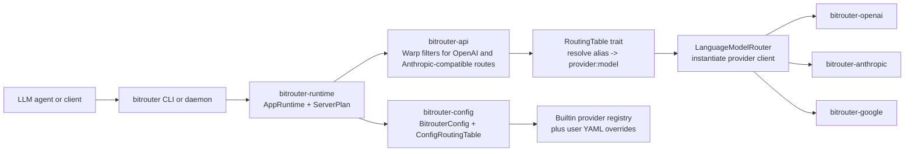
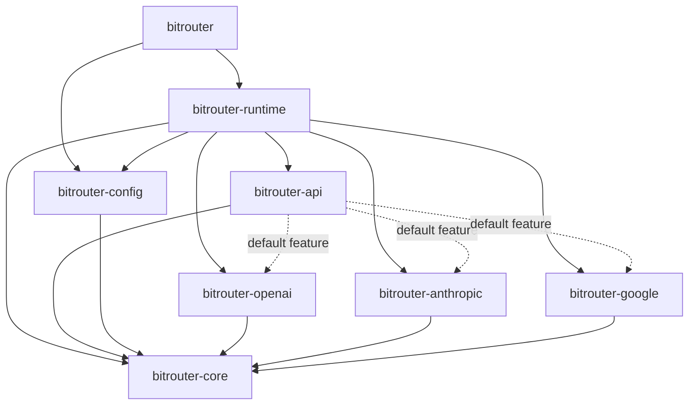

# BitRouter - Open Intelligence Router for LLM Agents

> The zero-ops LLM gateway built for modern agent runtime. Single binary. Zero infrastructure dependencies. Agent-native control.

[](LICENSE)
[](https://x.com/BitRouterAI)
[](https://discord.gg/G3zVrZDa5C)
[](https://bitrouter.ai)

## Overview

As LLM agents grow more autonomous, humans can no longer hand-pick the best model, tool, or sub-agent for every runtime decision. BitRouter is a proxy layer purpose-built for LLM agents (OpenClaw, OpenCode, etc.) to discover and route to LLMs, tools, and other agents autonomously — with agent-native control and observability via CLI + TUI, backed by a high-performance Rust proxy that optimizes for both performance and cost during runtime.

## Features

- **Agent-native routing** — agents discover and select LLMs, tools, and sub-agents at runtime
- **Multi-provider gateway** — unified access to OpenAI, Anthropic, Google, and more
- **Streaming & non-streaming** — first-class support for both modes
- **CLI + TUI observability** — monitor and control agent sessions in real time
- **Smart routing** — cost and performance optimization via configurable routing tables
- **High-performance proxy** — single Rust binary, async-first, minimal overhead
- **Tool calling** — unified tool use across providers

## Crate Structure

| Crate                 | Description                                                                 |
| --------------------- | --------------------------------------------------------------------------- |
| `bitrouter`           | CLI binary for `serve`, `start`, `stop`, `status`, and `restart`            |
| `bitrouter-runtime`   | Runtime assembly, server bootstrap, daemon lifecycle, and provider router   |
| `bitrouter-api`       | Reusable Warp filters for provider-compatible HTTP endpoints                |
| `bitrouter-config`    | YAML config loading, env substitution, builtin registry, and routing table  |
| `bitrouter-core`      | Transport-neutral model traits, routing contracts, shared types, and errors |
| `bitrouter-openai`    | OpenAI adapter for Chat Completions and Responses APIs                      |
| `bitrouter-anthropic` | Anthropic adapter for the Messages API                                      |
| `bitrouter-google`    | Google adapter crate for Gemini-facing request and response translation     |

## Quick Start

```bash
# Install
cargo install bitrouter

# Start the proxy
bitrouter start
```

<!-- Add more details on configuration and agent integration as the CLI stabilizes -->

## Supported Providers

| Provider  | Status | Notes                            |
| --------- | ------ | -------------------------------- |
| OpenAI    | ✅     | Chat Completions + Responses API |
| Anthropic | ✅     | Messages API                     |
| Google    | ✅     | Generative AI API                |

Want to see another provider supported? [Open an issue](https://github.com/AIMOverse/bitrouter/issues) or submit a PR — contributions are welcome. If you're a provider interested in first-party integration, reach out on [Discord](https://discord.gg/G3zVrZDa5C).

## Architecture



- **`bitrouter`** drives the product surface: CLI commands either scaffold a config for `serve` or load an existing runtime for daemon control commands.
- **`bitrouter-runtime`** owns process lifecycle and HTTP serving. It wires the routing table, provider configs, and Warp server into a runnable application.
- **`bitrouter-config`** loads `bitrouter.yaml`, expands `${ENV_VAR}` references, merges builtin provider definitions, and builds the config-backed routing table.
- **`bitrouter-api`** exposes provider-shaped HTTP routes such as OpenAI Chat Completions, OpenAI Responses, Anthropic Messages, and `/health`.
- **`bitrouter-core`** defines the shared routing and model contracts used by runtime, config, API, and provider adapters.
- **Provider crates** translate BitRouter requests into upstream provider APIs and implement the core model traits used by the router.

## Crate Dependency Graph



`bitrouter-core` sits at the center of the workspace: every routing, API, config, and provider crate depends on its shared contracts. `bitrouter-runtime` is the assembly layer above that core, while `bitrouter` is the thin CLI binary on top.

Current implementation note: the Google crate is part of the workspace and is wired into the dependency graph, but the runtime router still returns `unsupported` for `ApiProtocol::Google` requests today.

## Roadmap

- [x] Core routing engine and provider abstractions
- [x] OpenAI, Anthropic, and Google adapters
- [ ] MCP & A2A protocol support
- [ ] TUI observability dashboard
- [ ] Telemetry and usage analytics
- [ ] Provider & model routing policy customization

## Contributing

We welcome contributions of all kinds — bug fixes, new providers, documentation, and feature ideas.

### Getting Started

1. Fork the repository
2. Create a feature branch: `git checkout -b feat/my-feature`
3. Make your changes
4. Run tests: `cargo test --workspace`
5. Run formatting and lints: `cargo fmt --all && cargo clippy --workspace`
6. Commit your changes with a descriptive message
7. Push and open a pull request

### Guidelines

- Keep PRs focused — one feature or fix per PR
- Follow existing code style and conventions
- Add tests for new functionality
- Update documentation if your change affects public APIs
- Be respectful and constructive in discussions

### Branch Naming

| Prefix      | Purpose           |
| ----------- | ----------------- |
| `feat/`     | New features      |
| `fix/`      | Bug fixes         |
| `docs/`     | Documentation     |
| `refactor/` | Code refactoring  |
| `chore/`    | Maintenance tasks |

For larger changes, please open an issue first to discuss the approach. If you have questions, join us on [Discord](https://discord.gg/G3zVrZDa5C).

## License

Licensed under the [Apache License 2.0](LICENSE).
