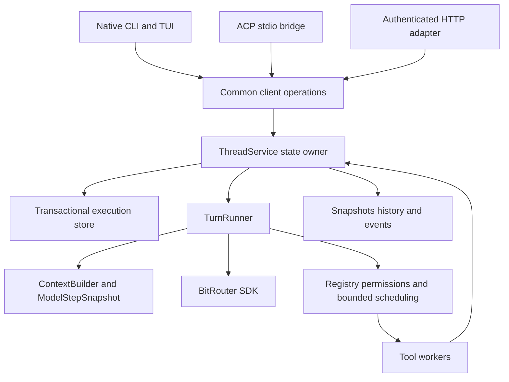

# BRO agent runtime MVP

**2026-10-02 contract update:** the approved
[Thread/Turn unification spec](BRO_THREAD_TURN_UNIFICATION_SPEC.md) supersedes
all Task compatibility, v13/v1 transport, duplicate completion events and
process-lifetime hot-capacity assumptions below. The body preserves its earlier
baseline. New validation belongs to the separate
[unification implementation record](BRO_THREAD_TURN_UNIFICATION_IMPLEMENTATION.md).
Core integration and lost-owner operator resolution remain separate tracks.

Version: **v0.2**. Updated: **2026-10-01**, including the product authority refresh.

**Current delivery order (user-confirmed, 2026-10-01):** finish the standalone
runtime/session implementation and independently validate `bitrouter-orchestrator`
before deciding how to integrate orchestrator core. CLI/HTTP/ACP client delivery
is a subsequent acceptance track. Existing runtime ownership remains in place
for this work; do not introduce a second scheduler or a core migration here.
The user also confirmed that abruptly lost owners and unconfirmed effects stay
blocked in this stage. Host investigation/proof and operator resolution are a
subsequent acceptance track; this runtime must not infer them from PID loss.

**Architecture authority changed:** product 003 now points to
[004 — Orchestrator Core and Harness Contract, v1.0](/Users/kelsen/Documents/bitrouter/product-engineering/bit-router-orchestrator/004-Orchestrator-Core-and-Harness-Contract.md).
004 assigns agent scheduling and model/context routing to core, and workspace
tools, durable workflow/session storage and edge signals to harness. It takes
precedence over this document where ownership, interfaces or subsequent phases
conflict. Sections below retain the runtime v0.2 execution requirements and
implementation record; they are not the new core implementation contract.
See the [source-verified migration handoff](BRO_AGENT_RUNTIME_HANDOFF.md).

The [core engineering spec v1.0](https://github.com/bitrouter/bitrouter/blob/a93ea456f6eb69bcc17d9cf2fac63808ae81f20d/docs/ORCHESTRATOR_CORE_SPEC.md)
has now been read on `codex/orchestrator-core`. Its earlier availability blocker
is resolved. Its DTOs, defaults and A01–A23 belong to the later core integration
track; do not silently apply them to this standalone runtime or declare C0–C6
implemented from R1–R4 results.

Status: **the user-confirmed standalone runtime/crate gate is locally verified;
the full product MVP and later integration remain incomplete.** R1/R2 and
R3 core context/queue/steering/history/observation are locally verified. R4 adds
bounded reconstruction and explicit recovery from proved safe checkpoints.
Store-wide owner fencing, conservative clean-stop transfer and shared workspace
exclusion across stores and bounded startup discovery are implemented. Lost-owner
resolution remains deferred. Terminal legacy Task conversion and same-Turn
continuation at known checkpoints use the existing commit and execution owner.
Workspace exclusion is not OS isolation.
DTOs, storage guarantees, recovery procedures, and limits remain review items.
Updating this document does not complete R0 or any implementation phase.

Product source: [003 — BRO Agent Runtime Design and Implementation, v0.2](/Users/kelsen/Documents/bitrouter/product-engineering/bit-router-orchestrator/003-BRO-Agent-Runtime-Design-and-Implementation.md).
The original v0.2 scope is translated below. Product 003's new 004 authority note
also applies: retain execution correctness and proven implementation, then
reconcile their ownership and interfaces with the current core engineering spec
before implementing the changed architecture.

BRO baseline: `b4294b316a319031c09744b9c9a785cbecc65550`, with the current
worktree inspected on 2026-10-01. Codex reference:
`799324821d36a822923cee7814d3b80f7ec3cf99`, verified in the local clone.
The baseline inspection preceded implementation. Current changed behavior and
phase-specific checks are tracked in [runtime implementation evidence](BRO_AGENT_RUNTIME_IMPLEMENTATION.md).
Neither the baseline nor partial phase checks prove full MVP completion.

## 1. Decision and document authority

The following decision records the runtime v0.2 baseline. It must not imply that
the new orchestrator core owns production workspace tools or durable storage.
The current product contract places those responsibilities in harness. The
app's existing database implementation and local tool executor are migration
inputs, while the scheduler and context builder are core inputs. They need one
explicit authority and commit path across the boundary, without two schedulers
advancing the same work.

Build a minimal, extensible Rust coding agent inside `bitrouter-orchestrator`,
using Codex Rust as an execution/state/failure reference. BRO owns its small
runtime, uses BitRouter SDK model execution, and retains existing BRO tools.
No `codex-core` dependency or Codex subprocess replaces native execution.

The central model is **Thread → Turn → Item**. Each provider request is a
**model step**. Attachments observe and control server work; they do not own it.

The v0.2 MVP includes bounded tool concurrency, explicit queueing and steering,
persistent execution facts, and safe restart recovery. These replace v0.1's
sequential-tools-only, busy-rejection-only, and process-local-only scope.
Start still rejects a busy thread; enqueue and steer are separate operations.

For the retained runtime v0.2 baseline, this spec supersedes:

- [Native agent server spec](BRO_NATIVE_AGENT_SERVER_SPEC.md).
- [Shared session server spec](BRO_SHARED_SESSION_SERVER_SPEC.md).

Their bodies preserve historical decisions and phase lists, not additional
requirements. Statements there that defer concurrency, queue/steer, persistence,
or recovery do not constrain this MVP. The
[implementation record](BRO_NATIVE_AGENT_IMPLEMENTATION.md) describes the earlier
runtime and recorded checks, not proof of this refactor.
[DEVELOPMENT.md](DEVELOPMENT.md) describes current code;
[CLI.md](CLI.md) describes delivered command behavior.

Product documents 001/002 retain workflow goals and automation evaluation;
003 v0.2 enlarges the native baseline delivery scope. Router document 004 retains
one `bro` and crate ownership; 005 retains longer-term state/context/cache design.
The new **orchestrator** document 004 is a separate document from router 004;
it changes core/harness responsibilities and adds the C0–C6 core roadmap.
This retained runtime baseline does not settle Jev's role or prove that roadmap.
Do not claim an end-to-end cost/latency/accuracy benefit without experiments.

## 2. Retained runtime v0.2 scope

This section records the older runtime MVP, including its deferred capabilities.
New core scope and ownership come from orchestrator 004 and its engineering
spec. In particular, native sub-agent scheduling and harness-executed tools are
required there; their appearance below as deferred does not defer them in v1.0.

One `bro` binary hosts the server and native CLI/TUI clients. Native, authenticated
HTTP, and inbound ACP share one runtime, permissions, history, and durable state.
Explicit external ACP harnesses retain their session/context/tool ownership.

| Area | Required MVP behavior |
| --- | --- |
| Conversation | Persistent Thread; at most one active Turn per Thread |
| Input | start, enqueue, steer; bounded FIFO, targeted cancellation, explicit queue resume |
| Tools | read, ls, find, grep, write, edit; bash on Unix, powershell on Windows |
| Concurrency | Bounded shared reads; workspace-exclusive writes, shell, verification; ordered barriers |
| Model | Fixed Thread model/effort baseline; immutable snapshot for each SDK request |
| Output | Live assistant and stdout/stderr; authoritative bounded Item records |
| Permissions | Server-owned read_only, ask, allow_effects |
| Persistence | Admission, full responses, calls/results, queue, steering, approvals, budget, terminal facts |
| Recovery | Restore history/pending state; continue only from confirmed safe boundaries |
| Lifetime | Disconnect detaches; restart changes epoch, not durable Thread/Turn identity |

Initial deployment is a trusted operator in authorized workspaces. A directory
and tool policy are not OS sandboxing. Shell uses host process authority.
Untrusted tenant isolation requires separate design and evidence.

Deferred: arbitrary effect replay, transparent adoption of old interactive
processes, PTY/interactive stdin tools, automatic compaction, history editing/forks,
native subagent orchestration, adaptive policy, runtime plugins, generic hooks,
generic schedulers, client-executed tools, and a first-party Web UI.
SDK routing, fallback, providers, and metering remain in their existing path.

## 3. Baseline implementation and required changes

These are pre-refactor findings from the inspected baseline. Consult the runtime
implementation record for changes made since that inspection, not this table
as a claim that the old behavior still applies after each phase.

| Current source | Current behavior | Required change |
| --- | --- | --- |
| `service.rs` / TaskService | Mutex-protected in-memory tasks, workspace leases, TaskTracker, approvals, bounded snapshot/observation | Durable Thread/input state; short ordered transitions with commit acknowledgement; recovery ownership |
| `agent.rs` / run_with_approvals | New user-message history for every task; sequential call loop | Turn runner over retained context; explicit model step, scheduling and common settlement |
| `agent.rs` / record | Sends events to an mpsc channel; ignores send failure; sender does not await service commit | Separate provisional progress from authoritative transitions; commit success gates all execution |
| Call identity and bounds | used_call_ids spans an entire run; steps counts model requests and tools | Step-qualified provider IDs, distinct Item IDs; separately bounded model steps and calls |
| Cancellation/budget exits | Can return after adding assistant calls but before producing all results | Settle every committed call before continuation; record not-started and uncertain effects honestly |
| `context.rs` | Clones SDK messages, builds Prompt, checks serialized bytes | Persistent reconstruction, pairing validation, context versions, immutable request snapshot and cleanup reserve |
| `tools.rs` | Separate declarations/allowed/read_only/dispatch matches; schemas parsed inside execute | Static registry as common source; validate before approval; resource metadata and bounded scheduling |
| Approval timing | Approval receiver timeout uses elapsed run time | Persist pending/resolved state; fence attempts/epoch; exclude only pure approval wait from active duration |
| Verification | Runs after Agent report in service; absent check is Unavailable | Verification Item through the same permission/exclusive path; not_requested distinct; evidence in future context |
| Local / HTTP | Local contract v4; task API over same service; task/instance identity | Versioned Thread controls and history; old task behavior projects onto one new runner |
| App storage/host | App assembles SeaORM DB/migrations; host constructs TaskService without runtime storage | Dedicated runtime records and transactions using app-supplied storage resources |
| Native / ACP | Native task client; existing ACP drives external harnesses | Continuous native controls plus inbound BRO ACP bridge, with client evidence |

Do not feed snapshot text or the evictable event deque back as conversation.
Do not treat router metering/trajectory records as an execution recovery journal.
The current runner already waits for full model output before tool execution;
retain that boundary and add validation, capacity reservation and durable commit.

## 4. Codex reference and intentional differences

Read relevant pinned source and tests before implementing each subsystem.
Preserve attribution if copying code. Naming similarity is not behavior evidence.
All paths below are relative to the pinned clone's `codex-rs/`.

| Reference | Adopt | BRO boundary |
| --- | --- | --- |
| `app-server-protocol/src/protocol/v2/thread_data.rs` | Thread/Turn/Item identities and lifecycle | Small BRO types, no complete app-server DTO port |
| `core/src/codex_thread.rs`, `core/src/session/input_queue.rs` | Explicit admission, targeted steering, pending inputs | Durable BRO future-Turn FIFO is separate from Turn-local pending input |
| `core/src/session/turn.rs`, `core/src/stream_events_utils.rs` | Model/tool loop, cancellation, full output boundary | SDK execution; no streamed-call early effects |
| `core/src/session/step_context.rs` | Immutable settings/tools captured per request | Small ModelStepSnapshot, no MCP/discovery/realtime subsystem |
| `tools/src/tool_executor.rs`, `core/src/tools/orchestrator.rs` | Declarations/dispatch and central permission decisions | Static registration; three profiles; no Guardian/sandbox upgrade retry |
| `core/src/tools/parallel.rs` | Concurrency qualification, cancellation and call association | Bounded workers and ordered read/exclusive barriers; parallel does not imply read-only |
| `core/src/context_manager/history.rs` | Legal history, separate model and presentation views | SDK Message and BRO Item, not a Responses-only wire model |
| `protocol/src/items.rs`, history projection | Start/delta/terminal and reconstructable history | Bounded authoritative records; deltas may be evicted |
| `rollout/src/recorder.rs`, `core/src/session/rollout_reconstruction.rs`, `core/src/session/daemon_recovery.rs` | Commit, reconstruction, limited recovery | One transactional authority; no JSONL plus DB dual authority or arbitrary exactly-once claim |

Keep BRO read/search/write/edit schemas and bounded outputs. Codex exec_command,
write_stdin and apply_patch are not required substitutions. BRO edit retains
unique non-overlapping replacements, content recheck, temporary write and diff.
Those checks do not guarantee safety against external concurrent writers.

## 5. Ownership and modules



Orchestrator owns execution state, input control, context, scheduling, approvals,
leases, settlement, recovery decisions and observation. App server supplies
trusted callers, workspace grants, config/credentials, storage and listeners.
App clients select targets and translate operations/events; TUI edits/renders.
ACP bridge is an adapter. SDK owns request preparation, routing, providers,
fallback, usage and settlement. BRO and SDK must not both execute one local call.

Refactor inside the existing crate first: service.rs for Thread/input/state;
agent.rs for Turn/model steps; context.rs for legal prompt reconstruction;
tools.rs split only as needed into registry/permission/scheduling/handlers;
small Item and execution-store modules when they have real consumers.
Use concrete types/enums and only necessary storage interfaces. No public
re-exports, unused framework, generic resource graph or backend plugin system.

Each Thread has one state-commit owner. Model/tool workers return facts; they do
not independently mutate conversation or Thread control. Commit authoritative
state in order before acknowledging it or publishing completion. The owner must
remain responsive while model/tool/approval/client I/O waits. Never hold a global
state lock across these waits. Service tracks and joins every owned worker.

Prefer existing app database assembly; local deployment uses SQLite. Runtime
admission, idempotency, queue, call states and results share one transactional
authority. Orchestrator defines consumed store operations; app supplies resources
and migrations. Exported logs are not another source of truth. Backend support
requires its own evidence; existing DB connectivity is not recovery proof.

ModelStepSnapshot captures model/effort, instructions, context version, exact tool
registry/version, and remaining bounds. Calls use the snapshot that advertised
them. Future policy may change snapshot construction, not an in-flight request.

## 6. Identities and state transitions

| Object | Meaning |
| --- | --- |
| Thread | Durable conversation, caller/access scope, canonical workspace, settings, permissions, context, history, queue and execution |
| Turn | One accepted unit of work; stable ID allocated at start/enqueue admission |
| Item | Stable BRO message/activity identity, invocation, origin, output and lifecycle |
| Model step / attempt | One provider request with captured settings, request ID, usage/routing provenance |
| Steering input | Independent input_id targeting one expected active turn_id; received/applied lifecycle |
| Attachment | Connection and observation resources; no execution ownership |
| Execution epoch | New each server start; fences workers/control/approvals, not durable object identity |

Provider-local tool IDs are qualified by model step internally; SDK results retain
the original IDs/metadata required by the protocol. Repeated IDs in later steps
must not collide. Reject duplicates within one complete response before any
call executes. Every started Item has a unique terminal record; an interrupted
assistant Item does not represent a complete message.

The following transitions are R0 review notation, not implemented Rust enums:

```text
Thread: idle -> busy -> idle                 (successful settled Turn)
        busy -> paused                      (failure/cancel, queue held)
        busy -> recovery_required           (unknown execution/effects)
        paused -> idle                      (explicit resume, blockers clear)
        recovery_required -> paused         (investigation confirms safe state)
        any -> closing                      (seal admission, clean up)
Turn:   queued -> running <-> waiting_for_approval
        running -> settling -> completed | failed
        queued -> cancelled                 (withdraw before activation)
        running/waiting -> cancelling -> settling -> cancelled
        active -> interrupted/recovery_required -> confirmed checkpoint
```

Queue pause and recovery blocking must remain separate facts even if the chosen
Thread enum combines their presentation. Waiting for approval, settling and
cleanup are not idle. Unknown process termination cannot release a workspace.
Targeted queue cancellation does not cancel active work or clear other inputs.

Preserve one active Turn per canonical workspace as well as per Thread. Shared
reads inside that Turn use a separate scheduling layer. Canonical-path exclusion
does not isolate overlapping roots, external editors or other host processes.

## 7. Input admission, queue and steering

| Operation | Required semantics |
| --- | --- |
| start | Admit/start only when Thread is idle, authorized and resources/lease available; otherwise reject with cause |
| enqueue | Durably admit a future Turn and return turn_id/order; no current-context mutation |
| steer | Atomically target expected active turn_id; admit input_id as received |
| cancel_turn | Target one active Turn; acknowledge intent, then stop/clean/settle |
| cancel_queued_turn | Withdraw one not-started Turn atomically against activation |
| resume_queue | Authorized explicit resume after checking blockers/resources; no replay of completed work |

Admission validates caller, workspace grant, input size and capacity. Commit
acceptance, deduplication and control state in one transaction before returning
accepted. Start obtains execution lease/capacity; enqueue obtains them on
activation. Rejections append no message or accepted-key record.

Deduplication is scoped to caller, durable Thread and operation; create-Thread
keys are caller/operation scoped. Server instance is not the only scope. Check
accepted keys before busy; same key/request returns original identity and current
state, conflicting reuse fails. Persist keys with retained objects. Expiry must
explicitly report that old execution cannot be confirmed, not treat it as new.
RPC correlation IDs are not acceptance keys.

FIFO entries enter model context only after durable activation. Start cannot
bypass accepted queued work; activation/control is serialized by the state owner.
Normally completed, cleaned and settled work advances the queue. Failure, cancel
or unknown effects pause it with a saved cause. Temporary capacity/lease shortage
waits visibly without dropping accepted input. Resume revalidates authorization
and does not restart an uncertain Turn from its original prompt.

Steering admission stops launches from the old response that have not started.
Let in-flight effects settle at a safe boundary; do not kill a modifying operation
by default. Settle committed but unstarted calls as not_executed_due_to_steer.
A model request may be preempted; partial output is display-only. If it cannot
stop promptly, its eventual response cannot launch stale tools after steering.

Persist received/applied or a reason for non-application. Applied binds context
version and the next model step. Receiving input is not proof the model saw it.
Apply multiple inputs in admission order, once; never reinject applied inputs
on recovery. A stale expected_turn_id is rejected, not moved to the next Turn.
Recheck admitted steering before verification completion/terminal commit/queue
advance. Cancel/unrecoverable failure records why pending steering was not used.
Steering cannot silently broaden permissions or permanent settings.

### R0 operation examples for review

These DTO sketches illustrate required fields, not released API routes/schema:

```json
{"op":"enqueue","thread_id":"th_A","idempotency_key":"input_2","prompt":"Fix the caller"}
{"accepted":true,"thread_id":"th_A","turn_id":"tu_2","state":"queued","queue_order":2}
{"op":"steer","thread_id":"th_A","expected_turn_id":"tu_1","idempotency_key":"correction_1","text":"Keep the public interface unchanged"}
{"accepted":true,"input_id":"in_1","turn_id":"tu_1","state":"received"}
{"event":"steer_applied","input_id":"in_1","turn_id":"tu_1","context_version":7,"model_step_id":"ms_4"}
```

The authenticated adapter supplies caller identity. Final names, epoch fields,
error DTOs and compatibility conversion must be frozen before client changes.

## 8. Turn execution and bounded scheduling

```text
commit activation/User Item
  -> capture step snapshot and validate prompt/bounds
  -> SDK model request, provisional assistant deltas
  -> validate full response/call IDs, reserve settlement capacity
  -> commit complete response and calls
  -> validate arguments/permissions, wait for needed approvals
  -> reserve workers/resources and commit execution intent
  -> execute within barriers; commit each result as it arrives
  -> settle all calls; construct SDK results in original call order
  -> apply steering; continue sampling or verify/clean/commit terminal
```

Reject incomplete/invalid/truncated responses before executing calls. Without
calls, validate finish reason and meaningful final output; empty or length-cut
answers do not constitute successful delivery. Preserve safe SDK fallback, not
whole-Turn retries after output or effects. Keep SDK cleanup/usage settlement
when cancelling a request; cancelled waiting does not establish zero cost.

| Tool class | Resource rule |
| --- | --- |
| read, ls, find, grep | Workspace-shared, bounded concurrency |
| write, edit | Workspace-exclusive |
| bash, powershell, verification | Workspace-exclusive, regardless of purported read-only command text |
| Future registered tool | Trusted metadata; exclusive if unspecified |

Preserve submission barriers: read A/read B may overlap, then edit A waits for
both, then read A observes the edit. Do not launch every call with join_all.
Reserve per-Thread/global workers and budgets before start. Approval waits hold
Thread/workspace execution lease but no running-tool permit or exclusive tool
lock. Approval permission and scheduling eligibility are separate checks.

State owner commits each completed result; completion order can affect progress,
not call/result pairing or model-message order. No next model request until all
committed calls are settled. On an error, cancellation or steering, stop new
launches and collect/clean up owned work. Ordinary tool errors/denials may be
fed back to the model after settlement rather than automatically failing the
Turn. R0 specifies error/denial classification and how unstarted calls are
settled; it cannot permit bypassing a failed commit. Store failure,
lost execution or critical unknown effects always block ordinary advancement.

Settlements distinguish completed, interrupted/effect-unknown and not-executed.
Never fabricate stdout, exit code or success. A result commit failure stops new
calls and model requests; in-flight work is stopped/collected, and unresolved
facts remain recovery blockers. Repairing message structure alone cannot prove
operation safety or authorize queue advancement.

## 9. Context, history and observation

Maintain two views from durable execution facts under explicit transitions:
SDK messages for model input, and complete Item history for clients. Not every
fact goes into the prompt. The evictable delta cache is authoritative for neither.

Reject orphaned calls/results. Preserve original provider ID/metadata and
step-specific association. Partial assistant streams remain interrupted display
records. Cancellation, bounds and steering settle every committed call before
building another prompt, including calls that never started.

Do not silently trim old history. Until compaction exists, stop with context_limit
and require a new Thread. Bound/truncate tool output with visible metadata.
Serialized bytes and provider token limits are different bounds; a 512 KiB
prompt limit does not guarantee provider capacity. Record source, step, context
version and available workspace version without a full evidence graph.
Reserve room for bounded results/errors/terminal state before calls are admitted.

Events carry server_instance_id, thread_id, monotonic sequence, timestamp and
relevant Turn/Item/input identities. Persist authoritative sequence progression
across restart; deltas need not be individually durable. Minimum control events
include queue admitted/cancelled/paused/resumed, steer received/applied/not-applied,
recovery blocked/resolved, Item lifecycle, approvals, cancellation and Turn end.

Atomically register observation with a snapshot cutoff; snapshot precedes newer
updates. Snapshot includes active Turn, queue/order/pause, steering, settings,
pending approvals, recovery blockers and bounded live output. Paged history
uses a fixed cutoff. Terminal records remain available after deltas expire.

Bound subscribers/caches by bytes and count. Slow clients never block execution
or approvals/cancel; resynchronize when necessary. Restart invalidates connections
and volatile deltas: reload durable snapshot/history, bind the new epoch, then
subscribe. Do not resubmit old work to reconstruct UI.

Current core choices: `read_thread_view`, `observe_thread`, and `thread_history`
use authenticated owner/current workspace grants and the current instance.
`ThreadView` contains settings, queue state, and the active or last activated
Turn with steering, pending approval, terminal evidence, and bounded live output.
Each Thread transaction commits one public `ThreadEvent` beside its execution
facts through the existing owner. Its sequence is that transaction's durable
root cursor; sequences can have gaps. Historical events preserve their producing
epoch. The history response envelope identifies the currently serving epoch.
This projection never supplies model context or authorizes execution.
Full assistant responses, interrupted evidence, tool results and verification
results enter the public projection in the same transaction as those execution
facts. Their availability does not depend on a later Task display-event commit.
Turn/step/Item identities correlate updates to the same Item; clients deduplicate
later Task display updates by these identities. Deltas received after an Item's
complete fact do not reopen its live projection.

Pagination fixes a cutoff on the first request; later pages must reuse it. Core
pages contain at most 1000 events and 2 MiB of serialized event bodies by default.
The store reads public rows within that range without loading internal prompts
or the complete execution stream. An oversized event fails visibly. Each Thread
caches at most 256 events / 2 MiB and permits eight attachments by default.
Broadcast storage is capped by both 32 entries and an 8 MiB byte budget, using
the maximum public event size; the default effective capacity is four entries.
Slow consumers atomically re-register with a resynchronized snapshot. Transient
capacity waiting and storage blockers publish snapshots without invented durable
sequence progress. Disconnect preserves work and pending approvals.

Assistant/tool deltas are volatile `Live` packets anchored to `after_cursor`.
They do not advance the Thread cursor and are absent from durable pagination.
Their bounded tails may appear in the snapshot. Complete/interrupted Items and
terminal records are committed presentation events. Same-instance reconnect is
implemented in the Rust core. Reloading after process loss requires R4 ownership
and effect checks; CLI/HTTP/ACP delivery remains R5 work.

## 10. Tools, permissions and approvals

Registry owns name, schema, effects, resource requirements and handler, rejecting
duplicates. Model declarations and dispatch share it. Validate arguments before
permission decisions, using registered metadata, not model assertions. Hide
forbidden tools and reject forged dispatches. Keep current path checks/output
bounds/edit behavior; OS support needs platform-specific execution evidence.

| Profile | read / ls / find / grep | write / edit / shell / verification |
| --- | --- | --- |
| read_only | Allow within server restrictions | Deny |
| ask | Allow within server restrictions | Ask per invocation |
| allow_effects | Allow within server restrictions | Allow within server restrictions |

Thread stores effective profile. Hard restrictions override approvals. Proposed
creation defaults: native interactive/ACP ask; compatibility headless may request
allow_effects when authorized; existing --read-only maps to read_only. Attach
inherits policy; an observer cannot auto-approve another client's work.

Bind approval to Thread, Turn, Item, attempt, exact validated arguments, workspace
and current epoch. First authorized valid answer commits once. Recheck cancel,
steering, grants and target before launch. Allow once is only that invocation.

Persist pending and resolved approvals. After epoch/attempt change, stale replies
cannot launch effects. Restore necessary unstarted approvals with new current
identities; never replay completed effects because an approval was restored.
Disconnect is neither approval, rejection nor cancellation. Pending approvals
remain visible without a client. Only time with no active execution and pure
approval wait is excluded from Turn active duration; overlapping work still counts.

## 11. Durable commits, recovery and lifecycle

| Durable fact | Minimum contents |
| --- | --- |
| Thread | Identity/access/workspace, settings/permissions, context version |
| Inputs/control | Idempotent acceptance, FIFO order, steering target/application, cancellation and pause intent |
| Model step | Request/attempt, snapshot, full response/calls, available routing/usage |
| Tool | Identity, validated arguments, resource/approval, execution intent, result/uncertainty |
| Turn | Lifecycle, cumulative limits, verification, outcome, safe checkpoint |
| Observation | Bounded authoritative Item content/terminal facts and durable sequence |

No plaintext credentials or unlimited output storage. Durable artifacts may
hold large bounded content, with quota/retention/deletion defined in R0.

```text
acceptance transaction commits -> acknowledge accepted
full response/calls commit      -> permit scheduling
execution intent commits       -> permit effect
result commits                 -> permit model consumption
cleanup/context/end commits    -> publish terminal / advance queue
```

Queue insertion and deduplication commit atomically. A channel send, memory update,
queued write or flush is not necessarily a durable commit. R0 defines storage
synchronization and supported faults. MVP proves process crash/restart behavior;
do not extend this to arbitrary power loss or exactly-once effects.

Database transactions cannot atomically include file changes or arbitrary shell.
The effect-after-intent/before-result window remains uncertain even with a log.

| Recovered facts | Allowed action |
| --- | --- |
| Queued, unstarted | Rebuild FIFO; recheck grants/lease/capacity before activation |
| Result committed | Rebuild Item/context; do not execute that call again |
| Confirmed checkpoint, no in-flight effects | Continue same Turn with a new recorded step/attempt |
| Partial model stream | Interrupted display; new request if safe; retain unknown usage/cost |
| Execution intent, no confirmed result | Block; confirm old execution termination and investigate effects |
| Unapplied steering / pending approval | Restore target/control state; no duplicate injection or stale answer |
| Cancelled or paused queue | Preserve intent; restart does not automatically resume it |

Recovery checks three separate conditions: legal message history, execution
termination, and effect status. If old processes may still run, retain exclusion.
Critical unknown effects set recovery_required and pause the queue. Investigation
and explicit resolution are recorded operations; a new read is not a historical
result. R0 must define those operator actions before recovery is shippable.

File fingerprints/preimages may assist write/edit investigation; matching current
content alone does not prove a previous write completed. Arbitrary shell cannot
automatically replay. No effect rollback, cross-crash exactly-once or transparent
old PTY/process-session adoption is promised.

Acquire exclusive execution ownership before restarting work. A fresh epoch,
PID or in-memory lease alone is not proof old workers are gone. R0 chooses how
to confirm termination/isolation and fence store writes. If evidence is absent,
remain visibly blocked rather than release a conflicting execution. Keep durable
Thread/Turn IDs; reject stale-epoch approvals/control against new attempts.

Cancel/shutdown seal scheduling, cancel and join owned execution, then settle.
Unconfirmed cleanup remains a blocker with honest uncertainty. Restart can
continue confirmed checkpoints, not restart an unknown prompt wholesale.

### Failure window example

```text
edit intent committed -> file replaced -> process crashes before result commit
restart -> new epoch, same Thread/Turn/Item, recovery_required
        -> confirm no old execution; investigate recorded target/preimage
        -> record explicit evidence/resolution; settle context
        -> only then permit safe continuation / authorized queue resume
```

Receiving cancel or fabricating an error ToolResult does not resolve this window.

### Current R4 reconstruction boundary

`TaskService::load_thread` consumes the same authoritative root stream as the
runner. It reads bounded record pages at one fixed cutoff rather than loading
the whole journal or using the evictable presentation cache as model context.
The first native Thread or legacy Accepted-Task header checks the caller, current
workspace grant and canonical
workspace identity before the remaining scan. Limits and hot-state capacity are
rechecked before installation. A scan does not hold the global admission lock.

The consumed `RecoveryState` reports the source epoch/cursor and recorded
status/pause, legal-context and terminal-checkpoint findings, pending controls,
unresolved call identities and budget uncertainty. Cumulative known counters
are preserved; missing provider usage, call charging and active duration are
explicitly unknown. Complete responses/results rebuild legal context in original
call order. Interrupted evidence stays in presentation. Stable identities and
exact invocation associations must validate; invalid records cannot provide a
settled continuation context.

Every cold-loaded Thread remains `recovery_required`, including a recorded
terminal checkpoint. Loading reserves local workspace exclusion and attempts a
shared inspection lock without changing an existing active marker. It creates no
runner, model request, approval sender or tool effect. Current-envelope epoch and
historical-event epoch remain distinct. Restored pending approvals retain their
metadata but cannot accept old answers. Cancellation and paused FIFO intent
survive; loading never advances the queue. Cached same-instance reads reuse this
view without another scan.

During reconstruction, the projection follows each committed writer epoch before
applying its checkpoint. Later-epoch status, pause and queue facts must not be
discarded by the live view's epoch filter. The installed snapshot still uses the
current serving epoch; stored history events retain their original epochs.

Reconstruction itself does **not** establish cross-process ownership, confirm old
worker/process termination, resolve effects or continue a checkpoint. The explicit
recovery operation below is a separate gate. An `OwnershipUnconfirmed` blocker
and the inspection lock/reservation are deliberately not proof of those gates.

### Current explicit recovery contract (standalone runtime)

`TaskService::recover_thread` consumes `ThreadRecoveryRequest`: inspected source
epoch, exact source cursor and caller/Thread-scoped idempotency key. The current
serving epoch, stored caller, live workspace grants, bounded legal context and
held workspace inspection lock must still match. The source must have a durable
stopped-owner proof; only a newer claimed writer with complete startup discovery
can accept the checkpoint. Unknown effects, unfinished calls/requests, uncertain
usage/time/call accounting and invalid records remain blockers. No TTL or PID
takeover exists. Host/operator investigation is deferred by the user's scope.

Acceptance atomically commits `ThreadRecovered`, the original operation key,
`ThreadCheckpoint` and public recovery event before installing runnable state.
An error or lost acknowledgement permits adoption only when a bounded reread
matches the exact original batch and final cursor. Failed or unreadable evidence
keeps execution blocked and withholds a stopped-owner proof. Caller detachment
does not cancel this owned operation; identical retries append nothing and do
not launch another worker. A changed source/key payload is rejected.

Terminal checkpoints restore recorded idle/pause intent; retained FIFO stays
paused until explicit `resume_queue`. Complete legacy Task settlement may be
converted by the same transaction, preserving the Task/Thread/first-Turn IDs,
original record prefix, keys, context and permissions. Active legacy conversion
and unfenced old owners remain blocked. Later facts/history use native Thread
transactions, without rewriting legacy facts or promoting missing privileges.

An active native Turn may continue only at an acknowledged `RunCheckpoint` or
complete `Settled` outcome. `RunCheckpoint` records complete paired context and
cumulative model steps, charged calls, spend and active duration before another
model boundary. Reconstruction validates it against committed responses/results;
it cannot hide missing calls, incomplete requests or unknown effects. Recovery
uses the original Turn/user Item, restores counters and cancellation/steering,
and runs the existing worker. The next model step gets fresh step/Item identities;
completed tools are retained as results and never replayed. Exhausted budgets
stop before another request. Pending steering retains its original target and
is applied through the existing model-boundary transaction once.

`Settled.outcome` persists status, final answer and stop detail before terminal
publication. If the model already finished, recovery finalizes that outcome
without another model request. A recorded `VerificationResult.status` and its
evidence are reused without repeating the check. A completed answer must match
the full assistant message. These optional fields keep old records readable;
an active old settlement without an outcome is blocked rather than guessed.
Partial model output remains display evidence with unknown usage retained.

This API is a crate operation. Local contract v13 and existing CLI/HTTP/ACP
surfaces do not expose new recovery commands. Full product R4, host lost-owner
investigation and core integration remain separately tracked requirements.

### Current legacy Task read projection (R4 partial implementation)

The loader now accepts legacy `Accepted` roots as well as native `ThreadCreated`
roots. It aliases the original Task identity into the Thread and first Turn
identity domains, without rewriting records or allocating replacement IDs.
`RecoveryState.source_is_legacy_task` identifies that source. The caller's stored
key/user IDs authorize the read; absent local/launch attributes are not inferred.
Coding Tasks project to `ask`, read-only Tasks to `read_only`; loading grants no
effects. Acceptance fingerprint/settings consistency is checked against the
original facts.

Startup discovery and explicit loading share the same bounded validator. Original
user/assistant/tool IDs, settings, event ordering, invocation associations, complete
context and counters must validate. Missing identities remain invalid and cannot
populate settled context. Existing approval metadata is visible without a runnable
sender. Cancel/terminal decisions and incomplete usage/time/call charging remain
recorded; every installed legacy view stays `recovery_required`.

Legacy history derives public changes from the original facts at their durable
root record positions. These cursors differ from the embedded old Task event
sequence, which is preserved. Memory and database use the same projection; SDK
request prompts and retained message arrays never enter the public page. Complete
response and result Items remain visible. Original event timestamps/epoch remain;
facts with no timestamp use zero rather than an invented time. A legacy Task has
one original writer epoch; later epochs require a separate conversion contract.
Unexpected records, another writer epoch or facts after its final outcome cannot
provide a valid continuation checkpoint.

Public count/byte bounds and a fixed cutoff apply. The database decodes one raw
legacy row at a time, with a 4 MiB header/raw-record processing bound, rather than
collecting the journal; gaps and oversized rows fail visibly. A public Item that
cannot fit fails visibly rather than being omitted. Reconnect starts from the
loaded snapshot and pages the same history under current caller/grant/epoch checks.

Loading remains a read adapter. The separate recovery transaction above permits
proved terminal conversion only; loading never promotes keys/permissions,
resolves an old owner or continues a Turn by itself.

### Current store ownership contract (R4 partial implementation)

Native execution first claims one owner for the configured execution store.
`ExecutionOwner` binds server instance and monotonic generation.
`claim_owner` accepts an empty store or a durably stopped previous owner. It
returns a blocked owner when the previous owner is active; it returns unfenced
when legacy execution facts have no owner proof. Neither elapsed time, PID loss
nor a new instance automatically retires an active owner. Retired instance IDs
cannot be reused. Read-only reconstruction remains available while blocked.

Migration 000024 creates a singleton `bro_runtime_ownership` fence and retained
`bro_runtime_owners` proofs. A short write lock on the singleton serializes
claims, stop proofs and commits across database connections. Every native commit
checks current instance/generation and active state within the transaction that
also commits version CAS, acceptance keys and facts. Raw bootstrap/import commits
are forbidden after ownership is established. The memory backend implements the
same protocol under its mutex, with its existing volatile fault promise.

`TaskService::initialize_execution` initializes this authority; the host calls it
in the native serving lifetime after fallible setup, and admission also checks it.
Local protocol v13 capabilities expose acquired/blocked/unfenced state. A blocked
native runtime returns recovery_required for new work; inference can still serve.
These capabilities and the owner token do not grant workspace access.

Shutdown seals admission, cancels and joins owned execution, durably pauses idle
queues, then records a stopped owner. Lost commits or uncertain effect/cleanup
facts conservatively withhold that stopped proof. A failed stop commit does not
claim a release. Successful stop prevents further old-owner commits; a new owner
can claim the next generation. Recovery reports include the original owner's
stored proof separately from context validity and operation effects.
That proof concerns the tracked runtime/worker shutdown and writer retirement;
it does not establish OS isolation or the absence of arbitrary external shell
processes. Cold Thread continuation still requires its separate recovery gates.

This establishes write ownership for one store, with local memory tests and
SQLite independent-connection/reopen/process-loss evidence. Shared workspace
exclusion below covers cooperating runtimes using different stores. Lost-owner
resolution and shell effect confirmation remain deferred host gates. Terminal
legacy conversion and safe native checkpoints use explicit recovery above.
Startup discovery is described below. No recovery/owner-resolution CLI or RPC is
published yet; do not advise deleting owner rows or replaying work to clear a blocker.

### Current shared workspace exclusion contract (R4 partial implementation)

Local contract v13 requires this execution behavior; the existing version check
rejects an older daemon before submitting work rather than silently using its
store-only fencing. No new Thread/recovery transport operation is published.

Before one-shot admission, Thread start or FIFO activation, acquire an exclusive
OS file lock for the canonical workspace, regardless of the configured database.
The canonical directory's parent must be writable. Coordination lives outside
the model workspace at `.bro-workspace-<sha256(canonical UTF-8 path)>.lock` and
`.bro-workspace-<same digest>.json`. The lock file is retained and never unlinked
as idle cleanup; replacing its inode could create separate locks. A filesystem
root without a parent cannot be used as a native execution workspace.

The version-1 marker binds canonical workspace, lease, execution, server instance
and store owner generation. It is bounded to 64 KiB, atomically replaced and file
synced. These are coordination facts, not model context or a replacement execution
journal. A held kernel lock reports conflict. An active marker without confirmed
release reports recovery_required even when its old process has disappeared.
Missing markers for existing locks, invalid identities, oversized markers and
symlink/nonregular coordination paths cannot authorize execution. This does not
claim parent-directory fsync, power-loss durability, distributed-filesystem lock
semantics, tamper resistance or OS sandboxing; it covers cooperating local runtimes.

The owned guard remains through approvals, model/tool execution, verification and
cleanup. Before committing each ModelRequest or ToolIntent, check both the local
execution identity and exact active marker. Failure seals execution before the
SDK/effect starts. Blocking coordination I/O is registered with the runtime's
worker tracker; caller disconnect cannot detach an acquisition from shutdown.
A dropped caller leaves uncertainty and never manufactures a clean-stop proof.

Known, joined work releases in three stages: commit WorkspaceReleasePrepared
with execution/workspace/lease identity; write the idle marker while retaining
the kernel lock; commit the final outcome, then drop the guard/local reservation
and publish terminal state. A preparation or marker failure retains recovery
blocking and cannot publish completion. A lost terminal acknowledgement keeps
the kernel guard and store owner blocked; the marker can already be idle because
physical cleanup and its durable preparation preceded that attempt. Abrupt guard
loss never converts an active marker to idle. Unknown effects do not prepare
release. Reconstruction checks preparation identity and rejects preparation
before known effect results; preparation alone cannot authorize continuation.

Cold inspection obtains the kernel lock when available and cannot finish it or
replace an existing active claim. Missing markers receive an inspection-only
active marker with no execution generation; inspection cannot turn it idle.
An unavailable kernel lock does not prevent read-only history reconstruction,
but the other runtime's lock/marker still excludes effects. Cold history remains
recovery_required, and any future continuation must revalidate ownership and
rebuild the latest durable head before launching work.

A live external owner is temporary capacity waiting for FIFO activation. One
tracked 100 ms retry waiter per service resumes eligible queues after release,
without another client request; it exits on shutdown or no eligible queue.
Unconfirmed release or corrupt evidence instead commits recovery_required and
cannot be bypassed by resume_queue. Explicit recovery may replace a matching
old workspace claim only after the source stopped proof and all context/effect/
budget gates pass. Lost-owner/process investigation and operator resolution
remain deferred. Native process-kill tests verify conservative blocking at commit
windows; they do not prove forced takeover, OS isolation or other platforms.

### Current bounded startup discovery contract (R4 partial implementation)

Execution initialization claims the store writer, then finishes discovery before
returning execution authority. A cached acquired owner cannot bypass an incomplete
scan. Failed discovery blocks new work; a later initialization may retry the same
owner without launching a worker or consuming a model request. The host uses this
same initialization before native serving; inference remains independent.

Migration 000025 adds `bro_execution_index`, with unique root identity and monotonic
position, and backfills existing roots in the database. New roots, index positions,
keys and facts commit atomically. Acquiring the owner also reconciles roots created
by an older cooperating writer after migration but before retirement, under the
same owner lock. Index membership pages retain one cutoff; head versions are current
metadata, not an immutable snapshot of mutable journals. Only a claimed writer
makes the startup versions stable enough for clean classification.

`ExecutionStore::read_index` uses count/byte bounds. Startup consumes fixed-version
`read_records` pages and the existing context/call validator rather than whole-stream
load or presentation cache. Defaults allow 1024 roots, 1,000,000 records across the
scan and 4 MiB of cold metadata, with existing 64-record/4-MiB page limits. Record
reads respect the remaining scan budget. Failure, malformed/unsupported headers,
missing rows or exhaustion cannot publish complete discovery or admit new work.
Cold metadata installs only after the complete scan. It stays separate from hot
Thread/Task/context/approval state and does not grant access to recorded workspaces.

Thread and legacy Accepted-Task headers both identify stored workspaces. With a
writer fence, the scan validates full records and reads the latest durable executing
epoch's owner proof. Only a valid terminal checkpoint/settlement, known results and
that owner's stopped proof permit *fresh workspace admission*. This classification
cannot continue the old context, apply steering, answer approval or advance a FIFO.
Unknown or invalid cold execution blocks its workspace before explicit load, for
one-shot submission, Thread start and queue activation. Live grants remain required.

Without a writer fence, startup can enumerate bounded headers for inspection but
never classify them clean; native execution remains blocked by its owner claim.
Local contract v13 capabilities expose only aggregate discovery progress, cutoff,
writer-fenced/completion state and error code, with no root identities or prompts.
A recovered history continues to use current caller/grant/epoch checks. Discovery
itself neither replays effects nor installs runnable approvals, and does not convert
a legacy Task into a continuous Thread. Explicit recovery is a separate operation.
Recorded investigation/operator resolution and broader host/backend/platform
process-fault evidence remain required before full product R4 is complete.

## 12. Verification, budget and capacity

Keep assistant answer, verification and stop reason separate. Configured checks
report passed/failed/denied/unavailable; only passed permits verified success.
No check means not_requested. Use origin=verification Tool Item through the same
permissions and workspace-exclusive scheduler. Client delivery includes the check
outcome, not only the earlier assistant message.

Verification failure ends the Turn with evidence and pauses queued work; later
Turns may fix it. No automatic repair loop. Include bounded verification evidence
in subsequent supported server-context messages; never invent a provider tool
result without a matching call. Pass is not proof of all user requirements.

Track estimated/actual/unknown costs with provenance and requested/available
actual route. Unknown usage is not zero and requested-model pricing is not
necessarily routed-model cost. Persist cumulative usage across restart. Define
model-step and tool-call bounds separately from the current mixed steps count.

Queue waiting and confirmed inactivity during downtime consume no active wall
time. Potentially running lost work is not free inactivity. Concurrent tools'
durations are not summed as Turn wall time. Pure approval-wait exclusion follows
§10, not a timer pause whenever any approval exists.

These are product v0.2 **proposed defaults for R0 review**, not shipped constants:

| Resource | Proposed default |
| --- | --- |
| Hot resident Threads | 32 per instance |
| Active Turns, including approval wait | 8 per instance |
| Running tools | 4 per Thread / 16 per instance |
| Waiting Turns | 32 per Thread |
| Individual user input | 64 KiB |
| Model steps | 32 per Turn; tool calls separately bounded |
| Active duration | 600 seconds, excluding only pure approval wait |
| Serialized prompt | 512 KiB, separately from token capacity |
| Hot context/Item metadata | 2 MiB per Thread, including settlement reserve |
| Total hot state | 64 MiB, including settlement reserve |
| Durable Turns/deduplication | Cover retained objects; disk quotas/retention fixed in R0 |
| Unattached idle hot state | May unload after 30 minutes; durable Thread is retained |

Bound pending steering, approvals, tools/output, artifacts, subscriptions and
buffers. Specify effective values/accounting in capabilities. Hot eviction must
not delete context, queue or keys. Active, approval-waiting or recovery-blocked
Threads are not ordinary idle eviction candidates. Explicit durable deletion
requires no owned execution and clear authorized semantics.

Reserve settlement space before work and refuse admission on storage exhaustion.
Physical disk failure/fullness can still prevent commits: block scheduling and
recover from last durable facts; do not claim a reservation guarantees all writes
under arbitrary failures. Never delete active records or bypass commit to proceed.

### Current core choices (R3/R4 partial implementation)

The Rust core consumes `ThreadRequest`, `ThreadTarget`, `TurnRequest`,
`CancelTurnRequest`, `ApprovalAnswer` and `SteeringRequest` from `thread.rs`. Thread creation fixes
caller, canonical workspace, settings and a host-granted ReadOnly/Ask/AllowEffects
profile. Every control targets the current server instance; cancellation and
approval additionally target a specific active Turn (approval includes request
ID). Mutating admissions and decisions require a 1–128 byte acceptance key.
The key scope is caller/Thread/operation (creation omits Thread); the request
fingerprint is SHA-256. Database index uniqueness, facts and version advancement
share a transaction. Key lookup precedes busy checks but never replaces grants.

Thread and Turn use one root commit stream: `ThreadCreated`, input admission,
activation, queue decisions/checkpoints and wrapped Turn execution facts. A
Thread checkpoint retains complete messages/context version; queued inputs enter
that history on activation. The core defaults admit at most 32 hot Threads,
32 waiting Turns per Thread and use 2 MiB/64 MiB context admission bounds. These
are admission checks; full settlement and total hot-state/disk reservation
accounting is still required before R6 completion.

Steering defaults admit at most 32 inputs and 64 KiB of steering text per Turn.
The received commit seals tool dispatch under a shared launch mutex; dispatch
means an owned worker with its permit and start handoff. Already dispatched
workers are joined and their effects settle; later calls are not executed.
Applied receipts and the next exact ModelRequest share a transaction, binding
input order, context version and model step. Steering during verification can
resume the same Turn with cumulative model/tool/spend/duration accounting.
Terminal commit is serialized against admission; failure/cancel/bounds record
non-application with a cause. The core currently lets an in-flight SDK model
request complete, then fences its response's tool launches.

These choices describe implemented Rust internals, not a released CLI/RPC
contract. Local protocol v13 carries optional Thread IDs, queued Turn and steering
projections. Rust steering controls are implemented; Thread controls,
load/history/reconnect and inbound native ACP still need client delivery. Legacy one-shot task submissions retain their
old instance-scoped keys until R5 converts them into Thread/Turn projections.
Cold accepted-key retries return original identities and known Turn status
without workers. Cold Thread continuation requires explicit checkpoint recovery.
The core reconstruction defaults allow two simultaneous readers, 64 records and
4 MiB per page, and at most 1,000,000 records per Thread scan. Configured page
limits cannot exceed 128 records or 4 MiB. Oversized individual records, missing
records or invalid cursors fail visibly rather than skip history or install a
partial Thread. These limits appear in runtime capabilities; they do not reserve
disk or complete the broader R0/R6 capacity accounting.

## 13. Clients, compatibility and ACP

All clients share create/load/get/list Thread, start/enqueue/steer, targeted cancel,
queue resume, answer approval, history and observation operations. Every access
checks trusted caller and workspace authority; durable identity is not a grant.
Inference authentication bypass and read-only control access do not grant agent
execution. HTTP cannot gain access to local-only workspaces by loading a Thread.

Local clients connect/start the same bro serve. Explicit remote failure never
falls back to local execution. Negotiate capabilities/version for new operations,
limits and retention. Stale execution epoch requires reload/rebind; retrying a
persisted accepted key returns its original identity after authorization.

One-shot task_id becomes a compatibility Thread/Turn projection, not a second
runtime loop. Preserve machine output until versioned migration. Existing
--task-id observation stays compatible. Proposed bro code --thread-id <id> and
bro task run --thread-id <id> <prompt>, plus input-control names/routes, require
R0 review. Creation-only options cannot mutate an attached Thread.
This document does not publish those proposed flags as usable CLI commands.

A proposed no-agent bro acp serve is a thin native stdio bridge; explicit external
harness selection retains its meaning. ACP session maps to durable Thread; each
connection binds current instance. session/new creates, session/load replays and
observes, session/prompt uses a verified Turn mapping. Native queue/steer are not
automatically ACP standard capabilities: return documented busy/limits where
unsupported rather than invent extensions.

Replay uses an atomic cutoff, then live updates, including native-origin work.
Expose pending approval/live state; overflow fails/resyncs rather than claiming
successful incomplete load. Stdout is protocol frames, stderr diagnostics.
EOF/bridge loss only detaches; explicit cancel targets observed current Turn.
Restart requires load/rebind, not automatic unknown prompt resubmission.

Server executes filesystem/shell; do not delegate native tools to client RPCs.
Reject unsupported client MCP registration without launching it. ACP permission
RPC is connection-local; underlying approval is durable runtime state. Route to
one eligible attachment; another authorized client may resolve it. Late/cross-
epoch replies cannot authorize. Do not equate a disconnected RPC with consent.

Named real ACP client/version must prove load/replay, updates and obsolete approval
UI when another client answers. No invented dismiss notification. Record limits
where the client cannot represent state. Native/HTTP and ACP have separate gates;
both are in delivery scope. First-release batching and selected clients are R0
release decisions, not evidence supplied by protocol mocks.

## 14. Migration phases and implementation evidence

This table retains the full product v0.2 roadmap. The current user-confirmed
standalone gate covers runtime/crate behavior with unknown owner/effect records
blocked. Host investigation/operator proof, client delivery and later core
integration are separate tracks; completing this gate does not complete R4–R6.

| Phase | Deliverable | Exit gate |
| --- | --- | --- |
| R0 Contract/synchronization | Consistent product/spec; identities/transitions, DTOs, persistence/ownership, limits, compatibility | Reviewed concrete operations and fault examples; no unused framework |
| R1 Durable execution records | Item/step snapshot, full-response/result commit and common settlement in current one-shot path | Working one-shot; partial streams, pairing, store failure and crash records covered |
| R2 Bounded concurrency | Worker limits, shared/exclusive barriers, cancellation, result commits | Reads actually overlap; writes retain order; stopped/failed batches leave no worker |
| R3 Continuing Thread/input | Retained context, FIFO, steering, approvals, reconnect and durable keys | Dependent Turns; queue/steer/finish/cancel races; disconnect/resync |
| R4 Safe recovery | Rebuild input/context/budget; ownership and effect investigation; continue checkpoints | Fault injection across commits; no completed-effect replay; unknown effects block |
| R5 Client delivery | Native/HTTP controls, old task projection, inbound ACP load/approval | Separate clients and selected real ACP client pass distinct gates |
| R6 Release evidence | Stress, platform/shutdown, live provider, quotas and docs | All required cases evidenced, remaining limits recorded |

Follow this order rather than replacing every public task name at once. R1 adds
commit acknowledgements to the actual runner, not asynchronous logging alongside
unchanged execution. R2 adds responsive worker supervision; R3 admits new input
through that owner; R4 uses the same records to recover. Safe restart continuation
is not claimed during intermediate record-only phases. All four expanded abilities
are MVP completion requirements despite incremental delivery.

Keep intermediate paths runnable. Route compatibility consumers through the new
runner and remove superseded execution paths once migrated. Create a new runtime
implementation record when source work starts, recording pinned references,
changed paths, deliberate differences, tests and incomplete gates. Old tests are
baseline assets; assertions intentionally enforcing state loss or old call-ID
scope must change with their corresponding phase, not be counted as new proof.

CLI/config/harness wiring changes update docs/CLI.md, skills/bitrouter and affected
plugin manifests together. Product publishing docs belong in bitrouter-docs.
Source changes require all-feature tests, clippy and fmt per AGENTS.md; run doctests
separately if the test runner omits them. This documentation edit claims no new
runtime test results.

## 15. Acceptance and remaining review

First complete integrated milestone: dependent Turns in one Thread, real bounded
read concurrency and ordered writes, visible queue/steering, approval/cancel and
reconnect; after restart, history/pending work load and safe continuation does
not duplicate effects or send malformed model history.

- [ ] Racing start accepts one Turn; enqueue durably admits separately; rejected input never enters prompt.
- [ ] Lost admission reply/restart retry returns original identity; conflicting key reuse fails.
- [ ] Second Turn consumes first's context; step-local tool IDs can repeat without Item/approval collision.
- [ ] read A/read B overlap; edit A is a barrier; later read A observes its result.
- [ ] Result completion order preserves pairing; batch/store failures stop launches and collect owned workers.
- [ ] Queue activation/cancel races activate at most once; failures/cancel/unknown effects pause; resume never replays completed work.
- [ ] Steering during model, tools, approval and verification stops old unstarted calls; received/applied are distinct; stale targets reject.
- [ ] Crash before/after steering application preserves ordering without duplicate injection; every committed call settles honestly.
- [ ] Competing approval replies authorize once; stale epoch/attempt answer or cancellation cannot launch/harm new execution.
- [ ] Inject process loss after admission/activation, before/after response commit, after intent and after effect before result commit.
- [ ] File changed without committed result requires investigation; unknown shell is not automatically replayed or skipped as successful.
- [ ] Old workers/processes not confirmed stopped block conflicting work; history repair alone cannot unblock effects.
- [ ] Partial assistant streams are display-only; cumulative budgets survive restart; unknown usage is not zero.
- [ ] read_only rejects forged effects/verification; attach cannot broaden policy or silently approve.
- [ ] Output floods, slow subscribers and replay races resync without blocking controls or losing authoritative terminal facts.
- [ ] Disk exhaustion/commit failure stops work; unloading hot state preserves durable queue/context/keys; quotas include cleanup records.
- [ ] Verification absent is not_requested; failures retain answer/evidence and pause queue; clients show final verification outcome.
- [ ] Real provider proves tool concurrency, continuous context and input controls through SDK, with actual routing/usage provenance.
- [ ] Named real ACP client proves load, native-origin updates, shared approvals and documented protocol limits.
- [ ] One-shot tasks and explicit external harnesses retain compatibility; every effect has one execution owner.
- [ ] Shutdown joins supported platform work; uncertain cleanup persists as a blocker, not terminal success with released lease.

Use scripted providers for state/stream errors, real subprocesses for effects and
cleanup, independent clients for races, and process faults for commit/recovery
windows. Keep mock, local checks, live provider, hosted CI, OS and real ACP client
evidence separate. Process-crash proof does not establish arbitrary exactly-once.

Confirmed product scope: existing tools, bounded concurrency, queue/steer,
persistence/safe recovery, one active Turn/Thread, full response commit before
execution, fixed-model baseline and SDK routing ownership.

R0 must resolve details without deferring those confirmed capabilities:

1. Effective worker/queue/steering/approval/hot-state/disk bounds and accounting.
2. Schema/transactions/synchronization/fault promise; execution ownership and effect investigation/resolution actions.
3. Steering boundaries, explicit interrupt semantics and client received/applied presentation; error/denial classification and batch settlement.
4. Permission defaults, pure-wait active timing, restored approval identity and control fencing.
5. Queue-resume authority, checkpoint continuation after failure/cancel, history/key retention and deletion.
6. Concrete CLI/API DTOs/versioning, named ACP clients, release batching and platform evidence.

No documentation synchronization marks these items reviewed or implemented.
