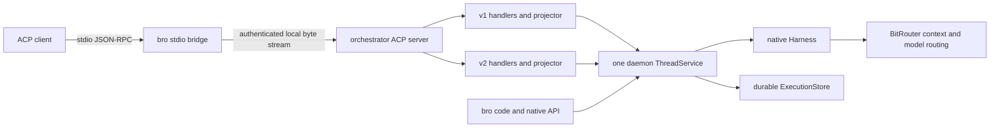

# Native BRO ACP server

Status: **implemented; local validation is recorded separately.**
Revision: 0.3, 2026-10-06. See [acceptance and remaining gates](BRO_NATIVE_ACP_SERVER_ACCEPTANCE.md).

This contract makes `bitrouter-orchestrator` an ACP agent backed by the daemon's
existing native BRO runtime. An IDE can create or reopen a BRO conversation over
ACP v1 or draft v2 without creating another execution service. Accepted work
survives an unexpected client disconnect. Explicit cancellation and closure have
different, durable queue dispositions.

## Authority and scope

[BRO_AGENT_RUNTIME_SPEC.md](BRO_AGENT_RUNTIME_SPEC.md) remains the authority for
Thread/Turn ownership, admission, effects, persistence and recovery.
[BRO_BASE_TOOLS_SPEC.md](BRO_BASE_TOOLS_SPEC.md) and
[BRO_HARNESS_RESOURCES.md](BRO_HARNESS_RESOURCES.md) remain the native tool and
resource contracts. This document defines the ACP projection and native
extensions. Acceptance evidence names the exercised source and environment.

[ACP_CONTROLLER_SPEC.md](ACP_CONTROLLER_SPEC.md) governs the existing external
agent controller/proxy path, whose agent owns its execution and history. Native
BRO ACP instead uses BRO-owned Threads and history. It must not obtain native
execution by spawning BRO through that external controller. The historical
[native server design](BRO_NATIVE_AGENT_SERVER_SPEC.md) is not revived.

The first release includes both v1 and v2, local stdio access, durable history,
approval reattachment, session listing and reopening, cancellation, closure,
and native Harness resources. Remote ACP transports, session fork, subagents,
MCP-over-ACP, client-owned filesystem/terminal tools, a complete model/settings
picker, Core integration and further SDK dissolution are outside this release.
Existing external ACP proxy behavior must continue to work.

## Confirmed product decisions

| Decision | Required behavior |
| --- | --- |
| Runtime location | Native ACP protocol/session adaptation belongs in `bitrouter-orchestrator`. |
| Execution authority | Reuse the daemon's `ThreadService`, native Harness and durable store. |
| Versions | Ship working v1 and v2 handlers together; negotiate per connection. |
| Unexpected disconnect | Detach transport and observation; do not cancel accepted execution. |
| Pending approval | Remain `WaitingForInput`; reconnect to the same live daemon restores the same native request. |
| Ordinary `session/cancel` | Cancel current active work; preserve accepted unstarted Turns in a durably paused queue. |
| Explicit `session/close` | Cancel active work and every accepted unstarted queue item, persist their outcomes, and release active resources. |
| History after close | Preserve Thread/Turn/Item identities, history, accepted keys and cancellation results; allow authorized reopening. |

The deployment command, multi-client approval ownership, empty-queue restart
rule and detailed v2 pause projection below are **approved implementation mechanics**.
They were selected for implementation after review.

## Implementation boundaries

This change includes the SDK ACP migration and native ingress, stacked on
[PR #945](https://github.com/bitrouter/bitrouter/pull/945). This is not a claim
about a published release.

| Area | Source and behavior |
| --- | --- |
| External ACP runtime | [acp/](../crates/bitrouter-orchestrator/src/acp/mod.rs) retains the external client/controller/capture/translation/upstream path. |
| Native adaptation | [acp/native/](../crates/bitrouter-orchestrator/src/acp/native/mod.rs) owns negotiated handlers, approval generations, bounded transport production and projectors. |
| Shared runtime | [service.rs](../crates/bitrouter-orchestrator/src/service.rs) is supplied once by [host.rs](../apps/bitrouter/src/host.rs). |
| Admission | [service/admission.rs](../crates/bitrouter-orchestrator/src/service/admission.rs) exposes the native user Item ID and atomic empty-pause foreground admission. |
| Approvals | [service/approval.rs](../crates/bitrouter-orchestrator/src/service/approval.rs) retains exact native input authority. |
| Closure | [service/close.rs](../crates/bitrouter-orchestrator/src/service/close.rs) persists queue withdrawals and joins only the selected Thread's workers; completion replay is inert. |
| Observation | [service/observation.rs](../crates/bitrouter-orchestrator/src/service/observation.rs) remains the committed-history/live source. |
| Resources | [harness/](../crates/bitrouter-orchestrator/src/harness/mod.rs) executes immutable host-authorized Thread bindings. |
| App bridge | [native_acp.rs](../apps/bitrouter/src/native_acp.rs) handles OS-local transport and protocol-pure stdio. |
| Dependency | SDK/Conductor 3.0.0 and schema 1.10.2; external consumers stay v1 and native ingress enables both versions. |

Native input remains a string with explicit untrusted resource provenance,
approval answers remain booleans, and session settings remain host-selected.
No mutable model/permission picker is advertised. Passive agent configuration
DTOs still live in the SDK after migration; their relocation is separate work.

## Deployment and ownership

The app owns process startup, stdio/listener plumbing, local peer authentication,
configuration and database construction. The orchestrator owns ACP negotiation,
native session/control adaptation, approval delivery and output projection.
Protocol types stay at that boundary; native Thread/Turn contracts remain ACP
independent. The adapter must not depend on `apps/bitrouter` or add a scheduler,
queue, durable content store or provider loop.

The bridge opens a dedicated local ACP stream served by the daemon.
Its EOF closes that stream only. Neither the bridge nor the protocol connection
owns model workers, shell process groups, MCP children or pending native input.
This avoids implementing an orchestrator backend against app-private native IPC
DTOs and avoids executing an independent agent in each IDE-launched process.

The host supplies a trusted caller and serving epoch before ACP dispatch.
`clientInfo`, session IDs and a requested `cwd` do not confer authorization.
Workspace registration/canonicalization and permission selection remain host
operations subject to existing grants. Reopening checks current caller, workspace
and instance ownership. An explicit unavailable remote target cannot fall back to
local execution. Provider credentials remain owned by the normal routing/auth
path, not by an ACP-specific credential broker.

The shipped command behavior is `bro acp serve` for native BRO and
`bro acp serve <AGENT>` for the existing external proxy. Native mode uses
`--model` or `chat.model`; `--read-only`, `--turn-timeout` and `--no-start` are
supported. The stdio bridge uses a daemon control-derived `.acp.sock` endpoint
on Unix and the existing owner-restricted transport on Windows. CLI references,
the BitRouter skill and all three plugin manifests are updated together.

## Protocol baseline and compatibility

As of 2026-10-06, the latest published schema is
[agent-client-protocol-schema 1.10.2](https://docs.rs/agent-client-protocol-schema/1.10.2/agent_client_protocol_schema/),
released on 2026-10-01. Implementation pins SDK/Conductor **3.0.0**, released
on 2026-10-06, and schema **1.10.2** with v2 enabled. SDK 2.2.0 requires schema
exactly 1.9.1; SDK 3.0.0 requires exactly 1.10.2, so the schema upgrade includes
the matching SDK/Conductor release. See the
[pinned SDK migration notes](https://github.com/agentclientprotocol/rust-sdk/blob/9821e73ab1cdf10a96c2f8d37ae4fbbaf3463a6c/src/agent-client-protocol/CHANGELOG.md).
Native process and stdio features are explicitly enabled because SDK 3.0.0
no longer enables them by default.

ACP wire v1 is stable; wire v2 is draft. SDK version 3.0.0, schema version 1.10.2,
ACP wire v2, native local protocol v15 and HTTP `/agent/v2` are separate version
spaces. Supporting ACP v2 does not change the native HTTP API's version.

Enable the SDK's `unstable_protocol_v2` feature and register separate typed v1
and v2 implementations through its protocol router. Both handlers are enabled
in the normal native ACP product build. Initialization selects a supported
version and fixes it for that connection; handlers do not silently reinterpret
v2 traffic as v1. A later connection may use the other version for the same
Thread. See the
[SDK's pinned v2 guide](https://github.com/agentclientprotocol/rust-sdk/blob/9821e73ab1cdf10a96c2f8d37ae4fbbaf3463a6c/md/protocol-v2.md).

Support means the chosen release's complete baseline session lifecycle plus
the explicitly advertised optional capabilities. It does not mean every draft
extension or compatibility with all future schemas carrying wire version 2.
Retain versioned wire fixtures and record the supported schema revision.

| Surface | v1 | v2 |
| --- | --- | --- |
| Initialize/new/prompt/cancel/update/permission | Implement stable baseline. | Implement draft baseline using v2 types. |
| Prompt response | Return completion/stop reason after the originating Turn settles. | Return acceptance with `messageId`; processing and completion use updates. |
| History reopen | Advertise and implement `session/load`; optional resume only if implemented. | Implement `session/resume` and its replay selection. |
| Directory | Advertise and implement session listing. | Implement baseline session listing. |
| Close | Implement and advertise the supported v1 close extension. | Implement baseline `session/close`. |
| Text/resource links | Support baseline input. | Support baseline input. |
| Embedded text context | Advertise only after bounded input conversion is implemented. | Same capability discipline. |
| MCP attachment | Implement stdio; advertise HTTP only when supported; do not advertise SSE. | Implement the chosen baseline's supported stdio/HTTP forms. |
| Optional settings/fork/subagents/MCP-over-ACP | Do not advertise unimplemented surfaces. | Same rule; enabling v2 does not enable these extensions. |

Initialization must fail visibly if the caller cannot obtain a usable native
runtime or required protocol implementation. A successful v2 initialize followed
by method-not-found for its baseline session methods is not dual-version support.

## Identities, admission and operations

One ACP `sessionId` identifies one native `ThreadId`. No second durable ACP
session registry is required. Native Item IDs identify user/assistant messages
and tool calls; provider call IDs remain correlation data. A pending permission
dialog refers to the native `(ThreadId, TurnId, InputRequestId, ToolItemId)`.
Connection generation and JSON-RPC request IDs are delivery identities only.
Use a versioned `_meta.bitrouter` object for operation keys and native
diagnostics; do not overload standard ACP fields with native control state.

The v2 acceptance `messageId` must equal the native user Item ID allocated by
admission and used in live updates and history. Extend the native receipt to
expose that ID; do not generate a parallel ACP message identity. Namespace
metadata may expose native Turn IDs, cursor, queue status and blocker reasons
for diagnostics without changing standard ACP entity identity.

| ACP operation | Native behavior |
| --- | --- |
| New session | Validate bounded setup and host grants; create a durable Thread without executing/discovering resources. |
| Prompt | Validate all input before acceptance; start an ordinary foreground Turn without bypassing accepted queued work. |
| List | Caller/grant-filtered, bounded cold directory query. |
| Load/resume | Inspect/reconstruct, attach observation and replay as requested; never start execution or resume FIFO. |
| Cancel | Select and fence the active Turn identity once, cancel it and retain the paused queue. Never retarget a later Turn. |
| Close | Execute the Thread close barrier defined below, affecting shared Thread work. |
| Permission answer | Validate current delivery generation, then submit to native approval authority with exact request identity. |

Reject busy/paused-queue prompts explicitly; do not silently enqueue them or
change the active prompt. Native CLI/API clients can still enqueue through the
existing FIFO interface. An ordinary cancel with no active Turn is an authorized
no-op and does not resume or withdraw existing queued input.

Implemented usability extension: after known cancellation/failure has fully settled
and **no accepted queued work remains**, a new explicit prompt may start fresh
by clearing the safe pause and admitting its Turn in one native transaction.
This is one native admission transaction. It never clears recovery, accounting, unknown-effect or close blockers.
With queued work present, require an explicit queue-resume operation. Use the
namespaced `_bitrouter/session/resume_queue` request, available in both versions,
which invokes `ThreadService::resume_queue`; existing native controls remain
available. ACP `session/resume` continues to mean reattachment only.

Native idempotency keys remain caller/Thread/operation scoped. JSON-RPC IDs are
not keys. The adapter allocates an operation key before admission, and can accept
a documented caller-supplied key in namespaced metadata for retry-capable clients.
Persist the accepted input/key before acknowledging it. A connection-local key
cannot provide transparent reconnect deduplication: if a standard client loses
an acknowledgement, inspect authoritative history rather than automatically
resubmit its prompt under a new key. Identical keyed retries return the original
receipt; changed payloads conflict.

## Disconnect, cancel and close

| Event | Active Turn / approval | Accepted queued Turns | Durable result and resources |
| --- | --- | --- | --- |
| Unexpected EOF, crash or broken stream | Continue execution; an unanswered approval remains `WaitingForInput`. | Preserve normal scheduling or an existing pause. | Drop connection-owned observers/responders only; no cancel fact. |
| `session/cancel` | Cancel the selected active Turn through native control, including pending input. | Retain every unstarted input; pause durably after settlement. | Persist cancellation/cleanup outcome; release that execution's resources. |
| `session/close` | Cancel active work and retire pending input. | Cancel every accepted unstarted input under the same close fence. | Persist per-Turn outcomes and close completion; release active resources, keep history. |
| Daemon shutdown/restart | Existing native shutdown/recovery rules apply. | Preserve durable disposition; never auto-resume after restart. | New epoch cannot revive old approval responders or replay uncertain effects. |

Dropping an ACP prompt RPC waiter, an SDK sent-request handle or an approval
responder is not `session/cancel`. Separate connection cancellation tokens from
Turn execution tokens. Transport failure while attempting to deliver a dialog
must not be interpreted as rejection, approval or business cancellation.
Do not introduce disconnect/approval idle timeouts that silently cancel work.
Existing execution deadlines, budgets and explicit daemon shutdown still apply;
disconnection does not disable those native policies.

Cancellation acceptance is not cancellation completion. Completion requires
native worker/effect cleanup and durable settlement. In v1, drain ordered final
updates before returning the original prompt's cancelled response. In v2,
report the cancellation completion update only after that barrier. A lost
transport prevents delivery, not durable completion; reconnect reads the result.
Already dispatched effects are not rolled back, and uncertain effects do not
become known simply because cancellation was requested.

### Single-Thread close barrier

Implement close in `ThreadService`, with one native authority and durable
operation identity. It is stronger than observer detach or `unload_thread`, and
must not call global `ThreadService::shutdown`.

1. Authorize caller/epoch and acquire the Thread's admission/control fence.
   Persist close intent and operation identity before accepting it. Block new
   prompts/enqueue, steering that launches work, queue activation/resume and
   conflicting close/recovery operations for this Thread.
2. Capture all accepted unstarted Turns under that fence. Persist a cancellation
   result for **each** one, including its Turn/user Item identity, cancellation
   cause and non-activation outcome. Include queued Turns when no active Turn
   exists. Do not delete inputs, reorder history or merely empty an in-memory list.
3. Request cancellation of the selected active Turn, if any, using its native
   identity. Retire pending approval delivery and settle it through native
   cancellation. No queued Turn may start between these steps.
4. Release global admission locks before waiting. Keep a per-Thread close fence
   while joining workers and proving tool/MCP/process cleanup and native
   settlement. Other Threads must remain usable.
5. Persist close completion only after queued outcomes and active cleanup are
   confirmed. Preserve accepted keys, durable pause/history and effect evidence.
   Publish final changes; on a healthy connection flush their ordered projection
   before the close response. Network acknowledgement is not the durable barrier.
6. Invalidate this Thread's ACP attachments and approval generations. Unload
   resident caches only if normal native eligibility checks permit it. Native
   TUI/API observers may retain an authorized read view; they must not be forcibly
   destroyed to make unload pass. Reopen via load/resume before further ACP use.

A close applies to the **shared Thread**, not only one client's subscription.
Other authorized views observe the cancelled work. It does not cancel other
Threads, stop the daemon or delete conversation history. No model/tool/MCP
execution resource may remain active after a successful close response; a
referenced inert view is compatible with successful closure.

Close retries with the same operation key converge on the stored result.
Concurrent new close requests join/reject against the same Thread fence; they
cannot duplicate cancellation facts or overtake accepted closure. If the client
disconnects after accepted close, closure continues. If storage or cleanup is
uncertain, retain the fence/recovery blocker and report failure; do not claim
successful release, evict evidence, resume the queue or repeat effects. A crash
between queue cancellation commits and close completion must reconstruct the
unfinished close and require appropriate native recovery, not infer completion
from EOF. Concrete close record layout and format migration are implementation
review gates.

## Approval reattachment

The native `InputRequested` fact and live pending sender are authoritative.
Connection-owned ACP permission requests are deliveries of that input. Initially
offer `allow_once` and `reject_once`; native boolean answers do not implement
persistent `allow_always`/`reject_always` grants.

On same-daemon reconnect, authorize and attach the existing Thread, read its
current pending input, and issue a new wire request with the **same native input
and tool IDs**. A fresh JSON-RPC request ID is expected. No duplicate native
approval, new tool intent, model step or effect is created. History replay and
current state are delivered before the reopen response; schedule permission
delivery after that response without holding the replay/admission barrier.
Dispatch must remain available while human input is pending.

Implemented ownership rule: allow multiple authorized observers, but one current
ACP permission-delivery owner per Thread. Reattachment by the same principal
replaces the old generation. A different observer does not silently take over
approval control. A native CLI/API answer remains valid under native policy;
its committed resolution retires the ACP dialog. Submit ACP answers only while
their delivery generation is current, coordinating generation replacement with
submission; then let native identity/state/epoch checks decide acceptance.
An old connection's late answer cannot approve after replacement, cancel or close.

If the dialog delivery fails or its peer returns a transport-style cancelled
outcome without an explicit native cancel/close, preserve `WaitingForInput` for
reattachment. A deliberate `reject_once` is a native negative answer. Once an
answer commits, duplicates/stale answers cannot launch an effect again.

Daemon restart is a different boundary. Persisted input metadata remains visible,
but the original sender/owner epoch is gone. Do not accept the old dialog as a
live approval. Reopen shows `RecoveryRequired` and the inspected pending fact;
continuation requires the existing explicit recovery contract. This release
does not promise automatic cross-process restoration of a waiting worker.

## Output, history and state projection

Use committed `ThreadEvent` history as the replay authority. Live assistant/tool
deltas are presentation hints; they do not advance the durable cursor and are
not sufficient to reconstruct history. Listing/opening/history queries remain
bounded and do not start workers or discover resources.

For reopening, register observation atomically with a snapshot cutoff, buffer
later traffic within bounds, replay requested history through that fixed cutoff,
then reconcile buffered events and current state in publication order. Deduplicate
committed events by cursor and entities by native IDs. Live updates anchored at
the cutoff can still be new: do not discard them using a blanket `cursor > cutoff`
filter. Finish replay before the load/resume response, with no missing interval
between replay and observation.

v1 history uses ordered message/tool projections. After live assistant text,
compare the emitted prefix with the committed text and emit only a missing
suffix; do not send the entire message again. If a gap or prefix mismatch makes
append-only repair impossible, report that reloading is required and stop that
item's live projection. Do not duplicate or invent text to hide the gap.

v2 uses stable message/tool entity IDs. Full message updates replace/upsert
content; chunks append. Replaying chunks into an existing entity requires a full
content reset first. A canonical full message can repair a lost live delta.
Honor `session/resume` replay selection: requested history is replayed, while
omitting replay does not silently emit the entire conversation. Native retained
entities keep their IDs across connections and protocol versions.

Bound outbound queues, replay pages, snapshot/live caches and input sizes using
the native limits plus measured wire overhead. On lag, use durable reconstruction
or report an explicit resynchronization failure. Drop a broken observer rather
than accumulate unlimited output or cancel native work. Never silently omit
committed content, tool outcomes or pending approvals.

| Native state/outcome | ACP projection |
| --- | --- |
| Running / known capacity wait | v2 `running` with bounded diagnostic metadata; v1 ordered progress/tool updates. |
| `WaitingForInput` | v2 `requires_action` plus the permission request; v1 permission request; same native request survives detach. |
| Successfully settled foreground work | v1 `end_turn`; v2 final `idle` only at a real foreground boundary. |
| Explicit cancellation fully settled | v1 `cancelled`; v2 cancellation completion uses `idle` with `cancelled`, followed by the current queue/blocker state when needed. |
| Paused accepted queue | Expose native pause reason and queued identities; require explicit resume; v2 current state is `requires_action`. |
| Failed execution / unknown effect / `RecoveryRequired` | v1 error; v2 visible error/blocker metadata and `requires_action` while blocked; never synthesize successful completion or readiness. |

The v2 cancel-completion-then-paused-state sequence is a review/conformance gate:
it must preserve v2's required cancellation signal without suggesting that the
retained queue resumed. Clients must consume the latest state. Verify against
the pinned SDK fixtures and a real client before accepting the projection.
`RecoveryRequired` is not terminal in the current Turn enum; a v1 waiter must
surface that blocker rather than wait forever or return `end_turn`.
Map token/request-limit stop reasons only when the corresponding native cause
is known. Generic native budget, storage and verification failures are not
`max_tokens`. Session state is session-wide; v2 updates lack a standard native
Turn ID and must not be assigned to whichever prompt an adapter last awaited.

## Prompt context, MCP, skills and AGENTS.md

Convert ACP content to bounded, protocol-neutral native input before admission.
Support text and resource links. Resource links preserve their URI/title and
source provenance; they do not authorize unrestricted fetching or filesystem
access. Optional embedded text resources must preserve source boundaries and
durable input fingerprints/history. Reject unsupported image/audio/binary blocks
explicitly rather than silently discard them. Do not flatten trusted system
instructions together with client-supplied content. Any new serialized input
shape needs an explicit runtime format/read compatibility plan.

ACP per-session MCP setup requires a scoped extension to today's host-selected
Harness resources. Validate server count, names, transport, command/args/env or
URL/headers under **host authorization**. A client may request a server; it does
not grant itself permission to execute that server. Use per-Thread immutable
binding revisions and the existing active-pass inventory freeze/intent/approval/
result barriers. Reject unauthorized or conflicting descriptors explicitly.
Never mutate global MCP configuration or silently replace a binding by name.

Persist the authorized binding reference/revision and digest needed for reopening
and recovery. Secret-bearing configuration stays in host-managed private storage;
public history, inventory, prompts and diagnostics exclude credentials. Frozen
bindings cannot change during an active Turn, approval wait or unresolved effect.
Changed setup on load/resume must conflict visibly rather than create duplicate
MCP processes; idle rebinding can be a later explicit native configuration API.

Creation/list/load/reconnect performs validation only, with no MCP connection or
skills discovery. Discover during native active execution as today. Read-only
Threads continue to exclude effectful MCP connections. Daemon-owned stdio MCP
children and joinable process owners survive ACP detachment and close through
native cleanup; HTTP uses the same native lifecycle. First-release resources
must not require a live ACP client's file/terminal/MCP callback lane. If an
execution-owned resource fails independently, apply the native error/unknown
effect policy; transport loss does not approve retry of uncertain effects.

Skills discovery and AGENTS.md scope/snapshot injection remain in the native
Harness. ACP neither implements a second scanner nor injects duplicated system
context. Use the existing six native tools and their grants. An ACP presentation
may show their calls without moving their execution into the IDE.

The initial session uses host-authorized native `AgentConfig` and permission
profile. Do not expose a fake mutable picker or map a mode string directly to
effect permission. Future settings need durable, authorized native setters and
an explicit next-Turn policy; that work is not necessary to claim initial ACP
support.

## Codex reference and design limits

The useful current reference is OpenAI's
[Codex App Server](https://learn.chatgpt.com/docs/app-server) as the execution
backend, with the ecosystem
[codex-acp adapter](https://github.com/agentclientprotocol/codex-acp) translating
ACP onto it. The older Zed Rust adapter is archived and points to this adapter;
it is not the architecture to copy by embedding `codex-core` into BRO.

At adapter snapshot `ca1d97173ad37b471d5a4e5847725a4657d34e29`,
[session/prompt control](https://github.com/agentclientprotocol/codex-acp/blob/ca1d97173ad37b471d5a4e5847725a4657d34e29/src/CodexAcpClient.ts)
maps session identity to Codex threads, registers completion observation before
starting a Turn, interrupts explicit cancellation and replays history for load.
[Permission handling](https://github.com/agentclientprotocol/codex-acp/blob/ca1d97173ad37b471d5a4e5847725a4657d34e29/src/permissions/CodexApprovalHandler.ts)
adapts backend decisions. BRO should reuse those separation and ordering ideas
with its own native IDs and control barriers.

That adapter's
[stdio process entrypoint](https://github.com/agentclientprotocol/codex-acp/blob/ca1d97173ad37b471d5a4e5847725a4657d34e29/src/index.ts)
closes its spawned backend on stdin loss. It is therefore not evidence for the
BRO disconnect policy, approval persistence or dual-version implementation.
Those are requirements of this contract and need independent BRO acceptance.

## Implementation sequence and review gates

The following implementation steps are complete in the worktree. The acceptance
record distinguishes fixture evidence from remaining IDE/platform/provider gates.

1. Upgrade the ACP SDK/schema/Conductor pair and validate existing external
   consumers. Add protocol negotiation fixtures for both versions.
2. Add native receipt/input/resource changes and the single-Thread close barrier.
   Specify transaction/lock ordering, durable close records, cancellation causes,
   interrupted-close recovery and any format/API version migration. Preserve
   supported older reads or reject unsupported formats before execution.
3. Implement shared native adaptation plus independent v1/v2 handlers and
   projectors. Implement approval generations, history replay and bounded lag
   handling. Both versions must pass baseline tests before product exposure.
4. Wire the daemon-owned server and thin stdio bridge with trusted host identity.
   Finalize the CLI surface and update the skill/plugin/reference contracts in
   the same implementation change.
5. Run wire, durability and process-lifecycle acceptance below, then document
   actual evidence and remaining platform/provider limits separately.

Runtime format **5** adds private `ThreadResources`, keyed
`ThreadCloseRequested` and `ThreadCloseCompleted` with the saved close snapshot.
Creation persists immutable host-authorized bindings in the same transaction as
Thread identity and key; public history excludes those private fields. This
release binds the configured host inventory and accepts only exactly matching
client descriptors. Unsupported or invalid MCP/prompt members fail before
admission; the SDK's permissive collection deserialization cannot discard them.
No client-supplied executable is added to the host inventory.

Closure records all queued terminal outcomes, active cancel intent and a Closing
checkpoint atomically under admission plus the Thread gate. It drops global
admission before joining that Thread's workers, then commits completion and a
Paused checkpoint. Same-key retries replay the saved result and never wait for or
cancel a newer Turn. Incomplete/malformed intent-completion pairs and storage or
cleanup uncertainty remain recovery-bound. Readers accept formats 2/3/4/5;
new appends upgrade only the envelope. No native protocol/API version changes.

## Acceptance criteria

These remain release-level criteria; some require external evidence beyond
local fixtures. Consult the acceptance record for completed local checks and
partial coverage. Existing tests alone do not establish real IDE/platform proof.

- [ ] Real stdio wire fixtures initialize and exercise new/list/prompt/reopen/
  permission/cancel/close in both versions; unsupported versions/extensions fail
  truthfully. Test the v2 acceptance/completion split and update ordering.
- [ ] v1 creates a Thread, v2 reopens it, and vice versa, preserving configuration,
  history and all retained entity IDs. No duplicate service, worker or content
  store is created. Directory access is caller/grant filtered.
- [ ] Drop a client after proven in-flight model/tool work. The same daemon
  completes it once, with observable durable result and no cancel fact. Drop
  before/after admission acknowledgement and resolve uncertainty without replay.
- [ ] Drop while `WaitingForInput`. Reconnect in either version restores the same
  native request. Old connection answers, duplicate answers, concurrent native
  answers and cancel/close races cannot launch the effect twice.
- [ ] Cancel a Thread with active work and at least two queued inputs. Prove
  worker/process cleanup, persist active cancellation, preserve queued inputs
  and the pause across reload. Only explicit queue resume starts retained work.
- [ ] Close the equivalent Thread and a queue-only Thread. Persist cancelled
  outcomes for every queued Turn; none starts after the close fence. Close joins
  active workers, retires approvals and releases owned processes/connections.
- [ ] Close/disconnect/retry/admission races preserve one close result. An
  accepted close survives loss of its caller. A second Thread remains usable
  while the first cleans up. Native observers retain accurate history.
- [ ] Read the durable store after close and after daemon restart: history,
  cancellation causes, keys and entity IDs remain; no queued item restarts.
  Restarted pending approvals/unfinished close remain explicitly recovery-bound.
- [ ] Inject store failures, unknown effects and failed resource cleanup. No
  successful close/cancel completion or unsafe unload is reported; evidence and
  native recovery blockers remain. No uncertain tool/MCP effect is retried.
- [ ] Replay history beyond hot-cache capacity while concurrent deltas/events
  arrive. Exercise UTF-8 boundaries, v1 prefix reconciliation, v2 replacements,
  reconnect replay selection, observer lag and bounded backpressure without
  missing committed facts or duplicating text.
- [ ] Unauthorized cwd/resource descriptors, stale epochs, unsupported content
  and oversized input fail before execution/admission. Read-only and cold
  operations start no MCP/skill/model work; reconnect does not alter active
  bindings or duplicate AGENTS.md context.
- [ ] Demonstrate real client behavior for v2 cancel plus paused queue, explicit
  queue resume, and a fresh prompt after a safely settled empty queue. Do not
  equate a transient idle notification with queue advancement or safe recovery.
- [ ] Existing external ACP proxy/client/capture/translation consumers retain
  their advertised behavior after the SDK upgrade.

Implementation validation must include workspace all-feature nextest (or cargo
test), doctests separately when using nextest, all-feature Clippy, formatting
and diff checks. Protocol tests should use controlled model/effect fixtures and
assert observable completion/cleanup rather than sleeps or endpoint status.
Record macOS/Windows process cleanup, real IDE, credentialed provider and hosted
CI evidence separately; a fixture pass is not production or cross-platform proof.

Source, dependency, CLI, runtime-format and skill/plugin changes require the
workspace checks above. Local run evidence and unverified deployment/platform
boundaries belong in the acceptance record.
