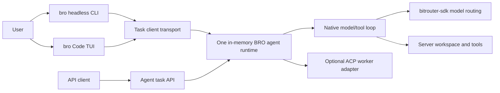

# Spec: one `bro` binary, three interfaces, one native agent server

Status: **implementation contract; current progress and verification are recorded in [the implementation notes](BRO_NATIVE_AGENT_IMPLEMENTATION.md).**
Baseline: this worktree at `fc157cf5` (2026-09-29).
Revision: 2026-09-30 — prioritize client/server separation and an in-memory
background runtime; durable workflow state and its component ownership are deferred.

## 1. Decision and scope

Ship **one `bro` executable** with three ways to use the same BitRouter-owned
coding agent:

1. A headless CLI that submits a task and can wait for its result.
2. An interactive TUI that submits tasks, displays progress, and answers
   requests for user input.
3. An authenticated task API for other clients.

`bitrouter-orchestrator` (BRO) provides the **native agent engine and a small
in-memory runtime**. The runtime owns active executions, conversation/context,
model/tool loops, workspace authority, approvals, cancellation, and live events.
`apps/bitrouter` hosts it in one background server process. The headless CLI and
TUI are clients of that server. The API is a third client entry, not a third
agent implementation. A local CLI/TUI starts or
connects to a `bro serve` process from the same executable; a remote client
connects only to an explicitly selected server.

The baseline requires no task journal, database, disk-backed event log, or
cross-restart recovery. Runtime state lives for the current server instance.
Durable workflow state may belong to another component; its ownership,
storage, scheduling, and recovery policy are later architectural decisions.
Do not add a persistence interface solely to anticipate those decisions.

This is a process-role split, **not** a request for two published executables.
One binary still contains both roles and their linked dependencies. Source-code
boundaries make ownership testable; they do not imply a smaller client download.

### Implementation order

Build a small, Pi-inspired Rust coding agent **inside BRO first**, then connect
the three client interfaces to that one engine. Pi is a reference for the
observable message → model → tool → result loop, not a package-by-package port.
Pin the Pi revision consulted during implementation; do not import its
extension system, session format, TUI design, or current durability package by
default. The first native agent uses a selected model and effort, simple
context assembly, and one sequential tool loop. Adaptive model routing,
adaptive context routing, native/ACP delegation, Jev, and feedback learning
follow only after the baseline is working and measurable.

The implementation sequence in §9 is: routed model-call seam → deterministic
native loop → in-memory background runtime → headless client → TUI → task API →
end-to-end validation. Each phase builds on the same agent loop and task
runtime; transport work must not create another loop. This document
defines the **first-party agent baseline and its three interfaces**, not the
later BRO optimization policy. The adaptive design is recorded separately in
the product-engineering BRO documents.

### Confirmed product choices

| Choice | Decision |
| --- | --- |
| Distribution | One `bro` executable. |
| User interfaces | Headless CLI, interactive TUI, task API. |
| Execution authority | BRO on the server. CLI/TUI do not run the native model/tool loop. |
| Local default | CLI/TUI connect to or start the local `bro serve` process. |
| Remote target | Explicitly selected; failure never falls back to local execution. |
| External harnesses | ACP remains an adapter for separately owned harnesses. |
| MVP model/context choice | User-selected model and effort; simple explicit context construction. |
| Runtime lifetime | One server instance owns in-memory executions; client disconnect does not cancel them. |
| Persistence | Not required; durable workflow ownership and cross-restart continuation are deferred. |
| Later differentiation | Dynamic model/context routing and workers can use the same execution interfaces; workflow-state ownership remains open. |

The command spelling and HTTP route examples below define implementation targets;
their appearance here is not an implementation-completeness claim. Consult
implementation notes and the current CLI for delivered behavior.

## 2. Source baseline and migration boundary

At the source baseline, [`apps/bitrouter`](../apps/bitrouter/) assembles both
the `bro` CLI and server, including router policy, daemon lifecycle, metering, local ACP launch,
and the Code driver. `bro serve` exposes the model router and existing control
surface. [`crates/bitrouter-tui`](../crates/bitrouter-tui/) owns terminal
rendering and a conversation projection; its Code view at that baseline consumes ACP
updates. `bro code [agent]` and `bro run <agent>` drive external ACP harnesses,
with harness-native session state. See [`DEVELOPMENT.md`](DEVELOPMENT.md),
[`CLI.md`](CLI.md), and [`AGENT_INTERFACE_UNIFICATION_SPEC.md`](AGENT_INTERFACE_UNIFICATION_SPEC.md).

The SDK's request-scoped [`ServerToolLoop`](../crates/bitrouter-sdk/src/language_model/server_tools/loop_controller.rs)
and [`SubAgentToolset`](../crates/bitrouter-sdk/src/language_model/server_tools/sub_agent.rs)
do not provide background native-agent execution ownership. The existing
`workflow_state` module extracts routing evidence; it is not a native agent
runtime. This spec adds that runtime rather than relabeling those components.

An earlier native-agent implementation introduced a journal-backed `TaskService`.
The revised P2 implementation replaces that dependency with in-memory execution
management. Existing journal/restart evidence describes the prior design; it is
not acceptance evidence for this revision. Old task records are not imported or
replayed. See the implementation notes for the current validation results.

This spec supersedes earlier **proposed** descriptions of `bro code` as
permanently ACP-only and remote agent execution as permanently out of scope.
It does not change the **implemented** behavior or the ACP controller's native
session ownership until explicit migration phases pass their gates. The
read-only remote-control listener remains a distinct authority boundary; see
[`REMOTE_CONTROL_MVP_SPEC.md`](REMOTE_CONTROL_MVP_SPEC.md) and
[`REMOTE_ADMINISTRATION_SPEC.md`](REMOTE_ADMINISTRATION_SPEC.md).

## 3. Ownership and dependency direction



| Component | Owns | Must not own |
| --- | --- | --- |
| `crates/bitrouter-tui` | Terminal input semantics, visual projection, rendering | Task truth, provider credentials, filesystem tools, agent process lifetime |
| Client side of `apps/bitrouter` | CLI parsing, target selection, terminal I/O, task client, human/JSON output | Native model loop, remote workspace, server database |
| Server assembly in `apps/bitrouter` | `bro serve` lifecycle and concrete wiring of router, runtime, auth, and transports; initiate and await runtime shutdown | Agent policy hidden in CLI or TUI code |
| `crates/bitrouter-orchestrator` | In-memory execution management, native session/context, model/tool loop, approvals, server events, workspace authority, cancellation and cleanup | Terminal drawing, CLI parsing, provider wire adapters, an assumed durable workflow store |
| `crates/bitrouter-sdk` | Provider protocols, routing, policy pipeline, metering contracts | User task progression or workspace execution |
| External ACP harness | Its native transcript, compaction, internal tools, and native session identity | BRO task ID or BRO delivery status |

`apps/bitrouter` remains the **composition root** because the sole executable
has a server entry. Calling its CLI/TUI code “client side” does not require the
entire app package to be client-only. Keep `bitrouter-tui` independent of the app
crate and async runtime. Add a small shared task wire contract only when both
client and server need it; do not make the client link the orchestrator merely
to import response types. Prefer concrete Rust types and private modules until
an actual second implementation needs a trait.

Within `bitrouter-orchestrator`, begin with these concrete responsibilities.
They may be private modules; the table is not a public API or a requirement to
create one trait per row.

| BRO responsibility | First implementation |
| --- | --- |
| `agent` | Own one bounded, cancellable model/tool loop and its stream of execution events. |
| `session` / `run` | Keep conversation messages, tool-call/result pairing, and current execution state in memory. |
| `runtime` | Register executions, retain cancellation tokens and execution handles, expose snapshots/subscriptions, resolve approvals once, and join shutdown cleanup. |
| `context` | Build each model input from the applicable instructions, conversation, and tool results; keep required constraints and legal message ordering. |
| `tools` | Execute local read, patch, and shell operations under the server's workspace and authority. |
| `model` | Submit the prepared native request to the assembled Router and capture proposed versus actual model/effort and usage. |

The runtime owns the run and presents submit/read/observe/input/cancel
operations to transports. Client connections own only their requests and
subscriptions, never the execution handle or its cancellation lifetime. Use
concrete Rust types and Tokio tasks in one process; worker processes, a generic
scheduler, facet routing, and a storage abstraction are not prerequisites.
Existing `apps/bitrouter/src/workflow_state` infers cross-harness request signals; it
must not become the authority for BRO's native task state. Later context/model
policies may read a view of the in-memory run at two explicit points: before
context construction and before a model request. The MVP implements those
points with ordinary functions and fixed choices, without a policy plugin
framework.

## 4. Process and target behavior

1. `bro serve` runs the existing model router and hosts the BRO agent runtime.
   Agent execution resources may initialize when a task is accepted, rather
   than for every router-only request. An API client never starts a local
   server on the user's behalf.
2. Headless CLI and TUI resolve a target before submission. With no explicit
   remote target they connect to the local service. If it is absent, one
   startup coordinator launches this same `bro` binary in server mode, waits
   for a ready/version response, and connects. Concurrent clients must not
   create competing servers. Startup failure is reported as failure.
3. An explicit remote target uses only its configured endpoint and credentials.
   It cannot read client-local provider keys, router config, database, or
   workspace as a fallback. The active host and workspace identity appear in
   both CLI results and the TUI.
4. The server owns the workspace path. A remote task names a server-side
   workspace known to the server; a client's current directory is never
   silently interpreted as a path on another host. The local client may offer
   its current directory as a request, which the local server validates.
5. Detach or connection loss removes that client's requests and subscriptions;
   an accepted execution continues, including waiting for approval. Explicit
   task cancellation is a separate operation. Losing the last observer does
   not stop an active execution.
6. Every server start creates a fresh `server_instance_id`. Readiness/capability
   replies advertise it with the contract version and limits. Subsequent
   requests and observations are bound to that instance; stale-instance
   requests fail clearly. A logical endpoint or server name is not a boot ID.
   After restart, prior task IDs and cursors are unavailable. Clients report
   that loss and never automatically resubmit an uncertain accepted request.
7. Server shutdown stops submission admission, requests cancellation of active
   executions, and awaits Agent/tool cleanup before releasing runtime resources.
   Track execution handles; closing listeners alone is not runtime shutdown.
   Cleanup includes pending approvals, subscribers, verification commands, and
   child processes. If a shutdown deadline requires forced termination, report
   incomplete cleanup honestly; cancellation does not roll back prior effects.

Local task access should use the existing OS-local daemon boundary, with a
new versioned task contract rather than exposing the trusted `DaemonCommand`
enum. Unix socket permissions (or the Windows named-pipe equivalent) gate
local clients. The HTTP task API is an adapter over the **same** runtime;
transport adapters cannot implement their own task progression.

## 5. Task API and event contract

### 5.1 Requests and execution identity

The API is **asynchronous**. Acceptance means the runtime registered and owns
the execution in memory; it does not mean that coding, verification, or delivery
succeeded, or that anything was saved to disk. The headless CLI may wait and
render a synchronous command experience over this contract. Existing task IDs
and route names can remain; renaming every wire type to `Run*` is not required
to change ownership and lifetime semantics.

| Operation | Proposed HTTP form | Semantics |
| --- | --- | --- |
| Discover capabilities | `GET /agent/v1/capabilities` | Version, server instance ID, supported operations, and finite limits |
| Submit task | `POST /agent/v1/tasks` | Validate instance/target/workspace and request key; return task ID and accepted state |
| Read task | `GET /agent/v1/tasks/{id}` | Current snapshot and instance-scoped cursor, including pending input and terminal outcome |
| Observe | `GET /agent/v1/tasks/{id}/observe` | Initial snapshot followed by ordered live events; optional instance-scoped `after` catches up within retained history |
| Answer request | `POST /agent/v1/tasks/{id}/inputs` | Answer one pending, identified approval or clarification |
| Cancel | `POST /agent/v1/tasks/{id}/cancel` | Request cancellation; terminal state arrives as an event |

The local transport provides the same operations and response meanings.
Distinguish control requests/responses, execution events, output deltas, and
approval lifecycle notifications. Correlate control replies with their request
IDs. A successful submit or cancel response is an acknowledgment, not a terminal
execution result. Subscription cancellation/detach closes only that observation.

Retain request-key deduplication in memory, scoped to the caller and server
instance: an exact retry returns the existing task, while conflicting reuse
fails. Advertise the retention window. Deduplication ends when its record is
evicted or the instance ends; it is not a cross-restart or indefinite exactly-once
guarantee. Clients must not blindly retry an ambiguous submission after those
boundaries. Do not add a durable inbox or a general input scheduler in this phase.

### 5.2 Snapshots, events, and bounded observation

Every emitted event carries `server_instance_id`, task ID, monotonically
increasing per-task sequence, event kind, timestamp, and typed payload. Initial
kinds include accepted/started, model-turn metadata, complete assistant message,
tool started/finished, input requested/resolved, cancel requested, and task
finished. Output deltas identify assistant text or the tool call and stdout/stderr
source. A delta never proves a complete response, tool result, or task outcome.
These sequences order in-memory observations; none is a durable cursor.

The snapshot contains status, workspace, selected model/tool mode, pending input
metadata (request ID, tool name/call ID, arguments or clarification), bounded
current assistant/tool output, final result, verification evidence, and its
event cutoff. Truncation and omitted history are explicit. Runtime status and
pending approvals remain available independently of notification delivery.

Register a subscription and obtain its initial snapshot/cutoff in one
synchronized step. Send that snapshot first, then updates newer than its cutoff;
there is no snapshot/subscription gap. Serialize state changes and sequence
allocation before publishing notifications. No disk write or fsync gates
acceptance, tool execution, approval, cancellation, or event publication.
When a retained `after` is supplied, include the retained events through the
cutoff as a catch-up batch with the snapshot, then tail newer events. Clients
use the cutoff to avoid applying catch-up events twice to the current projection.

Keep event catch-up and output caches bounded by both record count and bytes.
A retained `after` cursor can replay observations within this instance; an
expired cursor or lagged subscriber receives an explicit resynchronization
response and a fresh snapshot rather than a silent gap. Reattachment guarantees
current state and interaction, not every earlier streaming fragment or unlimited
transcript history. The model's required context remains separate from display
cache eviction.

Bound subscriber queues and request admission. Slow or disconnected clients
must not block the Agent loop. Notification overflow triggers resynchronization
or closes that subscription; it never cancels the run or drops the runtime's
terminal/pending-input state. Full admission queues reject new requests with a
typed overload error. Local and HTTP adapters share these rules; ordinary output
traffic cannot prevent cancellation or shutdown from being processed.

### 5.3 Approvals and cancellation

The runtime owns each pending approval and its waiting channel. An answer names
the instance, task, and pending request. Resolve it once under serialized state
management; duplicate, stale, or cancelled answers cannot execute the tool.
Multiple observers may display the request; the first valid answer wins.
Publish `input_resolved` when an answer, cancellation, or task termination clears
it, so every connected presentation removes its obsolete prompt. Reattachment
gets the full current request from the snapshot, without replaying old events.
Connection loss alone does not grant, deny, or clear an execution-owned approval;
the Agent's existing time/cancellation bounds still apply.

Cancellation requests signal the execution-owned token. Observe the terminal
event to learn whether execution and cleanup have ended. Server shutdown joins
that cleanup as specified in §4; an RPC timeout or client disconnect is not a
task-cancel request. Cancellation cannot undo completed tool effects.

### 5.4 Results and retention

`task_finished` reports the runtime-observed terminal status and evidence; it
never derives verification success merely from a model's claim.

`completed` means the native loop delivered a final answer. Verification has
its own `passed`, `failed`, or `unavailable` result. A configured check that
fails makes the task `failed`; no configured check leaves a completed task
explicitly unverified. CLI exit status reports task completion, while its
structured result always reports verification separately.

The initial state set is `accepted`, `running`, `waiting_for_input`,
`completed`, `failed`, `cancelled`, and `interrupted`. Reserve `interrupted` for
execution loss that the current runtime actually observes; a fresh server has
no earlier records from which to manufacture an interrupted or completed result.
Retain completed task snapshots for an advertised finite time/count/byte budget;
do not evict active executions or pending approvals to make space. Enforce an
active-execution admission limit. Expired or unknown task IDs return a typed
error, and memory cannot grow without a bound. No startup journal scan, automatic
tool replay, or cross-restart resume is part of this contract.

Task IDs belong to BRO. An ACP worker's native session ID remains a separate
field linked to that task; changing workers does not replace the task ID.
The local wire contract is version 4. Capabilities advertise a `runtime` object
with `server_instance_id` and limits. HTTP keeps `/agent/v1` and requires
`X-Bro-Server-Instance` for task operations; capabilities need only the execution
credential. `/events?after=N` remains a bounded JSON cursor read during migration;
`/observe?after=N` is the SSE subscription endpoint. Local requests/replies carry a correlated `command_id`; `submit` accepts an
optional caller-scoped `idempotency_key`. Local `observe` uses the same
snapshot/event contract. Live output snapshots mark truncation explicitly, and
terminal snapshots retain any reported `unknown_effect`. Typed errors include `instance_changed`, `unknown_task`,
`resync_required`, `conflict`, `overloaded`, and `shutting_down`.

Defaults: 8 active tasks; 32 terminal tasks, 64 MiB of terminal snapshots and
cached events, retained for up to 30 minutes; 256 events / 2 MiB per task;
8 observers per task with 32 queued events; 32 KiB of live snapshot output;
64 KiB task requests. Retention pressure may expire terminal results earlier.
Local admission permits 64 connections plus one bounded rejection reply. HTTP
permits 64 concurrent request handlers and 64 KiB JSON bodies. Agent event
handoff is bounded at 64 entries and approval handoff at one; subscribers never
backpressure an Agent. Agent step/context/duration bounds also have runtime
ceilings (256 steps, 2 MiB context, one day); default task bounds remain smaller.
HTTP connection draining has a five-second shutdown budget and reports any
remaining clients; runtime execution cleanup is joined independently.

The API must version its wire format and reject incompatible clients clearly.

## 6. Minimal native agent execution

One accepted task invokes one bounded native loop:

```text
register user task in memory → build model context → route one model request
  → retain complete assistant reply and tool-call IDs
  → execute allowed tool calls in order → retain every result or error
  → repeat with those results until a final reply or stop condition
  → run configured verification → publish terminal outcome
```

The first usable tool set is `read`, `write`, `edit`, and `bash`. Execution
occurs on the server in its selected workspace. Tool arguments are validated;
read/write/edit file paths are scoped to the workspace; command working directory,
exit status, stdout/stderr, timeout, output truncation, and cancellation are
explicit. A command's working directory alone does not confine its effects.
Calls run sequentially in the first slice, so two model-issued edits cannot
race. A tool failure is returned to the model as a result linked to its call
ID, and is also visible to the client. The loop has step, time, and spend
bounds. Reaching a bound is a visible non-success outcome.

Before each model request, BRO selects the configured model/effort and builds
the input from the recorded session. A tool call and its result retain the same
call ID. On a tool error, return a structured result to the model; a malformed
call does not execute. Record the final assistant message before declaring a
task complete. Context truncation may use a simple bounded rule, but must not
silently remove applicable user constraints or orphan a tool result. The MVP
does not select a different model based on inferred workflow phase.

For MVP verification, run a configured, bounded project check and record its
actual exit status and output. If no check is configured, report verification
as unavailable rather than successful. An independent model verifier,
subagents, adaptive context/model/effort policy, and automatic repair loops
are later capabilities. They can use the runtime's execution and observation
interfaces; their durable workflow state need not live in this crate. This
first slice must not claim the full BRO workflow is already delivered.

Native model calls use `bitrouter-sdk` routing and metering. Identify the
shared request-preparation, policy, execution, and settlement path before
embedding it: direct `Pipeline::execute` must not be assumed to include
HTTP-ingress-only `PromptTransform` behavior. Tests must compare equivalent
HTTP and native requests where the product promises the same policy.

## 7. Security and authority

The task API can execute code and is more privileged than the existing
read-only `/control/v1` API. Do not expose it simply by enabling that
listener or by relying on inference `server.skip_auth`. Remote task HTTP is
disabled by default, bound to loopback when enabled in the first release,
requires its own explicit execution credential, and is intended for an
authenticated tunnel or TLS reverse proxy. No browser cookie or permissive
CORS authentication is implied. Error bodies and events never include provider
keys, complete environment values, or server config secrets.

The server validates workspace authority and input IDs before side effects.
An approval is bound to one task and one pending request; a stale, duplicated,
or cancelled approval cannot authorize another action. Cancellation reaches
the model request and child process, and reports if the effect of a command
cannot be established. The first release is for a trusted single operator;
multi-tenant isolation and hostile untrusted repositories require a separate
execution-environment design. A path allowlist alone is not an OS sandbox.

## 8. CLI and TUI migration

The native headless command for this implementation is `bro task run "..."`,
with a stable machine-readable result and a nonzero exit status for failed,
cancelled, or interrupted tasks. It waits by
default. Structured streaming output emits the accepted task ID first and a
terminal record last, with diagnostic logging kept off stdout.
Future detached operation uses the same API rather than a second executor.
Client connection loss or a server-instance change is reported separately from
an observed terminal task failure; never invent a task outcome from transport
failure or resubmit automatically. Reattach means observing an existing run in
the same server instance, not recovering execution after a server restart.

`bro code` is the target native BRO TUI. Its state becomes a projection of
server task events; its editor and controls issue task inputs and cancellation
through the task client. Keep the existing ACP Code path working until the
native TUI can reconnect and correctly show pending input, tool results, and
terminal outcomes. Do not silently reinterpret an existing `bro code <agent>`
invocation or harness-native saved session as a BRO task.

Current `bro run <agent>`, `bro acp serve <agent>`, and native `bro codex` /
`bro claude` entry points retain their explicit external-harness semantics
through this MVP. Moving an external harness behind the BRO server later
requires its own capability and lifecycle gate; ACP transcript, compaction,
and recovery remain harness-owned. Before any CLI, config, listen-address,
or harness-wiring change ships, update [`skills/bitrouter/`](../skills/bitrouter/)
and plugin manifests in the same change as required by [`AGENTS.md`](../AGENTS.md).

## 9. Phased implementation plan for a Codex goal

**Goal outcome:** from this worktree, deliver one `bro` binary whose headless
CLI, interactive TUI, and opt-in task API are clients of one BRO-owned native
background server with a small in-memory runtime. A real provider must complete
and verify one bounded coding task.
The first delivered agent uses a fixed model/effort, simple context, and
sequential local tools; adaptive routing, delegation, durable workflow storage,
and cross-restart continuation are outside this goal.

Execute P0–P6 in order. A phase is complete only when its exit evidence is
recorded; code compiling or a mock-only test is not sufficient for a claim
about the full product path. Continue to the next phase without a separate
approval request when its dependencies are satisfied. Record for each phase:
the code paths changed, focused checks and their results, any external gate,
and the remaining risk. If a live credential or another external dependency is
unavailable, finish independent work and identify the unproven gate rather than
substituting mock evidence. Do not change unrelated worktree modifications.

### P0 — Establish the routed native-call seam

**Implement:** inspect the current `apps/bitrouter` assembly and SDK
`PromptTransform`/pipeline path, then provide the smallest native call path
BRO can use with an explicit caller, requested model/effort, policy checks,
fallback, and settlement. Keep HTTP protocol parsing at ingress. Avoid a
parallel Router instance or an unmetered direct provider client. Identify how
the SDK's request-scoped `ServerToolLoop` is excluded from BRO-owned local
coding tools so a call has one executor. Pin the Pi source revision consulted
for the loop design in implementation notes.

**Exit evidence:** focused tests show that a permitted native call executes and
is attributed, a rejected call never reaches a provider, and equivalent
HTTP/native calls receive the same applicable policy and settlement behavior.
Document any intentional ingress-only difference. Do not claim the agent exists
at this phase.

### P1 — Implement one deterministic native agent loop

**Implement:** add `crates/bitrouter-orchestrator` with concrete `agent`,
`session`/`run`, `context`, `model`, and `tools` responsibilities from §3. A
single run records the user input, builds a `Prompt` using a selected model and
effort, records the complete assistant reply, then executes its client tool
calls sequentially in reply order. Initially use `read`, `write`, `edit`, and
`bash`. Validate names and arguments before effects; record each call ID,
start, result/error, and final answer. Check cancellation and step/time/spend
bounds before every new request and tool. A malformed call produces an error
result without execution. Use a deterministic model fixture through a narrow
test seam; do not add a public model abstraction solely for tests.

**Context rule:** include applicable instructions, user messages, complete
assistant replies, and paired tool results in order. Keep this first builder
simple; reject an over-limit context explicitly rather than silently dropping
instructions or orphaning a tool result. Streaming emits assistant text and
live shell output as bounded, transient display deltas,
but only a complete assistant response can authorize tool execution.

**Exit evidence:** a deterministic multi-turn fixture reads, patches, checks,
and produces a final answer; tests exercise multiple ordered calls, tool
errors, malformed arguments, cancellation, and each bound. No tool runs twice
from one call ID. This phase proves the engine, not the server or a real model.

### P2 — Make BRO a small in-memory background runtime

**Implement, first slice:** replace the existing journal-backed service with
concrete in-memory execution management around P1. Keep submission, read,
identified input, cancellation, and bounded event queries while removing the
journal directory, append/fsync gates, startup replay, and restart reconciliation
from execution. Existing task/type names may remain to keep the refactor scoped.
Preserve workspace validation, one active task per canonical workspace in this
server instance, configured verification, and caller/instance-scoped request-key
deduplication. Do not require cross-process workspace locking or introduce a
database, storage trait, worker process, durable inbox, or generic scheduler.

The runtime owns cancellation tokens and tracked execution handles independently
of connections. Add the server-instance handshake, full pending-input snapshots,
finite admission/retention limits, and shutdown that seals admission, cancels
active executions, and joins cleanup. Retain runtime state before acknowledging
control operations; execution does not depend on logging or observers. The app
assembles the runtime and local transport; neither the app nor the transport
advances an independent Agent state machine.

**Implement, second slice:** add the §5 snapshot-plus-subscription contract,
typed assistant/tool output deltas, input-resolved notifications, bounded
catch-up, and slow-subscriber resynchronization. A single synchronized boundary
captures the snapshot/cutoff and installs the observer. Keep required model
context separate from bounded presentation history. Use the same runtime for
local and HTTP observations.

**Exit evidence:** tests cover state transitions, instance-scoped ordering,
snapshot/subscription races, one-use approval and approval/cancel races,
workspace validation, disconnect without execution cancellation, reattach to
the same running task (including pending approval), lag/resynchronization,
retention/admission limits, and shutdown during model/tool/approval execution.
The P1 fixture runs through runtime submission without reading or writing task
journal files; workspace tool effects still execute normally.
A fresh runtime has a new instance ID and rejects old IDs/cursors; no old run
or tool is automatically reconstructed or resubmitted. Historical journal tests
do not satisfy these gates and must be replaced with runtime-lifetime evidence.

### P3 — Deliver the headless client and real coding path

**Implement:** add `bro task run` as a client of the local agent runtime. It
connects to, or starts, the same `bro` executable in server mode; startup is
race-safe and checks readiness and contract version. The command waits by
default, prints a stable structured result, and maps failed, cancelled, and
interrupted outcomes to nonzero status. Keep `bro run <agent>` ACP semantics.
Support an explicit bounded verification command; absent one means
`unavailable`. Wire the selected provider through P0 rather than a test-only
model path.

**Exit evidence:** separate `bro` client/server processes finish the controlled
coding fixture, including a project check and a final answer available from the
runtime. Exercise server startup races, version mismatch, instance replacement,
disconnect/reconnect to an active execution, cancellation, shutdown cleanup,
and explicit remote failure without local fallback. Transport failure must not
produce a fabricated terminal result or automatic resubmission. Record a distinct
credentialed live-provider run with the model, actual route, tool actions,
verification result, and usage provenance. If no credential is available,
label this exit gate unproven while continuing independent phases.

### P4 — Connect the interactive TUI

**Implement:** make the native `bro code` view a projection of P2 runtime
snapshots/events and bounded transient assistant-text and shell-output deltas.
The TUI sends user input, identified approval, and cancellation through the
same client contract as P3; it never executes native tools. Reuse its existing
editor and rendering where semantics match. Preserve explicit ACP harness
paths and existing harness-native sessions until their migration is separately
validated. Do not import their transcripts as BRO task records.

Observe over the streaming contract rather than treating repeated snapshot
polling as the finished client/server design. Detach closes the observation;
explicit cancel stops the execution. Show reconnect, lost-instance, expired-run,
and resynchronization states without manufacturing completion.

**Exit evidence:** start a task, show assistant/tool progress, answer an input
once, disconnect, reattach to that same server instance, cancel another task,
and observe the same terminal status and verification as the headless client.
Exercise two observers resolving one approval, lagged observation, and a server
restart without silently retrying the task. TUI code owns only its projection,
not a second native loop or execution registry.

### P5 — Expose the opt-in task API

**Implement:** mount the §5 HTTP operations on the P2 runtime. Keep task
execution disabled by default on the HTTP listener; when enabled, bind to
loopback and require a credential distinct from inference and read-only
control access. Validate caller, server instance, workspace, instance-scoped
request key, task ID, and pending input ID before effects. Use the same bounded
snapshot/subscription, cursor, approval, cancellation, and terminal semantics as
local clients. Do not infer authorization from
`server.skip_auth` or add a second HTTP task engine.

**Exit evidence:** an authenticated API client and a local CLI client see the
same task and ordered events; a second client reattaches within the same instance;
an expired cursor explicitly resynchronizes. Unauthorized, stale-instance, or
stale-input requests produce no side effect. Disconnecting an HTTP stream does
not cancel the run, and slow consumers do not block it. Existing model
router and read-only control endpoints retain their previous access behavior.

### P6 — Prove the integrated product and close the goal

**Implement:** complete only the integration fixes exposed by P0–P5. Update
`skills/bitrouter/`, plugin manifests, and internal CLI documentation in the
same change as any actual CLI/config/listen/harness wiring alteration. Keep
the final change scoped to the native-agent baseline. Do not add adaptive
policies, subagents, Jev, broad extension APIs, durable storage, or a generic
workflow engine to satisfy an unrelated future requirement.

**Exit evidence:** run the repository-required `cargo nextest run
--all-features` (or `cargo test --all-features` when nextest is absent), `cargo
clippy --all-features`, and `cargo fmt -- --check` after source changes. Confirm
the single-binary, separate-process headless/TUI/API paths; unchanged ACP and
Router command behavior; detach/reattach, approval races, bounded observation,
server shutdown, and explicit instance loss without duplicate submission; and
the credentialed live-provider result from P3. Report mock, local integration,
live-provider, and any hosted evidence separately. Mark the goal complete only
when all required product paths and gates pass; otherwise report the exact
remaining gate without calling the implementation complete.

### Suggested `/goal` objective

> Implement `docs/BRO_NATIVE_AGENT_SERVER_SPEC.md` P0–P6 in order in this
> worktree. Build the Pi-inspired Rust single-agent baseline first, then attach
> headless CLI, TUI, and authenticated task API to one in-memory BRO runtime
> hosted by a single background server process. At each phase, record changed
> paths, focused verification, and remaining risks; keep
> existing ACP and Router behavior intact. Complete all phases and required
> repository checks, and distinguish deterministic tests from a credentialed
> live-provider coding run. Prove detach/reattach, bounded streaming, identified
> approvals, cancellation, and server cleanup. Do not add adaptive routing,
> subagents, persistence requirements, or cross-restart continuation in this goal.

## 10. Implementation defaults and later decisions

1. **Headless command:** use `bro task run` for native tasks. Keep `bro run
   <agent>` on its existing ACP path. Changing an existing command's meaning
   is a separate migration.
2. **TUI cutover:** P4 changes bare `bro code` only after the native event,
   pending-input, and reconnect paths pass their gates. Preserve explicit
   `bro code <agent>` and harness-native sessions; do not silently import them
   as BRO tasks. The migration UI for old sessions remains a release decision.
3. **Task HTTP exposure:** P5 starts opt-in on loopback with a distinct task
   execution credential. Remote TLS, multi-tenant authority, and a public
   endpoint remain later decisions. An explicit remote target never falls back
   to local execution.
4. **Verification default:** an explicitly supplied, bounded project check is
   authoritative for MVP verification. If absent, show `unavailable`; neither
   the assistant's claim nor a zero tool exit from an unrelated command means
   the task was verified. The long-term project-check configuration source is
   a later decision.
5. **Runtime identity and lifetime:** retain task IDs for the advertised lifetime
   of the current server instance. Create a fresh boot identity on restart;
   endpoint names, task IDs, and client attachments do not substitute for it.
   Reattach observes a still-existing execution; it does not resume lost work.
6. **Observation and cleanup:** use bounded caches/queues and snapshot-based
   resynchronization. Active work survives losing every observer. Terminal
   records have finite retention; Server shutdown explicitly cancels and joins
   active work. Publish limits in capabilities and test boundary behavior.
7. **Deferred architecture:** durable workflow state, its owning crate/service,
   storage backend, input scheduling, safe replay, multi-process workers, and
   crash recovery require a separate design. This baseline does not prescribe
   them or add unused extension seams for them.

These defaults make P0–P6 implementable without deciding adaptive routing or
the final release UX. Any actual CLI, config, listen-address, or harness wiring
change must update the BitRouter skill and plugin manifests in lockstep.
