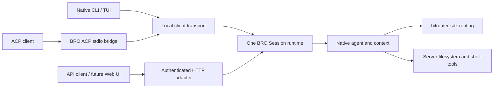

# Spec: BRO shared sessions for native and ACP clients

Status: **deprecated draft; superseded by [BRO agent runtime MVP](BRO_AGENT_RUNTIME_SPEC.md), a draft for maintainer review.**

Deprecated: 2026-09-30. The body below is historical proposal material. Its
Session/Run terminology, FIFO proposal, and phase list are replaced by the new
Thread/Turn/Item draft. Neither document establishes implementation completion.

Authority update (2026-10-01): the replacement v0.2 spec records the runtime baseline.
Queue/steer, bounded concurrency, persistence and safe recovery are MVP scope.
The table below's historical "confirmed" durability deferral and cancel-all-
queued-input proposal are superseded. Current cancellation targets one Turn;
queue resume is explicit after failure/cancel/recovery blocking.

Product 003 now gives orchestrator 004 v1.0 precedence for conflicting
core/harness ownership, interfaces and subsequent stages. See the replacement
spec's authority note and [migration handoff](BRO_AGENT_RUNTIME_HANDOFF.md).
The older Session/Run proposal below does not define the new core's identity
or persistence protocol merely because some names overlap.

Date: 2026-09-30

Source baseline: `b4294b31`, plus the current worktree's native agent implementation.

This is a proposed next slice after
[BRO_NATIVE_AGENT_SERVER_SPEC.md](BRO_NATIVE_AGENT_SERVER_SPEC.md). It adds
continuous conversations and an inbound ACP interface to the existing
process-local agent runtime. The
[implementation record](BRO_NATIVE_AGENT_IMPLEMENTATION.md) remains the source
for delivered behavior and verification. Approval of this draft is a separate
decision from implementation and release.

## 1. Product decision

BRO owns a continuous coding conversation on the server. Native CLI/TUI,
an ACP client, and an authenticated API client can attach to the same conversation
and interact concurrently. New input inherits its existing context.

The defining acceptance scenario is:

1. A native client creates a BRO Session and starts coding work.
2. An ACP client loads that Session while the work is running.
3. Both see assistant text, live shell output, tool results, and pending approvals.
4. Either authorized client can submit the next input, answer an approval, or
   cancel the Session's current work.
5. Closing either client, including the last client, leaves accepted work running.
6. An approval with no connected client remains pending until a client answers it,
   work is explicitly cancelled, or the server shuts down.
7. A later client attachment gets the current state and can continue interacting.

The first additional product client is ACP. A Web UI is a future consumer of
the same API; building that UI is outside this slice.

### Confirmed choices and proposed defaults

Historical decisions for this obsolete slice, not current product confirmation.
In particular, the durability deferral below was replaced by v0.2 MVP scope.

| Topic | Decision | Review status |
| --- | --- | --- |
| Conversation | The next input inherits the same Session's context. | Confirmed in discussion |
| Multi-client use | Several clients may control one Session concurrently. | Confirmed in discussion |
| Client exit | Accepted work continues independently of client connections. | Confirmed in discussion |
| Permission authority | Server stores the effective policy and checks every effect. | Confirmed in discussion |
| Next client | An ACP client consuming BRO's native agent. | Confirmed in discussion |
| Durability | Cross-server-restart state and continuation are deferred. | Confirmed in discussion |
| Third-party extensions | Plugin loading, hooks, and extension APIs are outside this slice. | Confirmed in discussion |
| Busy-session input | FIFO follow-up queue; steering is deferred. | Proposed default |
| Approval wait | No automatic expiry while the server remains alive. | Proposed default |
| Settings | Workspace, model, effort, and permission profile fixed at Session creation. | Proposed default |
| Cancel | Cancel active work and withdraw queued input; keep the Session usable. | Proposed default |

## 2. Current implementation and the required delta

Source inspection confirms the following baseline; this table is not a claim
that its tests were rerun for this draft.

| Current source | Delivered baseline | Change required here |
| --- | --- | --- |
| `crates/bitrouter-orchestrator/src/service.rs` | In-memory `TaskService`, instance identity, task snapshots, bounded observation, approval resolution, cancellation, and shutdown ownership | Add continuous Session ownership and serialized follow-up admission |
| `crates/bitrouter-orchestrator/src/agent.rs` | Each `run_with_approvals` starts with a new user-message history | Execute against retained Session context and return a valid continuation after interruption |
| `apps/bitrouter/src/agent_local.rs` | Local contract v4 for one-shot task operations | Add negotiated Session operations and client attachment |
| `apps/bitrouter/src/agent_api.rs` | Opt-in authenticated `/agent/v1` task API over the same service | Expose the same Session operations with existing workspace/auth restrictions |
| Native CLI/TUI | Can submit/observe a task, detach, and reconnect | Keep a composer and Session subscription across successive Runs |
| Existing ACP path | Drives separately owned external harnesses | Add BRO-as-ACP-agent bridge to the shared native runtime |

Current approval waits consume `AgentConfig.max_duration`; the default duration
is 600 seconds. Retaining approvals indefinitely therefore requires an explicit
budget change. Current headless tasks approve their own pending tool requests;
that behavior must become an explicit server policy rather than client-driven
approval of every request it happens to observe.

Existing multi-observer, instance fencing, live output, snapshot cutoff, and
workspace exclusion behavior should be extended through the same service.
No transport gets its own agent loop or parallel source of execution truth.

## 3. Ownership and source placement



| Component | Responsibility |
| --- | --- |
| `crates/bitrouter-orchestrator` | Session/context, Run progression, input queue, permission evaluation, approvals, events, workspace exclusion, cancellation, and cleanup |
| Server side of `apps/bitrouter` | Assemble the runtime in `bro serve`; establish callers, workspace grants, startup policy, and transport listeners |
| Client side of `apps/bitrouter` | Native CLI driver, target selection, client transport, and the ACP stdio bridge |
| `crates/bitrouter-tui` | Input editing, display projection, and rendering |
| `crates/bitrouter-sdk` | Existing model/provider/routing pipeline and ACP protocol support where reusable |

`apps` contains executable composition and client/server entry points. This is
compatible with a thin CLI/TUI client. Execution rules remain in the orchestrator.
The renderer cannot depend on the orchestrator or execute workspace tools.

The ACP bridge connects through the common client contract. It must not construct
an `Agent`, open a separate `TaskService`, or call provider APIs directly.
Reuse the current ACP Rust dependency and stable ACP v1 wire semantics;
the SDK crate's major version is not the ACP wire-protocol version.

Session wire DTOs must be usable without importing the execution engine.
Start with a small shared contract module in the app, with explicit server-side
conversion. Extract a contract/client crate only when an actual external Rust
consumer needs it. Do not build a general service registry, scheduler, storage
trait, or extension host for this slice.

## 4. Session, Run, and attachment

These are semantic responsibilities, not a requirement for three public traits.

### Session

A Session owns:

- An opaque `session_id`, bound to a `server_instance_id`.
- A validated server workspace and immutable creation settings.
- Canonical conversation messages and linked tool results.
- Its effective server permission profile.
- At most one active Run and a bounded FIFO of accepted follow-ups.
- Pending approval state, retained Run outcomes, and bounded display state.
- A monotonically increasing event sequence and current snapshot cutoff.

Session identity survives Run completion and client disconnect within the current
server instance. Client attachment count does not determine execution ownership.
An idle Session can accept another Run until it expires or reaches its advertised
capacity. The first slice has no persistent Session catalog.

### Run

A Run processes one accepted user input through model/tool iterations and optional
verification. It has a `run_id`, its originating submission ID, its own execution
limits, and a terminal result. One successful Run leaves the Session idle or starts
the next accepted follow-up. Its conversation remains available to later Runs.

Run completion, verification outcome, and transport failure remain separate facts.
Existing `task_id` may identify a compatibility one-shot Run; do not rename every
task wire type solely to introduce Sessions.

### Attachment

An attachment identifies a client's interaction with a Session. It owns requests
and subscriptions, never the Run's cancellation token or worker handle. Detaching
releases connection resources while preserving Session state and accepted work.

All native, HTTP, and ACP attachments resolve to the same Session. No session copy
is created when a second client loads it.

## 5. Input, ordering, context, and cancellation

1. **Serialize admission.** The runtime orders accepted inputs under one Session
   state transition. Concurrent clients receive explicit acceptance and a Run ID.
2. **FIFO while busy.** An input submitted during model execution, tool execution,
   verification, or approval wait is queued. It does not silently interrupt the
   current Run. Reject overflow before admission with `overloaded`.
3. **Promote on completion.** A successful Run promotes the next queued input.
   Append that input to model-visible context at promotion; a queued input must
   not affect the current model request. Queued input is separately visible in
   the snapshot, attributed to its submission and originating attachment.
4. **Stop on cancellation/failure.** Explicit cancellation cancels the active Run
   and withdraws all inputs queued before that cancellation transition. A failed
   Run also withdraws queued follow-ups with an explicit reason. This prevents
   an unexpected new Run immediately after failure or cancellation. New input
   may be submitted after cleanup; the Session remains usable.
5. **Fence cancellation.** Cancellation acknowledges intent first. New admission
   is rejected while cleanup is in progress. The terminal event reports completion
   of cleanup and any `unknown_effect`; previous side effects are not rolled back.
6. **Preserve valid context.** Retain complete assistant messages and tool-result
   pairing. When an admitted tool call is cancelled or fails before settlement,
   settle it with an explicit error/interruption result before a later model call.
   Include effect uncertainty when applicable. Incomplete assistant stream text
   remains display progress and is not promoted into a complete model message.
7. **Keep display and context separate.** Evicting streaming fragments must not
   remove model context or complete replayable conversation records. Reject an
   over-limit continuation explicitly; do not silently drop instructions, messages,
   or tool results. Automatic compaction and history editing are deferred.
8. **Keep workspace exclusion.** Different Sessions can execute concurrently in
   different authorized workspaces. Preserve the current one-active-execution-per-
   canonical-workspace restriction, including read-only Runs and approval waits.
   Keep the lease across a queued drain; release it when the Session becomes idle.
   A different Session targeting a busy workspace fails before accepting its input.

Tool identities used for display and approvals must be unique across Runs in the
Session. Provider-local tool-call IDs can repeat; qualify them by Run/model turn
and preserve the provider ID for legal tool-result pairing.

Input idempotency is scoped to caller, server instance, Session, and operation.
The same retained key and payload returns the same accepted Run. Conflicting
reuse fails. Correlation IDs for RPC replies and submission idempotency keys are
different fields. Deduplication is bounded and ends on expiry or restart.

## 6. Server permission and approval contract

### 6.1 Profiles

Proposed first-slice profiles:

| Profile | `read`, `ls`, `find`, `grep` | `write`, `edit`, platform shell | Verification command |
| --- | --- | --- | --- |
| `read_only` | Allow | Deny | Deny |
| `ask` | Allow | Ask per invocation | Ask for the explicit command |
| `allow_effects` | Allow | Allow under server restrictions | Allow under server restrictions |

Unix uses `bash`; Windows uses `powershell`. All tools execute on the server.
`allow_effects` is an explicit trusted-operator choice and grants no additional
workspace, filesystem sandbox, transport, or provider authority.

The server validates the requested profile at Session creation against the
caller and host's allowed profiles. It stores the effective profile in memory
and reports it to every client. A client cannot broaden it through an approval,
an ACP mode name, a prompt, or a forged tool name. Hard server restrictions
always take precedence. Profile mutation is deferred.

Every side effect goes through the same server check, including configured
verification. Filter advertised tools and enforce the same policy when calls
arrive; omission from the model schema alone is insufficient authorization.
Binding the verification command to an accepted input does not bypass policy.

Proposed compatibility mapping:

- A newly created native TUI Session uses `ask` by default.
- A newly created headless task requests `allow_effects`, preserving current
  automatic tool execution only when the server permits that profile.
- Existing `--read-only` requests `read_only` and still rejects `--check`.
- Submitting to an existing Session inherits its profile. A headless attachment
  never changes it or automatically answers another client's pending approval.
- ACP-created Sessions use `ask` by default; API creation defaults to `ask`.

### 6.2 Approval state

The runtime stores approval ID, Session/Run/action IDs, exact proposed tool and
arguments, workspace, permitted decisions, and pending/resolved state.

1. A tool effect cannot start before the server allows it or resolves its approval.
2. All authorized observers see the same pending request in snapshots/events.
3. The first valid authorized answer wins atomically; stale, duplicate, or
   cancelled answers cannot produce another effect.
4. A response can authorize only the identified invocation. First-slice options
   are allow once and reject once; remembering broad permission changes is deferred.
5. Resolving, cancelling, or terminating work emits `approval_resolved` so native
   and API views clear their obsolete prompt.
6. Connection loss cannot grant, deny, expire, or cancel the underlying approval.
7. Awaiting human approval does not consume the Run's execution-duration budget.
   Model/tool timeouts and active-execution bounds still apply outside that wait.
8. Pending approvals and their Sessions cannot be evicted by idle retention.
   They count toward finite active-work limits; explicit cancel or server shutdown
   provides cleanup when no person will answer.

The first deployment remains a trusted single operator. Existing local socket
ownership and explicit API execution credentials establish access; retain HTTP
workspace checks on every Session lookup and operation. Transport adapters supply
server-established caller identity. Do not invent a client-supplied trusted
principal or add a multi-tenant ACL engine here.

## 7. Observation and reconnect

Session observation continues across Run boundaries. A headless client can stop
waiting after its particular Run finishes without ending the Session subscription
contract or cancelling other accepted work.

Every event has `server_instance_id`, `session_id`, per-Session sequence,
timestamp, typed payload, and `run_id` when it concerns a Run. At minimum expose:

- Input accepted/queued/promoted/withdrawn.
- Run started/finished, cancellation requested, and verification result.
- Complete user/assistant messages and tool-call/result records.
- Assistant text deltas and shell output deltas with action ID and stdout/stderr.
- Approval requested/resolved and Session expiration where observable.

Observation registers a subscription and captures snapshot/cutoff atomically.
The snapshot contains settings, queue, active Run, pending approvals, retained
outcomes, bounded live output, and explicit truncation/capacity information.
Send the snapshot before events newer than its cutoff. A retained cursor can
catch up; an expired cursor or lagged subscriber gets an explicit resynchronization.
Complete conversation history is available through bounded, paged reads within
the retained Session, separately from the streaming event cache.

Canonical conversation admission and ordering belong to the runtime. ACP replay
must use complete conversation records, not attempt to reconstruct history from
an evictable stream of deltas. An attachment joining during output sees the
bounded accumulated live state, then subsequent output, with no subscription gap.

Bound event buffers by count and bytes. A slow client cannot block model/tool
execution, approval state changes, cancellation, or another client's observation.
Disconnect/resync the slow subscription when necessary.

## 8. Inbound ACP adapter

### 8.1 Process role and session identity

The ACP-facing process is a thin stdio bridge to `bro serve`. Local startup uses
the existing coordinated daemon-start path. Its stdout contains only ACP frames;
diagnostics use stderr. An explicit server target never falls back to local.

ACP EOF, transport errors, and bridge process exit detach its connections.
They must not call Session cancellation, kill a server-owned shell process, or
stop the shared server. An explicit ACP `session/cancel` is a user cancellation
operation and maps to the Session work-cancellation rule in §5.

Expose BRO's opaque Session ID as the ACP Session ID. The bridge binds operations
to the discovered server instance. Loading a native-created Session finds the
same runtime record and validates the caller/workspace. A stale ID cannot create
a replacement conversation. A different workspace or settings supplied during
load cannot mutate the existing Session.

### 8.2 Required mapping

| ACP method / mechanism | BRO meaning |
| --- | --- |
| `initialize` | Negotiate implemented stable wire capabilities; no speculative features |
| `session/new` | Create Session with validated server workspace and `ask` profile |
| `session/load` | Attach to existing Session and replay the retained complete conversation |
| `session/prompt` | Admit input or queue it; stream updates and respond when that input's Run terminates |
| `session/update` | Project shared messages, tool status, and live output, including work originating in another client |
| `session/request_permission` | Project an eligible server-owned pending approval and submit the client's selected one-time response |
| `session/cancel` | Cancel active Session work and withdraw queued input; return ACP cancelled stop reasons for affected pending prompts |
| stdio EOF / bridge exit | Detach only |

Advertise `loadSession` only when full replay works. A native Run completion does
not prevent an attached ACP client from receiving updates from later Runs.
Do not assume a generic client renders unsolicited updates correctly; verify the
chosen real client while native-origin work starts, runs, and finishes.

Capture the replay cutoff and live subscription atomically. Replay complete
conversation records through that cutoff before answering `session/load`, then
deliver newer updates. Project the current pending approval and bounded live tool
state as well. Work arriving during replay must neither disappear nor appear twice;
bounded subscription overflow requires a fresh attachment/replay with an explicit
error rather than an incomplete successful load.

Use ordinary ACP tool content updates for server-owned shell output. Do not call
client-side `terminal/create` or filesystem APIs to execute native tools: that
would tie execution to the client's lifetime and workspace. Broader client-hosted
execution is outside this slice.

Client-provided MCP servers on create/load do not extend the native tool registry
in this slice. Reject nonempty unsupported requests clearly; do not launch those
servers or claim an integration that does not exist. Likewise, do not advertise
Session modes, permission persistence, fork, close, or optional lifecycle methods
without implementing their defined semantics.

### 8.3 Multi-client approval limitation

ACP permission requests are connection-local RPCs. Their lifetime is distinct
from the shared runtime approval. Prefer one eligible ACP attachment at a time
as the permission-request recipient; native/API clients still see and can resolve
the same approval. Losing that recipient leaves the approval pending and allows
another eligible attachment to receive it.

When another client resolves it, publish the corresponding tool status to ACP,
stop treating the connection-local RPC as an authority, and reject/ignore its late
answer. Transport failure must not translate into a server-side reject decision.
An explicit cancelled permission outcome must be handled according to ACP's
turn-cancellation semantics.

The real-client gate must verify that obsolete approval UI is dismissed or
clearly becomes inactive when another client answers. Do not invent an ACP
notification for closing permission dialogs. If the chosen client's protocol/UI
cannot represent this correctly, report the specific limitation and keep this
gate open; do not claim complete simultaneous-control support.

## 9. Proposed CLI and API surface

These spellings are **review proposals, not current command documentation**.

```text
bro code                             # new continuous native Session
bro code --session-id <id>            # attach native TUI to an existing Session
bro task run "..."                    # new Session + one headless Run
bro task run "..." --session-id <id>  # submit follow-up; wait for this Run
bro acp serve                        # new native BRO ACP stdio bridge
bro acp serve <agent>                 # existing external-harness bridge
```

Adding the no-agent ACP form preserves the meaning of explicit `<agent>`.
Existing `bro code <agent>`, `bro run <agent>`, native harness launchers, and
external harness Session IDs retain their current ownership.

Existing `--task-id` can remain an observer compatibility path. It must not
silently treat a Run ID as a Session ID. `--session-id` selects continuous
interaction; creation-only settings supplied on attach must be rejected or
validated as exact matches, never silently replace Session settings.

An accepted headless record reports both Session and Run IDs. Its terminal record
and exit status describe that Run. Closing its output stream only detaches.
Connection loss reports an unknown transport outcome, never a manufactured Run
failure or an automatic retry after instance loss.

Proposed HTTP additions under the existing opt-in execution API:

| Operation | Route |
| --- | --- |
| Create Session | `POST /agent/v1/sessions` |
| List authorized retained Sessions | `GET /agent/v1/sessions` |
| Read Session | `GET /agent/v1/sessions/{id}` |
| Read retained conversation page | `GET /agent/v1/sessions/{id}/history` |
| Submit input | `POST /agent/v1/sessions/{id}/runs` |
| Observe across Runs | `GET /agent/v1/sessions/{id}/observe` |
| Answer approval | `POST /agent/v1/sessions/{id}/approvals/{approval_id}` |
| Cancel active and queued work | `POST /agent/v1/sessions/{id}/cancel` |

The local contract exposes equivalent operations. Reuse the existing HTTP
execution credential, instance header, body limits, and workspace allowlist.
Session listing must apply the same access restrictions as reading one Session.
Existing task routes become one-shot compatibility adapters over the same runtime.
Negotiate/version new local schemas explicitly; unsupported older clients fail
clearly unless a tested compatibility adapter is provided.

## 10. Runtime lifetime, limits, and shutdown

No journal, database schema, storage abstraction, startup replay, durable cursor,
automatic post-crash continuation, or tool replay is required.

Each server start creates a fresh instance ID. Old Session/Run IDs, queues,
approvals, cursors, and deduplication records are unavailable after restart.
Clients report instance loss and never automatically recreate the Session or
resubmit an ambiguously accepted input. Side effects already made to the server
workspace may remain; runtime-state loss does not undo them.

Graceful shutdown seals admission, cancels active and queued work, resolves
pending approvals as cancelled, and joins agent/tool/verification cleanup.
The shared server's lifecycle is independent of the ACP bridge's lifecycle.

Retain existing task limits where applicable and add finite Session bounds.
Suggested review defaults:

| Resource | Proposed bound |
| --- | --- |
| Registered Sessions | 32 per instance, with explicit overload |
| Active Session drains, including approval waits | Existing 8-active-work limit |
| Queued inputs per Session | 16 inputs / 512 KiB aggregate |
| Individual input | Existing 64 KiB request ceiling |
| Canonical conversation per Session | 2 MiB; capacity failure is explicit |
| Retained canonical conversation across Sessions | 64 MiB ceiling |
| Observers / output caches | Existing finite runtime bounds, adapted to Session scope |
| Unattached idle Session | Eligible for eviction after 30 minutes or retention pressure |

Never evict active work, queued work, or pending approvals. Attached idle Sessions
can consume a bounded Session slot; new creation fails when capacity is exhausted.
Account for metadata, queue, history, and output memory in runtime limits; their
budgets cannot be bypassed by switching from one-shot to continuous use.

Before an operation can exceed canonical-context capacity, stop safely and retain
the necessary completion/error record. Reject further continuation when full and
direct the user to a new Session. Do not turn transcript truncation into an
implicit compaction policy. Advertise effective limits and retention, including
the finite deduplication window, through capabilities.

## 11. Implementation slices and exit gates

These labels are separate from the original P0–P6 baseline phases.

| Slice | Deliverable | Exit evidence |
| --- | --- | --- |
| S0 — Contract | Approve this draft, wire names, permission defaults, and a named real ACP client/version | Review decisions resolved; capabilities and compatibility behavior specified |
| S1 — Continuous runtime | Retained context, serial Run admission, bounded follow-ups, valid cancellation continuation, and approval budget change | Deterministic multi-Run/context/queue tests through the existing runtime |
| S2 — Server policy and native clients | Server profiles, verification authorization, continuous native composer/headless follow-up, Session snapshots and subscriptions | Separate native client/server processes; policy and multi-client races covered |
| S3 — ACP bridge | Native BRO ACP endpoint and existing-Session load over the shared client contract | Protocol harness plus selected real ACP client against native-created Sessions |
| S4 — Integrated acceptance | Same-session native/ACP/API control, disconnect/reconnect, limits, and honest restart loss | All scenarios below; implementation record and shipped CLI/skills updated |

Each slice extends the existing runtime. There is no parallel replacement engine
and no need to implement the later durable design as scaffolding.

### Required acceptance scenarios

- [ ] **Context continuity:** input B can use information and linked tool results
  established by input A without client-side retransmission of the transcript.
- [ ] **One Session:** native-created Session loads in ACP and reads through API
  with the same identity, settings, permissions, active Run, and outcomes.
- [ ] **Concurrent input:** racing clients produce one admission order and no
  overlapping model/tool loops for the Session; busy inputs remain out of current
  model context until promotion.
- [ ] **Streaming:** native and ACP show assistant text and live bash output
  before the Run completes; a late joiner obtains accumulated bounded live state.
  Include Windows shell evidence when claiming Windows support.
- [ ] **Detach:** closing all clients during model/tool execution leaves work
  running; a later attachment observes its real outcome.
- [ ] **Approval retention:** wait beyond the previous Run-duration limit while
  detached; approval remains pending, and no tool effect occurs before approval.
- [ ] **Approval race:** native/API/ACP answers cannot execute a tool twice; stale
  answers fail, and the named real ACP client's obsolete prompt is dismissed or
  clearly inactive after another client answers.
- [ ] **Policy:** a forged effect call in `read_only` is denied on the server;
  headless attach cannot broaden an `ask` Session or auto-answer its approvals.
- [ ] **Verification:** shell checks obey the same policy; their result remains
  separate from model claims and controls the Run outcome as documented.
- [ ] **Cancellation:** ACP cancel and native cancel stop active work, withdraw
  queued inputs, join child cleanup, and preserve a legally paired history for
  a later Run; no queued Run unexpectedly starts after cancellation.
- [ ] **Slow observer:** output flood or subscriber lag does not stall execution
  or another client; resync has an atomic cutoff and restores pending approvals.
- [ ] **Capacity:** queue/history/Session limits reject admission explicitly;
  waiting approvals cannot be silently evicted to create space.
- [ ] **Workspace:** a second Session cannot concurrently drain the same
  canonical workspace; HTTP cannot list/load a local Session outside its grant.
- [ ] **Retry:** exact retained submission retry returns the same Run; conflicting
  reuse fails; no request is replayed across server instance loss.
- [ ] **Restart:** a new instance reports old state unavailable and never repeats
  an edit/shell effect or claims to have recovered a pending approval.
- [ ] **ACP boundary:** bridge EOF only detaches; explicit cancel acts on shared
  work; unsupported client MCP requests fail without launching extra tools.
- [ ] **Compatibility:** existing explicit external-harness CLI paths and one-shot
  task behavior keep their documented meanings and machine-readable outcomes.

Use scripted providers and separate processes for deterministic ownership/race
proof, then a named real ACP client for rendering and approval behavior.
Record credentialed-provider evidence separately; mocks, successful compilation,
and protocol conformance do not prove a live provider integration.

When source implementation changes, run the workspace-required tests, clippy,
and formatting checks. Changes to shipped CLI/config/harness wiring must update
`skills/bitrouter/` and relevant plugin manifests in the same implementation
change. This draft changes no shipped CLI or skill contract.

## 12. Deferred work and review decisions

Historical deferrals only. For current scope and unresolved details, use
BRO_AGENT_RUNTIME_SPEC.md v0.2 §2 and §15.

Deferred: durable Session/history/approval storage, recovery of interrupted model
or tool execution, exactly-once side effects, steering, history editing/forking,
automatic compaction, runtime settings mutation, third-party plugin APIs,
client-hosted tools/MCP registration, multi-host workspace transfer, multi-tenant
isolation, and a first-party Web UI.

The following proposed choices need maintainer review before implementation:

1. Approve FIFO follow-ups and cancellation/failure withdrawing already queued
   input, while retaining the conversation for later input.
2. Approve `ask` / `read_only` / `allow_effects` profiles and the headless creation
   compatibility default; attached clients always inherit the existing profile.
3. Select the first real ACP client and version for simultaneous-control proof,
   especially cross-client approval resolution and unsolicited updates.
4. Approve no-agent `bro acp serve` for native BRO, `--session-id`, additive Session
   routes, and the existing `--task-id` observation compatibility path.
5. Approve indefinite in-memory approval waits and the proposed bounded retention
   and capacity defaults.

## 13. Reference boundaries

References were consulted on 2026-09-30. They motivate boundaries; they are not
requirements to port another project's architecture. Mutable upstream branches
must be pinned again when implementation borrows specific behavior.

- [ACP Session setup](https://agentclientprotocol.com/protocol/v1/session-setup):
  `session/load` and conversation replay across different client instances.
- [ACP prompt turn](https://agentclientprotocol.com/protocol/v1/prompt-turn):
  prompt response, tool progress, and explicit cancellation semantics.
- [ACP tool calls](https://agentclientprotocol.com/protocol/v1/tool-calls):
  permission RPCs, one-time decision options, and content updates. ACP alone does
  not establish BRO's multi-client ordering or persistent approval authority.
- [Pi experimental server](https://github.com/earendil-works/pi/blob/main/packages/server/README.md):
  multiple presentation attachments and host-owned worker lifetime.
- [Pi experimental durable runtime](https://github.com/earendil-works/pi/blob/main/packages/durable/README.md):
  persisted checkpoints, explicit resume, and replay-safe versus interrupted tools.
  This draft deliberately defers that recovery layer.
- [OpenCode dev V2 Session specification](https://github.com/anomalyco/opencode/blob/dev/specs/v2/session.md):
  serialized Session execution and explicit input admission; post-crash continuation
  is described as deferred in the inspected experimental specification.
- [Codex official changelog](https://learn.chatgpt.com/docs/changelog):
  managed-daemon thread/work recovery exists. It is a distinct feature from client
  reconnection and does not imply universal restoration of arbitrary shell effects.
