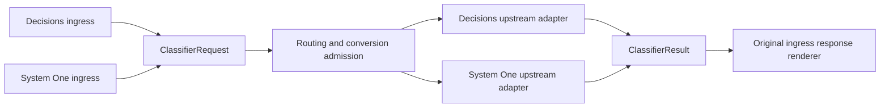

# Classifier and model representation specification

Status: **v0.2, accepted implementation direction; implementation and validation in progress.**

Date: 2026-10-08. Source baseline: `d6dfc245be38c7e6d3977b0528cbcdf694fac246`,
the remote `main` checked out for this discussion. Native OpenAI Decisions is
implemented at this baseline. The source baseline describes the starting point;
current [implementation evidence](CLASSIFIER_API_ACCEPTANCE.md) is tracked
separately from provider and external deployment evidence. The local migration
is documented in [CLASSIFIER_API_MIGRATION.md](CLASSIFIER_API_MIGRATION.md).

BitRouter will represent typed decision calls as **Classifier**, alongside
**LargeLanguageModel** for generative conversation calls. OpenAI Decisions and
TypeSafe System One will become two wire protocols for one canonical classifier
request and result. Callers retain their chosen API format while routing can
select an upstream whose conversion rules preserve the required semantics.

This extends the pattern used by Chat Completions, Messages and Responses:
protocol codecs surround a shared semantic representation, and conversion
admission determines which targets can serve a particular request.



## 1 Agreed direction and proposed defaults

| Topic | Status | Contract |
| --- | --- | --- |
| Representation names | Agreed | LargeLanguageModel and Classifier are peer semantic representations |
| Classifier protocols | Agreed | Decisions and System One use one classifier representation |
| Canonical primitive names | Agreed naming direction | Predicate, Choice and Score; native `noul` maps to Predicate |
| Public classifier vocabulary | Agreed naming direction | `classifier`, `ClassifierRequest`, `ClassifierResult`, `ClassifierQuestion`, `ClassifierAnswer`, `classify`, `Classification` |
| Additional representations | Agreed | Introduce one for a distinct task contract; modality alone does not require one |
| Conversion scope | Proposed default | Both native paths and the admitted common subset of cross-protocol paths |
| Structured text conversion | Proposed default | Preserve structure natively; exclude cross-protocol targets until a specific conversion rule is established |
| Refusal for a System One caller | Proposed default | Fail delivery explicitly, retain accounting and do not replay completed work |
| Partial usage | Required invariant; implementation shape open | Missing counters remain distinguishable from known zero |
| SDK module naming | Accepted R4 default | Shared lifecycle moves to `model_call`; existing generation semantic types remain |

Section 15 records the implementation defaults accepted when implementation
was requested. The GPT-6 Astra review correction below also applies.

## 2 Scope and boundaries

The first feature includes the canonical classifier representation, Decisions
and System One codecs, selected-target classification, HTTP ingress for both
protocols, compatible routing, shared protections and settlement, TypeSafe
activation and catalog data, and validation of both native and admitted cross
paths. A completed feature must expose one classifier call contract rather
than two independent operation payloads.

The representation remains a bounded model judgment over shared evidence.
Using its answers for model, effort, context or workflow selection is separate
policy work. Classification does not execute tools, grant permissions or
advance a durable agent task.

Image generation, video generation, embeddings and speech APIs are extension
examples, not implementation deliverables. This change adds no unused variants,
media job framework, new CLI command or new default routing algorithm. It
introduces no Chat/Responses emulation of classifier probabilities.

## 3 Verified baseline and source ownership

| Baseline source | Current behavior | Proposed change |
| --- | --- | --- |
| [AI protocol and operation types](../crates/bitrouter-ai/src/types.rs) | Generation and Decisions operations; Decisions is a built-in protocol | Classification operation; System One also maps to it |
| [AI decisions types](../crates/bitrouter-ai/src/classifier.rs) | Ordered OpenAI-shaped input, questions and answers | Generalize into canonical classifier types under `classifier` |
| [AI protocol interfaces](../crates/bitrouter-ai/src/protocol/mod.rs) | Generation adapters convert `Prompt` and `GenerateResult`, with SSE methods | Keep generation interfaces; add classifier interfaces without SSE requirements |
| [Decisions codec](../crates/bitrouter-ai/src/protocol/decisions.rs) | Native request/result validation and same-wire rendering | Convert native Decisions to and from the classifier representation |
| [Selected-model client](../crates/bitrouter-ai/src/client.rs) | `decide` requires the Decisions protocol and shares selected HTTP/auth | `classify` dispatches the selected classifier protocol |
| [SDK envelopes](../crates/bitrouter-sdk/src/model_call/types.rs) | Generation and Decisions payload variants | Generation and Classification payload variants |
| [SDK operation scopes](../crates/bitrouter-sdk/src/model_call/operations.rs) | Generation, Decisions and Both | Explicit classification coverage; preserve generation defaults |
| [Routing table](../crates/bitrouter-sdk/src/config/routing_table.rs) | Selects a protocol for the required operation, preferring the inbound wire | Also admit request projection and the caller's response contract |
| [SDK executor](../crates/bitrouter-sdk/src/model_call/executor.rs) | Separate native Decisions preflight and execution | One classifier preflight/execution path with protocol dispatch |
| [SDK HTTP server](../crates/bitrouter-sdk/src/server.rs) | Serves generation APIs and `/v1/decisions` | Also serve `/v1/systemone`; use the original ingress renderer |
| [Catalog vocabulary](../crates/bitrouter-ai/src/catalog/types.rs) | Registry vocabulary includes Decisions | Add System One declarations and operation-compatible discovery |
| [Frozen tariffs](../apps/bitrouter/src/metering/tariff.rs) | Captures actual protocol/endpoint pricing and Decisions cache uncertainty | Preserve provenance and add independent System One pricing semantics |

The existing [AI ownership contract](BITROUTER_AI_REFACTOR_SPEC.md) and
[Decisions lifecycle contract](DECISIONS_API_SPEC.md) remain applicable.
This proposal supersedes their OpenAI-only semantic naming once implemented;
it preserves their selected-account authority and completed-attempt accounting.
The earlier [Decisions acceptance evidence](DECISIONS_API_ACCEPTANCE.md) applies
to its tested native path, not to classifier conversion or TypeSafe conformance.

## 4 Representation protocol and capability

These concepts have separate responsibilities:

| Concept | Question it answers | Examples |
| --- | --- | --- |
| Representation | What task is requested, and what constitutes its result? | LargeLanguageModel, Classifier |
| Protocol | How are that request and result encoded and transported? | Chat Completions, Messages, Responses, Decisions, System One |
| Capability | Which inputs, outputs and optional features can this target support? | Image input, structured criteria, typed boolean choices |

LargeLanguageModel keeps the existing generative `Prompt`, `GenerateResult`
and stream semantics. Its conceptual name does not require adding an unused
`LargeLanguageModel` wrapper type or renaming every existing generation type.
Classifier uses its own typed evidence, questions and answers.

The [OpenAI Decisions contract](https://developers.openai.com/api/reference/resources/decisions/methods/create)
already accepts inline image evidence. That is image input
for Classifier. Describing a video can likewise be a LargeLanguageModel
capability. Generating images or videos may need a distinct representation
because the request, result and lifecycle differ.

Future representations follow the same ownership pattern. An asynchronous
media API that returns a job ID needs explicit submission, status,
cancellation and completion semantics when that API is actually added. A
model job cannot be treated as a completed synchronous result. Shared
infrastructure is reused where its lifecycle contract applies.

## 5 Canonical classifier contract

### 5.1 Request and evidence

`ClassifierRequest` contains the caller's model selector, shared evidence,
an ordered vector of questions, and scoped provider options needed by the
implemented protocols. Target projection substitutes the selected native model
without mutating the source request.

Evidence is a typed union of plain text, structured JSON, and ordered user
messages containing text or inline images. Structured JSON has an object or
array root; a string uses the text variant. Nested JSON fields retain their
types. Images retain their inline data URL, detail and ordering.

Question instructions and applicable rubric descriptions accept text or
structured JSON. The root and presence/null rules follow the originating
protocol. TypeSafe's [live OpenAPI schema](https://api.typesafe.ai/openapi.json)
permits omitted or null instructions, optional/null Noul criteria and
structured Score legend values. These are native semantics; they are not
converted to required OpenAI strings. A singleton native Score rubric is
accepted by that schema and excluded from OpenAI, whose minimum is two levels. This is a bounded semantic field, not an escape hatch for arbitrary
unclassified request fields.

The canonical representation is a superset of supported native semantics.
Parsing must retain every accepted task-relevant field. An adapter must
reject unsupported ingress fields before constructing a partial request.

### 5.2 Questions and answers

The [OpenAI native contract](https://developers.openai.com/api/reference/resources/decisions/methods/create)
and [TypeSafe native contract](https://docs.typesafe.ai/api) define the source
shapes. The following table defines their proposed canonical semantics.

| Canonical primitive | Request semantics | Answer semantics |
| --- | --- | --- |
| Predicate | Instructions and optional true/false criteria | Probability that the predicate holds |
| Choice | Instructions and ordered options, each with a string or boolean value and optional criteria | Selected supplied value, complete option distribution and provider confidence |
| Score | Instructions and ordered rubric levels, retaining labels and descriptions where supplied | Probability-weighted level index, complete level distribution and provider confidence |

Predicate represents both native OpenAI `predicate` and TypeSafe `noul`.
Optional Noul true/false criteria are semantic fields, so cross-protocol
admission must consider them.

Choice preserves the distinction between boolean `true` and string `"true"`.
Its internal option order and typed values survive map conversion. Score
preserves fractional values and level order. A native score legend is retained
as returned evidence; a request-owned label is not misreported as an upstream
observation.

Probability and confidence retain the reported values and protocol/model
provenance. Classification does not define a universal confidence formula or
portable threshold. Provider confidence is not measured workflow accuracy.

Confidence rendering is destination-specific. Native output preserves the
reported value. For admitted OpenAI answers rendered as System One, derive
Choice confidence as `(max(p) - 1/n) / (1 - 1/n)`. Derive Score confidence as
`max(0, 1 - sum(p_i * abs(i - mode)) / MAD_uniform)`, with the lowest index selected
on a tied mode, and `MAD_uniform = sum(abs(i - (n-1)/2)) / n`. These follow [TypeSafe's documented statistics](https://docs.typesafe.ai/confidence)
and use the validated complete distribution. Retain OpenAI's reported value
in the canonical result and record the rendering derivation through conversion
observability. A finite upstream value is not evidence of formula equivalence.

The reverse direction is audited separately: OpenAI documents reported
confidence without imposing the TypeSafe formula. Preserve the reported value
only when the destination schema admits it. This response codec capability does
not lift the independent usage admission gate in section 10. Fixtures must
include reported confidence that differs from the destination statistic.

`ClassifierResult` contains the actual provider-reported model, an answer
vector correlated to the canonical question vector, usage evidence and scoped
native metadata. `ClassifierAnswer` also includes Refusal, retaining which
question was declined. A refusal carries no fabricated probability or score.

Validate answer count, identity, primitive, selected option, distribution
membership, finite numbers, probability ranges/totals and weighted score
consistency before success hooks. Numerical tolerances follow the verified
protocol contract and stay separate from application decision thresholds.

### 5.3 Identity and native metadata

Canonical question position is the internal correspondence rule. Retain
OpenAI optional names and System One map keys separately; a name is not a
unique internal identifier. Unnamed and duplicate-named OpenAI questions must
remain distinct.

Native metadata retains protocol provenance, auxiliary options, absence/null
distinctions and bounded additive response fields needed for faithful same-wire
rendering. Core evidence, criteria and answers remain typed. Unsupported
model-visible fields are rejected rather than hidden in metadata.

OpenAI `safety_identifier` is an OpenAI-scoped option. It grants no caller
identity or authentication authority. A System One projection with this option
is excluded until its required upstream handling is explicitly defined; it
must not silently drop the field or copy it into Jev's state.

Same-wire output preserves admitted native fields and raw usage. Cross-wire
output includes only fields whose meaning is defined for the destination.
Foreign opaque extensions are retained in internal evidence with provenance,
not copied into a different provider's namespace. Classifier telemetry retains
the existing recursive safety-identifier filtering.

## 6 Codec and selected-target interfaces

AI owns classifier semantics and both pure codecs. The minimum classifier
adapter contract covers:

1. Parse an inbound body into `ClassifierRequest`.
2. Render a validated canonical result in the caller's protocol.
3. Check one selected target's request projection without I/O.
4. Render that target's request and its correlation mapping.
5. Parse and validate its response against that projection.

The existing separation between inbound and outbound adapters can be reused
for classifier-specific interfaces. Neither interface requires dummy stream
encoders, tool calls, finish reasons or continuation IDs. Transport keeps
endpoint and authentication responsibilities independent of the semantic codec.

The selected-call API is:

```rust
pub async fn classify(
    &self,
    target: &ModelTarget,
    request: &ClassifierRequest,
    cancellation: &CancellationToken,
) -> Result<ClassifierResult>;
```

`ApiProtocol::Decisions` and `ApiProtocol::SystemOne` both require
`ModelOperation::Classification`. `generate` and `stream` reject classifier
targets; `classify` rejects generation targets before authentication or I/O.
The client invokes exactly the supplied target and performs no ambient
credential lookup, catalog refresh, account selection or cross-provider fallback.

AI reuses selected HTTP, deadlines, cancellation, redaction and bounded
selected-account authentication recovery. Auth extensions that shape a body
must be followed by protocol-specific validation before dispatch.

## 7 Correlation through conversion

Each outbound projection carries a request-owned correlation mapping. It
records canonical question position, emitted upstream identity and any admitted
option/level identity transformation. A response is decoded against this
mapping, not against assumptions about JSON object order.

For Decisions ingress sent to System One, assign distinct upstream keys such
as `q0` and `q1`. Restore the original question order and OpenAI names on return.
For System One ingress, retain the original keys for client rendering; a
Decisions projection may omit optional native names and correlate by position.
Synthetic names must not become instructions or criteria.

Native upstream names/keys must still be validated before mapping them back.
Missing, extra, duplicate or mismatched answers fail completion validation.
Decode errors must not accidentally correlate a valid answer to another question.

## 8 Conversion rules

The default permits classified equivalent representations and excludes
task-semantic or unknown transformations. Native shape preservation and
mechanical identity changes are distinct from changing model-visible wording.
Every cross-protocol rule needs tests in both directions where applicable.

| Source feature | Cross-protocol treatment in the proposed first version |
| --- | --- |
| Plain string evidence and instructions | Admit when target limits and response requirements are satisfied |
| Predicate without separate true/false criteria | Map `predicate`/`probability` and `noul`/`noul` |
| Question array versus map | Admit through the correlation mapping |
| String Choice values with text or absent descriptions | Map ordered options to string-keyed criteria; preserve absence/null under the native contract |
| Simple Score levels expressed as single text labels | Map label to criteria entry; preserve zero-based order, score and distribution |
| Structured state, instructions or descriptions | Preserve on System One; exclude Decisions until a defined serialization rule is accepted |
| Predicate true/false criteria | Preserve on System One; exclude Decisions until an instruction-composition rule is accepted |
| Boolean Choice values | Preserve on Decisions; exclude System One until an explicit identity and model-visible wording rule is accepted |
| Score label plus separate description | Preserve on Decisions; exclude System One until a defined level-description composition rule is accepted |
| Inline image evidence or image detail | Preserve on Decisions; exclude System One |
| OpenAI-scoped safety identifier | Preserve on Decisions; exclude System One pending a handling rule |
| Unclassified native request fields | Reject ingress before model work |

Structured JSON serialized into text retains bytes but changes the input
presentation. Concatenating a score label and description or Noul criteria into
instructions likewise changes model-visible wording. These are specific review
items, not a general permission to degrade requests.

Provider/model limits are applied per target. A representation does not impose
the strictest provider's limits on native calls to another provider. Input size,
number of options and rubric levels must be checked without claiming a rough
host estimate is the provider's tokenizer result.

### 8.1 Directional support matrix

| Caller wire | Selected upstream wire | Proposed support |
| --- | --- | --- |
| Decisions | Decisions | Native supported semantics and faithful rendering |
| System One | System One | Native supported semantics and faithful rendering |
| Decisions | System One | Admitted common request subset, gated by a verified OpenAI-shaped usage projection |
| System One | Decisions | Admitted common request subset; successful answers convert, while a refusal follows section 9 |

This matrix is an implementation target. At the baseline only the first row
exists. A gated row must remain unavailable in discovery and routing until its
request, response and usage contracts are established.

## 9 Routing response compatibility and completion

The SDK derives the Classification operation from the canonical payload.
For every candidate it checks operation support, supported request features,
classified conversion rules, known response/usage projection requirements and
effective auth/pricing policy before I/O. Matching operation alone is insufficient.

Compatibility admission must consider all applicable classifier protocols for
that candidate before excluding it. A preferred protocol that cannot render
the request must not hide another supported, compatible protocol. This applies
to each fallback target and to route changes introduced by hooks.

Protocol preference remains a preference within eligible candidates. Existing
operator priorities and account authority remain intact. Conversion exclusion
is preflight, not a failed billable attempt. Content-free diagnostics identify
the structural field and reason. An empty eligible chain returns a clear
compatibility error.

The SDK retains the original ingress protocol and identity throughout the call.
The selected upstream protocol controls request rendering and pricing. The
original ingress protocol controls client response rendering.

### 9.1 Refusal and output failure

The canonical result can always retain a refusal. Decisions can render it;
the [documented System One answer union](https://docs.typesafe.ai/api#answer-types)
has no refusal member. The proposed
default allows an otherwise compatible OpenAI target for a System One caller,
but a returned refusal produces an explicit content-free gateway output error.
The first version fails that response as a whole, without inventing a partial
System One success envelope. Review decision R2 covers the alternative of
excluding such targets before execution.

Completed malformed output and unrepresentable completed results retain
independently usable usage and native attempt provenance, settle exactly once,
and never enter generic retry/fallback. No client delivery failure can turn
completed model work into permission to execute it again. Existing pre-completion
HTTP/transport fallback follows its explicit policy and budget.

Streaming and generative continuation/options are rejected before hooks or
request checks can cause model work. Shared delivery and shutdown draining
preserve the current completed-attempt accounting behavior.

## 10 Usage pricing and native evidence

Classifier usage decoding records reported totals, the availability of each
optional breakdown, origin and the raw upstream object with its actual protocol.
Unknown differs from known zero. A derived total is distinguished from a total
reported by the provider. Partial evidence remains useful on output failure.

The current [shared Usage type](../crates/bitrouter-ai/src/types.rs) uses numeric
breakdowns whose zero means known zero. It cannot by itself express every
partially reported classifier usage payload. Implementation must add an explicit
partial-evidence contract consumed by codecs, shared accounting and telemetry;
it must not fill unknown breakdowns with zero and expose them as known Usage.
The proposed ownership is one AI-owned usage evidence contract used by both
representations, with adapters for existing generation usage. The implementation uses `UsageAvailability`
alongside existing totals: absent breakdowns cannot normalize into known
cache/reasoning buckets. System One input-only tariffs use reported input
units independently and retain the availability mask in settlement evidence.

[TypeSafe's reference](https://docs.typesafe.ai/api#response-body) reports
input/output totals without OpenAI's complete
cache/reasoning breakdown. Rendering that evidence into Decisions requires an
established rule for every required destination field. Until such a rule exists,
Decisions-to-System-One routes are excluded before execution. Native System One
remains usable, and input-only pricing can use reported input totals without
claiming cache/reasoning breakdowns are known.

Client usage rendering follows the destination schema and uses only established
reported, derived or proven-inapplicable fields. An estimate is never labeled
provider-reported. Converted usage is not presented as a raw object received
from a provider that never emitted it.

Tariffs are frozen for the actual outbound provider, native model, protocol and
endpoint profile after final route mutation. The caller's endpoint never selects
the charge basis. System One rates are independent of generation and Decisions
rates. Free output billing does not erase reported output counters. Preserve
the existing Decisions cache-billing uncertainty and unavailable-cost behavior.
`require_known_pricing` admits only coverage established for that actual tariff.

## 11 Protections catalog and documentation

AI owns canonical types, codecs, selected-target invocation, auth mechanisms
and usage decoding. The SDK owns caller identity, routing/fallback, required
hook coverage, request identity, delivery and settlement contracts. The app
owns credentials/activation, local policy, metering stores and operational defaults.

Shared caller auth, authorization, budgets, rate guards, reserved IDs and tariff
capture must explicitly cover Classification. Renaming an operation scope must
not silently turn a generation-only extension into a classifier extension.
Classifier checkers inspect all model-visible evidence, instructions and criteria,
including structured keys and values. Caller credentials, safety identifiers
and System One correlation keys stay excluded. Optional OpenAI names retain
the existing metadata-fragment check coverage; that coverage does not assert
that the names enter model reasoning.
Generation defaults, reasoning-effort selectors, continuation and tool loops
remain generation-scoped.

Add registry vocabulary `systemone`, its protocol mapping, verified TypeSafe
model declarations and independent rates. Catalog discovery must distinguish
classification from generation and reflect active credentials and implemented
conversion support. A model entry or gateway brand alone is not endpoint proof.
Other System One-compatible upstreams require their own verified declarations.

The proposed app credential is `TYPESAFE_API_KEY`; direct AI callers supply
effective credentials explicitly. Verify the provider base/path convention
against the transport to avoid duplicated `/v1` segments. Registry editorial
data and generated `dist/registry` must be committed together during implementation.

Update the shipped BitRouter skill in lockstep when the environment/config/API
setup changes. Check the plugin manifests distribute a matching skill and CLI
surface. Product API prose, translations and the generated public catalog
remain in `bitrouter-docs`; this internal spec does not publish that support.

## 12 Public API and persisted evidence migration

| Existing source surface | Proposed source surface |
| --- | --- |
| `bitrouter_ai::decisions` semantic types | `bitrouter_ai::classifier` canonical types |
| `DecisionRequest` / `DecisionResult` | `ClassifierRequest` / `ClassifierResult` |
| `DecisionQuestion` / `DecisionAnswer` | `ClassifierQuestion` / `ClassifierAnswer` |
| `ModelClient::decide` | `ModelClient::classify` |
| `ModelOperation::Decisions` | `ModelOperation::Classification` |
| `PipelineInput::Decisions` / `PipelineOutput::Decisions` | `Classification` variants |
| `new_decisions`, `decision_request`, `decisions` accessors | `new_classification`, `classifier_request`, `classification` accessors |
| Executor Decisions preflight/execution methods | Classification preflight/execution methods |
| `OperationScope::Decisions` | `OperationScope::Classification` |

The wire names `decisions` and `systemone`, and their HTTP paths, remain native.
LargeLanguageModel continues using the existing generation call types/methods.
Alpha allows breaking source imports, but no public re-export compatibility
shims or unused wrapper types are introduced.

Audit workspace consumers, SDK extension examples and known external consumers
before removing old source symbols. The existing [migration inventory](DECISIONS_API_MIGRATION.md)
is a starting point; its old Cloud snapshot is not current migration evidence.
External migration and deployment require separate validation.

Historical records using the semantic value `decisions` must remain readable as
Classification with their original outbound protocol and tariff evidence intact.
The recommended serialization migration reads legacy operation/scope values
where they are actually persisted or configured and writes `classification`
for new semantic records. Native protocol strings continue writing `decisions`.
Inventory each affected store/config/export before deciding on aliases or an
explicit data migration. Old consumers of new exports require coordinated rollout.

`OperationScope::Both` covers the two operations currently implemented. Adding
a third representation later requires an explicit applicability decision; Both
must never become an implicit permission to serve every future operation.

## 13 Implementation sequence

| Phase | Deliverable | Completion condition |
| --- | --- | --- |
| P1 | Canonical classifier types and naming migration | Native Decisions behavior and historical evidence preserved; all consumers use the new semantic contract |
| P2 | System One codec, transport and native gateway path | Typed direct calls and native gateway round-trips work through shared protections and settlement |
| P3 | Conversion admission, correlation and cross-protocol rendering | Both directions exercised for their admitted subset; usage/output gates and exclusions are explicit |
| P4 | Catalog, app activation, documentation and release migration | Committed catalog is current; skills match setup; full validation and external migration boundaries are recorded |

P1 through P4 constitute the feature. Passing only native codec fixtures does
not complete cross-protocol support. No intermediate phase may advertise a
route whose response or usage projection is still gated.

Keep generation semantics and tests intact throughout. Exact module placement
is resolved in R4 before a mechanical namespace migration. Do not split shared
execution or settlement into duplicate classifier pipelines for naming symmetry.

## 14 Acceptance and evidence

| Requirement | Required validation |
| --- | --- |
| Canonical representation | Both ingress formats produce the same core Predicate/Choice/Score semantics for equivalent requests |
| Native fidelity | Decisions text/images, names and refusals; System One structured fields, criteria, legend, keys and usage round-trip under their own schemas |
| Common conversion subset | Exercise both directions for predicate, string choice and simple score; assert actual outbound body, actual provider identity and original client response shape |
| Correlation | Unnamed and duplicate-named Decisions questions, unusual map keys, reordered upstream maps, mixed primitives and distribution identities |
| Admission | Images, booleans, structured text, split rubric descriptions, Noul criteria and scoped options exclude incompatible targets before I/O |
| Routing | Compatible secondary protocol considered; candidate/fallback/hook mutations cannot bypass admission; explicit priorities preserved |
| Partial usage | Distinguish missing from zero; prove that unresolved OpenAI-shaped usage excludes the route; retain independently decoded usage on failure |
| Refusal and malformed output | Explicit egress failure, one completed attempt, one settlement and no retry/fallback under even a permissive custom fallback policy |
| Pricing | Same caller endpoint routed to different wires uses each actual frozen tariff; free outputs retain counts; Decisions cache uncertainty remains intact |
| Required protections | Auth, identity, budgets, rate limits, request checks and tariff capture cover Classification; generation-only hooks remain scoped |
| Privacy and lifecycle | Credentials and safety identifiers stay out of forbidden projections; cancellation/disconnect/shutdown preserve attempt and settlement evidence |
| Migration | Legacy persisted semantic values read correctly, new values remain distinct from wire names, and external consumer status is explicit |
| Generation regression | Existing Chat Completions, Responses, Messages, tools, streams and continuity retain their admitted behavior |
| Extension boundary | No unused image/video/job representation or automatic expansion of Both |

Use synthetic HTTP upstreams for deterministic four-direction coverage and
negative cases. Add credentialed TypeSafe and OpenAI smoke validation separately,
recording actual model/version, wire, usage, correlation and settlement. Fixtures
and green CI do not establish live provider conformance, invoice billing or
production deployment. Any gated conversion remains clearly identified.

For source changes, run `cargo nextest run --all-features` or
`cargo test --all-features` when nextest is unavailable, `cargo clippy --all-features`,
and `cargo fmt -- --check`. Run doctests separately when using nextest.
Registry changes require `cargo run -p dist-helper -- registry validate`,
`cargo run -p dist-helper -- registry build`, and `cargo run -p dist-helper -- check`.
Keep registry-only validation data-driven rather than freezing model counts in tests.

## 15 Review decisions

| ID | Question | Recommended choice | Consequence |
| --- | --- | --- | --- |
| R1 | Automatically serialize structured text or compose criteria across protocols? | Defer these specific transformations; implement the simple common subset first | Rich native requests remain available; those cross targets are excluded until a rule is accepted and tested |
| R2 | Allow OpenAI as a System One upstream when it may return a refusal? | Allow compatible requests and surface an explicit whole-response output error on refusal | Shared representation retains refusal and accounting; client delivery can fail after paid work |
| R3 | How should partial usage be represented and rendered? | One shared AI-owned evidence contract with per-field availability; gate cross-wire output until required fields are established | Existing numeric Usage readers need an audited migration; Jev-to-Decisions usage cannot assume zeros |
| R4 | Rename the SDK's shared `language_model` module now? | Move shared lifecycle to `model_call` in a separate mechanical implementation batch; retain current generation semantic type names | Public imports change, but Classifier gains no duplicate pipeline and unrelated generation types avoid cosmetic churn |
| R5 | How should the semantic rename affect stored/configured values? | Read legacy `decisions` where applicable, write `classification` for new semantic values, and preserve native protocol values | Historical evidence remains interpretable; export consumers require coordinated rollout |

The implementation request accepted the recommended R1 through R5 behavior.
GPT-6 Astra reviewed the original v0.1 spec and identified the destination
confidence gap; v0.2 resolves it in section 5.2. Implementation completion requires the acceptance
evidence above; it does not establish external Cloud or production availability.

## 16 Upstream references

These primary sources were checked on 2026-10-08. Recheck schema, limits,
aliases and pricing before implementing provider declarations.

- [OpenAI Decisions HTTP contract](https://developers.openai.com/api/reference/resources/decisions/methods/create)
- [OpenAI Decisions guide](https://developers.openai.com/api/docs/guides/decisions)
- [TypeSafe System One HTTP contract](https://docs.typesafe.ai/api)
- [TypeSafe live OpenAPI schema](https://api.typesafe.ai/openapi.json)
- [TypeSafe models and pricing](https://docs.typesafe.ai/models)
- [TypeSafe confidence semantics](https://docs.typesafe.ai/confidence)

The sources establish native API contracts. Conversion policies, the partial
usage contract and BitRouter's representation taxonomy are the proposed design
in this spec. Protocol similarity alone does not establish conversion fidelity.
