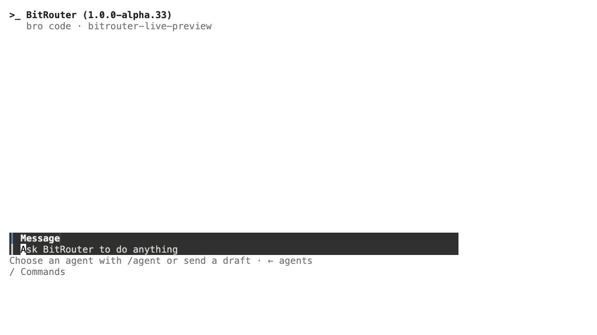
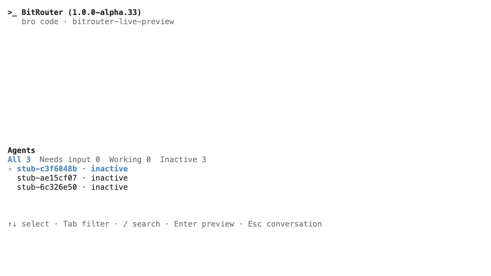
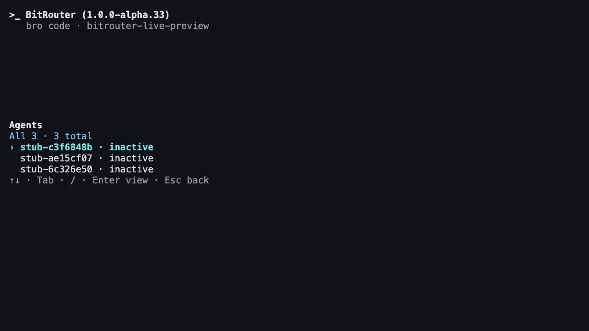

# Codex style native-scrollback TUI implementation

Status: **implemented; locally verified** · 2026-10-01

Contract: [CODE_TUI_CODEX_NAVIGATION_SPEC.md](CODE_TUI_CODEX_NAVIGATION_SPEC.md).

## Changes

- Conversation-first entry; explicit agent selection preserves the draft.
- Normal-buffer, read-only Agents navigation consumes existing supervisor
  snapshots. Left requires an empty composer and yields to input owners.
- Local search/filter/metadata preview and stable run-ID selection live in
  [agents_menu.rs](../crates/bitrouter-tui/src/agents_menu.rs). Menu input returns
  no execution, attachment or permission effect.
- [CodeView](../crates/bitrouter-tui/src/code.rs) holds the foreground document
  projection while the menu is open. The journal continues receiving updates;
  returning flushes through the existing native writer.
- Composer band and compact footer replace the persistent background strip.
- Existing run controls remain an explicit legacy command-launcher action,
  preserving their permission/lease fences. They never appear beside the new
  Agents menu; standalone CLI commands and large inspectors remain available.
- CLI/development/skill prose is updated. Plugin manifests distribute the same
  skill; JSON and referenced skill paths remain valid. No flag, listen port,
  configuration default, plugin wiring or supervisor contract was changed.

## Acceptance evidence

The final full workspace run passed **3,559 tests**, with **22 skipped**.
The strengthened menu PTY journey passed in that run.

| Requirement | Current evidence |
| --- | --- |
| A1 | Bare-entry and hidden-alias PTY tests; live `bro code` opened Conversation while three supervised fixture runs already existed. |
| A2 | Menu PTY trace rejects alternate-screen entry and scrollback-clear sequences across opening, resize and return. |
| A3 | `left_navigation_respects_drafts_permissions_repeat_and_hotkeys`, existing editor/picker/paste tests, and live Left navigation. Current config parser still reserves editor arrow keys; reducer priority also covers explicitly supplied bindings. |
| A4 | Real supervisor fixture inventory in the screenshot; existing target-isolation tests. Reducer/renderer represent loading, empty, unavailable, stale/error state without synthetic tasks or unknown counts. |
| A5 | `agents_menu::tests` cover search, metadata preview, identity-preserving refresh and nearest surviving selection. Menu reducer returns no task effect. Budget/minimum-size checks cover clipping and navigation hints. |
| A6 | `agents_menu_preserves_the_draft_and_forty_percent_budget` retains draft/queue; the PTY journey receives ordered ACP updates while the menu is open, resizes, and observes retained output once on return. The menu owns no conversation editor/cursor/history. |
| A7 | Late foreground permission attention is observed in the PTY journey after the preceding text update; no automatic destination switch or answer. Existing permission, queue and cancellation tests pass. |
| A8 | PTY emulator scrollback contains no menu help; trace rejects scrollback clear. Existing writer tests retain anchored terminal history and keep dock controls out of it. |
| A9 | Live light 80×24 and dark 40×16 inspections; live 30×10 menu shows resize/Esc return guidance. Renderer/editor/PTY tests cover long labels, CJK, emoji, multiline, paste and resizing. |
| A10 | Menu PTY performs three repeated visits and SIGTSTP/SIGCONT while inside the menu. Shared lifecycle PTY cases cover SIGINT/SIGTERM, disconnect, external editor and shell restoration. Navigation emits no task-stop effect. |
| A11 | Live unbound draft `review this UI` opened the picker. Binding configured `stub` left the exact draft and cursor in the composer: captured `session/prompt` count remained 3. Explicit subsequent Enter changed it to 4 with the exact draft once. Picker cancellation also passes the bare-entry PTY case. |
| A12 | Legacy control/retained-history and standalone-manager PTY journeys pass. Existing operations remain explicit; the new menu advertises only selection/filter/search/read-only preview/return. |

## Required checks

- `cargo nextest run --all-features --no-fail-fast`: 3,559 passed, 22 skipped.
- `cargo test --all-features --doc`: 5 passed, 1 ignored.
- `cargo clippy --all-features`: passed.
- `cargo fmt -- --check`: passed.
- `git diff --check`: passed.
- Local spec links, plugin-manifest JSON and JPEG artifacts: verified.
- Renderer dependency graph remains synchronous, with no app/network dependency.

Builds used `CARGO_INCREMENTAL=0`, `CARGO_PROFILE_DEV_DEBUG=0` and
`CARGO_PROFILE_TEST_DEBUG=0` to fit local disk space. These omit incremental
artifacts/debug symbols while retaining the unoptimized test profile.
Build output reports the existing `proc-macro-error2` future-compatibility
notice and the macOS test-linker unwind-table warning.

## Live screenshots

These are screenshots of compiled `target/debug/bro` running in a real PTY,
displayed through a local terminal emulator. Inventory comes from the actual
supervisor with isolated test ACP processes, not hard-coded UI rows. Preview
resources and test processes were isolated under `/tmp/bitrouter-live-preview`;
no credentialed provider was used. Post-preview inventory confirmed all fixture
runs had no writer lease. Fixture runs, daemon, browser tabs and preview server
were stopped after verification. Color was enabled only in the preview
process; the product continues honoring `NO_COLOR`.

No hosted CI, Windows interactive acceptance, credentialed provider acceptance
or production deployment was performed. The first menu delivery is locally
verified; deferred task operations and full-screen modes remain outside scope.
