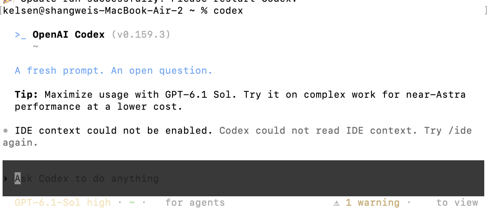

# Codex style native scrollback conversation and Agents navigation

Status: **implemented; locally verified (first delivery)** · Date: 2026-10-01

This proposal refactors `bitrouter-tui` around a Codex-like conversation entry
and an explicitly opened Agents view. The first delivery implements navigation
and the menu skeleton using native terminal scrollback. BitRouter task
operations are added separately when their capabilities are defined. This is
a normative implementation contract. Evidence is recorded separately in
[CODE_TUI_CODEX_IMPLEMENTATION.md](CODE_TUI_CODEX_IMPLEMENTATION.md).

## 1. Product decisions

The latest user requirements control this proposal:

1. Native scrollback is the default and the only new rendering mode in the
   first delivery. Do not introduce an owned full-screen conversation renderer.
2. Reference Codex's menu structure and interaction hierarchy. Do not copy its
   capability inventory, backend, branding or model-specific promotional text.
3. Startup opens Conversation. An eligible plain Left-arrow key opens Agents.
   Existing runs and background events never open Agents automatically.

The previous discussion of a default full-screen shell is withdrawn.
Conversation and Agents are logical destinations, not instructions to enter
the alternate screen. All new entry/menu navigation stays in the normal buffer.

### 1.1 Visual reference



The screenshot supplies the hierarchy: compact product/directory header,
conversation content, a distinct composer band, and a short footer containing
session context and the Agents hint. It is not evidence of BitRouter capability.
Use BitRouter names and confirmed facts; never manufacture warnings, costs,
reasoning tiers, model names or sample tasks. Source inspection, rather than
the screenshot's glyph rendering, establishes the Left-arrow binding.

### 1.2 Existing contracts

This delivery replaces the default persistent background strip and
expanded in-conversation navigation in
[BACKGROUND_AGENT_UX_SPEC.md](BACKGROUND_AGENT_UX_SPEC.md). It refines startup
and navigation in [CODE_TUI_UX_SPEC.md](CODE_TUI_UX_SPEC.md), retaining its
native writer, queue, permission, cancellation and terminal-restoration rules.
Supervisor ownership, native session identity and remote ACP scope stay intact.

Those documents retain historical implementation evidence. The default Code
presentation is governed here; existing run controls remain an explicit legacy
action outside the new menu, preserving previously shipped operations. Historical
acceptance evidence is not proof of this delivery.

## 2. First delivery scope

Deliver the conversation entry, composer/footer hierarchy, eligible Left
navigation, an Agents list from available inventory, local filtering/search,
read-only metadata preview, return to Conversation, and the state/rendering
separation needed to maintain these surfaces independently.

Reuse the existing supervisor list projection where available. Opening Agents
must not start an agent process, submit a prompt, acquire a writer lease, attach
to another run or modify configuration. Reuse existing transport bootstrap only
where required to read inventory; failures remain visible and recoverable.

Create, attach, reply, stop, take over, archive, delete, fork and worktree
management are deferred capabilities of the new menu. Keep existing explicit
commands/actions reachable during migration. Add an operation to the new menu
only in a later scoped change backed by BitRouter capability. No dead action
buttons, placeholder success or Codex-only shortcuts are delivered.

This delivery does not remove CLI commands, add flags, change the supervisor,
invent session IDs, add remote execution, introduce a theme/plugin framework,
or create a transcript database or per-run full-conversation cache.

## 3. Conversation entry

`bro code` paints Conversation first, even when supervised runs exist. It never
starts on a run directory or automatically opened agent chooser. Existing
explicit-agent invocations still connect to that agent, with connection state
shown inside Conversation.

The unbound entry retains an editable draft. Resolve an existing configured
default through the host's existing configuration; do not invent a new default
agent policy. If none is resolved, show a concise selection hint. `/agent` or
submission of a nonempty draft explicitly opens the existing agent picker.
Selection binds the agent and restores the exact draft, without submitting it.
A subsequent Enter submits normally. Cancellation restores the unbound draft.

Conceptual layout, not a fixed color or pixel specification:

```text
  >_ BitRouter (version)
     working directory

  Conversation content, or a short empty-state invitation

  › Ask BitRouter to do anything
    session context                         ← agents
```

The header is document content, not a fixed top bar. Composer and footer form
the repaintable dock. Use spacing, subdued hints and a composer background
readable with light and dark themes. The default conversation has no permanent
sidebar, background-agent row or boxed command-center panel. Supplied attention
counts may appear in the footer without opening another surface.

Session context uses actual application-supplied agent/model/route/cost data.
Unknown values stay absent or unreported. Do not copy a reasoning tier unless
ACP supplies an equivalent setting. Working-state Enter remains explicit FIFO
next-turn queueing; no steering or cancellation semantics change here.

## 4. Left arrow and input priority

`← agents` means one unmodified `KeyCode::Left` press, not the literal characters
`<` and `-`. Show the hint only when the key can perform that action.

Navigation requires conversation composer focus, a completely empty draft and
no paste, picker, command menu, permission choice, queue editor, search or
external-editor handoff owning input. Explicit editor remaps take precedence;
hide the hint when Left has another configured meaning. Capability-unavailable
targets may open an unavailable view, never silently fall back to local runs.

| Context | Plain Left behavior |
| --- | --- |
| Eligible empty composer | Open Agents |
| Nonempty or multiline draft, including cursor at byte zero | Normal cursor editing |
| Picker, commands, search or permission interaction | That surface's handler |
| Paste payload | Literal insertion without navigation |
| External editor or suspended terminal | Current terminal owner's input |
| Agents list or preview | Agents-local navigation |

Respect existing key-release/repeat rules. Holding Left cannot repeatedly enter
and leave Agents. Slash commands remain independent. Background events never
override focus.

## 5. Agents menu skeleton

Opening Agents records the origin and replaces the composer dock with the menu.
The resident runtime continues processing foreground and background events.

```text
  Agents
  All 4   Needs input 1   Working 2   Inactive 1
  ───────────────────────────────────────────
  › review implementation     needs input
    inspect dependencies      working
    run checks                working
    earlier task              inactive

  ↑↓ select · Tab filter · / search · Esc conversation
```

Rows and counts above are illustrative. Delivered content comes from inventory.
This is a list with lightweight filters, not a permanent tabbed dashboard.
Selection supports a read-only metadata preview. Narrow layouts retain title
and state before directory, route, cost or other secondary data.

| Input | First delivery behavior |
| --- | --- |
| Up / Down | Select a visible run row |
| PageUp / PageDown | Page within the menu |
| Tab / Shift-Tab | Cycle available status filters |
| `/` | Focus local list search |
| Enter on a run | Show read-only metadata from the existing snapshot |
| Esc in search or preview | Return to list, retaining selection |
| Esc in list | Restore originating Conversation |
| Ctrl-C | Preserve existing explicit interrupt/exit policy; selection alone never targets a run cancellation |

Enter is not writer attach. Open conversation is a future operation, not an
advertised slot in this goal. Adding it later must define history restoration,
draft/queue ownership and read/write authority in the same change.

Use stable `run_id` across refreshes. Preserve filter, query, selection and
scroll when the selected run survives. If it disappears, select the nearest
surviving row without dispatching an action. Parent/child grouping, if present,
comes only from supplied `parent_run_id`, never inferred labels/process lists.

Render loading, empty, unavailable, disconnected and error states. A failed
refresh may retain visibly stale metadata. Distinct targets never implicitly
share inventory; remote/operations-only entry must not display local runs.

## 6. Native buffer transitions

Conversation and the new Agents menu use the normal buffer. Startup, Left,
filter/search, metadata preview and return emit no `EnterAlternateScreen` or
native-scrollback-clear command. Do not reserve the whole terminal for a new
default Agents dashboard.

**First-delivery layout choice:** reuse the writer's transient dock,
capping the entire Agents region at 40 percent of supported viewport height,
including heading, filters, rows, preview/search and help. This adapts Codex's
menu hierarchy to native scrollback; it is not a claim of pixel-identical layout.
Remove optional preview/metadata before selection and return controls; paginate
rather than overflow. Below the current supported minimum, show a compact
resize-and-return message and prevent mutations. Reuse the existing minimum.

Menu frames never enter transcript history. Above the dock remains the
terminal-owned conversation document. While Agents is open, apply incoming
foreground updates to the retained journal without growing its normal-buffer
projection. On return, emit accumulated content exactly once through the
writer, then restore the composer/footer. Changing dock height or resizing
cannot duplicate transcript entries.

Keep originating draft bytes, cursor, input history and queue. Agents state
never overwrites them. Native scrollback position belongs to the terminal and
cannot be promised to survive new output/resize at an exact offset. Never
restore by clearing the terminal and reprinting the full document.

A foreground permission arriving in Agents records attention without answering
it or switching destinations. Returning to review uses the existing fresh
selection/confirmation rules. Unresolved permissions block queue dispatch.
Selected metadata is not authority to answer another run's request.

Existing explicitly invoked large inspectors may retain their alternate-screen
implementation. They are not entered by the new menu path. New full-screen
Conversation and Agents modes remain deferred.

## 7. State and implementation boundaries

Separate responsibilities without porting Codex's complete module graph:

| Responsibility | Reuse or extract |
| --- | --- |
| Destination and origin | Navigation ownership currently mixed into `CodeState` |
| Journal, turn, editor, queue, foreground permission | Existing `CodeState`, `Journal`, `Editor` behavior |
| Inventory, stable selection, filter, preview | Existing `AgentDeckState` presentation facts |
| Composer/footer and Agents layout | Focused rendering modules from `code.rs` and `agents.rs` |
| Output, geometry and terminal restoration | `CodeView`, `Writer`, `lifecycle` |
| Polling, target capabilities and errors | App `Runtime`, `CodeServices`, `BackgroundClient` |
| Execution, persistence, leases and permissions | Existing supervisor and ACP owners |

Names/file layout are implementation choices; do not introduce unused types.
Keep `bitrouter-tui` synchronous, independent of app/network/storage. Typed UI
intents return to the app for effects. Renderers do not discover processes,
authorize writes or acquire leases.

Background history currently projects `seq`, `kind`, `text`; the foreground
journal retains structured ACP entities. This delivery needs metadata only.
A later shared rich transcript viewer must address that difference explicitly,
not reconstruct tool state from flattened text.

The migrated Code default must not retain a second expanded deck beside Agents.
Keep reusable inventory mapping and explicit action implementations. Removing
standalone CLI entries requires a separate command-surface decision.

## 8. Delivery sequence

1. Characterize native-buffer, permission, queue and terminal-cleanup behavior;
   extract only the presentation/navigation boundaries used here.
2. Render Conversation entry and Codex-style composer/footer; defer unresolved
   agent selection until explicit user intent.
3. Implement eligible Left, Agents inventory/filter/search/preview in the dock.
4. Implement retained foreground updates, deterministic return and attention;
   replace the in-Code expanded deck presentation.
5. Complete state/render/PTY verification and required source checks. Record
   implementation evidence separately from this normative spec.

Do not implement deferred operations just to make the menu appear complete.

## 9. Acceptance criteria

| ID | Required observation |
| --- | --- |
| A1 | Bare Code first shows Conversation even with existing runs; no automatic Agents/chooser. Explicit-agent entry retains connection semantics. |
| A2 | Startup and Conversation → Agents → Conversation emit no alternate-screen entry or scrollback-clear command. |
| A3 | Eligible empty composer Left opens Agents once; drafts, remaps, popups, permissions and paste retain priority. Hint matches eligibility. |
| A4 | Inventory uses actual data/stable IDs and visible loading/empty/unavailable/error states; no sample tasks, false state or local fallback. |
| A5 | Filters/search/preview remain within dock budget, preserve selection on refresh, and perform no run mutation/writer attach. |
| A6 | Return preserves draft, cursor, input history and queue; accumulated foreground updates appear once, including after resize. |
| A7 | Background events and permissions never switch destination; permission stays unanswered until explicit review; existing cancellation/queue rules hold. |
| A8 | Menu/help/filter/preview never enter transcript history; shell output predating Code stays intact. |
| A9 | Light/dark, 80×24, wide/narrow and below-minimum layouts retain usable navigation; CJK, emoji, multiline and paste keep correct cursor/editing. |
| A10 | Repeated transitions, disconnect, signals, external editor and suspend/resume leave a usable shell; navigation never stops resident work. |
| A11 | Unbound entry preserves typed text through agent selection/cancellation; selection alone never submits. |
| A12 | Existing explicit operations remain reachable; no duplicate expanded deck or advertised unavailable Codex operation. |

Use state tests for routing/transitions, render snapshots for layout, and real
PTY journeys for escape sequences, retained output and terminal cleanup. Reuse
`code_tui_pty`; screenshots alone do not prove behavior. Required source checks:
`cargo nextest run --all-features` (or `cargo test --all-features` without
nextest), `cargo clippy --all-features`, `cargo fmt -- --check`.

Separate manual terminal/theme observations, PTY results and hosted CI. The
existing Unix-only PTY suite does not establish Windows interactive acceptance.
Credentialed adapter verification is separate from this menu implementation.

When implemented, update CLI/development docs, affected UX specs and a progress
ledger. Any CLI/default configuration/harness wiring change also requires
`skills/bitrouter/` and applicable plugin-manifest lockstep under repo rules.
Until then, shipped skills continue describing the currently available CLI.

## 10. Implementation goal prompt

Implementation was authorized after review. The original goal prompt is kept
here as the scope contract for implementation and follow-up review.

```text
Implement the reviewed docs/CODE_TUI_CODEX_NAVIGATION_SPEC.md in this repository.
Deliver the first native-scrollback Conversation and Agents menu refactor,
satisfying A1–A12. Start on Conversation; eligible plain Left opens Agents;
return restores the originating conversation. Use existing inventory/metadata
only; do not add deferred task operations or a full-screen mode. Preserve
ACP/supervisor authority, queues, permissions, terminal cleanup and access to
existing explicit actions. Follow AGENTS.md. Complete required checks and
record exact evidence/limitations in a separate implementation ledger. Report
changes and remaining risks for review. Do not deploy, publish or merge without
authorization, or claim production acceptance without corresponding evidence.
```

## 11. Source references

Inspection baseline: BitRouter `d93ed73be2411992cc44e3234b6e7b11df1effb2`;
Codex main `d91294c39edb93d204926b33f21310dc968edc34`.

- [Conversation state/view](../crates/bitrouter-tui/src/code.rs),
  [agent deck](../crates/bitrouter-tui/src/agents.rs),
  [writer](../crates/bitrouter-tui/src/writer.rs),
  [driver](../apps/bitrouter/src/chat/code.rs),
  [supervisor mapping](../apps/bitrouter/src/agent_sessions.rs).
- [Codex composer navigation](https://github.com/openai/codex/blob/d91294c39edb93d204926b33f21310dc968edc34/codex-rs/tui/src/bottom_pane/chat_composer/agents_navigation.rs).
- [Codex Agents layout](https://github.com/openai/codex/blob/d91294c39edb93d204926b33f21310dc968edc34/codex-rs/tui/src/app/agent_center/render.rs).
- [Codex Agents state](https://github.com/openai/codex/blob/d91294c39edb93d204926b33f21310dc968edc34/codex-rs/tui/src/app/agents_overview.rs).
- [User supplied visual reference](assets/code-tui-codex-entry-reference.png).

Codex supports interaction patterns. Dock budget, staged operation scope and
BitRouter transition rules above are BitRouter design decisions.
