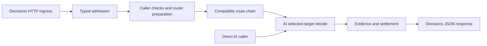

# First-class Decisions API support

Status: **v0.2, design direction accepted; implementation and provider validation
pending.**

Date: 2026-10-06. Implementation is intended as a stacked PR on
[PR #962](https://github.com/bitrouter/bitrouter/pull/962), branch
`codex/ai-refactor-wip`, reviewed at
`529f2fdeb7dc1f6bd3cef2ae243b22106b66ef16`. The independent R1-R3 review found
only AI test/support changes since the original `def77d4e` audit; production
envelope, hook and pricing seams are unchanged. That parent remains Draft/WIP.
This document is saved in a checkout of main at `31cf68ed`; references to the
parent use immutable GitHub links because its AI package is absent here.

## 1. Purpose and agreed scope

An application should be able to send an OpenAI-compatible
`POST /v1/decisions` request to BitRouter and receive typed answers, with the
same caller authentication, routing ownership, execution accounting and
settlement guarantees as other model calls. A Rust caller should also be able
to invoke one selected Decisions target through `bitrouter-ai`, without
constructing a router or server.

The discussion established these boundaries:

1. Decisions becomes a first-class inbound and outbound protocol.
2. Decision requests and results have their own typed semantics.
3. Native Decisions routing is the initial supported execution path.
4. Authentication, routing, policy and settlement retain the owners established
   by #962; operation-specific payloads use shared model-call infrastructure.
5. Using decision answers to choose BitRouter's model, effort or context plan
   is a separate policy PR. This PR exposes the primitive without adopting a
   new routing algorithm.

The user accepted the independent review's R1-R3 recommendations. Sections
below record the selected implementation contract; section 12 distinguishes
those decisions from the remaining cache-billing validation gate.

Out of scope: Chat/Responses emulation of decision probabilities; learned
policy or calibration; BRO workflow control; new CLI commands; changed default
routers/models; voice integration; streaming or continuation for Decisions;
new account discovery or subscription login flows; a general framework for
future model operations.

## 2. Upstream evidence and limits

The [Decisions guide](https://developers.openai.com/api/docs/guides/decisions)
describes a public beta at `/v1/decisions`, currently using `gpt-6-luna`.
Independent questions evaluate shared evidence. Dependent questions require
separate calls. Its speed comparison with Responses is an upstream claim,
not a BitRouter benchmark or acceptance target.

The [HTTP create reference](https://developers.openai.com/api/reference/resources/decisions/methods/create)
defines the request and ordered response. The
[typed resource reference](https://developers.openai.com/api/reference/typescript/resources/decisions)
provides the input unions. Preserve their distinctions:

| Surface | Contract to preserve |
| --- | --- |
| Evidence | A string, or user messages whose content is a string or ordered text/image parts |
| Images | Inline data URLs; optional detail; at most 128 images across the request |
| Predicate | Instructions; optional name; answer probability |
| Choice | Instructions, options with string-or-boolean values and optional descriptions; selected value, distribution, confidence |
| Score | Instructions, ordered labeled levels with optional descriptions; score, distribution, confidence |
| Refusal | An answer variant for an individual question; other answers can succeed |
| Identity | Optional question names; response names may be null; answer order remains authoritative |
| Safety identifier | Optional caller-supplied field; never a gateway authentication identity |

Unsupported roles, tool items, files, audio and external image references must
produce explicit admission errors. A boolean choice remains distinct from a
string containing its spelling. Retain optional/null fields according to the
native schema. The response envelope contains `model`, `answers` and `usage`.
The documented contract has no stream request field or continuation ID.

The guide defines a score as a probability-weighted average of zero-based
level indices. The codec preserves the returned value and distribution; it
does not choose application thresholds or reinterpret confidence as measured
workflow accuracy. [Score and interpretation guidance](https://developers.openai.com/api/docs/guides/decisions#score-against-a-rubric)

Before implementation, re-fetch these pages and record schema changes. Do not
infer additional limits, endpoint availability or auth methods from the
generic model catalog. Live account access remains unverified.

## 3. Source baseline and required changes

| Verified #962 seam | Current behavior | Required change |
| --- | --- | --- |
| [AI protocol types](https://github.com/bitrouter/bitrouter/blob/529f2fdeb7dc1f6bd3cef2ae243b22106b66ef16/crates/bitrouter-ai/src/types.rs#L90) | Four built-in protocols plus outbound custom protocols | Add `Decisions`, with stable `decisions` serialization and an operation distinction |
| [AI adapters](https://github.com/bitrouter/bitrouter/blob/529f2fdeb7dc1f6bd3cef2ae243b22106b66ef16/crates/bitrouter-ai/src/protocol/mod.rs#L323) | Requests/results are `Prompt`/`GenerateResult`; adapters require SSE methods | Add a typed Decisions codec; keep generation codecs faithful to their own semantics |
| [AI client](https://github.com/bitrouter/bitrouter/blob/529f2fdeb7dc1f6bd3cef2ae243b22106b66ef16/crates/bitrouter-ai/src/client.rs#L290) | Selected-target generation/streaming and shared HTTP/auth behavior | Add selected-target decision invocation and share transport/auth machinery |
| [SDK envelopes](https://github.com/bitrouter/bitrouter/blob/529f2fdeb7dc1f6bd3cef2ae243b22106b66ef16/crates/bitrouter-sdk/src/language_model/types.rs#L263) | Request and execution envelopes contain generative payloads | Make payload/result dispatch operation-aware |
| [SDK server](https://github.com/bitrouter/bitrouter/blob/529f2fdeb7dc1f6bd3cef2ae243b22106b66ef16/crates/bitrouter-sdk/src/server.rs#L1347) | Shared handler parses a Prompt; non-streaming execution is detached | Add Decisions ingress/egress through the shared lifecycle |
| [Protocol selection](https://github.com/bitrouter/bitrouter/blob/529f2fdeb7dc1f6bd3cef2ae243b22106b66ef16/crates/bitrouter-sdk/src/config/routing_table.rs#L300) | Native protocol is a preference; otherwise select the preferred head | Filter incompatible operations before choosing a protocol |
| [Application pricing](https://github.com/bitrouter/bitrouter/blob/529f2fdeb7dc1f6bd3cef2ae243b22106b66ef16/apps/bitrouter/src/metering/pricing.rs#L263) | Lookup keys are provider and service ID | Include outbound protocol in effective tariff resolution |

The parent spec describes classifier expansion as outside its extraction.
This stacked PR adds that new operation; it does not retroactively present
#962's generation API as already covering Decisions.

## 4. Ownership and typed API

| Owner | Responsibilities |
| --- | --- |
| `bitrouter-ai` | Decision evidence/questions/answers/results, codecs, selected-target HTTP invocation, usage decoding, effective authentication |
| `bitrouter-sdk` | Caller and request identity, routing/fallback, operation-aware pipeline envelopes, HTTP error/header policy, lifecycle and settlement evidence |
| `apps/bitrouter` | Provider activation, credentials/config assembly, budgets and authorization policy, metering, reporting and deployment defaults |
| Registry/dist helper | Verified protocol declarations and tariffs, source validation and generated catalog artifacts |

Selected pure semantic types live under `bitrouter_ai::decisions`. They include
`DecisionRequest`, `DecisionInput`, `DecisionQuestion`, `DecisionChoiceValue`,
`DecisionAnswer` and `DecisionResult`, with the constituent input/option/level
types needed by real callers. `DecisionResult` carries shared `types::Usage`.
Wire parsing/rendering lives in `protocol::decisions`.

Selected-call API sketch:

```rust
pub async fn decide(
    &self,
    target: &ModelTarget,
    request: &DecisionRequest,
    cancellation: &CancellationToken,
) -> Result<DecisionResult>;
```

This is an API sketch, not compiling or implemented code. It belongs on
`ModelClient`. The client requires an effective Decisions target, projects the
native model ID from that target, and preserves the original request. Direct
calls read no ambient credentials, discover no accounts and perform no
cross-provider fallback.

Keep `generate` and `stream` typed for generation. Reject a Decisions target
passed to them, and a generation target passed to `decide`, before auth/I/O.
Do not manufacture assistant text, tool calls, finish reasons or response IDs
to carry decision answers.

Use one concrete built-in Decisions codec initially. Factor selected HTTP/auth
execution away from generative rendering so both paths share timeout,
cancellation, credential redaction and the existing bounded 401 recovery.
Do not implement dummy SSE methods merely to register it in a generative
adapter table. Custom outbound protocols retain their existing generation
contract; extensible custom decision adapters are deferred until needed.

### R1: SDK payloads and execution seams

Use these SDK-owned variants under `language_model::types`:

```rust
pub enum PipelineInput {
    Generation(Box<Prompt>),
    Decisions(DecisionRequest),
}

pub enum PipelineOutput {
    Generation(GenerateResult),
    Decisions(DecisionResult),
}
```

Box the generation payload so the envelope does not carry a 608-byte enum
variant. Borrowing accessors still return `&Prompt`; the used generation
constructor accepts `Prompt` and owns this allocation. This implementation
refinement satisfies the repository's Clippy requirement without suppressing it.

Replace `PipelineRequest.prompt` with `input`. Keep the gateway/provider/account
and timing fields in the surrounding envelopes. Keep `PipelineResponse.result`
and `ExecutionResult.result`, changing their type to `PipelineOutput`.
Member semantics remain in AI; gateway envelope types remain in SDK.

`ModelOperation::{Generation, Decisions}` lives alongside AI protocol types.
Derive the operation from `PipelineInput` and check it against the endpoint and
selected protocol. A caller header cannot select or change the operation.

| Accessor or constructor | Selected contract |
| --- | --- |
| `PipelineContext::input()` | Borrow the typed input |
| `PipelineContext::operation()` | Return the derived operation |
| `generation_prompt()` / `decision_request()` | Return the matching payload as an Option |
| `PipelineOutput::usage()` | Borrow available canonical usage for either result |
| `PipelineOutput::generation()` / `decisions()` | Borrow the matching typed result as an Option |
| `PipelineRequest::new(model, caller, prompt)` | Retain the used generation constructor |
| `PipelineRequest::new_decisions(model, caller, request)` | Construct a typed Decisions request |

Remove unconditional `PipelineContext::prompt()`; every caller must use an
explicit operation path. This is an alpha public API breaking change, not a
compatibility re-export layer. Do not use unchecked extraction of either variant.

Preserve the generation Executor's typed `execute`, `execute_stream` and
preflight methods. Add `execute_decisions` and Decisions preflight with an
explicit unsupported-operation default for existing custom executors. The
common non-streaming lifecycle dispatches by `PipelineInput`; `HttpExecutor`
invokes AI `generate` or `decide`. Decisions preflight does not run generation
conversion admission. Streaming rejects a Decisions payload before hooks,
request checks or route execution can cause side effects.

Generation mutations become fallible. Nonempty generation defaults in
`apply_preset_overrides`, and reasoning-effort setters applied to Decisions,
produce explicit unsupported-operation errors. Do not translate those defaults
into question instructions.

The migration inventory includes SDK context, executor, pipeline and server
tools; application session identity, continuation, policy hooks/locks,
evolution runtime/catalog/costs and workflow response observers; and telemetry
exporters. Generation callers match the generation result explicitly; shared
consumers use typed usage/identity/timing access. Preserve the existing detached
work tracking and delivery handshake for both non-streaming operations.

## 5. Gateway contract

Add `POST /v1/decisions` to the normal model API listener. It accepts native
Decision JSON and responds with native Decision JSON. Existing body limits,
caller authentication, request-ID handling and response error conventions
apply. The normal BitRouter request ID stays in its header; no Decisions body
ID or continuation token is invented.

Illustrative request after implementation, with an activated OpenAI API-key
provider. The model string is a BitRouter catalog selector:

```json
{
  "model": "openai/gpt-6-luna",
  "input": "The export stalls after the user selects a date range.",
  "questions": [
    {
      "type": "predicate",
      "name": "export_issue",
      "instructions": "Does the report describe an export problem?"
    },
    {
      "type": "choice",
      "name": "queue",
      "instructions": "Select the support queue.",
      "choices": [
        {"value": "product", "description": "Product functionality."},
        {"value": "account", "description": "Account access."},
        {"value": "other", "description": "Other reports."}
      ]
    }
  ]
}
```

Render the model reported by the provider in the Decision result. Record the
original selector and actual selected model separately in gateway evidence.
Preserve the answers array; do not turn names into a map or reorder options.
Validate one answer per question, positional name/type correspondence (or
refusal), selected values from the supplied typed choices, and score-level
indices from the supplied rubric. Validate finite numeric values and native
probability ranges without rounding or replacing provider values. Any
distribution-consistency tolerance must be documented and tested; confidence
must not acquire an invented relationship to the largest probability.

| Condition | Gateway outcome |
| --- | --- |
| Malformed/unsupported request, including `stream` or generation-only fields | HTTP 400 before upstream execution, with a bounded field location |
| Oversized request | Existing gateway body-limit response |
| Caller denial, quota/rate denial | Existing gateway policy/status handling |
| Recognized selector with no compatible Decisions target | Explicit compatibility error before upstream execution |
| Unknown model selector | Existing unknown-model error |
| Valid mixed answers or all refusals | HTTP 200; preserve refusals; normal usage settlement |
| Completed invalid upstream answer/envelope | Fail delivery without retry; preserve and settle available usage evidence once |
| Provider HTTP error | Existing SDK error projection and retry-header handling |

Reject unknown request fields instead of dropping them. Preserve additive
upstream response fields in the same-protocol codec's native extension storage
without interpreting them; unknown answer variants and missing required fields
cannot yield a partial successful result.
Diagnostics omit evidence text, images, question/choice text and safety IDs.

## 6. Shared lifecycle and hook migration



The implementation extends the existing model-call lifecycle. It must not
create an independently authenticated proxy with a second accounting path.
The direct AI caller remains below gateway business policy, as in #962.

### R2: supported operations and required protection

A hook's supported operations and the operations requiring its protection are
separate declarations. Use small registration metadata:

```text
supported_operations: Generation | Decisions | Both
required_operations:  Generation | Decisions | Both | None
```

Apply this metadata to policy, route, execution, observation, settlement and
finalization registrations. `PipelineBuilder` knows the operations served by
the host and validates host-declared global requirements against applicable
registrations. A required operation must be supported. Required protection is
declared by host assembly, not inferred solely from which hooks happen to be
installed. Enabling Decisions cannot silently weaken that protection.

Existing/custom hosts default to generation support until they explicitly
enable Decisions and migrate their required registrations. Intentionally
generation-only functional hooks may be scoped accordingly. Required security,
budget and content checks must support Decisions or prevent it from being served.

Router-bound requirements are checked before defaults, selectors or checker
execution. An unrelated generation router does not disable the whole endpoint;
only requests selecting incompatible router behavior fail admission.

`PipelineContext::prompt()` migration follows R1. Absence of a generation
payload is an ordinary typed case, never an empty synthetic Prompt or a panic.
Classify the existing consumers by responsibility:

| Concern | Decisions behavior |
| --- | --- |
| `AuthHook` | Shared caller establishment |
| `PolicyHook` | Shared requested-selector authorization, expiry, budgets and rate limits; Decisions supplies an empty tool set for tool ACL checks |
| `SessionContextHook` | Share principal/header identity; scope prompt-based harness extraction to generation |
| `JudgeCosts` | Share reserved-request protection; reject Decisions reuse of an existing generation judge reservation |
| Fixed model/router resolution and provider/account selection | Reuse existing identities, pins and preferences, with hard compatibility filtering |
| Generative model selectors, policy bindings and defaults | Explicitly operation-scoped; unsupported configured behavior returns an error |
| Input request checks | Required when router-bound; use explicit Decisions projection and operation support |
| Generation content/output hooks | Explicit scope; a configured required check cannot disappear on a decision request |
| Tool loop, prompt transforms, SSE, Responses continuation persistence | Generation-only; never entered by Decisions |
| Evolution recipe selection and predictive response observers | Generation-only |
| Metering and telemetry | Share request/hop ownership, usage and durations; consume typed operation/result |
| Generic delivery handshake and shutdown tracking | Shared, separately from generation continuation persistence |

The reserved-ID guard in `JudgeCosts::admit` currently also inspects generation
tools and tool choice. Split its shared reservation protection from its
generation accounting. Scoping the entire hook to generation would bypass the
guard on Decisions. Preserve its current lookup/ownership semantics; do not
reject arbitrary IDs merely because they share a prefix.
[Reservation validation](https://github.com/bitrouter/bitrouter/blob/529f2fdeb7dc1f6bd3cef2ae243b22106b66ef16/apps/bitrouter/src/evolution/costs.rs#L153)

Extend native checker `Input` with the operation and compiled `Registration`
with supported operations. Extend fragment kinds for decision instructions,
choice values/descriptions and rubric labels/descriptions. Project in stable
order: evidence, then each question's name if present, instructions, options
and rubric. Preserve string/boolean choice identity in the projected values.
Question names are explicitly covered metadata; safety identifiers remain
excluded identity metadata, not an authentication identity or telemetry label.

Report excluded images in coverage. Preserve byte/fragment caps, timeouts and
fail-closed behavior; oversized projection cannot be truncated into an allow
decision. Use decision-specific fragments directly, without constructing a
Prompt. Existing compiled callbacks declare generation support until their
registration and coverage contract are explicitly migrated.
[Checker contract](https://github.com/bitrouter/bitrouter/blob/529f2fdeb7dc1f6bd3cef2ae243b22106b66ef16/crates/bitrouter-sdk/src/extension/request_check.rs#L20)

Preserve the existing entry order: local identity/authentication, frozen router
and check bindings, preparation/defaults, local policy, bound request checks,
then route selection. The applicability preflight must precede incompatible
defaults/selectors and external checker work.
[Entry preparation](https://github.com/bitrouter/bitrouter/blob/529f2fdeb7dc1f6bd3cef2ae243b22106b66ef16/crates/bitrouter-sdk/src/language_model/pipeline.rs#L915)

Fixed-model named routers can serve Decisions when their defaults and checks
are compatible. Generation policy routers, including any default auto router
whose selector requires generative state, receive a clear unsupported-operation
error until separately enabled. This does not grant new authorization or change
the existing requested-selector authorization contract.

Non-streaming gateway execution remains detached after admission. A downstream
disconnect must not drop admitted upstream work or its settlement. Graceful
shutdown joins/drains the same owned work. Explicit direct-client cancellation
continues to stop pending I/O; it is distinct from downstream abandonment.
Refusal is a completed model answer, not a retry trigger.

### Completed malformed output and accounting

Decode usage independently of answer validation and carry validated usage
through the selected-client failure/evidence path. A completed Decisions
response with malformed answers fails delivery, does not automatically retry,
and settles that attempt's available evidence once. This operation-specific
rule is applied before the generic invalid-response fallback decision, including
custom fallback policy dispatch; it cannot discard usage by trying another target.

The current default retries `UpstreamInvalidResponse`, while context settlement
reads final result usage. Merely adding usage to the final successful result
would lose a paid malformed attempt before fallback.
[Fallback behavior](https://github.com/bitrouter/bitrouter/blob/529f2fdeb7dc1f6bd3cef2ae243b22106b66ef16/crates/bitrouter-sdk/src/language_model/routing.rs#L285),
[final result usage](https://github.com/bitrouter/bitrouter/blob/529f2fdeb7dc1f6bd3cef2ae243b22106b66ef16/crates/bitrouter-sdk/src/language_model/context.rs#L772)

Preserve existing bounded fallback for pre-completion transport/status failures
and existing generation behavior. Missing usage retains its unknown/estimated
classification; it does not imply a free call. Error display and HTTP projection
must not expose retained raw responses or credentials.

Cross-attempt provider-cost aggregation and customer charging are separate
contracts. This PR does not add malformed-Decisions retry or silently sum
multiple provider costs into generative customer bills. Such retry support
would require explicit per-attempt evidence and a separately reviewed charging
policy. Document fallback commitment in the error/evidence path so a completed
invalid Decisions response cannot be mistaken for a pre-completion failure.

## 7. Protocol compatibility and registry

`ApiProtocol::Decisions` serializes as `decisions` in runtime config and dist.
The registry helper gains a matching source token and runtime mapping.

Operation filtering precedes native-protocol preference:

1. Resolve the selector and its normal provider/account candidates.
2. Limit each candidate's protocol set to the requested operation.
3. Exclude candidates with an empty compatible set, including pinned candidates.
4. Choose the native protocol within that set, otherwise its compatible head.
5. Repeat/check the invariant at executor admission for every fallback hop.

For this PR, Decisions has one supported wire family. Generation retains its
existing four-protocol conversion matrix; adding Decisions does not create a
five-by-five semantic conversion promise. A plain generation request also
cannot select a Decisions-only target when it requires no optional capabilities.

Add Decisions support only to the verified OpenAI `gpt-6-luna` model entry.
Preserve its generative protocols and their preference order. Do not add
Decisions to the provider-wide wildcard, subscription providers or gateways
based on their OpenAI branding. Generic `/models` discovery and image-input
capability metadata are insufficient proof of Decisions support.

The Decisions decoder enforces inline-image form independently of any model's
generic image capability. It never downloads an external image automatically.
Registry changes rebuild `dist/registry`; runtime config changes regenerate
the committed config schema. Synthetic route fixtures test the mechanism;
catalog IDs and counts are not frozen in provider-specific Rust tests.

## 8. Usage, pricing and metering

The Decision usage decoder maps provider input/output/cache/reasoning counters
into existing canonical Usage and retains the original usage object. Zero
output tokens can be valid success. Missing or inconsistent evidence is not
replaced by zeros. Additional usage fields can remain in raw evidence until
they have a documented billing meaning.

The guide currently lists $0.10 per million input tokens for Decisions, with
no output, cache-read or cache-write charges. Regional processing and
long-context premiums apply; the tariff is endpoint-specific.
[Decisions pricing](https://developers.openai.com/api/docs/guides/decisions#pricing-and-availability)
The [ordinary GPT-6 Luna model page](https://developers.openai.com/api/docs/models/gpt-6-luna)
lists a different generative output/cache tariff. Preserve that distinction.

### R3: complete protocol tariffs

Use per-model `pricing_by_protocol` maps with complete tariff entries:

| Representation | Value type and protocol keys |
| --- | --- |
| SDK runtime `ProviderModel` | `HashMap<ApiProtocol, PricingConfig>`; runtime protocol names |
| Registry source/dist and AI catalog | Registry pricing structure; source tokens translated to runtime names by dist generation |

An exact outbound-protocol override wins. Existing `pricing` remains the
generation fallback only when no matching override exists. Decisions never
falls back to ordinary model pricing. Missing fields inside an explicit
override remain missing; they cannot inherit generation rates. Context-tier
inheritance is confined to the base rates of that same complete tariff.

Runtime config uses flat micro-USD-per-token fields. This illustrates a
global base/context tariff, not a complete provider configuration. The zero
cache rates are conditional on the cache-billing gate below:

```yaml
api_protocol: [chat_completions, responses, decisions]
pricing_by_protocol:
  decisions:
    input_micro_usd_per_token: 0.10
    cache_read_micro_usd_per_token: 0
    cache_write_micro_usd_per_token: 0
    output_micro_usd_per_token: 0
    context_tiers:
      - above_input_tokens: 272000
        input_micro_usd_per_token: 0.20
```

Registry source instead uses nested USD-per-million-token buckets. The
corresponding proposed model-entry fragment is:

```yaml
id: openai/gpt-6-luna
provider_model_id: gpt-6-luna
api_protocol: [openai, responses, decisions]
pricing_by_protocol:
  decisions:
    input_tokens:
      no_cache: 0.10
      cache_read: 0
      cache_write: 0
    output_tokens:
      text: 0
    context_tiers:
      - above_input_tokens: 272000
        input_tokens:
          no_cache: 0.20
```

These are two representations of the selected proposed schema, not examples
accepted by the current implementation. Preserve the existing ordinary
`pricing` entry and generative protocol order when adding the override.
[Runtime pricing shape](https://github.com/bitrouter/bitrouter/blob/529f2fdeb7dc1f6bd3cef2ae243b22106b66ef16/crates/bitrouter-sdk/src/config/mod.rs#L1099),
[registry pricing shape](https://github.com/bitrouter/bitrouter/blob/529f2fdeb7dc1f6bd3cef2ae243b22106b66ef16/crates/bitrouter-ai/src/catalog/types.rs#L357)

Lookup uses `(provider, native service ID, outbound protocol)`, preserving
canonical/native aliases. `SettlementContext.target` already carries the
actual attempted/serving protocol; reuse it rather than adding a duplicate
top-level field. Missing target/protocol evidence cannot be reconstructed from
a model name.

### All pricing consumers and frozen evidence

| Consumer | Required migration |
| --- | --- |
| SDK config and AI catalog types | Parse/store protocol overrides and generate their schema |
| Dist helper | Validate/serialize overrides and preserve them through registry sync/write paths |
| App registry application | Map each registry tariff into runtime PricingConfig |
| App `build_pricing_table` | Insert canonical and native aliases for each protocol tariff |
| `PricingTable` and metering recorder | Resolve actual protocol and use the frozen effective tariff |
| SDK `ConfigRoutingTable::usage_pricing` and stream pricing | Honor the same exact override/fallback rules for generation protocol overrides |
| Evaluation settlement `subject` | Consume the same pricing snapshot instead of independently resolving another tariff |
| Evidence/storage/export/reconciliation | Retain protocol, rates, tariff version/profile and usage; keep legacy defaults explicit |
| Reload signatures | Include protocol tariffs and any billing-basis/profile fields in restart-required pricing detection |

Freeze application-owned tariff snapshots after final route mutations and
before dispatch, using existing typed request events. Cover each effective
target in the admitted chain and preserve the matching snapshot for the actual
attempt. Known-price admission, metering and evaluation consume that same
evidence; they cannot independently read different configuration versions.

A snapshot contains outbound protocol, effective rates/tiers and version,
endpoint tariff profile and any confirmed billing basis. Validate the effective
endpoint after `api_base_override`; provider/model/protocol alone cannot
distinguish global from regional processing prices. A cross-profile override
without a matching tariff is unavailable. An explicitly configured regional
provider may carry its own complete tariff; do not infer premiums for an
unverified custom endpoint.

Keep tariff changes restart-required. Extend `reload::pricing_signature` to
cover overrides and new billing/profile semantics; do not introduce hot tariff
reload. The SDK config table is reloadable while the application recorder holds
an assembly-time `Arc<PricingTable>`, so separate live lookups would drift.
[Reload classification](https://github.com/bitrouter/bitrouter/blob/529f2fdeb7dc1f6bd3cef2ae243b22106b66ef16/apps/bitrouter/src/reload.rs#L667),
[pricing signature](https://github.com/bitrouter/bitrouter/blob/529f2fdeb7dc1f6bd3cef2ae243b22106b66ef16/apps/bitrouter/src/reload.rs#L1067)

### Documentation-derived rates and cache-billing gate

The Luna model page specifies a whole-request 2x input multiplier above 272K
input tokens and a 10% regional premium. Combined with the Decisions guide's
endpoint-specific base rate, the input rates are interpreted as follows:

| Profile | Up to 272,000 input tokens | Above 272,000 input tokens |
| --- | ---: | ---: |
| Global | $0.10/M | $0.20/M |
| Regional, where supported | $0.11/M | $0.22/M |

These combined rates are a documentation-derived interpretation, not invoice
or live-provider verification. The threshold selects a rate for the whole
request, not only the tokens above it. Regional inference support for Decisions
is currently documented for the US and Europe; endpoint availability elsewhere
does not establish that inference occurs there.
[Luna pricing](https://developers.openai.com/api/docs/models/gpt-6-luna),
[regional endpoint support](https://developers.openai.com/api/docs/guides/your-data#endpoint-limitations)

One narrow validation gate remains: whether cached input subsets are free or
included in the base input charge. The current calculator subtracts cache-read
and cache-write tokens before applying the uncached rate. For 1,000 input tokens
with 400 cache-read and 100 cache-write tokens, the illustrated zero-cache tariff
bills 500 tokens. If Decisions bills all 1,000 input tokens, that formula is
incorrect. The opened upstream docs do not explicitly resolve this distinction.
[Existing normalization](https://github.com/bitrouter/bitrouter/blob/529f2fdeb7dc1f6bd3cef2ae243b22106b66ef16/crates/bitrouter-ai/src/types.rs#L1728)

Preserve raw/canonical usage and mark cost evidence unavailable for Decisions
reports with nonzero cache counters until explicit upstream billing guidance
or a repeat-call receipt resolves the basis. A token-usage response by itself
does not prove the billed amount. If total-input billing is confirmed, add only
the explicit billing-basis field needed by that calculation and include it in
frozen charge evidence/versioning. Do not implement both hypothetical formulas
as an unused general billing framework.

Unsupported tariff conditions remain unavailable. Hosts requiring guaranteed
known-price coverage must deny unsupported conditions before dispatch; they
cannot promise coverage based on an assumed future cache-counter value.

Metering records freeze the outbound protocol, effective tariff/version and
normalized usage used in the calculation. An old record lacking protocol/tariff
evidence remains legacy or unknown; no retrospective Decisions rate is assigned
from its model name.
Preserve existing precision/rounding and separate upstream cost from any
deployment-owned customer fee. Schema/storage migrations must retain old rows.

## 9. Observation and documentation

Expose the operation and actual inbound/outbound protocol in request/hop
evidence. Decisions uses request/upstream duration; it has no first-token event.
Question count and refusal count may be bounded numeric observations. Names,
instructions, option values, images and safety IDs are not telemetry labels.

Update the SDK's declared span schema and committed artifact for any new
attributes, then update renderers/conformance fixtures together. Do not export
undeclared fields or label a decision as generated assistant text.

Implementation documentation covers the direct AI call, gateway request,
protocol filtering and tariff overrides. Update `skills/bitrouter/` with the
shipped protocol/auth setup while keeping the entrypoint under roughly 200
lines. Keep plugin references consistent with the actual CLI; this proposal
adds no CLI command, port, env var or default model. Product API documentation
and catalog refresh belong in `bitrouter-docs` and require a coordinated
follow-up rather than an internal spec being treated as published docs.

## 10. Implementation sequence and stack

Planned branch: `codex/decisions-api`. Planned PR title:
`feat(ai)!: add native Decisions API support`. The SDK envelope/accessor
migration is an alpha public API breaking change; document it and migrate
known consumers. Conventional headers stay under 60 characters.

| Batch | Deliverable | Completion condition |
| --- | --- | --- |
| D1 | AI semantics, protocol identifier, typed codec and direct call | Request/result fidelity, mismatched-operation rejection, auth/cancellation fixtures pass |
| D2 | SDK typed envelopes, operation requirements, checker migration, routing filter and endpoint | End-to-end native JSON follows required policies; completed malformed output cannot retry |
| D3 | Protocol tariffs, usage settlement, reporting and artifacts | Frozen pricing agrees across consumers; restart-required changes and the cache-billing gate are explicit |
| D4 | Registry activation metadata, docs/skill updates and full validation | Catalog/schema/public API artifacts current; evidence scope recorded |

These are commits within one vertical stacked PR. Complete protocol support
requires all four batches and qualified evidence for remaining provider gates.
PR base is
`codex/ai-refactor-wip` while #962 is open. Rebase onto its reviewed head before
implementation/delivery; after the parent merges, rebase and retarget to main.
Keep the parent extraction's unrelated unfinished acceptance work separate.

Inventory external consumers affected by the SDK public payload/accessor
change, including the parent's known `bitrouter-cloud` consumer. Workspace
compilation cannot prove those checkouts migrated. Gateway or Cloud protocol
support is advertised only for the deployment actually updated and verified.

## 11. Acceptance and evidence

All criteria below are **pending**. This spec provides no implementation proof.

| ID | Required evidence |
| --- | --- |
| A1 | Native text and inline-image requests round-trip, retaining part order, detail, descriptions, names and safety identifier; unsupported input stops before auth/upstream |
| A2 | Predicate/choice/score and mixed/all-refusal responses preserve typed values, distributions and order; missing/malformed answers fail delivery |
| A3 | Direct `decide` projects a selected native model without changing the source; shared auth/redaction/timeouts/cancellation behave as expected |
| A4 | Decisions cannot invoke a generation target, and generation cannot invoke a Decisions-only target; mixed lists, pins, defaults and fallback all enforce this |
| A5 | Builder rejects uncovered global requirements; router admission rejects incompatible required behavior; shared auth/budget/rate/reserved-ID guards run; unrelated generation routers remain usable |
| A6 | Exact protocol overrides and generation fallback agree across metering/eval/SDK; missing override rates remain unknown; zero-output/refusal usage settles; nonzero Decisions cache counters remain unavailable until the billing basis is verified |
| A7 | A real local gateway with a controlled upstream fixture completes and settles once after observed downstream disconnect; shutdown waits for owned work |
| A8 | Completed malformed Decisions output retains usable usage, fails delivery, never retries even through custom fallback, and settles once; pre-completion fallback and generative customer charging retain their established behavior |
| A9 | Existing generation codec matrix, Responses continuation, tool-loop, streaming and provider-auth suites remain green; AI dependency boundaries remain isolated |
| A10 | Both pricing representations, source/runtime protocol mapping, alias lookup, artifact guards and legacy records pass; test 272,000/272,001 input boundaries, endpoint profiles, frozen tariffs and restart-required protocol-price changes |
| A11 | A bounded credentialed OpenAI call through the local gateway confirms endpoint/auth/schema/usage behavior; record date, model, route and redacted evidence |
| A12 | Native checker operation declarations and fragments preserve evidence/name/instruction/choice/rubric order and typed values, report images/safety-ID exclusions, and retain bounded fail-closed coverage |

A7 uses explicit upstream admission/completion and a confirmed settlement
record; sleeps or a client-side cancellation status alone are insufficient.
Local fixtures establish local lifecycle behavior. A11 establishes the tested
provider/account path only. Hosted CI and any deployed Cloud path are reported
separately. If credentials are unavailable, mark A11 unverified and qualify
support claims; do not fabricate live evidence or inherit it from #962.

Before submitting source implementation, run the repository checks:

```bash
cargo nextest run --all-features
cargo test --doc --all-features
cargo clippy --all-features
cargo fmt -- --check
cargo run -p dist-helper -- registry validate
cargo run -p dist-helper -- registry build
cargo run -p dist-helper -- generate-schema
cargo run -p dist-helper -- check
```

If nextest is absent, use `cargo test --all-features`; nextest alone does not
run doctests. Also run the existing public API, feature isolation, span-schema
and affected storage-migration guards. Tests of protocol/routing/billing logic
use meaningful synthetic fixtures, not snapshots of live model catalog counts.
Follow repository rules on panic-free Rust, no lint bypasses and no public
forwarding exports. Validation commands here are a future requirement, not
commands executed while authoring this document.

## 12. Accepted decisions and remaining validation

The independent review was read-only. The user accepted its recommendations
before this revision; acceptance of the design is not implementation evidence.

| Decision | Accepted resolution | Implementation obligation |
| --- | --- | --- |
| R1: SDK envelopes | `PipelineInput`/`PipelineOutput`, explicit typed accessors, typed executor seams and shared lifecycle | Migrate all Prompt/result call sites and external consumers; generation mutations are fallible; communicate the breaking change |
| R2: hook applicability | Supported operations and required protection are distinct; builder/global and router/local checks enforce coverage | Split mixed hooks, preserve shared reservation/auth/budget checks, migrate native checker operations/fragments |
| R3: tariffs | Complete `pricing_by_protocol` entries, actual outbound-protocol lookup, app-owned frozen snapshots and restart-required changes | Migrate every listed consumer and representation; validate endpoint profile, context boundary and old records |

The remaining narrow billing gate is cache-counter interpretation. Until
upstream billing evidence resolves it, nonzero-cache Decisions costs remain
unavailable. Long-context/regional combinations are documentation-derived
interpretations and must be described as such until billing validation.

The completed-malformed-output rule is also accepted: retain usage, fail
delivery, do not retry and settle the single attempt's evidence. Cross-attempt
charging and decision-driven routing policy remain outside this PR.

Before declaring the stacked implementation complete: refresh #962's source
baseline; re-check the beta schema; implement R1-R3 and their acceptance
criteria; migrate affected consumers; resolve or explicitly retain the billing
gate; and record local, hosted-CI, provider and external-consumer evidence with
their actual limits. This revision changes documentation only; implementation,
commit, PR publication and deployment have not occurred.

Authoring verification: Markdown structure, JSON/YAML examples, local links,
immutable source-anchor bounds and whitespace were checked. These are document
checks only; Rust, provider, hosted CI and deployment checks have not run.
