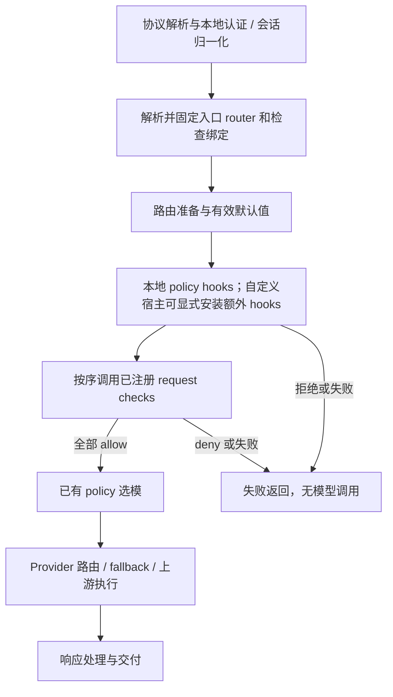

# Router & Extension Spec

状态：**v0.7，Beta 编译式扩展与共享前台宿主；实现与本地验证结果见验收记录，尚不表示已发布。**

本版替代 v0.5 的 Native/HTTP 双交付设计。Beta 的可执行 extension 统一编译进自定义宿主，
启动时注册能力，router 显式绑定。删除 HTTP checker 服务、wire crate 和连通 probe；
不增加 `bitrouter-extension` crate。远程管理客户端仍然可以查询宿主状态，这不是远程扩展执行。

开发体验与分步验收见 [Host-oriented Extension Spec](HOST_EXTENSION_DX_SPEC.md)：
共享前台宿主、作者类型归位及允许未声明注册保持未激活。v0.7 将这些规则纳入当前契约。

## 1. 产品目标与已确认决定

用户选择 router 后主要将模型选择交给它。现有最小 coding router 复用 policy-lock，
不在本轮增加选模算法。配置已有能力无需编写 Rust；开发和接入新可执行 extension
需要 Cargo 项目和自定义宿主构建，不能仅修改官方 bro 的配置来加载代码。

Extension 作者从 `bitrouter_sdk::extension::ExtensionApi` 进入，按需理解具体能力。
默认 bro 不依赖 regex matcher。源码位于 `extensions/` 的 crate 可以独立维护，
但 Beta 没有动态库加载、进程管理、热安装或远程 extension 协议。

## 2. 术语与职责

| 名称 | 含义 |
| --- | --- |
| Router | 命名请求配置：selection、defaults 与能力绑定 |
| Extension | 编译进自定义宿主并注册类型化能力的 Rust 模块 |
| Request check | 在选模/模型调用前对有界入口文本返回 allow/deny 的能力 |
| Checker instance | `checkers.<id>.native.revision` 声明的已编译检查实例 |
| Binding | Router 对该实例的引用、顺序和限制 |
| SDK | 公开注册和能力类型，提供已有 pipeline 契约；不依赖具体 extension |
| Host | 装配注册、校验配置、固定身份、执行限制和回执查询 |
| Legacy Plugin | 旧自定义宿主 hooks/migrations 包装；保留未被替代的语义 |
| Context extensions | 请求内类型化状态容器，与代码扩展入口无关 |

## 3. Router 契约

### 3.1 配置和寻址〔已实现〕

用户通过 `model: bitrouter/<router-id>` 调用 named router。

| 部分 | 语义 |
| --- | --- |
| `selection.kind: model` | 使用已有物理或虚拟 model selector，沿用 provider cascade |
| `selection.kind: policy` | 引用已有 policy-lock 中的 policy，保留当前 runtime 所需的 `base_model` |
| `selection.routing` | Provider 偏好和筛选；不是权限白名单 |
| `defaults` | 仅补充未显式提供的系统提示和生成参数 |
| `checks.request` | 有序的入口检查绑定；全部允许才继续，首次拒绝或失败即停止 |

Router 共享宿主 pipeline。目前不能通过配置安装任意 Rust hooks、新选模算法或独立执行引擎；
router 之间也不具有进程级隔离。不得通过 router/preset 互相引用制造隐式递归。

旧 `presets:` 和旧地址通过兼容解析进入同一种有效 router 表示，不建立第二套执行路径。
旧配置写回迁移属于显式操作，运行或查询不能顺手改写文件。

### 3.2 身份与权限〔已实现的边界〕

必须区分原始 selector、逻辑 router、router/checker binding、有效模型、实际 provider 与执行尝试。
入口绑定完成后，模型选择、候选调整和 fallback 不得替换原始 router 身份或检查绑定。

现有授权检查沿用 requested-selector 语义：允许调用一个 router，表示允许由其绑定策略选模。
当前没有由这份 spec 新增的“选模后逐物理模型再次授权”。Checker 也不能覆盖宿主授权。

绑定摘要标识宿主的脱敏配置绑定，不是完整 prompt、秘密值、policy-lock、外部规则文件或
二进制的内容证明。revision 是宿主作者声明，不能代替代码或规则证明。不得凭摘要相同声称判定逻辑未变。

### 3.3 默认 coding〔已确认方向，沿用既有实现〕

初始化建立 coding 与已有 policy 的关系。`base_model` 是策略运行时输入，不承诺是故障兜底。
策略或模型不可用时显示未就绪，不暗中换成另一种算法或绕过检查。固定模型 router 保留给
确定性场景及兼容迁移；用户调用 coding 时无需每次填写物理模型。

### 3.4 Selection policy、selector 与 policy-lock 的关系

Router 决定采用哪一种 selection；policy-lock 保存当前发布的策略产物；`PolicyRuntime` 读取并执行它。
`ModelSelector` 是 pipeline 调用选择实现的 Rust 接口，不是另一份用户配置，也不等同于 policy-lock。

当前 builder 保存全局 `Vec<Arc<dyn ModelSelector>>`，pipeline 在解析到 policy 时依次调用它们。
**尚无按 router 绑定自定义 selector ID 的注册机制。** 给该接口包一层闭包不能自动实现不同 router
各自使用不同算法，也不能让固定模型路径自动运行 selector。

现有 `PolicyRuntime` 还处理 continuation、reasoning 参数、decision、evaluation 和 trajectory 关联。
未来简单函数只返回选模建议；宿主验证目标可解析、能力兼容及受支持的结果范围，拒绝递归，保持固定身份。
这不授权新增“逐物理模型第二次 ACL”，也不以简单函数整体替换当前 policy runtime。

## 4. Extension 契约

### 4.1 一个入口，按需了解能力

统一注册入口和 request-check 输入、判定、回调位于 SDK 的 `extension` 模块。
不依赖 app crate，不另建 API crate，不保留 HTTP v1 DTO 作为 Native 业务输入。
普通函数接收 `ExtensionApi` 并调用 `request_check(id, revision, callback)`。
自定义前台宿主通过 `host::serve_with_extensions` 复用官方服务生命周期；
`assemble::build_app_with_extensions` 保留为低层装配接口。二者共用注册和激活校验。
具体可运行例子见 `apps/bitrouter/examples/native_regex_checker.rs`。

注册不执行检查，不安装全局 hooks，不代表所有 router 都启用它。
重复或非法注册使整个注册集合无效，即使作者忽略单次错误也不能部分启动。
配置缺少注册或 revision 错配阻断启动，包括声明但未绑定的实例。
有效但未配置的注册保持未激活，只产生按 ID 排序的启动诊断；不创建执行状态。
配置中的同一 id 可供多个 router 绑定。

### 4.2 输入与能力边界

输入提供有界、有序的文本片段及 coverage；业务判定为 allow 或带有限 reason code 的 deny。
fragment/coverage 的作者类型统一位于 `extension::request_check`；原来位于
`language_model::request_checks` 的六个类型已移动，不保留旧路径别名，序列化字段不变。
回调不接收 HTTP 信封、协议版本、响应关联字段、完整 pipeline context、凭据或宿主诊断接口。
输入覆盖 system、消息文本/reasoning、已有工具参数和结果、批准理由。
媒体仅计入未覆盖信息；不读取文件 bytes，不检查生成输出、后续 harness 工具循环或嵌套调用。
超限拒绝，不截断。输入检查不能冒充完整 PII 检测、脱敏或输出保护。

宿主 runner 只接收固定 binding 和同一业务 `Input`；请求与 router 身份留在 pipeline。
返回 `CheckerResult { decision, revision }`，复用业务 `Decision`，由宿主附上注册 revision，
pipeline 对任意 runner 的返回继续统一校验；native runtime 在记录完成诊断前先执行同一校验。
原 `CheckerInvocation` / `CheckerDecision` 属于本次 beta Rust API 收敛的迁移项；
作者 callback 与配置不变。详见 [runner 契约](REQUEST_CHECKS_SPEC.md#host-runner-boundary)。

### 4.3 执行、并发和失败

每 router 最多 16 个有序检查，首次 deny/error 停止后续检查与模型调用。
每检查实例最多 32 个并发；输入默认 256 KiB，最大 4 MiB、4,096 片段。
每绑定等待预算默认 500 ms、最大 30 s，覆盖并发排队与回调等待；不是整个请求的总预算。

同步回调在 blocking pool 执行。超时或取消停止等待并拒绝/终结请求，不能强制杀死已开始的
回调；并发 permit 保留到真实工作完成。非法判定和执行失败按 fail-closed 处理。
受限 Rust API 不是安全沙箱：同进程代码仍有进程权限，不承诺抵御恶意扩展或进程 abort。

### 4.4 Legacy Plugin 兼容

旧 `Plugin::install(&mut AppBuilder)` 可以装配全局 hooks 和 migrations；旧
`GuardrailsPlugin` 保留输入/输出/stream block/redact 语义，通过 matcher 的 `sdk` feature 显式启用。
新 request-check 仅覆盖 router-bound 输入 allow/deny，不能作为旧接口无损替代。
本轮移除的是最近新增的 app 作者入口、Native map 装配入口和 HTTP checker 路径，
迁移统一使用 SDK ExtensionApi。`PluginId`、现有 `Config::plugins` 消费者、Context extensions
和 agent-plugin 分发清单不做机械重命名。

### 4.5 后续能力

自定义 router/selector、eval、output-check 等仍需各自真实需求和执行契约。
本轮不增加空方法、通用事件总线、manifest registry 或可运行脚本引擎。
Extension 内部可自行调用网络，但不因此构成 BitRouter 远程扩展协议。

## 5. 执行顺序与失败语义〔已实现〕

以下为有检查绑定的 named router 主路径：



1. 流式和非流式请求共享入口准备；之后按执行和交付模式分支。
2. `pre_resolution_hook` 完成本地认证和会话处理，之后才固定绑定。
3. `router_preparation_hook` 可以选择有效候选配置，但不能替换原始检查绑定。
4. 对有检查绑定的请求，普通 `pre_request_hook` 接收有效默认值；此时修改 selector 明确失败。
5. 无检查绑定的旧路径保留普通 hook 改写 selector 后再应用最终默认值的兼容语义。
   不能声称旧 hook 已检查后来补入的默认值，也不能在固定绑定之后改写出新的受检 router。
6. 取消请求会停止等待，但不能证明同步回调停止执行，也不能撤销已发生的上游调用。

## 6. 配置与迁移

```yaml
checkers:
  company-input:
    native:
      revision: company-rules-v1
routers:
  coding:
    selection:
      kind: policy
      policy: auto
      base_model: coding-base
    checks:
      request:
        - checker: company-input
          timeout_ms: 500
          max_input_bytes: 262144
```

例子假定 policy 和 base_model 已存在。注册代码必须使用同名 id 与 revision。
默认 bro 没有任何自定义回调，遇到该声明会明确失败；必须运行已经链接并注册 extension 的宿主。
`bro config validate` 验证配置结构和引用，不证明某个构建含有所需代码。
保存检查声明或绑定后必须 restart；reload 不伪装成激活新状态。

旧 HTTP `endpoint`、`credential_env`、`contract_version` 字段明确拒绝并提示编译式迁移；
不将 endpoint 自动转换成 Native。删除 HTTP 服务、专用协议 crate 及其独立可执行制品发布入口。
任何 `plugins.bitrouter-guardrails` 旧键仍阻断默认宿主激活，不能通过移除配置静默失去保护。
需要旧输出/global/redact 能力的部署须保留相应 custom-host hooks，不能自动改成输入 block。

## 7. 诊断

不提供 `bro checks`、checker inventory、probe 或 request-check receipt 查询面。
启动时报告注册、revision 和绑定错误，并按 ID 排序报告未激活注册。每次 native 调用只记录
checker id、注册 revision、耗时和固定结果/失败类别；不记录 prompt、匹配文本、规则名或
callback 原始错误。配置有效、代码成功注册和真实调用仍是不同事实；缺少日志或遥测不能证明
检查未执行，allow 也不能证明模型执行或客户端交付成功。

## 8. 验收门槛

| ID | 必须验证 |
| --- | --- |
| CE01 | SDK 无默认 features 可用；扩展不依赖 apps；无 checker-protocol 或新 API crate |
| CE02 | 注册非法/重复/被忽略错误、配置缺失注册/revision 错配阻断启动；合法未配置注册保持未激活 |
| CE03 | 两 router 绑定不同检查，allow 正常路由，deny/超时/非法结果零上游 |
| CE04 | 同步超时和取消不提前释放已开始工作的并发名额 |
| CE05 | 固定 router 身份、saved/running/restart 状态仍成立；非法结果记录为失败类别 |
| CE06 | 旧 HTTP 配置明确失败；checker CLI/管理端点移除；默认宿主不含 matcher |
| CE07 | 旧 SDK Plugin/stream/output 兼容测试保持；输入检查不宣称替代全部保护 |
| CE08 | 本地全量测试、lint、fmt、文档、schema、feature 和真实 Native 进程验证 |

验证事实与尚未完成的门槛见 [验收记录](GUARDRAILS_EXTENSION_ACCEPTANCE.md)。
历史 Native/HTTP 验收不能证明本次编译式收敛已经通过。

## 9. 相关实现

- [SDK extension](../crates/bitrouter-sdk/src/extension/mod.rs)
- [宿主装配](../apps/bitrouter/src/assemble.rs)
- [共享前台宿主](../apps/bitrouter/src/host.rs)
- [检查 runtime](../apps/bitrouter/src/request_checks.rs)
- [请求检查契约](REQUEST_CHECKS_SPEC.md)
- [扩展使用与迁移](GUARDRAILS_EXTENSION.md)
- [regex extension](../extensions/regex-checker/README.md)
