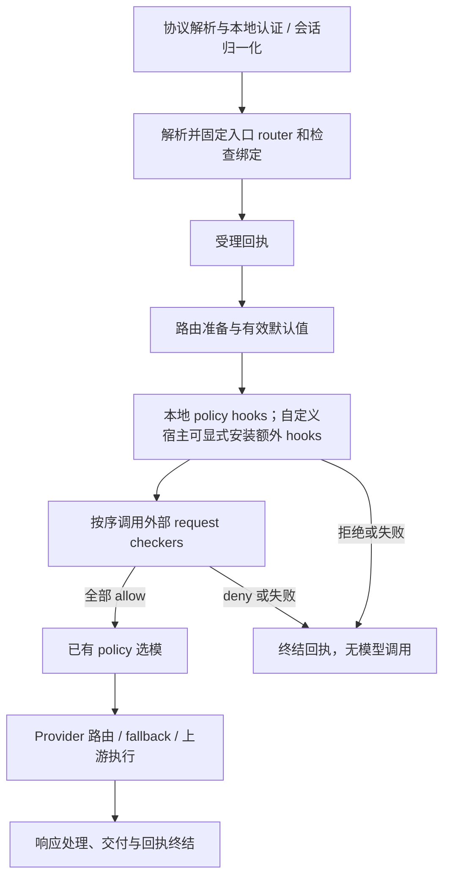

# Router & Extension：组合、执行边界与 Guardrails 独立交付

状态：**v0.4，6A–6C 已接入本工作区：共享 HTTP v1 契约、独立输入 checker、默认宿主依赖移除与迁移阻断。验证结果见验收记录；公开发布仍待发布流程。自定义 router/selector API 不在本轮范围。**

日期：2026-09-17。实施前源码基线：`main@2b01d2e6eab72274fb4b3571534fb5c9e656746b`；本轮状态指当前工作区变更，不代表已合并或发布。

本文独立定义 router 与 extension 的关系，作为第一批最后一步 guardrails 拆分的评审依据。
不引入新的模型选择算法，也不将整个 beta 架构纳入本次实施。

v0.3 更新：落地第 6 项的共享协议、服务、构建隔离和旧键阻断；实现及制品证据见 [验收记录](GUARDRAILS_EXTENSION_ACCEPTANCE.md)。
v0.3 曾将目录收敛到 `extensions/guardrails/{matcher,service}`，当时保留包名、CLI 与运行语义；
共享 wire 契约仍位于 `crates/bitrouter-checker-protocol`。

v0.2 更新：统一 Extension 产品术语，区分静态 Rust 装配与独立服务，明确普通函数的作者入口、
宿主执行约束和 wire 契约；将 guardrails 独立交付与自定义 router/selector API 分为两个增量。
与产品架构文档 `001-Extensible-Router-Architecture.md` v0.9 的第 3、4、6、10 节对应；
该文档中的双模式、client/server 拆分及 durable workflow 不属于本 spec 的交付承诺。

v0.4 更新：`request-check` 是 capability，`regex-checker` 是具体 extension；已接入显式
Native 注册与 HTTP 共用的检查运行时。新服务 package/binary 改为 `bitrouter-regex-checker`，
源码归入 `extensions/regex-checker/`；旧 matcher package 和 SDK hooks 保留兼容身份。

## 1. 产品目标与已确认决定

用户选择一个 router 后，主要将模型选择交给它。用户需要理解“选用什么行为、绑定什么能力、
当前是否生效、一次请求实际发生了什么”，无需为了扩展现有 `bro` 学习 Rust。

以下决定已经确认：

1. `apps/bitrouter` 默认只提供一个最小 coding router；用户可以定义其他 router。
2. Router 替代 preset，作为公开的具名请求处理配置对象；不再要求建立同名 preset。
3. coding 复用已有 policy-lock，由初始化流程建立绑定；缺少模型或策略时明确未就绪。
4. 沿现有 pipeline 和管理查询演进。第一版检查回执只保证当前进程内查询。
5. guardrails 拆分允许明确迁移阻断；不得静默丢失既有保护。
6. Rust Plugin 统一归入 Extension 产品概念；Context `extensions` 仍是请求状态容器。
7. 开发者使用普通 Cargo 项目、业务函数和小型注册/服务入口；不先建设脚本 runtime 或通用插件平台。
8. 配置与代码定义复用同一宿主执行路径；guardrails 拆分不等待自定义 router API。

其中“默认一个 router”是产品入口决定，不表示默认宿主已经移除了其余功能、所有插件或全部选模实现。

## 2. 术语与状态

| 名称 | 本文含义 | 当前状态 |
| --- | --- | --- |
| Router | 命名的请求处理配置，组合选择策略、默认值和能力绑定 | 已实现 |
| Selection policy | 选模规则或策略产物；router 的 selection 当前支持固定模型引用或 policy-lock | 已实现，运行在宿主内 |
| Extension | 向 router 或宿主提供一项有明确契约的可替换能力 | 产品概念；首个外部接入契约为 request checker |
| Checker instance | `checkers.<id>` 声明的 HTTP 连接或 Native 实例 | 已实现 |
| Binding | Router 对 checker 的引用及调用限制 | 已实现，入口请求固定绑定 |
| Rust `Plugin` | 构建时向 `AppBuilder` 注册 hooks 和 migrations 的便捷包装 | 已实现；不提供进程隔离或动态安装 |
| Context `extensions` | 请求内部按 Rust 类型存放对象的数据容器 | 已实现；不是外部扩展注册表 |
| Host | `apps/bitrouter` 的装配、HTTP 调用、凭据和管理实现，以及使用的 SDK runtime | 已实现；尚不等于最终 minimal core |
| Extension artifact | 可独立构建、发布、运行和升级的能力实现 | guardrails 已有独立 executable 和本地归档；公开发布待完成 |

**关系：用户选择 router；router 声明使用哪些能力；宿主按契约调用实现并执行共同约束。**

面向用户首先解释 Router 与 Extension；selection 是 router 的行为，request-check 是 extension
提供的一种能力，binding 是两者的连接。保留这些技术词用于配置和诊断，不要求用户管理同层的五种产品。
`selector` 还可能指 `provider/model` 等模型地址；它与 Rust `ModelSelector` 执行接口不是同一含义。

Rust crate 拆分、默认宿主装配、发行制品组成是三个不同问题。独立 crate 不自动意味着用户能
扩展一个已经安装的 `bro`；配置关闭也不等于移除了编译依赖。

## 3. Router 契约

### 3.1 配置和寻址〔已实现〕

用户通过 `model: bitrouter/<router-id>` 调用 named router。

| 部分 | 语义 |
| --- | --- |
| `selection.kind: model` | 使用已有物理或虚拟 model selector，沿用 provider cascade |
| `selection.kind: policy` | 引用已有 policy-lock 中的 policy，保留当前 runtime 所需的 `base_model` |
| `selection.routing` | Provider 偏好和筛选；不是权限白名单 |
| `defaults` | 仅补充未显式提供的系统提示和生成参数 |
| `checks.request` | 有序的入口检查绑定；全部允许才继续，首次拒绝或失败即停止 |

Router 共享宿主 pipeline。目前不能通过配置安装任意 Rust hooks、新选模算法或独立执行引擎；
router 之间也不具有进程级隔离。不得通过 router/preset 互相引用制造隐式递归。

旧 `presets:` 和旧地址通过兼容解析进入同一种有效 router 表示，不建立第二套执行路径。
旧配置写回迁移属于显式操作，运行或查询不能顺手改写文件。

### 3.2 身份与权限〔已实现的边界〕

必须区分原始 selector、逻辑 router、router/checker binding、有效模型、实际 provider 与执行尝试。
入口绑定完成后，模型选择、候选调整和 fallback 不得替换原始 router 身份或检查绑定。

现有授权检查沿用 requested-selector 语义：允许调用一个 router，表示允许由其绑定策略选模。
当前没有由这份 spec 新增的“选模后逐物理模型再次授权”。Checker 也不能覆盖宿主授权。

绑定摘要标识宿主的脱敏配置绑定，不是完整 prompt、秘密值、policy-lock、外部规则文件或服务
二进制的内容证明。同一 endpoint 的实现可以变化。不得凭摘要相同声称判定逻辑未变。

### 3.3 默认 coding〔已确认方向，沿用既有实现〕

初始化建立 coding 与已有 policy 的关系。`base_model` 是策略运行时输入，不承诺是故障兜底。
策略或模型不可用时显示未就绪，不暗中换成另一种算法或绕过检查。固定模型 router 保留给
确定性场景及兼容迁移；用户调用 coding 时无需每次填写物理模型。

### 3.4 Selection policy、selector 与 policy-lock 的关系

Router 决定采用哪一种 selection；policy-lock 保存当前发布的策略产物；`PolicyRuntime` 读取并执行它。
`ModelSelector` 是 pipeline 调用选择实现的 Rust 接口，不是另一份用户配置，也不等同于 policy-lock。

当前 builder 保存全局 `Vec<Arc<dyn ModelSelector>>`，pipeline 在解析到 policy 时依次调用它们。
**尚无按 router 绑定自定义 selector ID 的注册机制。** 给该接口包一层闭包不能自动实现不同 router
各自使用不同算法，也不能让固定模型路径自动运行 selector。

现有 `PolicyRuntime` 还处理 continuation、reasoning 参数、decision、evaluation 和 trajectory 关联。
未来简单函数只返回选模建议；宿主验证目标可解析、能力兼容及受支持的结果范围，拒绝递归，保持固定身份。
这不授权新增“逐物理模型第二次 ACL”，也不以简单函数整体替换当前 policy runtime。

## 4. Extension 契约

### 4.1 本轮采用的表达〔方向已确认〕

保留按能力命名的现有配置：首个外部能力使用 `checkers` 和 `checks.request`。
本轮不增加通用 `extensions:` 注册表、manifest、任意 hooks DSL 或 extension 安装器。

理由：当前只有一个已落地的外部调用契约。再建立一层 extension ID → checker ID → router
binding 会增加配置和诊断对象，却不增加当前能力。未来出现第二种外部能力时，再评估统一注册需求。

同一个 checker instance 可以被多个 router 引用；每个 binding 具有自己的限制和身份。
不同规则集可以先由不同 endpoint 表达，本轮不虚构 `ruleset` 配置字段或远程规则管理 API。

### 4.2 责任归属

| 责任 | 宿主 | Router 配置 | 外部 checker |
| --- | --- | --- | --- |
| 认证、凭据和请求归属 | 权威实现 | 不得覆盖 | 不得覆盖 |
| 使用哪个选择策略 | 执行已有 runtime | 声明选择 | 无权选择模型 |
| 检查什么入口范围 | 生成有界文本投影及 coverage | 声明绑定 | 按收到的范围判定 |
| 判定规则、匹配算法 | 不应包含外置后的具体 matcher | 引用能力 | 拥有实现及规则 |
| 超时、大小、并发及返回校验 | 强制执行 | 在允许范围内设置限制 | 配合协议，不能放宽宿主限制 |
| 拒绝后的零模型调用 | 执行保证 | 不能要求绕过 | 返回 deny |
| 回执、取消、交付事实 | 唯一权威 | 无 | 只提供结果和自报版本 |
| 外部服务生命周期 | 本轮不代为启动/升级 | 保存连接声明 | 操作者独立部署 |

Rust hooks 仍是受信任的宿主代码，具有比 HTTP checker 更大的进程内能力；不能把对 HTTP checker
的限制当作 Rust Plugin 的安全隔离保证。

### 4.3 Request-checker v1〔已实现〕

- 输入为有效入口请求的受限文本投影：system、消息文本/reasoning、已有工具参数和结果、人工审批理由。
- 文件等非文本内容明确列为未覆盖；不发送文件字节、provider/管理凭据或任意内部 metadata。
- 返回仅支持 allow/deny，不支持改写请求、脱敏、选模、工具调用或输出检查。
- 协议版本和 invocation ID 必须匹配；未知字段及畸形返回按协议错误拒绝。
- deny 与服务故障分别记录；timeout、连接失败、协议错误均阻止后续模型调用。
- 截止时间包含排队、连接及响应体读取；不自动重试，不跟随重定向。

| 限制 | 当前值 |
| --- | --- |
| 单 router 检查数 | 最多 16，顺序执行 |
| 单 checker 并发 | 最多 32 |
| Binding deadline | 默认 500 ms，最大 30 s |
| 文本大小 | 默认 256 KiB，最大 4 MiB；最多 4,096 个片段，超限拒绝、不截断 |
| 编码后调用体 / 响应体 | 最多 8 MiB / 16 KiB |

此契约不覆盖随后生成的输出、工具循环的新结果、嵌套请求的自动继承或原生 coding harness 的全部活动。
外部实现版本是服务自报证据，不是可信证明；v1 尚无规则摘要锁定或远程证明机制。
上述 deadline 不包含此前的投影和输入校验，也不是所有有序检查共享的总预算。HTTP 编码位于等待预算内，但同步编码不可被异步 timeout 抢占。

### 4.4 Rust 作者体验与两种交付方式〔request-check 两种方式已实现〕

借鉴 Pi 的重点是小入口、普通业务代码与逐步增加复杂度。Rust 下使用 Cargo 管理代码和依赖，
库中编写判定函数，入口负责注册或运行协议服务；作者不必复制 pipeline、回执存储或管理接口。

| 方式 | 作者交付 | 使用者需要做什么 | 权限边界 |
| --- | --- | --- | --- |
| 静态 Rust extension | 业务 crate 与显式装配入口 | 自定义宿主链接并重新构建 | 受信任的进程内代码，不是沙箱 |
| 独立原生 extension | 可执行文件与受支持的能力协议 | 运行服务，将已安装 bro 的 router 绑定到服务 | 只接收投影、返回受限结果；仍需部署和维护进程 |

默认 bro/core 发布产物不包含已外置的具体判定实现；用户显式构建的自定义宿主可以静态链接它。
两种方式共享适用的业务逻辑及输入/结果语义，不承诺共享完整可变 `PipelineContext` 或相同权限。
任意 HTTP URL 只有实现支持的版本化能力契约后，才能作为该能力的 extension 接入。

建议项目从 `Cargo.toml`、`src/lib.rs`、`src/main.rs` 和测试开始：library 包含判定，binary 使用
服务 helper 处理协议。已有 `Plugin::install` 可演进为装配入口；不并行新增一套同义的 Plugin/Extension
注册体系，不以全面改名作为本批交付。注册仅提供能力，router 显式绑定才启用检查；不得隐式全局激活。

初版不用自定义 manifest 重复 Cargo 包信息，不承诺动态 Rust ABI、脚本加载、自动发现、stdio transport
或 bro 自动拉起进程。当前具体入口为服务 crate 的 `adapter::router`、共享 capability 模块的 `CheckCallback` / `CheckDecision`，以及宿主的 `NativeChecker` / `build_app_with_checkers`；
它们服务于这个输入 checker，不代表已新增通用 extension 注册接口。

### 4.5 首个作者入口：业务判定与 HTTP v1 分开〔已实现〕

作者接收受限文本及 coverage，返回 allow/deny；适配器校验请求信封并关联响应中的版本和 invocation ID。
宿主继续拥有网络限制、结果校验、拒绝执行、回执与管理事实。服务 helper 减少协议样板代码，不绕过这些检查。

HTTP v1 信封与严格编解码现位于 `bitrouter-checker-protocol::v1`，宿主和服务实际共同消费；
SDK 的 invocation/decision 类型保留，宿主显式转换，不改变已有 wire JSON 结构。
`RequestCheckerRunner` 仍带宿主 reporter，是 transport 接缝；业务回调不持有该 reporter。
独立服务消费共享协议和默认不启用 `sdk` feature 的 matcher，正常依赖不包含 SDK。

Checker 的价值在于明确输入权限、拒绝点、失败规则和可查结果。代价是网络/序列化、部署、版本兼容与
超时维护；受限投影也放弃了任意 context 访问和改写能力。首版保留这个明确边界，不扩成任意远程 hook。

### 4.5.1 Native 与 HTTP 共用的 request-check 运行时〔已实现〕

Capability 描述接口，extension 提供实现，实例携带配置，router 显式绑定；部署方式是独立维度。
`regex-checker` 的规则可用于秘密信息或部分 PII 格式检查，不代表内置完整 PII 检测器。
不新增通用 extension registry、manifest 或一组 Guardrail/Eval 包装接口。

`bitrouter-checker-protocol::capability` 提供普通同步回调与业务判定，复用有界 v1 输入。
Matcher 提供 `checker::callback(rules)`，Native 与 HTTP 服务使用同一函数。
宿主 `RequestCheckRuntime` 统一 binding 校验、输入校验、并发许可、deadline、结果校验；
pipeline 继续统一投影、拒绝、回执与零上游调用。HTTP 分支单独拥有凭据、编码与网络操作。

自定义宿主显式调用 `assemble::build_app_with_checkers`，按 checker id 注册 `NativeChecker`。
配置使用 `checkers.<id>.native.revision`，代码注册 revision 必须相等；缺失、错配和多余注册阻断启动。
Revision 是代码/规则的声明身份，变更须更新，非可信证明。注册不隐式全局启用；router 仍绑定
`checks.request`。官方 bro 不链接 matcher、不提供 Native 注册；配置本身不能安装 Rust 代码。

管理 inventory 增加 execution/native_revision，Native 无 endpoint fingerprint。Native probe 的
reachability 为 not_attempted、protocol 为 not_checked；synthetic decision/error 才是本地探测结果。
Native 不经过 HTTP，不能宣称网络连通。回执 attempted 表示已提交本地工作，response_received 表示
本地判定已返回；HTTP 保留原义。两种方式都不把 probe 写成实际请求使用证据。

Native 使用 blocking pool；每实例最多 32 个已准入调用。超时包含排队等待，停止等待不抢占 CPU；
许可随已提交的工作持有直至结束。共享判定/回执语义不意味着共享隔离或取消保证。
旧 `sdk` feature hooks 仍是兼容路径，不是这个新 Native checker 的实现。

### 4.6 并发、异步与取消〔新 API 必须明确的约束〕

普通函数入口不意味着顺序执行或自动隔离。共享状态遵守 `Send + Sync`，需要共享时显式使用 `Arc`
及同步机制；不能默认用一个全局 `FnMut` 隐式串行化所有请求。最终签名须用实际 checker/selector 示例验证。
确定性、短时同步判定可先做小适配；需要异步 I/O 时再提供明确的 async 入口，不提前加入通用 trait 层。

CPU 密集工作需有界资源安排；异步 timeout 不会抢占同步计算，`spawn_blocking` 也不保证强制取消。
取消等待或 drop future 不证明远端服务停止；当前非流式宿主执行也可能在客户端断开后继续。
不得为了函数式入口改写现有终结、计量与交付语义。

已实现的服务回调为 `Fn(&v1::Request) -> CheckDecision + Send + Sync + 'static`。服务在读取 body 前
取得至多 32 个并发许可，饱和返回 503；body 读取限制 8 MiB、30 秒。同步判定交给 `spawn_blocking`，
许可随 CPU 工作保留，即使调用方停止等待也不会提前释放；这些限制不保证强制取消 CPU 工作。

### 4.7 后续自定义 router 增量〔与 guardrails 拆分分开〕

先用一个真实自定义选模示例定义最小输入、合法结果和错误，再决定函数签名及注册入口。
实现必须支持 router 指向特定选择实现、拒绝未知/重复标识，并确保未绑定实现不会执行；
配置式 router 与代码定义仍进入同一执行路径。首次接入不要求新增选模算法，示例可采用确定性规则。

本轮不提前发布 `SimpleModelSelector` 等新 trait，也不将 closure helper 视为 selector 隔离已完成。
现有观察 hook 具有 context 能力，不能仅改名就宣称只读；若以后开放 observer，应使用专门的事实投影。
外部 selector 协议、通用 registry 和进程管理分别评审，均不是第 6 项的前置条件。

## 5. 执行顺序与失败语义〔已实现〕

以下为有检查绑定的 named router 主路径：



1. 流式和非流式请求共享入口准备；之后按执行和交付模式分支。
2. `pre_resolution_hook` 完成本地认证和会话处理，之后才固定绑定并受理回执。
3. `router_preparation_hook` 可以选择有效候选配置，但不能替换原始检查绑定。
4. 对有检查绑定的请求，普通 `pre_request_hook` 接收有效默认值；此时修改 selector 明确失败。
5. 无检查绑定的旧路径保留普通 hook 改写 selector 后再应用最终默认值的兼容语义。
   不能声称旧 hook 已检查后来补入的默认值，也不能在受理之后改写出新的受检 router。
6. 取消请求可终结或标记回执不完整，但不能证明外部服务停止执行，也不能撤销已发生的上游调用。

回执不是所有入口错误的全局日志。认证失败、畸形入口、未解析出的 router、直接模型请求，
都不伪造 named-router 受理回执；绑定成功之后的本地拒绝和 checker 失败才在该契约内。

## 6. 配置示例〔现有 schema；独立服务需另行运行〕

```yaml
checkers:
  organization-input:
    endpoint: http://127.0.0.1:8081/check
    credential_env: ORGANIZATION_CHECKS_TOKEN
    contract_version: 1
routers:
  coding:
    selection:
      kind: policy
      policy: coding
      base_model: coding-base
    checks:
      request:
        - checker: organization-input
          timeout_ms: 500
          max_input_bytes: 262144
```

示例假定 `coding` policy 和 `coding-base` selector 已存在，且操作者已经运行兼容服务。
本轮服务默认监听 `127.0.0.1:8081`，提供 `POST /check`；具体启动与规则配置见 [使用和迁移说明](GUARDRAILS_EXTENSION.md)。
服务可运行在本机或远端；跨机器传输需要由部署者配置合适的 TLS 与访问控制。
凭据由目标 daemon 的环境解析，不能用客户端环境代替。绑定到 router 的必要凭据缺失会阻止激活。

用户增加另一 router 时复用相同结构；不需复制 policy 算法或创建第二份 preset。
直连模型请求不会自动应用此处 `coding` 的检查，这一点必须在迁移评审中显式处理。

## 7. 状态与诊断〔已实现〕

管理查询来自所选 daemon。Local IPC 与 remote control 共享运行事实，不混入客户端配置。
以下维度分开表达，不压缩为一个含糊的 healthy：

| 维度 | 能证明什么 | 不能证明什么 |
| --- | --- | --- |
| 配置有效性 | 引用、协议和限制是否合法 | 服务已部署或规则正确 |
| saved / running / restart-required | 保存配置与目标运行状态的关系 | 外部服务规则未变 |
| probe | 一次合成请求的连通及协议结果 | 真实请求使用过或未来一定可用 |
| last actual | 当前保留回执内的实际调用证据 | 完整历史或从未使用 |
| request receipt | 该次受理的绑定、检查、执行及交付事实 | 客户端已消费输出、崩溃后可恢复 |

Router/checker 配置属于启动状态，编辑保存后需要 restart；不得用普通 reload 声称它们已生效。
Policy-lock 等独立状态仍按各自的状态契约报告，不把所有来源概括为同一个配置版本。

回执与可选 exporter 无关。默认最多 4,096 条，完成记录 15 分钟过期，容量压力可提前淘汰完成记录；
活跃记录不淘汰，容量不足时在调用前拒绝受理。重启丢失记录，查询需区分进程实例和 unknown。
Probe 不产生实际使用证据；allow 不表示生成成功，server committed 不表示客户端已收到。

## 8. Guardrails 拆分：实现边界与迁移差异

### 8.1 拆分前基线与保留的自定义宿主能力

拆分前 `apps/bitrouter` 直接依赖 `bitrouter-guardrails`，解析 `plugins.bitrouter-guardrails.custom_patterns`，
编译正则规则后通过 `GuardrailsPlugin::with_static` 注册全局 hooks。无规则时不注册，不代表依赖已移除。
`GuardrailsPlugin::dynamic` 允许自定义宿主逐请求存入规则集；它不表示动态加载外部服务。

| 能力 | 拆分前内置实现 / 显式启用的 SDK hooks | Request-checker v1 |
| --- | --- | --- |
| 入口文本 block | 支持，拼接文本后匹配正则 | 支持；按顺序拼接各片段并各附换行，含最后一个片段 |
| 入口 redact | 请求 hook 不执行 redact | 不支持 |
| 流式输出 block / redact | Text / reasoning deltas 上执行 | 不支持 |
| 非流式输出检查 | 当前插件未注册对应结果检查 | 不支持 |
| 作用域 | 宿主全局注册的规则 | Named router 显式绑定 |

旧流式 matcher 的 block 跨 chunk 检测只保留有限历史，发现匹配时可能已经发送部分内容；
redact 按 chunk 执行，跨 chunk 匹配存在已知限制。不得称其为完整的交付前输出审查。

### 8.2 最小独立制品〔本地实现，公开发布待完成〕

首个制品实现 HTTP request-checker v1，只承诺入口文本 block 判定。
同一 workspace 中新增 package `bitrouter-regex-checker`，binary `bitrouter-regex-checker`，
共享必要的规则实现；制品可独立发布，默认 `bro`
不依赖该服务或 matcher。现有库如仍服务自定义宿主，可保留兼容接口；不必为了独立交付立刻迁仓。

服务拥有规则文件、校验、正则编译和判定；宿主拥有投影、调用限制、失败拒绝、回执与诊断。
初版规则在服务启动时固定，非法规则或不支持的 action 导致服务启动失败，不静默跳过。
不增加远程规则编辑、自动安装、自动启停或输出检查协议。

`bitrouter-guardrails` 默认 features 为空；旧 hooks/plugin 由显式 `sdk` feature 提供，rules/config 保持独立。
默认宿主已移除该 crate 依赖及规则编译/插件装配代码。共享协议只依赖 serde/serde_json；
`cargo-dist` 使用 `precise-builds = true` 按应用构建，避免 workspace feature 合并污染发行边界。

独立制品交付必须包含可运行入口、配置说明、版本、发布产物及兼容性验收。
只移动目录、添加 Cargo feature 或提供库 API，均不足以满足独立制品目标。
服务参数为 `--rules PATH`、`--listen ADDR`、`--credential-env ENV_NAME`，支持 `--help`、`--version`。
`scope: input` 和每条规则的 `action: block` 必须显式填写；不同规则集使用独立服务配置。
发布计划提供六个目标平台的独立归档，不安装进 bro 包；本机可运行证据和公开发布门槛分别记录。

### 8.3 迁移阻断〔已实现，验收见记录〕

移除默认装配时，发现旧 `plugins.bitrouter-guardrails` 配置应明确阻止启动，提供配置位置和
能力差异说明。即使同时存在新 checker 也不自动认为旧配置已经迁移；空旧配置同样要求显式清理。
迁移诊断需保留于默认宿主，不得通过依赖旧 matcher 才能识别旧配置。

迁移必须分别检查：

1. **输入语义：** 片段顺序、换行连接及正则跨片段行为不能无说明改变；对支持的输入范围验证兼容性。
2. **输出语义：** 旧 block 规则同时参与输出检查，仅有 block 也不能自动判为完全兼容；
   redact 更不能被改成 allow 或无声忽略。
3. **作用域：** 全局规则可能覆盖直接模型入口；只给 coding 添加 binding 会缩小范围。
   不自动创造“所有入口都映射到 coding”的新行为。
4. **证据范围：** daemon 无法仅凭旧键被删除，证明外部规则及全部客户端都迁移正确。
   迁移说明必须要求部署者核对受保护入口和输出需求，不能报告自动证明了等价保护。

旧键检测是宿主可执行的启动阻断。若删除旧键后仍有输出或全局覆盖需求，宿主无法自动推知该需求；
此时属于部署迁移验收未通过，不能声称 daemon 仍会自动阻止启动。使用者应保留满足需求的旧部署，
或先另行交付所需能力。本文不授权用输入检查冒充完整迁移。

## 9. 分步实施与验收门槛

| 顺序 | 最小改动 | 完成标准 |
| --- | --- | --- |
| E1 | 共享实际消费的 HTTP v1 信封与最小服务适配 | 现有客户端与独立服务协议互通；业务回调不持有 reporter；schema 不变 |
| E2 | 分开规则实现与 SDK hooks/plugin 依赖 | 输入拼接/跨片段语义有兼容测试；规则可供独立服务使用，依赖图无完整宿主 |
| E3 | 独立输入 checker executable | 启动固定规则；非法规则、redact 和不支持范围启动失败；版本、配置及发行入口明确 |
| E4 | 真实跨进程验证并提供独立发布制品 | daemon + checker + 可计数模拟上游；两 router、失败零上游、回执、probe 与迁移说明可验证 |
| E5 | 移除默认宿主装配/依赖，加入轻量旧键阻断并复验 | 无旧配置正常运行；旧键明确失败；默认发布不包含 matcher；发布制品在干净环境可用 |

6A 覆盖 E1–E2；6B 覆盖 E3–E4 的本地服务、归档和跨进程验证；6C 覆盖 E5 的宿主移除、迁移与复验。
本工作区已接入这些实现；各项实测结果见 [验收记录](GUARDRAILS_EXTENSION_ACCEPTANCE.md)。
独立制品必须在对外迁移时可供操作者获得；本地归档不等于已发布。公开发布前不宣称第 6 项的发布门槛已完成。
后续 R1 用真实示例实现 router 对自定义 selector 的绑定与最小函数入口；R2 再按需求讨论外部 selector
和进程管理。R1/R2 不阻塞 E1–E5，也不捆绑 client/server 拆分、完整 SDK 重组或新的选模算法。

| ID | 验收场景 | 要求 |
| --- | --- | --- |
| RE01 | 两 router 使用不同检查服务，选模和 fallback 变化 | 原始身份、绑定、执行结果可分别查询 |
| RE02 | deny、timeout、畸形返回、版本不兼容、输入超限 | 受检请求的上游调用计数为零，回执原因明确 |
| RE03 | 服务规则无效、redact 等不支持配置 | 明确拒绝服务激活，不无声丢弃规则 |
| RE04 | 默认 bro 无任何检查配置 | 正常运行，依赖图和构建装配中无 guardrail matcher |
| RE05 | 旧 guardrails 键，含空配置、block、redact，以及新旧配置并存 | 默认宿主给出迁移阻断，不能只警告后继续 |
| RE06 | 输入跨片段匹配、工具参数/结果、非文本内容 | 支持范围与边界有测试，未覆盖内容不伪装已检查 |
| RE07 | 直连模型入口与已有输出保护需求 | 明确记录不等价；不得用 named-router 输入演示作为全局迁移验收 |
| RE08 | exporter 关闭、probe 成功、实际调用失败、进程重启 | 证据互不混淆，回执不存在时保留未知/不可用 |
| RE09 | 修改绑定或 endpoint | saved 与 running 分离，所有 reload 入口要求 restart |
| RE10 | 干净环境运行已发布制品 | 无需重编译 bro；版本及配置错误诊断可复现 |

本地端到端测试应使用真实 daemon、独立 checker 进程和可计数的模拟上游；真实 provider 验证单独报告。
模拟上游验证不能称为真实模型成功。源码变更仍须执行仓库要求的 tests、clippy、fmt 和适用发行检查。
移除 guardrail matcher 不代表所有 `regex` 依赖消失；如宣称体积改善，必须提供同条件 A/B release 构建测量。

## 10. 本轮明确不做

- 通用 extension marketplace、动态库/WASM 加载、进程内插件沙箱。
- 新选模算法、router 继承/嵌套 DSL、任意外部 selector 协议。
- 输出 block/redact 的远程协议、工具副作用审批、完整 harness 覆盖。
- 原子热替换、外部规则证明、持久回执、跨进程恢复。
- 将全部 policy/evaluation/trajectory 功能整体外置，或把当前 SDK 宣称为最终 minimal core。

## 11. 决策状态与独立审阅处置

产品方向已确认；以下区分方向、实施约束与仍需用代码验证的 API，不把文档更新当成实现完成。

| ID | 议题 | 当前决定 | 仍需确定或验证 |
| --- | --- | --- | --- |
| D1 | 产品概念与配置 | Plugin 归入 Extension；Context extensions 除外；保留 `checkers` / `checks.request` | 不新增通用 registry；旧 Rust API 兼容路径随实际消费者确定 |
| D2 | 首个 guardrail 范围 | 输入 block；不声称替代旧输出或全局覆盖 | 已实现逐片段附换行、严格启动 schema；具体证据见验收记录 |
| D3 | 迁移阻断 | 旧键存在即阻止启动；删除旧键不证明等价覆盖 | 自动检测与部署者验收分别验证 |
| D4 | 发布与依赖 | 同 workspace 独立服务；默认宿主不链接 matcher | 六平台归档计划已配置；本地 macOS 制品与公开跨平台发布分开验收 |
| D5 | 规则生命周期 | 首版启动固定，不热更新 | 服务版本不能冒充规则摘要证明 |
| D6 | Rust 作者入口 | 普通同步函数与小型 HTTP 适配已有实际消费者；静态 hooks 显式启用 | 新 async 回调或通用注册接口仍需真实消费者，不在本轮提前增加 |
| D7 | 自定义 router | 单独增量，保留现有 PolicyRuntime | 按 router 绑定、重复/未知 ID、合法输出与兼容路径；不提前新增 trait |

独立 reviewer 基于源码提出的关键修正已纳入：全局 selector 列表不能冒充 router 隔离；业务 decision
不能冒充 wire response；input-only 不能等价迁移 output/global 规则；异步 timeout 不能保证抢占 CPU
或停止远端执行。该次审阅为只读源码与设计审阅，没有运行测试，也未交付新 API。

## 12. 关联规范与源码依据

本文记录现状与提案的分界。已实现请求协议以 request-checks spec 和代码为准；本文不静默修改 wire v1。
历史 router spec 中有关 checks 尚未实现的段落属于当时子批次范围，由后续 request-checks spec 补充。

- [Router/preset 迁移](ROUTER_PRESET_MIGRATION_SPEC.md)
- [配置状态契约](CONFIGURATION_STATE_CONTRACT_SPEC.md)
- [Request checks 与回执](REQUEST_CHECKS_SPEC.md)
- [Router 配置及绑定](../crates/bitrouter-sdk/src/config/router.rs)
- [Plugin 与应用构建](../crates/bitrouter-sdk/src/app.rs)
- [Pipeline 入口、路由及执行](../crates/bitrouter-sdk/src/language_model/pipeline.rs)
- [Native/HTTP checker runtime](../apps/bitrouter/src/request_checks.rs)
- [Policy runtime](../apps/bitrouter/src/policy_lock.rs)
- [宿主装配](../apps/bitrouter/src/assemble.rs)
- [Guardrail hooks](../extensions/regex-checker/matcher/src/hooks.rs) 与 [matcher](../extensions/regex-checker/matcher/src/rules.rs)

- [独立服务与配置](../extensions/regex-checker/service/README.md)
- [共享 HTTP v1 契约](../crates/bitrouter-checker-protocol/src/v1.rs)
- [迁移与操作说明](GUARDRAILS_EXTENSION.md)
- [实施验收记录](GUARDRAILS_EXTENSION_ACCEPTANCE.md)

验收记录区分本地测试、平台 CI 和公开发布；文档更新本身不替代这些证据。
