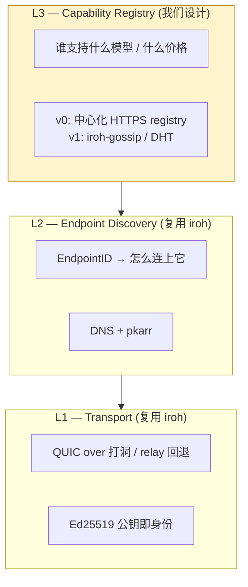
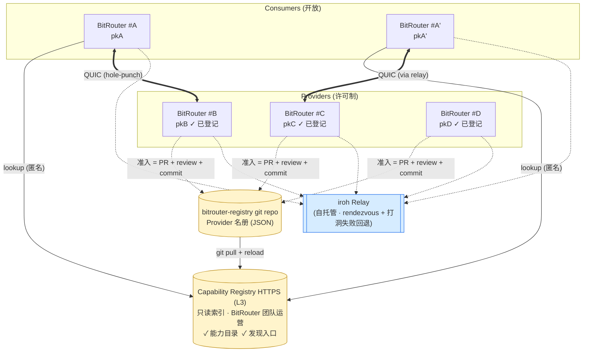
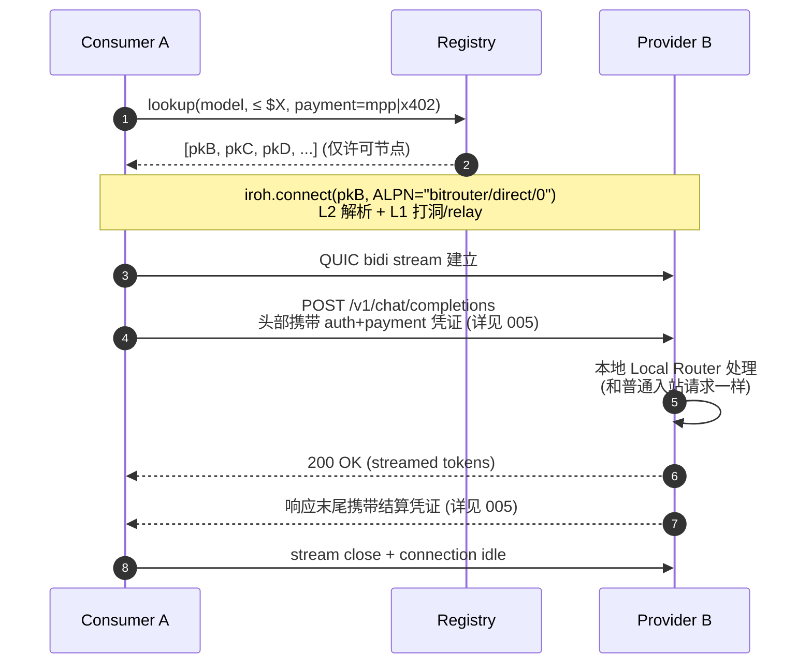
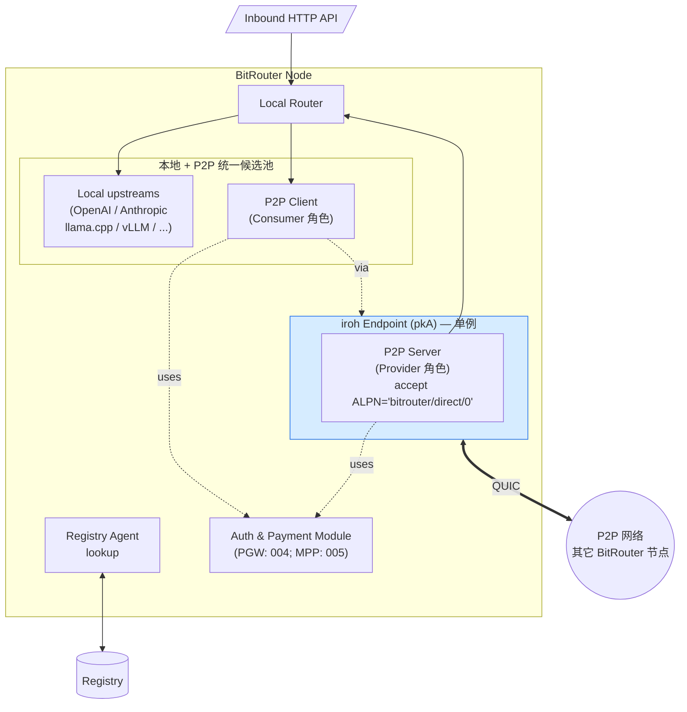

# P2P Intelligence Router — 概念性设计 v0.5

> 状态：**概念设计 — v0.5**。本文只做概念与拓扑层面的勾勒；协议细节见 002 / 003 / 004 / 005 / 006。所有跨文档术语 / 中英文 / 代码命名对照见 [`001-02-terms.md`](./001-02-terms.md)；协议版本、编码、签名约定见 [`001-03-protocol-conventions.md`](./001-03-protocol-conventions.md)；数据格式与请求响应示例见 [`001-04-api-reference-examples.md`](./001-04-api-reference-examples.md)。
>
> 变更（v0.4 → v0.5）：与 [`003 §2.1`](./003-l3-design.md) 两层身份模型对齐——Provider 条目主键改为 `provider_id`（ed25519 root pubkey），下挂 `endpoints[]` 数组（每条含 iroh `endpoint_id`）。L1/L2 中"`EndpointID`"是 iroh 原词，不变；L3 协议层"被许可身份"统一称 `provider_id`/`pgw_id`。
>
> 版本演进：
> - v0.1：单层拓扑。**已废**——假设了全网发现 + 公网直连。
> - v0.2：拆成 L1/L2/L3 三层，传输层引入 [iroh](https://github.com/n0-computer/iroh) 的「按公钥拨号 + 打洞 + relay」。
> - v0.3：明确 v0 范围为 **中心化 Registry + 许可制 Provider**。
> - v0.4：本地 upstream 与 P2P 候选合并为统一路由池；v0 全网统一按 token 计价。
> - **v0.5（当前）**：与 003 L3 设计对齐——v0 Registry 退化为 **git 仓库 + HTTPS 只读服务**，不再有 Provider 自助 announce / 签名公告；支付网关角色独立到 004，MPP 绑定独立到 005。自建 relay 已在 002 落地。

## ==0. v0 范围收敛（TL;DR）==

- **Registry 中心化**，由 BitRouter 团队运营。
- **Provider 必须由 Registry 许可**才能出现在网络中；非许可的 `provider_id` 即使技术上可拨号，也不会被 Consumer 发现。
- **Consumer 开放**，任何 BitRouter 节点都可以查 Registry 和发起请求。
- **信任模型**：Provider 是半可信的——Registry 通过准入审核为它们背书，v0 不做链上信誉或作恶证明。
- **下一阶段目标**（不在 v0 内）：Registry 去中心化（iroh-gossip / DHT）、Provider 无许可加入、链上信誉。

## 1. 背景

BitRouter 目前已经能作为**本地路由节点**运行：它在本地聚合多个上游 API（OpenAI / Anthropic / 本地模型等），按策略把一次推理请求路由到最合适的上游。

今天世界上有很多零散的、已经跑起来的 BitRouter 节点：

- 开发者自己机器上挂着 Claude / GPT 订阅额度的节点；
- 小团队部署的、带有某些地区独占 API Key 的节点；
- 跑本地模型（llama.cpp、vLLM）的节点，有空闲 GPU；
- 自建了 fine-tuned 模型的节点。

**P2P Intelligence Router 要做的事**：把这些节点拼成一张网络，让一个节点在本地没有合适上游时，**向网络里的其他节点付费购买一次推理**，付费用稳定币（MPP / x402，含 MPP-on-Stripe）点对点完成。

一句话：**BitRouter 是单机路由器，P2P Intelligence Router 是把这些路由器连成的互联网**。

## 2. 设计原则（v0）

1. **节点对等（技术层）**：同一份 BitRouter 二进制既能当 Consumer 也能当 Provider；v0 仅"Provider 角色"受许可。
2. **本地与 P2P 等价比较**：本地静态配置的 upstream 和 Registry 中的 P2P Provider 作为**同一个候选池**参与 Local Router 的路由决策——按相同的策略（模型、价格、延迟等）打分，不预设"本地优先"。
3. **公钥即身份**：节点以 Ed25519 公钥（`EndpointID`）为唯一身份，与 IP / 域名 / 端口解耦。
4. ==**按需短连**：Consumer 不维护全网连接；选中 Provider 时才按公钥拨号建立 QUIC 连接。==
5. **两层分离**：能力发现（谁卖什么、多少钱）和节点可达性（公钥 → 可达地址）是**两套不同的服务**。
6. **付费即协议**：请求 + 付款走统一的 HTTP 语义（PGW 角色见 004，MPP 绑定见 005）。
7. **许可制先行**：v0 靠 Registry 的准入审核换取"不用做信誉/抗女巫/作恶检测"的简单性。

### 2.1 ==许可制消掉了哪些未决问题==

因为 v0 的 Provider 集合是**已知、可信、可联系到的**，以下问题当场退化或消失：

| 问题                 | v0 处理                                    |
| ------------------ | ---------------------------------------- |
| 抗女巫 / 海量假 Provider | 由准入流程处理，协议不管                             |
| Provider 作恶（收钱不兑现） | Registry 可离线仲裁 + 下架；v0 不做链上证明            |
| Provider 信誉排序      | v0 不做；Consumer 可简单按价格选                   |
| Registry 防滥用公告     | 只有被许可的 pk 才能发布公告                         |
| 身份和支付地址的绑定         | 入驻时登记，Registry 条目权威                      |
| 计价单位的分歧            | v0 **统一按 token 计价**（见 §3.3）；schema 保留扩展位 |
| ALPN / 协议版本协调      | 中心化协调，需要时统一升级                            |

## 3. 三层模型

把网络拆成三层，每层各自可独立演进：



**L1 + L2 直接吃 iroh**，我们只自己设计 **L3**，以及跑在 L1 之上的应用层请求-付款协议。

### 3.1 L1 — Transport（iroh）

- 每个 BitRouter 节点持有一对 Ed25519 密钥，公钥即 `EndpointID`。
- Consumer 不需要知道 Provider 的 IP / 端口，调 `endpoint.connect(endpoint_id, ALPN)` 即可（`endpoint_id` = iroh `EndpointId`；与协议层 `provider_id`/`pgw_id` 的两层关系详见 [`003 §2.1`](./003-l3-design.md)）。
- iroh 先尝试 UDP 打洞直连，失败就走公共 relay，自动挑最快路径。
- 得到的是一条标准 QUIC 连接，双向多路复用流 + 端到端加密。

这一层**我们不重新发明**。

### 3.2 L2 — Endpoint Discovery（iroh 自带）

- 把 `EndpointID` 解析成当前的 relay URL + 直连候选地址，由 iroh 的 DNS/pkarr 发现服务负责。
- 对我们上层透明：拨号时传入一个 `EndpointAddr{ id, addrs: ∅ }`，iroh 自己去查、自己去重试。
- 应用数据库里**只存 `EndpointID`** 就够了，具体地址是易变的，不要缓存。

### 3.3 ==L3 — Capability Registry（许可制目录）==

v0 Registry 同时承担三个职责：

1. **准入审核**：线下/线上流程审批 Provider 节点。审批通过后把它写进 git 仓库里的 Provider 名册（`provider_id` / 当前 `endpoints[]` / 报价；两层身份模型详见 [`003 §2.1`](./003-l3-design.md)）。
2. **能力目录**：名册本身就是能力目录——每个 Provider 条目静态声明它支持的模型与报价。
3. **发现入口**：Consumer 以 HTTP 查询候选 Provider 列表（Registry 服务把 git 仓库索引到内存供查询）。

Registry 回答的核心问题：

> 我要一个能跑 `claude-3.5-sonnet`、每百万 input token 报价 ≤ $X、接受 MPP 付款的 **被许可** Provider，给我一批候选的 `provider_id`（及其当前 `endpoints[]`）。

它**不**回答「怎么连上某个 endpoint」——那是 L2 的事。

Provider 条目的概念形态（v0 字段详见 [`003 §2.2`](./003-l3-design.md) snapshot schema）：

```jsonc
{
  "provider_id": "ed25519:<root pubkey>",       // 长期身份；签整份 snapshot
  "endpoints": [                                  // 一个或多个实例（多区域横向扩容详见 006）
    { "endpoint_id": "ed25519:<...>", "region": "geo:us-east-1", "node_addr": {...} }
  ],
  "status": "active" | "suspended" | "retired",
  "models": [
    {
      "name": "claude-3.5-sonnet",
      "context_window": 200000,
      "max_output_tokens": 8192,
      "tokenizer": "anthropic-claude-3",
      "pricing": [                              // 平铺 PaymentRequirements 列表，权威定义见 004-02 §3.2
        {
          "scheme":   "token",
          "rates":    { "input_per_mtok": "3.00", "output_per_mtok": "15.00" },
          "protocol": "mpp",
          "method":   "tempo",
          "currency": "0x20c0000000000000000000000000000000000000",
          "method_details": { "chain_id": 4217 },
          "intent":   "session"
        }
      ]
    }
    // 未来示例（v0 不实现，schema 预留）：
    // pricing 中追加 { "scheme": "request", "rates": {"per_request": "0.02"}, ... } 等 entry
  ],
  "payout": { "evm": "0x…" }                  // 占位；与 auth 一同细化
}
```

v0 Registry 的形态：

- **git 仓库 + 简单 HTTPS 只读服务**。team 维护的 `bitrouter-registry` 仓库里一个 Provider 一个文件；变更走 PR + review + commit；HTTPS 服务拉 git、做内存索引、对外只读。
- **无自助 announce / 无数据库 / 无 admin API**。所有准入、挂起、下架、改价都是 git 变更。
- ==**未登记的 `provider_id` 不进入查询结果**——这就是"许可制"在协议层的体现。==

**v0 计价模型（重要决策）：全网统一按 token 计价。**

- Registry **只接受** `scheme: "token"` + `intent: "session"` 的 entry 用于 LLM token-based 模型；具体校验规则见 [`004-02 §3.5`](./004-02-payment-protocol.md)。
- 即使 Provider 的**底层实际成本**是订阅制（Claude Max / ChatGPT Plus）、包月、本地 GPU 电费，它在网络中仍必须折算成 token 单价对外报价。"把真实成本换算成 token 单价"是 Provider 自己的定价责任与风险。
- 这样 Consumer 侧的价格比较、结算、争议都以唯一尺度（token）进行，可直接和 OpenAI / Anthropic 等官方定价对齐；Local Router 也能用同一把尺子比较本地 upstream 和 P2P 候选（见 §2 原则 2）。
- Schema 的 `pricing` 是一个**平铺的 PaymentRequirements 列表**，每条 entry 由 `(scheme, protocol, method, intent, currency, method_details, recipient, rates)` 等字段组成（type-first Rust + serde，权威定义在 [`004-02 §3.2`](./004-02-payment-protocol.md)），刻意为 `request` / `duration` / `bandwidth` 等未来 scheme 与 mpp 之外的协议预留扩展位，v0 先只用 `(token, mpp, tempo, session)` 一条。

v1 / 后续演进路径（不在本稿展开）：

- 放开准入 → 需要反女巫 + 信誉系统；
- Provider 自助 announce + 签名公告（脱离 git PR 的延迟）；
- 去中心化 Registry → **iroh-gossip** topic 广播公告 / DHT key=EndpointID；
- Registry 退化为引导节点列表，不再是权威。

## 4. 网络拓扑（概念图）



说明：

- **实线** = 控制面（Registry 查询）；**双线** = 业务数据面（QUIC 请求 + 付款）；**虚线** = 与 relay 的常驻心跳（home relay 维持）、以及 Provider 准入所需的 git 变更（非实时）。
- **Registry 只承载查询，不承载请求流量**（控制面 vs 数据面完全分离）；权威状态在 git 仓库。
- **Consumer ↔ Provider 之间是点对点 QUIC**，iroh 自动选择直连（打洞）还是 relay 数据面。
- **Consumer 只需要知道 `pkB`**。Provider 换了网络、换了机器、换了 home relay，对 Consumer 是透明的。
- **每个节点只在"正在使用"的少数几个对端上保持活跃连接**，不存在"连到全网节点"这回事。

## 5. 一次请求的生命周期

以 Consumer A 调 `POST /v1/chat/completions`、本地无合适上游为例：

1. **本地决策**：A 的 Local Router 在**本地 upstream + Registry 候选**组成的统一候选池中做路由；本次决策选中了一个 P2P Provider（而非某个本地 upstream）。
2. **能力查询**：A 向 Registry 查询 `model + 价格上限 + 支付方式`，得到**被许可**的候选 `provider_id` 列表（含 `endpoints[]`）。
3. **选择**：A 按自己的策略（v0：最便宜的、或上次成功过的）选中 Provider B 的 `pkB`。
4. **拨号**：A 调 `endpoint.connect(pkB, ALPN="bitrouter/direct/0")`。iroh 在后台完成打洞/relay，返回 QUIC 连接。
5. **请求 + 付款**：A 在一条 bidi stream 上发起 HTTP 请求，头部携带鉴权与支付凭证（具体绑定见 005）。
6. **兑现**：B 验证支付后，把请求交给自己的 Local Router 当成普通入站请求处理，结果流式返回 A；响应末尾携带结算凭证（见 005）。
7. **回源**：A 把结果按正常响应返回给上层 Agent / 应用，上层调用方**对 P2P 无感**。
8. **争议兜底（v0 带外）**：==若 Consumer 遇到"收钱没兑现 / 模型谎报 / 严重降级"等情况，通过 BitRouter 团队的申诉通道上报；Registry 有权挂起或下架该 Provider。v0 不做协议层退款。==



## 6. 与现有 BitRouter 的集成

P2P 层**不是新进程**，而是 BitRouter 节点内的模块：



- **iroh Endpoint** 全进程一个实例，所有出/入 P2P 连接共享它，得到最优网络行为。
- **P2P Client** = Consumer 角色：查 Registry → 拨号 → 发请求 + 付款。
- **P2P Server** = Provider 角色：accept 后把请求交给本地 Local Router，**走的就是本地原本的路由管线**。Provider 不需要为 P2P 单独维护上游通道——它卖的就是"自己那台 BitRouter 能做的事"。
- **Registry Agent**：v0 仅 Consumer 角色使用（查 Registry 并缓存）；Provider 角色 v0 不做主动 announce——进入 git 仓库即注册完成。
- **Auth & Payment Module**：生成 / 校验鉴权与支付凭证，PGW 角色见 004、MPP 绑定见 005。

## 7. v0 明确不做的事

- ❌ 无许可 Provider 加入（v1+ 再谈）
- ❌ 链上 / 协议层信誉、评分、黑名单（v0 用 Registry 运营后台做挂起/下架）
- ❌ 抗女巫、Provider 作恶的密码学证明
- ❌ 可验证推理（zkML 等）
- ❌ 多 Provider 竞价 / 拍卖撮合
- ❌ 请求中继、洋葱路由、隐私路由
- ❌ 网络级负载均衡与容量规划
- ❌ 去中心化 Registry（iroh-gossip / DHT 留待 v1）
- ❌ 协议层退款 / escrow（v0 靠 Registry 带外申诉；详见 005）

## 8. 开放问题

许可制 + 中心化 Registry 已经消掉一批未决问题（见 §2.1）。剩下仍需讨论的（详细列表见 003 §11 / 004 / 005）：

1. **Provider 准入流程**：线上申请表 vs 线下合同？需要 KYC 吗？提现地址验证？（偏运营，不在本文展开，但要立项。）
2. **Consumer 选路策略的默认打分函数**：价格 + 上次成功率 + 延迟？是否暴露 policy hook 给用户？
3. **Provider 的 token 计数口径**：用哪家 tokenizer？不同模型的 tokenizer 差异如何登记？Consumer 如何核验 Provider 报的 token 数不虚高？
4. **Registry 仓库公开 vs 私有**、commit 权限、JSON Schema 冻结版本——见 003 §11。
5. **支付与鉴权协议绑定 / 流式结算语义**——分别在 004-01（PGW 角色）、004-02（支付协议集成与 pricing schema）、005（MPP wire-level 绑定）讨论。

## 9. 下一步

- [x] 确定 v0 的"许可制 + 中心化 Registry"范围。
- [x] L1+L2 原型跑通（见 002）。
- [x] L3 详细设计（见 003）。
- [x] 004-01：支付网关（PGW）角色定义。
- [x] 004-02：支付协议集成（intent 选择 + Registry pricing schema）。
- [x] 005：MPP 在 BitRouter 中的 wire-level 绑定 + PGW 网络费规范。
- [ ] 006：auth 模式（计划）。
- [ ] `bitrouter-registry` 仓库 + Registry HTTPS 只读服务上线。
- [ ] Provider 准入流程（运营侧）跑通至少 1 个真实 Provider。
- [ ] "两台 BitRouter（一台 Provider 已登记）+ 一个 Registry + 一次付费请求"的端到端原型（happy path）。
