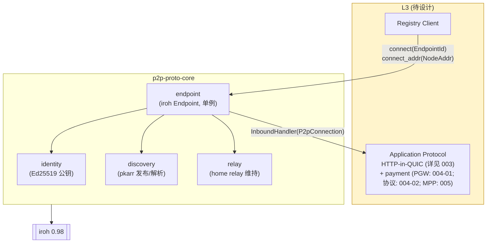
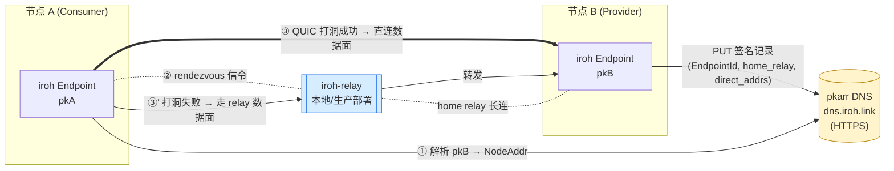

# P2P Intelligence Router — L1+L2 拓扑验证原型

> 状态：**PoC 已实现并跑通 — v0.2**。本文记录实现要点、关键决策与真实环境实验结果，作为后续 L3 设计与正式集成的事实基础。
>
> 变更（v0.1 → v0.2）：补充与 [`003 §2.1`](./003-l3-design.md) 两层身份模型的关系说明（见 §1.x 末尾"两层身份与本 PoC 的对应"）。本 PoC 代码与脚本不需要任何变更——它就是两层身份的"退化形态"。
>
> 前置阅读：[`001-01-overview.md`](./001-01-overview.md) v0.5。
>
> 代码仓库：[bitrouter/bitrouter-p2p-proto](https://github.com/bitrouter/bitrouter-p2p-proto)（私有）。

## 0.x 两层身份与本 PoC 的对应（重要）

[`003 §2.1`](./003-l3-design.md) 引入了两层身份：
- `provider_id` / `pgw_id`（ed25519 root pubkey，签 Registry snapshot）
- `endpoint_id`（iroh `EndpointId`，per-instance 热密钥，做 QUIC 拨号）

**本 PoC 是该模型的退化形态**：单节点单进程，root 与 instance 是同一把 Ed25519 密钥，等价于 `provider_id == endpoint_id`。L1/L2 代码（`P2pNode` / `P2pConnection` / identity 等）都只看到 `EndpointId`——这是 iroh 原语，无需变更。

后续从 PoC 演化到生产时：
- 每个 Provider/PGW 实体保留一把**冷 root key**（=`provider_id`/`pgw_id`），离线托管，仅用来签 Registry snapshot 与密钥轮换；
- 每个进程实例继续用一把**热 EndpointId**（= iroh 端的 `endpoint_id`），由 root snapshot 中的 `endpoints[]` 列表授权；
- L1/L2 行为零变化；变化只在 L3 Registry/snapshot 层。横向扩容（多实例 / 多区域）详见 [`006`](./006-horizontal-scaling.md)。

## 0. TL;DR

- 独立仓库 `bitrouter-p2p-proto`，Rust workspace，与主仓零耦合。
- L1 = iroh `Endpoint`（QUIC + 打洞 + relay 回退），L2 = iroh DNS+pkarr（n0 公共基础设施）。
- ALPN 固定 `bitrouter/direct/0`；身份 = Ed25519 公钥 (`EndpointId`)，私钥本地持久化。
- **Relay 已切换到自托管** `iroh-relay --dev`（本地 :3340）；公共 n0 canary relay 仅作为可选回退保留。
- 验证结论：双节点 echo 在 in-process / 同主机双进程下稳定跑通；自托管 relay 路径下握手延迟 ≈1 ms（公共 relay 下 ≈1 s）。

## 1. 实现成果

### 1.1 仓库结构

```
bitrouter-p2p-proto/
├── crates/
│   ├── p2p-proto-core/   # library: P2pNode, P2pConnection, identity, config, error
│   └── p2p-proto-cli/    # binary `p2p-proto`: id / serve / ping / echo / reset-key
├── experiments/
│   ├── two_process_local.sh         # 公共 n0 relay 跑通脚本
│   ├── two_process_local_relay.sh   # 本地自托管 relay 跑通脚本
│   └── NOTES.md                     # 真实网络实验记录
├── README.md
└── .github/workflows/ci.yml         # fmt + clippy -D warnings + test
```

依赖钉死 `iroh = "=0.98.0"`，CI 跑 `cargo fmt --check && cargo clippy -D warnings && cargo test`。

### 1.2 库 API（实际形态）

```rust
pub struct P2pNode { /* 持有 iroh::Endpoint + Router */ }

impl P2pNode {
    pub async fn start(cfg: P2pConfig) -> Result<Self>;
    pub fn endpoint_id(&self) -> EndpointId;
    pub fn home_relay(&self) -> Option<RelayUrl>;
    pub fn direct_addrs(&self) -> Vec<SocketAddr>;
    pub async fn online(&self) -> Result<()>;          // 等待 home relay 就绪
    pub async fn connect(&self, peer: EndpointId) -> Result<P2pConnection>;
    pub async fn connect_addr(&self, addr: NodeAddr) -> Result<P2pConnection>;  // 跳过 pkarr
    pub fn set_inbound_handler(&self, handler: Arc<dyn InboundHandler>);
    pub async fn shutdown(self) -> Result<()>;
}
```

设计原则与原方案一致：不暴露 ALPN，不暴露 `EndpointAddr`（除 `connect_addr` 外）；
入站连接通过 ALPN 路由到注册的 handler。

### 1.3 与原方案的关键差异

| 项 | 原计划 | 实际实现 | 原因 |
|---|---|---|---|
| Relay 默认值 | n0 公共 relay | **自托管 `iroh-relay --dev` 本地 :3340**；公共 relay 仅可选 | 公共 relay 引入 ~1s 握手延迟且生产不稳定 |
| 拨号路径 | 仅按 `EndpointId` | 增加 `connect_addr(NodeAddr)` 与 CLI `--addr-file` | pkarr 冷启动竞态导致首次拨号经常超时；addr-file 是确定性 bootstrap |
| `serve` 行为 | 直接绑定即返回 | 默认 `--wait-ready` 等待 `online()` 后再印 ready blob，并加 `--pkarr-warmup-ms`（默认 2000） | pkarr 发布需要传播时间，不等会让对端首次拨号失败 |
| `echo` 重试 | 一次性 | 加 `--retry N`（默认 0，pkarr 路径建议 ≥3） | 对应 pkarr 冷启动竞态 |
| Metrics exporter | Prometheus :9100 | 暂未实现 | 当前 PoC 用 `tracing` 日志已经足够诊断；待 L3 集成时再补 |
| `doctor` 子命令 | 计划提供 | 未实现 | 用上游 `iroh-doctor` 即可，无需重复 |
| `--json` 输出 | 开放问题 | 未加 | 现有人类可读输出已能满足脚本（addr-file 本身就是 JSON） |

其余决策（ALPN 命名、身份持久化、单 Endpoint 单例、relay 配置三态、不开 mDNS/DHT、connect 30s 硬超时…）均按原方案落地。

## 2. 真实网络实验结果

完整记录见仓库 `experiments/NOTES.md`。摘要：

### 2.1 In-process（CI）

- `tests/two_nodes.rs`：同进程两个 `P2pNode`，relay disabled，`connect_addr` 直连。
- 100% 通过，~毫秒级握手。CI 必跑。

### 2.2 同主机双进程，n0 canary relay（Round 1）

| 拨号方式 | 成功率 | 握手延迟 | 备注 |
|---|---|---|---|
| `--addr-file`（携带 LAN direct addr） | 4/4 | 1–2 ms | 同 LAN 自动打洞成功 |
| `--peer + --retry 3`（pkarr） | 3/3 | ≈1 s | 第一次往往要等 pkarr 传播 |

**根因**：pkarr 冷启动竞态 + 公共 relay 高 RTT。修复：`serve` 加 `--pkarr-warmup-ms`，`echo` 加 `--retry`，新增 `--addr-file` 确定性路径。提交 `f769b15`。

### 2.3 同主机双进程，自托管本地 relay（Round 2）

```
cargo install iroh-relay --version =0.98.0 --features server --bin iroh-relay
iroh-relay --dev   # HTTP :3340, metrics :9090
./experiments/two_process_local_relay.sh
```

| dial | wall time | `connected_in_ms` |
|---|---|---|
| 1 | 1049 ms | 1 |
| 2 | 112 ms  | 0 |
| 3 | 111 ms  | 0 |
| 4 | 111 ms  | 0 |

握手延迟从 round 1 的 ~1 s 降到 ~1 ms。Wall time 主要被 CLI 冷启动主导。提交 `b35cddc`。

注意：同主机仍会打洞到 LAN direct，所以这条数据反映的是 "本地 relay rendezvous + LAN direct 数据面"，不是纯 relay 数据中转。强制走 relay 数据面（屏蔽 `direct_addrs`）作为后续实验。

### 2.4 跨真机 / 公网 NAT 矩阵

**尚未跑**。原计划的家宽-家宽 / 家宽-云 VM / 移动热点-云 VM 需要部署 production relay 后再做。见 §4。

## 3. 失败模式（已观察到的）

| 场景 | 表现 | 处理 |
|---|---|---|
| pkarr 冷启动竞态 | 第一次按 `EndpointId` 拨号 8s 超时 | `--pkarr-warmup-ms` + `--retry` 已缓解；`--addr-file` 完全规避 |
| 公共 relay 抖动 | 偶发握手 >2s 或失败 | 切自托管 relay 后消失 |
| 对称 NAT（"varies by destination"） | 打洞失败，强制走 relay 数据面 | 设计预期；relay 自身 RTT 即决定一切 |
| `home_relay` 切换 | 未观测异常 | 未刻意制造，留待生产环境观察 |

## 4. 后续工作

按优先级排：

1. **生产 relay 部署**：选 hosting（Hetzner / DO / Fly），域名 `relay.bitrouter.ai`，`cert_mode = "LetsEncrypt"`，开 QUIC address discovery（:7824），metrics scrape，可选 bearer-token 鉴权（`IROH_RELAY_HTTP_BEARER_TOKEN`）只允许许可 provider 使用。
2. **跨真机实验矩阵**：基于生产 relay 跑家宽-家宽 / 家宽-云 / 移动-云组合，记录 path_type 分布与握手 RTT。
3. **强制 relay 数据面实验**：`addr-file` 屏蔽 `direct_addrs`，测纯 relay 中转吞吐与延迟。
4. **pkarr 自托管或绕过**：v0 registry 直接发 canonical `NodeAddr`（含 home_relay），可以完全跳过 pkarr，让 L2 退化为"按 registry 数据拨号"。这与 001 / 003 的 v0 中心化 registry 决策天然契合。
5. **Metrics exporter**：等 L3 接入时一起做，目前 `tracing` 足够。
6. **正式集成**：决定是把 `p2p-proto-core` 作为 crate 让 BitRouter 主仓 `cargo add`，还是迁移代码进主仓重构。

## 5. 与 L3 的交接面 + 运行时拓扑



两端节点建立连接时的真实拓扑：



关键路径（数字序号对应上图）：

1. **L2 解析**：A 把 `pkB` 拿到 pkarr DNS 解析出 `NodeAddr { home_relay, direct_addrs }`。若用 `connect_addr(addr)` 直接传入（如 PoC 的 `--addr-file` 路径或 v0 registry 下发 canonical NodeAddr），可跳过 pkarr。
2. **Rendezvous**：A 通过 B 的 home relay 发打洞信令；双端在 relay 里交换候选公网地址。
3. **数据面**：
   - **优先打洞成功 → 直接 UDP/QUIC 直连**（绝大多数 NAT 组合可达），relay 只参与了几包信令，之后完全 bypass。
   - **打洞失败（对称 NAT 等）**→ 数据面全程走 relay 转发，RTT 受限于 relay 位置与 client-relay 链路。

**契约**（PoC 已落实）：

- `connect()` / `connect_addr()` 成功返回的 `P2pConnection` 保证 ALPN 一致 + 远端公钥 QUIC TLS 校验通过；`remote()` 密码学可信。
- 入站 `InboundHandler::handle(conn)` 同保证。
- L1 不做业务级身份准入——"是否被 Registry 许可" 完全是 L3 的判断。
