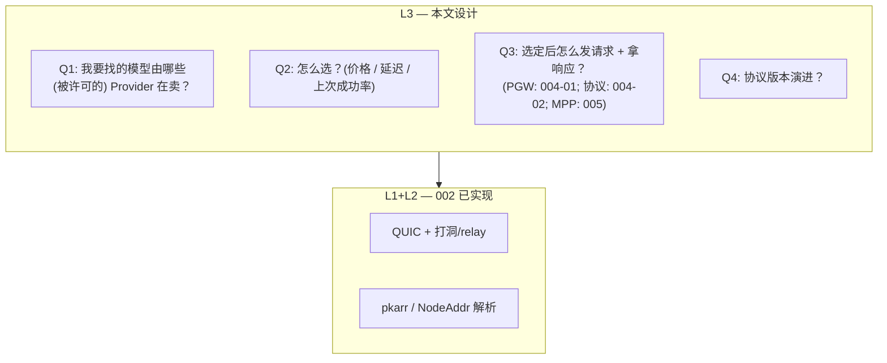
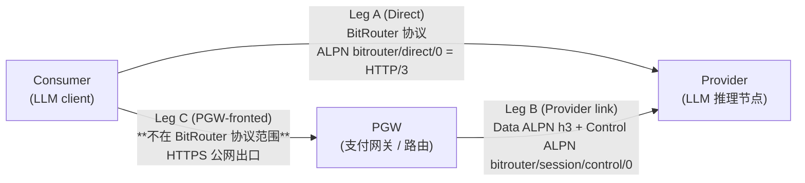
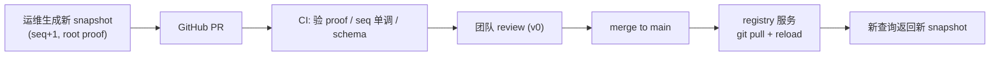
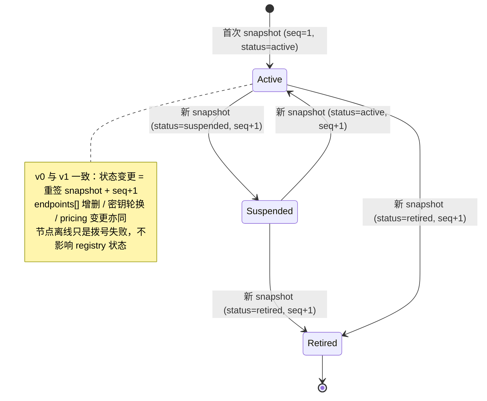
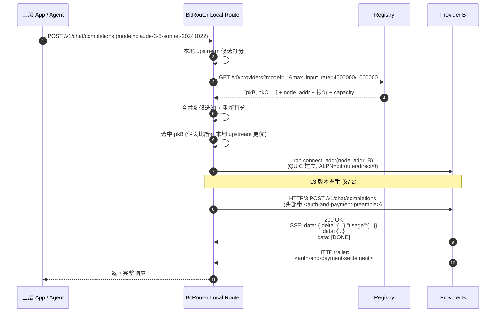
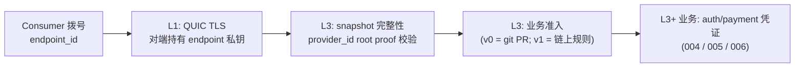
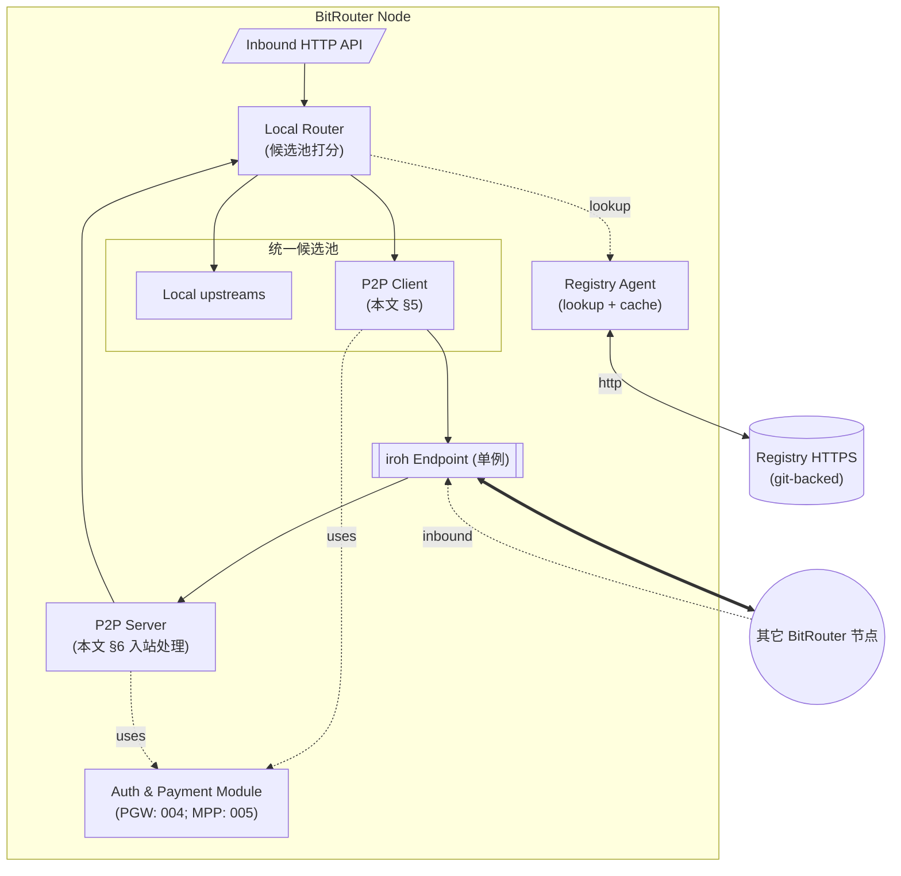

# L3 — Capability Registry + 应用层协议（v0 详细设计）

> 状态：**初版详细设计**。基于 [`001-01-overview.md`](./001-01-overview.md) v0.4 的概念设计与 [`002-l1-l2-mvp.md`](./002-l1-l2-mvp.md) 的 L1/L2 PoC 结论。
>
> 本文落地的是：v0 中心化 Registry 的数据模型 + HTTP API、Provider 生命周期、Consumer 查询/选路、跑在 L1 QUIC 之上的请求-应答应用协议、协议版本协商。
>
> **变更历史**：
>
> - **v0.5**：引入==**两层身份模型**==——`provider_id` / `pgw_id` (ed25519 root pubkey) ⊕ `endpoint_id` (iroh `EndpointId`)；Registry 数据模型重构为"**root-key 签名的 snapshot**"（§2.2 / §8）；新增 §8.4 "v1+ 去中心化路线（A/B/C/D 四个方向）"；显式排除"事件流"架构（§8.1）；删除"v1 self-service announce"历史包袱。002 prototype MVP 视为 `provider_id == endpoint_id` 的退化情形（§2.1）。
>
> **不**在本文展开（独立立项）：
> - **支付协议（MPP / x402）的具体绑定与流式结算语义**——见 004 / 005。本文把支付当成抽象的业务行为。
> - Registry 运维 / Provider 准入流程的运营细节（KYC、申诉、合同）。
> - L3 → L4（多 Provider 拍卖、可验证推理等）。
> - v1 去中心化方向的具体实现（§8.4 仅列方向）。

## 0. TL;DR

- **L3 = 控制面（Registry，静态 git 仓库 + HTTPS 只读 API）+ 数据面应用协议（HTTP-in-QUIC，支付/auth 占位）**，两者完全解耦。
- ==**两层身份**==：`provider_id` / `pgw_id` 是 ed25519 **root pubkey**（"是谁"，长期身份）；`endpoint_id` 是 iroh `EndpointId`（"哪个进程"，可多实例并存）。Registry 主键 = `provider_id`；每个 provider 条目内挂一个 `endpoints[]` 数组列出其物理实例。详见 §2.1。
- Registry v0：**Provider 名册是一份签入 git 仓库的 signed snapshot 集合**——每个 provider 一份 root key proof 覆盖的 snapshot，原子替换、自包含、可离线验证。==**v0 中心化 Registry 的语义 = "未上线合约的物化视图"==**；任何 client 都不依赖 Registry 服务的可信性，仅依赖 root proof。详见 §8。
- 应用协议：在 ALPN `bitrouter/direct/0` 的 QUIC connection 上跑 **HTTP/3**。每个请求是一条 HTTP/3 request stream。
- L3 协议版本通过 HTTP 头协商，与 ALPN 解耦——L1 不感知。
- 计费：v0 全网统一 per-token（即 `scheme: "token"`）。本文只定到"Provider 在 snapshot 中声明每模型的 pricing[] 列表"为止；==**完整 pricing schema（含 protocol / method / intent / method_details 等字段、type-first Rust + serde 定义）见 [`004-02 §3.2`](./004-02-payment-protocol.md)；wire-level 预付/结算/退款见 [`005`](005-l3-payment.md)；auth 见 006。**==
- 信任：snapshot 由 `provider_id` root key proof 覆盖 → 任何节点离线可验。v0 把 git 仓库当 KV 存储，v1+ 把同一 snapshot 模式搬到链上（§8.4）。

## 1. 范围

### 1.1 在 L1/L2 之上 L3 要回答的问题



### 1.2 范围内

- Registry 数据模型与 HTTP 只读服务形状。
- Provider 生命周期（git PR → active → suspend / retire）。
- Consumer 查询、选路、拨号、发请求、收响应。
- 应用层协议选型（HTTP/3 over QUIC）。
- L3 协议版本协商。
- 计价口径声明（单价由 Provider 在 git 上声明）。

### 1.3 范围外（v0 不做）

- **支付角色与网关定义 → [`004-01-payment-gateway.md`](./004-01-payment-gateway.md)；支付协议集成（intent 选择、pricing schema、协商规则） → [`004-02-payment-protocol.md`](./004-02-payment-protocol.md)；MPP 绑定与结算具体规范 → [`005-l3-payment.md`](005-l3-payment.md)；auth 模式 → 后续 006 文档**。本文把它们当抽象槽位。
- Registry 去中心化具体实现（v1+ 上链或 commit-on-chain，方向见 §8.4；v0 用中心化 git 仓库**模拟未来合约存储的语义**）。
- 自定义事件流 / 增量更新协议——v0 与 v1 都遵守"snapshot 是状态机原子单元"（§8.1）的硬约束。
- 多 Provider 拍卖 / 撮合 / 转售。
- 抗女巫 / 信誉 / 评分。
- 可验证推理 (zkML)。
- 隐私路由 / 洋葱路由。
- 跨模型路由（A 调 GPT，但 B 用 Claude 兑现）——v0 严格按 `model` 字符串匹配。

## 1.4 协议三段 leg 分层

==**v0.7（R11 决议）起，BitRouter 端到端协议显式拆为三段 leg**==——后续所有协议字段、ALPN、错误语义、支付绑定都按本表归位。



| Leg | 端到端 | 协议归属 | 主文档 |
|---|---|---|---|
| **Leg A** | Consumer ↔ Provider（Pure P2P 直连） | ==BitRouter 协议范围内==；ALPN `bitrouter/direct/0` 上承载 HTTP/3（§6.1）；MPP wire 见 [`005`](./005-l3-payment.md) | 005 |
| **Leg B** | PGW ↔ Provider（PGW 路径上的内部一跳） | ==BitRouter 协议范围内==；==dual-connection 拓扑==——**Data Connection** 走标准 ALPN `h3` (HTTP/3) 承载 LLM 流；**Control Connection** 走 ALPN `bitrouter/session/control/0` 承载长度前缀 JCS-JSON 支付控制帧（**非** WebSocket）；详见 [`004-03`](./004-03-pgw-provider-link.md) | 004-03 |
| **Leg C** | Consumer ↔ PGW（PGW 对公网的入口） | ==**不在 BitRouter 协议范围**==——这是 PGW 自己暴露的公开 HTTPS API（OpenAI 兼容、x402 / MPP 等），由 PGW 各自实现并对外公布；BitRouter 协议**不**约束 ALPN / 头 / 错误码 | 各 PGW 实现自描述 |

==**重要边界**==：

- Leg A 与 Leg B **不**复用同一 ALPN——历史上 `bitrouter/direct/0` 曾被理解为通用 P2P，v0.7 起明确**仅**用于 Leg A。Leg B 的 Data Connection 切到 IETF 标准 `h3` ALPN，避免 BitRouter "假装" HTTP/3 的兼容性问题。
- Leg B 的 Control Connection 与 Data Connection **必须是两条独立 QUIC connection**：Data Connection 使用 ALPN `h3`，Control Connection 使用 ALPN `bitrouter/session/control/0`。二者绑定到同一对 (PGW endpoint, Provider endpoint) 与同一长期 BR-internal payment channel，但不能在同一 QUIC connection 内复用 stream。
- Leg C 的存在意味着 PGW 对外可以是任何 HTTP API 实现（包括与 BitRouter 协议无关的传统订阅 / 月费）；但只要 PGW 在内部把请求转发到 Provider，Leg B 必须遵守 BitRouter 协议。
- ==支付分层==：Leg A 上 Consumer 出示 MPP credential（其中 Tempo 路径的 voucher 走 EIP-712，详见 [`004-02 §4`](./004-02-payment-protocol.md) / R9）；Leg B 上 PGW 与 Provider 之间维护一条**独立**的 BR-internal payment channel，voucher 走 BitRouter ed25519 签名（**链下 only**，不上链；PGW 通过 EIP-712 把 collateral 锁在 Tempo 上是另一条独立动作）。

后续章节默认按 Leg 维度组织协议字段——若某约束跨 leg 适用，会显式标注 "Leg A & B" 等。

---

## 2. Registry 数据模型

v0 Registry 是 git 仓库里一份手工维护的"snapshot 集合"。==**关键不变量**==：每个 Provider 一份**原子 snapshot**——由该 Provider 的 ed25519 **root key** 签名、自包含、可离线验证。任何字段变更 = 生成新 snapshot + 递增 `seq` + 重新签名（无字段级 partial update，无事件流）。这一约束在 v0 与 v1 完全一致——v0 把 git 仓库当成"未上线合约的存储后端"；v1 把同一份 snapshot 直接搬到链上或 commit-on-chain（§8.4）。

### 2.1 两层身份模型

| 层 | 字段 | 类型 | 角色 |
|---|---|---|---|
| **Identity（冷）** | `provider_id` / `pgw_id` | ed25519 root pubkey | "是谁"——长期身份；签 snapshot；写入 BitRouter 协议 / 支付凭证 / receipt |
| **Instance（热）** | `endpoint_id` | iroh `EndpointId`（亦为 ed25519） | "哪个进程"——QUIC 拨号的对象；可同时多个；可轮换 |

==**provider_id 永不复用、永不重新分配**==（即使 retire 也作废，避免支付路由错人）。`endpoint_id` 是 provider 在 snapshot 内自行声明的"当前可拨号实例"集合，可随业务自由增删（横向扩容、密钥轮换、地域调整）。详见 [`006 横向扩容`](./006-horizontal-scaling.md)。

> ==**与 002 prototype MVP 的兼容性**==：002 实现的 `p2p-proto-core` 只知道单一 `EndpointId`，不感知 `provider_id`。在新模型下这是"`provider_id == endpoint_id` 的退化情形"——单实例 Provider 无横向扩容、无密钥轮换；之后引入 root key 不需要修改 L1/L2 任何 API。

### 2.2 Provider snapshot

```jsonc
{
  "type": "bitrouter/registry/node/0",
  "payload": {
    // —— 身份 ——
    "provider_id": "ed25519:<base58btc>",       // root pubkey；主键；永不变更
    "node_id": "ed25519:<base58btc>",
    "operator_id": "<内部运营者标识>",            // 仅备注
    "status": "active",
    "admitted_at": "2026-04-01",

    // —— 状态机版本（替代事件流）——
    "seq": 42,                                  // 单调递增；每次 snapshot 替换 +1
    "valid_until": "2026-07-01T00:00:00Z",

    // —— 实例集（可多实例并存）——
    "endpoints": [
      {
        "endpoint_id": "ed25519:<base58btc>",
        "region": "geo:ap-east-1",
        "node_addr": {
          "home_relay": "https://relay.bitrouter.ai/",
          "direct_addrs": ["1.2.3.4:41234"]
        },
        "capacity": { "concurrent_requests": 4 },
        "alpn": "bitrouter/direct/0",
        "min_l3_version": 0,
        "max_l3_version": 0,
        "added_at": "2026-04-01"
      }
    ],
    "models": [
      {
        "name": "claude-3-5-sonnet-20241022",
        "context_window": 200000,
        "max_output_tokens": 8192,
        "tokenizer": "anthropic-claude-3",
        "pricing": [
          {
            "scheme": "token",
            "rates": {
              "input": { "numerator": "3000000", "denominator": "1000000" },
              "output": { "numerator": "15000000", "denominator": "1000000" }
            },
            "protocol": "mpp",
            "method": "tempo",
            "currency": "0x20c0000000000000000000000000000000000000",
            "method_details": { "chain_id": 4217 },
            "intent": "session",
            "min_increment": "1"
          }
        ]
      }
    ],
    "accepted_pgws": { /* see 004-03 §3.1 */ }
  },
  "proofs": [
    {
      "protected": {
        "type": "bitrouter/proof/ed25519-jcs/0",
        "payload_type": "bitrouter/registry/node/0",
        "signer": "ed25519:<base58btc>",
        "payload_hash": "sha256:<base58btc>"
      },
      "signature": "<base58btc>"
    }
  ]
}
```

**Schema 设计原则**：

- ==**snapshot 是 Registry 状态机的原子单元**==——不允许字段级 partial update。任意变更都是"完整新 snapshot + `seq+1` + root key 重签"。这条规则使 v0/v1 共用同一存储语义（git KV ↔ 合约 storage）。
- **proof 覆盖整个 payload**——`endpoints[]` 的真实性、pricing 真实性、accepted_pgws 真实性都派生自 root proof，==**不需要每个 endpoint 单独委托签名**==。
- **每个 `models[]` 元素自带 `pricing`**——同 v0 之前的设计；不再拆 `models` / `pricing` 两个并行列表。
- ==**`pricing` 是平铺的 PaymentRequirements 列表**==——权威定义见 [`004-02 §3.2`](./004-02-payment-protocol.md)（type-first Rust + serde schema，复用 [`mpp` crate](https://github.com/tempoxyz/mpp-rs) 类型）。本文示例只展示 v0 实际公告的"token + mpp + tempo + session" 一条。
- ==**Token-based LLM API 强制 `intent: "session"`**==（004-02 §2.1）；其他 scheme（request / duration）允许 `charge`。
- **endpoint-level `payment` / `payout.stripe` 字段已废弃**——支付方式由每个 model 的 `pricing[]` 自描述。
- `model.name` **不做 alias**——`claude-3-5-sonnet` 和 `claude-3-5-sonnet-20241022` 是两个不同的模型。
- 所有时间戳 RFC 3339（UTC）。所有结算金额使用 TIP-20 base units 的整数字符串；报价/费率使用 [`004-02`](./004-02-payment-protocol.md) 定义的 rational 形态。

### 2.3 仓库布局（v0）

```
bitrouter-registry/        (独立 git repo，团队私有；模拟"未上线合约存储")
├── README.md              # 准入流程、PR review checklist
├── known-models.json      # 团队维护的"已知模型名"白名单
├── providers/
│   ├── <provider_id>.json # 一个 Provider 一份 snapshot；文件名 = root pubkey
│   └── ...
├── pgws/                  # 同上，每个 PGW 一份 snapshot（详见 004-01）
└── schema.json            # JSON Schema，PR CI 校验
```

==**v0 CI 只做"未来合约会做的检查"**==（不引入额外业务逻辑）：

1. JSON Schema lint。
2. ==`proofs[]` 验证==（root key 按 [`001-03`](./001-03-protocol-conventions.md) 签 JCS payload）。
3. ==`seq` 严格单调递增==（同 `provider_id` 下，新 snapshot 的 `seq` 必须 > 旧 snapshot 的 `seq`）——模拟合约 `require(new_seq > old_seq)`。
4. `valid_until` 在合理窗口内（不过远、不过近）。
5. `pricing[]` 每条 entry 通过 [`004-02 §3.5`](./004-02-payment-protocol.md) 的全部规则。
6. ==**Provider 准入 / 准退**== 由 git commit 权限本身代理（v0 中心化）；v1 由链上治理或自由准入决定。

> 这种"CI = 合约的物化模拟"刻意避免任何 v0-only 的字段或事件类型——v1 上链时 v0 数据可直接迁移。

### 2.4 Registry 服务侧索引

服务启动时把所有 `providers/*.json` / `pgws/*.json` 加载进内存（每个文件 = 一份 snapshot），按 `provider_id` / `pgw_id` 建主键索引；按 `model.name` / `region` 建二级索引：

| 索引 key | value |
|---|---|
| `provider_id` | 完整 snapshot |
| `pgw_id` | 完整 snapshot |
| `model.name` | 含该 model 且 `status=active` 的 provider_id 列表 |
| `(model.name, region)` | 同上 + 按 endpoint region 过滤后的子列表 |

变更通过 `git pull` + 热加载（或重启进程）。无 DB。

## 3. Registry HTTP 服务

Base URL: `https://registry.bitrouter.ai`（示意）。**只读**。无认证。所有响应 JSON，全部从 git 仓库构建的内存索引产生。

> ==**HTTP 服务本身不可信**==——所有下发的 snapshot 都带 root key `proofs[]`，调用方应离线用 `provider_id` / `pgw_id` 验证。该服务在 v0 仅作"分发与索引便利层"；v1 上链后被链上 RPC + 链下 cache 取代（§8.4）。

### 3.1 列表 / 过滤

```http
GET /v0/providers?model=<name>&protocol=<mpp>&method=<tempo|stripe|...>&intent=<session|charge>&currency=<token-addr-or-iso4217>&region=<geo-tag>&max_input_rate=<rational>&max_output_rate=<rational>&limit=20
```

返回（**每条 = 一份完整 snapshot**）：

```jsonc
{
  "providers": [
    { /* 完整 snapshot，schema 见 §2.2，含 proofs[] */ }
  ],
  "as_of": "2026-04-18T11:30:00Z",              // 服务进程加载 git 时间
  "git_rev": "<commit sha>"                     // 便于排查；v1 替换为合约 block height / tx
}
```

设计要点：

- ==**始终下发完整 signed envelope**==（含 `proofs[]`）——上层可独立验。Registry 服务无需被信任。
- 默认按总价升序；过滤参数仅起"减小返回集"作用，不强制选谁。
- `region` 过滤是对 `endpoints[].region` 的过滤；服务侧返回的 snapshot 仍带原始全部 `endpoints[]`（避免破坏 proof 校验），由 Consumer 在客户端按 region 选实例。
- 限速：匿名 IP 60 req/min。

### 3.2 单条查询

```http
GET /v0/providers/{provider_id}
GET /v0/pgws/{pgw_id}
```

返回完整 snapshot（含 `proofs[]`）。Consumer 拨号失败后用来确认 `endpoints[]` / `seq` 是否变更。

### 3.3 仓库变更如何生效



- 自动化：merge → webhook → 服务 `git pull` + 原地 reload。
- 紧急下架：生成 `status: "suspended"` 的新 snapshot（**root key 必须生成有效 proof**）+ PR。==root key 离线时无法下架——这是协议级折衷==（v1 直接照搬：合约 require root proof）。
- v1 切换：把"PR + merge"换成"提交链上交易"，CI 检查改成合约校验；snapshot 内容、proof 算法、`seq` 语义不变。

### 3.4 高可用

- 多副本无状态服务，前置 CDN 缓存 GET（短 TTL ~30s）。
- 控制面挂 ≠ 数据面挂——已建立的 QUIC 连接可继续；新拨号会失败 → 降级到本地 upstream。
- SLA 目标：99.5%（v0），监控公开。

## 4. Provider 生命周期



**关键不变量**：

- ==`provider_id` 一旦登记，永不复用、永不重新分配==。即使 retire，root pubkey 也作废——避免支付路由到错的人。
- `endpoint_id` **可自由增删**——通过新发一份 snapshot（`endpoints[]` 改写）即可生效；这是横向扩容、密钥轮换的工作模式（详见 [`006`](./006-horizontal-scaling.md)）。

## 5. Consumer 路径

完整链路：



> 鉴权与支付的具体绑定（凭证字段、错误码、退款语义、流式结算等）见 **[`005-l3-payment.md`](005-l3-payment.md)**（PGW 角色定义见 [`004-01-payment-gateway.md`](./004-01-payment-gateway.md)；支付协议与 pricing schema 见 [`004-02-payment-protocol.md`](./004-02-payment-protocol.md)；auth 模式后续 006 文档）。本文只在请求/响应里**预留两个抽象槽位**：
> - **请求**首部携带 `<auth-and-payment-preamble>`（一个或多个 HTTP 头），Provider 在路由前校验。
> - **响应**末尾携带 `<auth-and-payment-settlement>`（==HTTP trailer==，或经轮询端点拉取；不在 SSE body 里插自定义事件，以保证 OpenAI/Anthropic 兼容客户端无需改造），Consumer 用来对账。具体头名与 fallback 端点见 005 §2.5。

### 5.1 候选池合并（与 001 §2 原则 2 对齐）

Local Router 把"本地 upstream"和"Registry 返回的 P2P 候选"放进同一个候选池打分：

```
score = w_price · price_per_1k_tokens
      + w_latency · expected_latency_p50
      + w_reliability · (1 - last_24h_success_rate)
      + w_locality · is_local              // P2P=0, 本地=1，权重默认为 0
```

权重默认 `(price=1.0, latency=0.0, reliability=0.5, locality=0.0)`，即"按价格 + 历史成功率"选；用户可以在 BitRouter 配置里覆盖。**默认不预设本地优先**——这正是 001 v0.4 的修正决策。

### 5.2 拨号策略

==**先选 endpoint 再拨号**==。Local Router 拿到 Provider snapshot 后：

1. 在 `endpoints[]` 中按客户端 region affinity / capacity / 上次失败回退顺序挑一个 `endpoint_id`。
2. 首选：snapshot 内带的 `endpoint.node_addr` → `connect_addr()` 直拨。零 pkarr 依赖。
3. 失败回退：`connect(endpoint_id)` 走 pkarr（如果该 endpoint 同时发布到 pkarr）。
4. 同 provider 内换下一个 endpoint；全部失败再回候选池剔除该 provider。
5. 超时：30 秒（沿用 002）。

> 横向扩容场景下的 region 评分细节见 [`006 §2.4`](./006-horizontal-scaling.md)。

### 5.3 连接复用

- v0：每个 `(endpoint_id)` 一条 QUIC 连接，连接内多 stream 复用并发请求。
- 空闲 60 秒关闭。
- 不做连接预热；按需建立。
- 跨同 `provider_id` 不同 `endpoint_id` 不复用——iroh QUIC 连接绑定到具体公钥。

## 6. 应用层协议（QUIC 之上）

### 6.1 Framing：HTTP/3 in QUIC（ALPN `bitrouter/direct/0` 重定义）

==**v0.7（R2 决议）起的协议级决策**==：ALPN `bitrouter/direct/0` **重定义**为承载**标准 HTTP/3** 的 BitRouter 命名空间——不再使用 "HTTP/1.1 在裸 QUIC bidi stream 上跑" 的早期方案。每个 P2P 请求 = 一条 HTTP/3 request stream（QPACK 头压缩、HEADERS / DATA frame、SETTINGS、CONTROL stream、push 禁用），对端按完整 HTTP/3 协议栈处理（[RFC 9114](https://www.rfc-editor.org/rfc/rfc9114)）。

==**关键设计要点**==：

- **单一 ALPN**：`bitrouter/direct/0` 是 Leg A 的**唯一** ALPN；Leg B 用 `h3` + `bitrouter/session/control/0`（详见 §1.4 / [`004-03`](./004-03-pgw-provider-link.md)）。
- **HTTP/3 = wire**：节点实现层**直接复用** [`hyper`](https://hyper.rs/) / [`h3`](https://github.com/hyperium/h3) 等成熟 HTTP/3 栈，BitRouter 不重新实现 framing。
- **流式响应**：用 SSE (`text/event-stream`)——HTTP/3 的 DATA frame 透明承载 SSE 字节流；OpenAI / Anthropic 客户端无需改造。
- **L3 版本协商**：仍走应用层 HTTP 头 `X-Bitrouter-L3-Version`（§7.2），与 ALPN / HTTP/3 解耦。
- **不引入 BitRouter 自有 frame 类型**：HEADERS / DATA / SETTINGS 完全沿用 HTTP/3，Server Push 显式禁用。

==**与 v0.6 决策的差异**==：v0.6 曾选择在裸 QUIC bidi stream 上自带一套请求/响应文本 framing，理由是 "一 stream 一请求"模型简单。v0.7 反转：`hyper`/`h3` 成熟、HTTP/3 已是工业标准，自维护一套类 HTTP framing 的实现成本反而更高；流复用、头压缩、错误语义全部跟随 IETF 标准更易维护。

==**协议错误模型**==：详见本文 [§ 协议错误模型](#协议错误模型) 附录。

### 6.2 兼容性约束

Provider 处理入站 P2P 请求时，**走的就是它本地 BitRouter 已有的 HTTP 处理管线**（001 §6）。这意味着：

- 请求路径、JSON schema 必须与 Provider 节点的 inbound HTTP API 一致。v0 锁定为 **OpenAI 兼容 schema**（BitRouter 主仓已支持）。
- Anthropic / 其它非 OpenAI 模型由 Provider 节点内部做 schema 转换，对 Consumer 看上去都是 OpenAI 格式。

### 6.3 P2P 专用头

在标准 HTTP 头基础上扩一组 `X-Bitrouter-*`：

| 头 | 方向 | 用途 |
|---|---|---|
| `X-Bitrouter-L3-Version` | 双向 | L3 协议版本（首次 stream 必带，§7.2） |
| `X-Bitrouter-Quote-Version` | 双向 | Provider 当前报价版本号；Consumer 带上自己看到的；不一致触发 409（让 Consumer 回 Registry 重新拉） |
| `BitRouter-Request-Id` | P→C 起始 header | UUID，关联 `Payment-Receipt` / 轮询端点 / 错误日志（005） |
| `<auth-and-payment-preamble>` | C→P | **占位**——具体头集合见 005 |
| `<auth-and-payment-settlement>` | P→C HTTP trailer | **占位**——具体格式见 005（trailer 名 `Payment-Receipt`，值为 signed envelope；fallback `GET /v1/payments/receipts/{id}`） |

### 6.4 计价口径

- **Tokenizer 由 Provider 在公告里声明**（`models[].tokenizer`）。
- Consumer 用同一个 tokenizer 自己也能算 input tokens；output 必须信 Provider。
- v0 不强制 Consumer 校验 output token 数；可在客户端做"明显异常告警"（比如 stream 收到的可见字符数与上报 token 数差 10×）。
- 防作弊靠 Registry 申诉通道，不靠协议。

### 6.5 错误处理

==**完整错误模型**==见本文 [§ 协议错误模型](#协议错误模型) 附录（R4）。常见情况速查：

| 状态 | 含义 | body / 头 | Consumer 行为 |
|---|---|---|---|
| `200` + Payment-Receipt trailer | 成功 | OpenAI 兼容 JSON 或 SSE | 正常返回 |
| `402 Payment Required` | 支付 / 鉴权失败 | `WWW-Authenticate: Payment ...`（MPP 多参数 challenge，详见 005 §2 / R8） | 按 challenge 重发付款；非鉴权错误**不**走此通道 |
| `400` / `404` / `409` / `429` / `5xx` | 非支付错误 | `application/vnd.bitrouter.error+json`（`bitrouter/error/0`） | 按 `payload.code` 处理 |
| `409` + `X-Bitrouter-Quote-Version` | 报价版本陈旧 | BitRouter error object + 扩展字段 | 回 Registry 拉新报价、重选 |
| `429 Too Many Requests` | Provider 限流 | BitRouter error object | 退到候选池下一个 |
| `5xx` | Provider 内部错 | BitRouter error object | 候选池下一个；记一次 failure |
| 200 后 SSE 内 `data: {"error": {...}}` + `[DONE]` | 流中途错 | OpenAI v1 错误 schema | 终止流；按 receipt 计已产出 |
| QUIC stream 提前断开 | Provider crash / 网络抖 | — | 按已收到的 SSE 事件可计算实际产出；后续对账由 005 协议处理 |

## 7. L3 协议版本演进

### 7.1 与 ALPN 的关系（重申）

L1 的 ALPN `bitrouter/direct/0` 表达 "这是 Leg A 的 BitRouter HTTP/3 通道"（§6.1），**不**表达 L3 版本。

L3 的版本号在**应用层**协商，与 ALPN 解耦：

- L3 = 0：本文定义的协议。
- L3 = 1+：未来扩展（新付款方式、新错误语义……）。
- 同一节点可同时支持 `min_l3_version..=max_l3_version`，在 Registry 公告里声明。
- ALPN 升级（如 `bitrouter/p2p/1`）保留给"换 wire 协议（如换底层 HTTP 版本）"这种破坏性变更。

### 7.2 协商方式

每条新建的 QUIC bidi stream 上，**第一帧**是 HTTP 请求行之前的一行 ASCII：

```
BITROUTER-L3 0\r\n
```

或在 HTTP 请求头里加 `X-Bitrouter-L3-Version: 0`。**v0 实际采用后者**（更标准、debug 友好），因为只有一个版本，无需协商；更高版本时如果首帧需要更早判断（如换 framing），再切到前者。

Consumer 选 `min(consumer_max, provider_max)` 作为本 stream 协议版本。

### 7.3 升级路径

| 类型 | 例子 | 是否升 L3 版本 |
|---|---|---|
| 加新 HTTP 头（兼容） | 新增 `X-Bitrouter-Region-Hint` | 否 |
| 加新付款方式 | 加 ERC-3009 | 否，扩 `payment` 字段即可 |
| 改 wire（如换 HTTP 版本） | HTTP/3 → HTTP/4 | 是；同步升 ALPN |
| 改 ALPN 底层语义 | datagram 控制信道 | 升 ALPN 到 `bitrouter/p2p/1` |

## 8. 信任模型

L3 信任由四层叠加：



### 8.1 Snapshot = Registry 状态机的原子单元

==**硬约束（v0 与 v1 共享）**==：

1. **原子性**：Registry 中每个 `provider_id` / `pgw_id` 对应一份 snapshot，**不允许字段级 partial update**。任何变更（status、endpoints[]、pricing、accepted_pgws、即使是密钥轮换）都是"完整新 snapshot + `seq+1` + root 重签"。
2. **自包含 + 自验证**：snapshot 内的所有字段（含 `endpoints[]`）都被同一个 root proof 覆盖；任何节点离线即可验，无需信任 Registry 服务。
3. **状态版本由 `seq` 单调表达**：v0 CI / v1 合约都强制 `require(new_seq > old_seq)`——用于回放保护。
4. **哈希算法固定**：`sha256(JCS(payload))`，字符串形式为 `sha256:<base58btc>`——v0 用作 git diff hint / v1 用作 on-chain commitment。
5. ==**不引入"事件流"**==：协议永远不定义 `PUBLISH` / `REVOKE` / `ROTATE` 等事件类型。所有"事件"都是"两份相邻 snapshot 的差异"——由 client 自行 diff 推导。

> 这五条是 v0 ↔ v1 平滑迁移的关键。任何"v0-only 的事件 / partial 字段"都会破坏这条 invariant 并制造历史包袱。

### 8.2 Root key 与轮换

- ==**`provider_id` / `pgw_id` 即 root pubkey**==——长期身份，应离线/HSM 保管。
- 推荐策略（v1 规范化）：snapshot 内嵌 `next_root_pubkey: ed25519:<...>` 字段；下一份 snapshot 由新 root 签名 + 旧 root 联合签名以完成过渡。详见 PKI 行业标准做法（CT log、TUF 等）。
- v0 不强制实现轮换字段——仅在 §11 列为开放问题。
- ==**root key 丢失 = 该 provider_id 永久不可用**==。这是协议级折衷而非 bug——避免"任何热密钥泄漏导致主权变更"。运维责任，不在协议保证范围内。

### 8.3 v0 与"未来合约"的等价映射

| 概念 | v0 实现 | v1+ 链上等价 |
|---|---|---|
| Storage | git 仓库（`providers/<provider_id>.json`） | 合约 `mapping(bytes32 => Snapshot)` 或 commit-on-chain（§8.4 方向 B） |
| 写入授权 | git push 权限 + PR review | tx 由 root key 签名；合约校验 `verify proof signer == provider_id` |
| 单调约束 | CI 校验 `new.seq > old.seq` | 合约 `require(new.seq > old.seq)` |
| 准入门禁 | 团队 review（中心化） | 自由准入 / DAO / 抵押等（治理方向开放） |
| 读取 | HTTPS 只读服务 | 合约 view + 链下 indexer |
| 真相口径 | `git_rev` 定位 | 区块号 / tx hash |

这意味着 ==**v0 的 Registry 是"未上线合约的物化模拟"**==——任何写入侧逻辑（CI 检查）都必须能在合约上原样实现，反之 v0 也不应放过任何合约能拦截的违规。

### 8.4 v1+ 去中心化路线（仅列方向，不指定实现）

可选演进路径（按"协议改动量"递增）：

| 方向 | 描述 | 优势 | 劣势 |
|---|---|---|---|
| **A**：纯链上合约 | 全部 snapshot 数据上链 | 最简单的可验证性；不依赖任何链下系统 | gas 成本 ∝ snapshot 大小；TPS 受限 |
| **B**：commit-on-chain + data-off-chain（==**推荐**==） | 链上仅存 `{provider_id, payload_hash, snapshot_uri, seq, proofs}`；snapshot 体本身放 IPFS / arweave / 任意 S3 | gas 成本恒定；保留可验证性；存储成本可承受 | 需要解决 data availability（snapshot URI 失联问题，可由多镜像缓解） |
| **C**：复用 ENS / pkarr-on-chain | 把 snapshot URI 作为 ENS resolver 字段或 pkarr 的 TXT 记录 | 复用现有 PKI 基础设施 | 受限于这些系统的语义能力 |
| **D**：部署在 L2 / Tempo | 在低 gas 链上跑方向 A 或 B | gas 廉价；与 BitRouter 自身 Tempo 集成天然 | 需要 bridge / 跨链 tooling |

==**任何方向都共享 §8.1 的五条硬约束**==——v0 不引入的字段在 v1 也不会突然出现。本文不在 v0 阶段确定具体方向；v1 立项时另开文档。

### 8.5 业务层 auth / payment

请求/响应内的 auth 与 payment 凭证校验属于第四层（业务层）信任，详见 [`004-01`](./004-01-payment-gateway.md)（PGW 角色）+ [`004-02`](./004-02-payment-protocol.md)（协议集成）+ [`005`](005-l3-payment.md)（MPP 绑定）+ 后续 006（auth）。这一层与 §8.1 的 snapshot 信任根**正交**——例如 PGW 的 capability_grant 也由该 PGW 的 `pgw_id` root key 签名（004-01 §3.1），其语义独立于 snapshot 状态机。

## 9. 与 BitRouter 主仓的集成形态



新增模块：

- **Registry Agent**：on-demand lookup with cache（Consumer 角色）。lookup 结果带 `as_of` + `git_rev`，本地缓存 60 秒。Provider 角色 v0 不需要任何 announce 工作——出现在 git 上即注册完成。
- **Auth & Payment Module**：详见 004-01（PGW 角色）+ 004-02（协议集成）+ 005（MPP 绑定与结算）。本文只承诺它能填出 §6.3 的两个占位槽。
- **P2P Server**：入站 stream 解析 HTTP，转交 Local Router，拿到响应后挂上 settlement 占位。

复用模块：

- **iroh Endpoint**：002 已实现的 `p2p-proto-core::P2pNode`。
- **Local Router**：BitRouter 主仓现有的；只需扩 candidate trait 让 P2P 候选能进。

## 10. 失败与争议（仅 L3 层面）

| 场景 | v0 处理 |
|---|---|
| Registry 不可用 | 已建 connection 不受影响；新拨号失败 → Consumer 降级到本地 upstream。 |
| Provider 在 git 上被 suspend 但 Consumer 缓存还在 | 拨号可能成功但请求被 Provider 自身 fast-fail；Consumer 60s 后强制刷新缓存。 |
| Provider 离线（git 还是 active） | 拨号超时 → 候选池下一个；多次失败后本地短期 backoff。 |
| `git_rev` 跨 Consumer 不一致 | 短期可见——CDN/副本未对齐；接受。 |
| Auth / 支付相关失败 | 见 005。 |

## 11. 开放问题（接 001 §8）

1. **`bitrouter-registry` 仓库公开还是私有？** 公开有透明度收益，私有方便审核未公开 Provider。倾向公开 + 把内部审核痕迹放别处。
2. **谁有 commit 权限**？建议 protected branch + 至少 1 个团队成员 review；同时 CI 强制 root proof 校验（任何条目变更都必须由对应 root key 签）——保证即使 commit 权限被滥用也无法伪造他人 snapshot。
3. **`models[].name` 已知列表（`known-models.json`）**和 Provider 条目同仓库还是分仓库？同仓库简单。
4. **JSON Schema 的字段命名规范**（蛇形 vs 驼峰；`usdc` 单位写在 key 还是 value）。要在第一个 release 之前定死。
5. **Tokenizer 一致性的灰色地带**：同一模型在 OpenAI / Anthropic / 第三方有时 tokenizer 略有差异。v0 简单做法是"按 Provider 声明为准"，但需要在 UI 里告知用户。
6. **P2P 入站请求是否计入 Provider 自己 BitRouter 的本地 quota / rate-limit**：倾向于"是"。
7. **Consumer 把 P2P 请求 fan-out 到多个 Provider 比成本最低**：v0 不做（违背 §1.3 的反拍卖原则）。
8. **`status: active` 但实际节点离线，Registry 是否做主动健康检查**？v0 不做，靠 Consumer 反馈聚合。
9. **Root key 轮换字段（`next_root_pubkey`）是否在 v0 schema 内预留**？倾向"预留 optional 字段"——v0 不实施轮换，但 schema 不阻塞 v1。
10. **Snapshot `valid_until` 到期策略**：到期后 Registry 是否拒绝下发？倾向"到期 = 隐式 suspended"，强制运维定期续签——避免"僵尸条目永久挂着"。
11. **v1 去中心化方向选型**（§8.4 A/B/C/D）：本文不决；v1 立项另开文档。

## 12. 落地顺序

1. **Schema + 仓库布局**（§2.2 + §2.3 + 开放问题 1-4 + 9-10）冻结。
2. **`bitrouter-registry` 仓库**建仓 + CI（JSON Schema lint + root proof 校验 + seq 单调校验）。
3. **Registry HTTPS 服务**单实例上线（拉 git → 内存索引 → 只读 API；下发完整 snapshot 含 proofs[]）。
4. **Provider 准入流程**（运营侧）跑通至少 1 个真实 Provider，落到 git。
5. **`p2p-proto-core` 升级**：暴露 `set_inbound_handler` 给 P2P Server 用；`connect_addr` 已经有了（002）。
6. **BitRouter 主仓扩 Local Router**：让 candidate trait 能装 P2P 候选；接入 Registry Agent；客户端验 root proof。
7. **Auth & Payment Module**：见 004 / 005 落地顺序。
8. **端到端 happy path**：Consumer + Registry + Provider 三方真机跑通一次付费请求（001 §9 末尾的目标）。
9. **生产 relay 部署**（接 002 §4）配合上线。

## 13. 与 002 衔接的具体 API 缺口

为了让 002 的 `p2p-proto-core` 满足本文需要，需要补 / 微调：

| 已有 | 缺 |
|---|---|
| `connect(EndpointId)` | OK |
| `connect_addr(NodeAddr)` | OK，**v0 主路径** |
| `set_inbound_handler` | OK，但 handler 当前只 echo；要换成"开 stream → 解 HTTP → 转 Local Router" |
| `online() / home_relay() / direct_addrs()` | OK，Registry Agent 仅 Consumer 角色用得到（取自身用于诊断/日志） |
| 暂无 | 给 stream 加 `read_http_request` / `write_http_response` 帮手（薄封装 `httparse` + body chunked / SSE） |
| 暂无 | trailer 写 settlement 占位的 helper（HTTP/2+/QUIC 原生支持；HTTP/1.1 走 `TE: trailers`） + receipt 轮询 fallback 端点 |

这些都是应用层封装，不需要碰 iroh 本身。

---

## 协议错误模型（Appendix）

==**v0.7（R4 决议）的统一错误模型**==——本协议范围内所有 wire-level 错误按以下两条分类编排，节点实现层不得引入 BitRouter 自有错误格式之外的第三种约定：

### 1. 支付 / 鉴权类错误 → 402 + MPP

- 触发条件：缺凭据 / 凭据过期 / 余额不足 / 通道未开 / 通道 nonce 反序 / `method_details` 不接受 / `(protocol, method, intent, currency)` 未公告 / receipt 校验失败等。
- HTTP 响应：**`402 Payment Required`** + `WWW-Authenticate: Payment ...`（按 [`005 §2`](./005-l3-payment.md) / R8 的 challenge wire 格式：`id` / `realm` / `method` / `intent` / `request` / `expires` / `digest` / `opaque`）。
- ==同时**禁止**在 body 内塞 RFC 9457 problem+json==——402 永远是 MPP 的语义槽，不与 problem+json 复用。若需要 body 供日志 / 人类阅读，使用 `bitrouter/error/0`，但 verifier / client 仍以 `WWW-Authenticate` 为权威。
- 详细错误代码（如 `protocol_not_offered`、`method_not_offered`、`intent_not_supported_for_scheme`、`currency_not_supported`、`method_details_invalid`、`channel_voucher_invalid`）通过 `WWW-Authenticate` 的 `request` 子对象内的 method-specific error code + 可选 `error_description` 参数表达。

### 2. 非支付类错误 → BitRouter Error Object

- 触发条件：参数缺失 / 模型不存在 / 报价版本陈旧 (`X-Bitrouter-Quote-Version`) / 限流 / 内部错 / 上游模型超时等。
- HTTP 响应：标准 status code（`400` / `404` / `409` / `429` / `5xx`）+ body `Content-Type: application/vnd.bitrouter.error+json`，schema 使用 [`001-03 §4`](./001-03-protocol-conventions.md#4-bitrouter-error-object) 的 `bitrouter/error/0`：

  ```jsonc
  {
    "type": "bitrouter/error/0",
    "payload": {
      "code": "quote.version_mismatch",
      "title": "Quote version mismatch",
      "status": 409,
      "detail": "Provider quote version v=42 does not match consumer-cited v=41.",
      "instance": "/v1/chat/completions#req-01HG...",
      "category": "registry",
      "retriable": true,
      "doc_url": "https://docs.bitrouter.ai/errors/quote.version_mismatch",
      "br_request_id": "01HG..."
    }
  }
  ```

- 节点实现层应当为每个常用错误维护稳定的 `payload.code`（用于客户端 switch / 监控分类）与 `payload.doc_url`（人读文档锚点）；不得把 URL-based `type` 放入 canonical wire。

### 3. SSE 流内错误 → `data: {"error": {...}}` + `[DONE]`

- 触发条件：HTTP/3 已经返回 `200 OK` + 开始 SSE 流，但流中途出错（上游模型断开、Provider 内部异常等）。
- 协议：发送一条 `data: {"error": {"code": "...", "title": "...", "detail": "...", "category": "...", "retriable": true}}\n\n` 帧，紧接 `data: [DONE]\n\n`，关闭 stream。错误 schema 沿用 OpenAI v1 chat completions 的 `error` 子对象外形，但字段与 `bitrouter/error/0.payload` 对齐（详见 [`005 §2`](./005-l3-payment.md) / R3）。
- ==**禁止**在 SSE 流内插入 `event:` 字段==——所有 frame 都是匿名 `data:` 帧，对 OpenAI / Anthropic 兼容客户端透明。

### 4. 跨 leg 适用性

| Leg | 1（402+MPP） | 2（BitRouter error object） | 3（SSE 内） |
|---|---|---|---|
| Leg A（Consumer↔Provider） | ✅ | ✅ | ✅ |
| Leg B Data Connection（PGW↔Provider HTTP/3） | （Provider 不直接面对 Consumer 的支付凭据；Leg B 上的支付凭据校验失败转化为 Control Connection 帧错误） | ✅ | ✅ |
| Session Control Connection（`bitrouter/session/control/0`） | ❌（控制平面用专用 `payment-error` 帧，详见 [`004-03`](./004-03-pgw-provider-link.md)） | ❌ | ❌ |

### 5. 身份字符串编码

本附录与 wire-level 协议中所有"算法-公钥"字符串、Tempo EOA DID、iroh hex 边界等编码细节，按 [`001-02 §8.5`](./001-02-terms.md) 统一规范。
