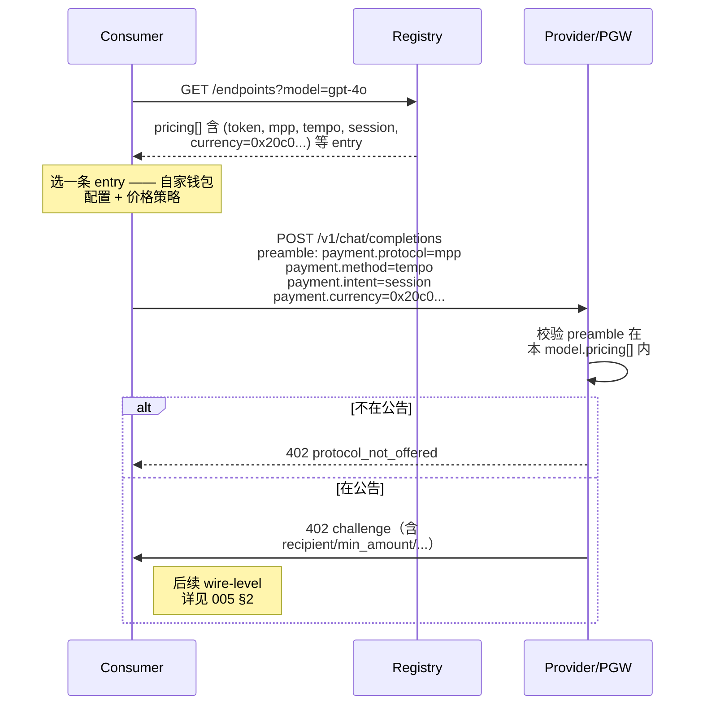

# 004-02 — L3 支付协议集成：Intent 选择与 Pricing Schema

> 状态：**v0.7.2 — snake_case JSON 字段命名补丁**。
>
> 变更（v0.7.1 → v0.7.2）：所有 BitRouter JSON / Registry 字段统一为 `snake_case`。EIP-712 等外部标准字段保留其标准命名。
>
> 变更（v0.7 → v0.7.1）：§3.3 JSON 投影示例顶层主键从 `endpoint_id` 改为 `provider_id`（root pubkey）；与 [`003 §2.1 / §2.2`](./003-l3-design.md) 两层身份模型一致。`pricing[]` 是 provider 级别字段（与 `models[]` 同层），不挂在 endpoint 上。无类型 schema 变更。
>
> 之前版本：**v0.7 — 上游 `mpp` crate 类型对齐版**。本文规范化 BitRouter L3 上 "支付协议如何被表达、协商、绑定到具体 API 调用" 这一层。位于 [`004-01 PGW 角色`](./004-01-payment-gateway.md) 与 [`005 MPP wire-level 绑定`](005-l3-payment.md) 之间。
>
> 关联：[`003-l3-design.md`](./003-l3-design.md) §2.1（Provider 条目 schema）；[`004-01-payment-gateway.md`](./004-01-payment-gateway.md)（PGW 角色与信任模型）；[`005-l3-payment.md`](005-l3-payment.md)（MPP HTTP 头、challenge、`Payment-Receipt`）。

---

## 0. TL;DR

- ==**协议层规范：token-based LLM API 只支持 MPP `session` intent**==。`charge` 等非 session intent 不允许用于 token-based pricing。理由见 §2.1。（注：上游 `mpp` crate v0.10 暂无 `topup` 类型，本文 v0.7 不在 Registry 公告 topup；接入路径见 §8 #11。）
- 其他 API 类型（固定单价的 embeddings / image generation / 按时长的 audio）可以选 `session` 或 `charge`，由 Provider 自由声明（§2.2）。
- ==**新 Registry pricing schema（Rust + serde 类型权威，扁平 PaymentRequirements 风格）**==：`pricing` 是平铺数组，每条 entry 由 4 层 internally-tagged enum 拼成——`Scheme`（计费方案）× `Protocol`（支付协议）× `MppMethod`（MPP 的 method 维度，如 `tempo` / `stripe` / `lightning`）× 该 method 的 `Intent`（如 `session` / `charge`）。每个 variant 只携带自己需要的字段，**消灭 optional + 运行时 if/else** 的反模式。详见 §3.2。
- ==**语义对齐 [MPP 上游](https://mpp.dev/payment-methods/) + BitRouter JSON 字段统一 `snake_case` + 直接复用 [`mpp` Rust crate](https://crates.io/crates/mpp) 上游类型**==：tag 名直接叫 **`method`**（与 MPP `WWW-Authenticate: Payment` 头中的 `method` 参数同名）；每个 method 的 listing 结构沿用 MPP `ChargeRequest` / `SessionRequest` 的字段子集（`currency` + `recipient` + `method_details`），其中 `method_details` 字段**直接复用** `mpp::TempoMethodDetails` / `mpp::StripeMethodDetails` 等上游类型——不重新发明轮子，上游字段格式演化时跟随 `mpp` crate 升级即可。==Schema 内不做"统一抽象"==——既然用了 tagged enum，就不需要跨 method 的字段结构通用性，每个 variant 与上游一致即可。Registry 公告 ↔ MPP wire 的转换只做必要的外部协议适配，详见 §3.7。
- ==**金额单位锁定为 atomic unit 整数字符串**==：链上结算字段（Tempo voucher、top_up、receipt settlement）一律使用 TIP-20 base units 的 JSON string；报价/费率单独用 rational（`{numerator, denominator}`）表达，二者只在结算边界做一次 `ceil` 收敛。**协议层不做任何法币↔稳定币 / 法币↔法币的汇率换算**。
- ==**只公告 MPP 已支持的 (protocol, method, intent)**==——Solana 当前 MPP 实现没有 `session` intent（类型层 `SolanaIntent` 直接没有 `Session` variant），**协议层不预留 placeholder**；token-based LLM API 在 Solana 上完全不可用，Consumer 须切换到 Tempo（v0.7 唯一已 active 的 session method；Lightning 待 v0.9 PGW 启用，详见 §5）。等 MPP 上游加入 Solana session 后，BitRouter 跟随接入并更新本文 §5 状态矩阵（§6）。
- 本规范不影响 PGW 内部结算（PGW↔Provider 怎么对账是 [`004-01 §3`](./004-01-payment-gateway.md) / [`005 §3`](005-l3-payment.md) 的事）；本文只规范 Consumer↔(PGW 或 Provider) 这一跳的协议协商。

---

## 1. 范围

### 1.1 本文回答的问题

1. **协议绑定语义**：一次 LLM API 调用要付钱，Consumer 应该选哪种 (protocol, method, intent, currency) 组合？
2. **Pricing 表达**：Provider 如何在 Registry 公告里声明 "我支持哪些 (protocol, method, intent, currency)"，Consumer 如何选？
3. **API 类型 × Intent 兼容矩阵**：哪些 API 类型必须用哪些 intent，哪些自由选？
4. **未实现 (protocol, method, intent) 的过渡方案**（如 Solana session 上线前）。

### 1.2 范围内

- ✅ Pricing schema 字段定义与校验规则。
- ✅ "API scheme × intent" 兼容矩阵 + 协议层强制约束。
- ✅ Consumer 选择 (protocol, method, intent, currency) 的协议侧规则（先看 Registry → 在 preamble 声明 → Provider 校验）。
- ✅ Solana session 上线前的过渡策略。

### 1.3 范围外

- ❌ MPP wire-level 字段（`Authorization: Payment` 头格式、challenge auth-params、`Payment-Receipt`）——见 [`005`](005-l3-payment.md)。
- ❌ PGW↔Provider 之间的内部结算（custodial 还是链上 channel 还是合约）——见 [`004-01 §4`](./004-01-payment-gateway.md)。
- ❌ Auth / 身份（双密钥 attestation）——见规划中的 006。
- ❌ 非 MPP 支付协议的具体接入（如未来的 x402）——但 schema 留扩展位（§3.4）。

---

## 2. 设计原则：API scheme 决定 intent

### 2.1 Token-based LLM API → 强制 `session`

LLM token-based API（按 input/output token 数计费）的根本特征：

- ==**最终金额事前未知**==——Consumer 发请求时不知道服务器会生成多少 output token。
- ==**流式生成，价格按 chunk 累加**==——服务器边推理边产生成本。
- ==**单次请求金额很小（几分到几十美分）**==——逐请求上链交易费 + 延迟无法接受。

`charge` intent 不适合的具体原因：

| 问题 | 用 `charge` 的后果 |
|---|---|
| 事前未知金额 | Consumer 必须 (a) **预付足额**（按最坏情况 max_tokens 估）后等 server 退余额，多一笔 refund tx；或 (b) Server 拒绝服务直到金额够 |
| 每请求一笔链上 tx | Tempo confirms 几秒、Solana 几百毫秒——叠加在已经几秒的推理上，UX 灾难 |
| Gas / fee 占比 | 链上 fee 可能与 LLM 请求本身一个量级，得不偿失 |
| Refund 复杂度 | server 端要追踪每条请求的实付金额、写 refund 逻辑、应对失败 refund |

`session` intent 天然契合：

- Channel 状态机就是为 "**长期、流式扣费**" 设计——Consumer 开通道时锁一笔押金，每个请求结束 server 给 Consumer 一张签名 voucher（累计扣款），Consumer 也可以反向签确认。
- 通道关闭时（用户主动 / TTL / 单方退出）一次性上链结算最终累计金额。
- 通道生命周期内**任何 API 调用都是链下消息交换**——零 gas、毫秒延迟。
- ==**协议层 1:1**==——一条 session channel 一个收款方（Provider 或 PGW），与 BitRouter "1 session = 1 upstream Provider" 的 sticky 路由设计天然吻合（详见 [`005 §1.5 Invariant 2`](005-l3-payment.md)）。

==**协议层硬约束**==：

> **如果某条 `pricing[]` entry 的 `scheme == "token"`，那么该 entry 的 method-specific `intent` 必须是 `"session"`**（即类型上必须 `match` 到该 method 的 `*Intent::Session` variant）。等价地：`MppMethod::Solana` / `MppMethod::Stripe` 等没有 `Session` variant 的 method **不能与** `Scheme::Token` 共存。
>
> 这一条由 §3.5 #2 CI 校验强制；任何不满足的 Provider 条目应在 PR 阶段被拒绝合并。（注：v0.7 schema 已扁平化为 `pricing[]` 平铺数组，`(scheme, protocol, method, intent)` 全部在 entry 顶层 — 不再有 v0.2 的 `protocols[*].intents[*]` 嵌套结构。）

### 2.2 其他 API scheme 自由选 intent

非 token-based API 的 intent 兼容关系：

| Pricing scheme | 描述 | 推荐 intent | 也允许 intent |
|---|---|---|---|
| `token` | 按 input/output token 数 | `session`（强制） | — |
| `request` | 单次调用固定单价（如 embeddings、image gen） | `session` | `charge` |
| `duration` | 按推理 / 流时长（如 audio transcription、TTS、video） | `session` | `charge`（短时长） |
| `bandwidth` | 按数据量（v1+ 远期场景） | `session` | — |

==**非 token-based API 也推荐 `session`**==——因为 Provider 端可以共用 channel 状态机代码，BitRouter v0.7 节点二进制只需实现一种 server-side intent。`charge` 留作 "Consumer 偶发使用、不想开通道" 的退化路径。

### 2.3 协议层约束不限制 PGW↔Provider 内部结算

本文规范的是 **Consumer↔(PGW 或 Provider)** 这一跳的协议格式与 intent 选择。

PGW 与 Provider 之间怎么结算（custodial 月结、MPP channel、合约托管……）是 PGW↔Provider 的事，**不受本文约束**。例如 PGW 可以对外只暴露 `session` intent，对 Provider 用任意结算方式。详见 [`004-01 §4.2`](./004-01-payment-gateway.md)。

### 2.4 协议层只规定 intent 选择，不规定 asset 优先级

Consumer 选哪条 asset（哪条链上的哪种 token，或哪种法币）是商业决策（gas、稳定币偏好、地区合规、汇率），协议层不强排序。Provider 可在 `pricing[]` 里铺多条 entry，Consumer 自选。

---

## 3. Registry Pricing Schema

### 3.1 schema 演化简记（已废弃版本）

第一版把 `payment_methods` 平摊在 endpoint 上：所有 model 强制共用同一组协议，没有 `(scheme, protocol, method, intent, currency)` 维度。

第二版尝试嵌套 `pricing[].protocols[].intents[]`，把 (protocol, intent) 拎出，但仍把 `currency` 与 `rates` 放在外层、`asset` 放在内层——隐含"USD ↔ 任意 stablecoin 1:1"假设。Provider 公告 EUR / CNY 等非美元法币就要求实时 FX——而 MPP / x402 等成熟协议都不做动态汇率，只表达"付多少某种 asset"。

第三版扁平化为 PaymentRequirements 列表，但仍是"一堆 optional 字段 + 运行时校验"——`min_increment` / `max_session_duration_s` 只对 `intent == "session"` 有效，`recipient_hint` 不能与 fiat 共存等约束都靠 §3.5 规则文字描述。这些约束理应由**类型系统**强制，而不是写在校验器代码里。

第四版重塑为 `Scheme + Protocol(Mpp(MppRequirement))` 两层 tagged enum，把所有 MPP method 共用同一个 `MppRequirement` 结构（`asset` + `intent`）。问题：MPP 的 `card` / `stripe` / `lightning` 等非链上 method **没有 CAIP-19 asset 可以自描述网络**——硬套 CAIP-19 既扭曲语义又丢失 MPP 层公告的关键参数。

第五版（短暂）补回 `network` tag、把 chain 与非 chain method 拆成独立 `*Requirement` struct——但仍**自创**一套字段命名（`network` 而非 MPP 的 `method`、强制 `asset` (CAIP-19) + `recipient_hint` (CAIP-10) 而非 MPP 的 `currency` / `recipient`）。这条路径需要在 Registry schema ↔ MPP wire 之间做一次字段翻译，违背"既然用了 tagged enum 就不必跨 method 通用化"的设计初衷，也徒增上游协议演化时的维护成本。

第六版（短暂）改为 1:1 镜像 MPP 字段命名（tag = `method`、`currency` 用 token 合约 raw hex 等），但仍**自己定义** `*Requirement` struct，其中把 `payment_method_types` / `accepted_networks` 当作 method-listing struct 的 top-level 字段——这与上游 [`mpp` crate](https://github.com/tempoxyz/mpp-rs) v0.10 的实际类型布局**不一致**：上游 `ChargeRequest` / `SessionRequest` 自身只有 `currency` / `recipient` / `description` / `external_id` / `method_details`（method-specific 字段统一收纳进 `method_details: Option<serde_json::Value>`），具体的 `payment_method_types` / `chain_id` / `fee_payer` 等都属于 method-specific 子结构（如 `mpp::StripeMethodDetails` / `mpp::TempoMethodDetails`）。第六版在 wire 上仍要做一次"top-level 平铺 ↔ `method_details` 嵌套"的翻译，与"零拷贝"目标矛盾；也没复用上游已有的 method-specific 类型。

==**v0.7 落定（第七版）：在语义对齐 MPP 字段结构的基础上，直接复用 [`mpp` crate](https://github.com/tempoxyz/mpp-rs) v0.10 的上游类型**==——每个 method 的 listing struct 的字段集合 = 上游 `ChargeRequest` / `SessionRequest` 的 Registry 子集（`currency` + `recipient` + `method_details`），其中 `method_details` 直接复用 `mpp::TempoMethodDetails` / `mpp::StripeMethodDetails` 这些上游已经定义好的类型，避免重复造轮子；BitRouter JSON 投影统一使用 `snake_case`。Registry-side 仍保留 closed `MppMethod` tagged enum 以提供"method × intent 组合在编译期可枚举"的强类型保障（这是 BitRouter 注册表的策略层需求，上游 `mpp::MethodName(String)` 的 open 设计是为了 wire 兼容，两者不冲突）。详见 §3.6 / §3.7。

### 3.2 Type-first schema：Rust + serde 作为权威语法

==**v0.7 起，本协议的 pricing schema 以下列 Rust 类型（搭配 [`serde`](https://serde.rs/) 默认推导）为唯一权威定义。**== JSON / YAML / 其他序列化格式都是这套类型的投影。Registry CI、Local Router、PGW 客户端的实现应当**直接 derive 这些类型**，并在 method-specific 字段处**直接 import [`mpp` crate](https://github.com/tempoxyz/mpp-rs) v0.10 的上游类型**（如 `mpp::TempoMethodDetails` / `mpp::StripeMethodDetails`），而不是各自维护一份 JSON Schema 然后跑跨字段断言。

设计要点：
- 一条 `PricingEntry` 由 `Scheme`（计费方案）+ `Protocol`（支付协议）两个正交 internally-tagged enum 经 `#[serde(flatten)]` 拼到同一层 JSON 对象。
- `Protocol::Mpp(MppMethod)` 内层再展开一层 `MppMethod`——也是 internally-tagged enum，==tag 名为 `"method"`，与 [MPP `WWW-Authenticate: Payment` 头的 `method` 参数](https://mpp.dev/protocol/challenges)同名==。Variant 与 [`mpp` crate v0.10 实际 ship 的 method](https://github.com/tempoxyz/mpp-rs) 一一对应（v0.10 = `tempo` / `stripe`；其他 method 待上游实现，详见 §5）。
- ==**每个 method 的 listing struct 的字段集合 = 上游 `mpp::ChargeRequest` / `mpp::SessionRequest` 字段集合的 Registry 子集**==：`currency` + `recipient` + `method_details`。其中 `method_details` 字段类型**直接是上游 `mpp::TempoMethodDetails` / `mpp::StripeMethodDetails` 等已定义的类型**——不重新发明，不复制粘贴；JSON 投影统一采用 `snake_case`。
- ==**Registry 公告 vs runtime 请求的层次区分**==：Registry 公告的是"长期可用的支付配置"（method、currency、默认 recipient、固定 method-specific 参数），不含每次调用变化的字段（`amount` / `description` / `external_id` 由 challenge 阶段填）。我们把 listing struct 命名为 `*Listing`（区别于上游的 `*Request`），但字段子集与上游严格对齐——发 challenge 时直接 `let req = mpp::ChargeRequest { amount: per_call_amount, currency: listing.currency, recipient: listing.recipient, method_details: listing.method_details.map(serde_json::to_value).transpose()?, .. }` 即可，详见 §3.7。
- 每个 method 内再嵌一个 `Intent` tagged enum（tag 名为 `"intent"`），==**只列出该 method 实际支持的 intent**==。比如 `SolanaIntent` 只有 `Charge` variant、没有 `Session`——这就把"Solana session 暂未实现"这条事实**编进了类型系统**，根本没法构造非法组合。
- 服务端 dispatch 直接 `match entry.protocol { Mpp(method) => match method { Tempo(t) => match t.intent { ... } } }`——零运行时 schema 解析，类型本身就是分发表。
- 设计参考了 [MPP 协议](https://mpp.dev/llms-full.txt) / [`mpp` Rust SDK](https://github.com/tempoxyz/mpp-rs) 的 (method, intent) 形态、[x402 v2 PaymentRequirements](https://github.com/x402-foundation/x402/blob/main/specs/x402-specification-v2.md) 的"network + scheme-tagged variant"模式。

```rust
use serde::{Deserialize, Serialize};

// ==== 直接复用上游 mpp crate 的 method-specific 类型 ====
// Cargo.toml: mpp = { version = "0.10", features = ["tempo", "stripe"] }
// 上游用 cargo feature 门控各 method 的类型；只编译我们实际接的。
use mpp::protocol::methods::tempo::TempoMethodDetails;
use mpp::protocol::methods::stripe::StripeMethodDetails;
// 上游 v0.10 暂未提供 SolanaMethodDetails / LightningMethodDetails / MonadMethodDetails /
// StellarMethodDetails；我们把这些 method 的 listing 标记为 BitRouter 扩展（§3.7 / §5），
// 并在上游补齐后切换到上游类型。

/// 一条完整的 pricing entry，等价于 x402 PaymentRequirements。
/// `(scheme, protocol, method, intent, currency, identity_subset_of_method_details)`
/// 在同一 model 的 pricing[] 内必须唯一。`identity_subset_of_method_details` 的具体字段
/// 由各 method 决定（如 Stripe 的 `network_id`、Tempo 的 `chain_id`），详见 §3.5 #1。
#[derive(Debug, Clone, Serialize, Deserialize)]
pub struct PricingEntry {
    /// 计费方案：决定 `rates` 的形状（token / request / duration / bandwidth）。
    /// internally tagged on `"scheme"`.
    #[serde(flatten)]
    pub scheme: Scheme,

    /// 支付协议：决定剩余字段的形状（mpp / x402 / ...）。
    /// internally tagged on `"protocol"`.
    #[serde(flatten)]
    pub protocol: Protocol,
}

// ─── Scheme: 我们这一层定义的计费方案 ────────────────────────────────

/// `rates` 的内容由 scheme variant 各自定义。
/// 数字单位 = 该 entry 的 method 自己的 native currency；
/// 协议层不做汇率换算。
#[derive(Debug, Clone, Serialize, Deserialize)]
#[serde(tag = "scheme", rename_all = "snake_case")]
pub enum Scheme {
    Token { rates: TokenRates },
    Request { rates: RequestRates },
    Duration { rates: DurationRates },
    Bandwidth { rates: BandwidthRates },
}

#[derive(Debug, Clone, Serialize, Deserialize)]
pub struct TokenRates {
    pub input: RationalRate,
    pub output: RationalRate,
    #[serde(default, skip_serializing_if = "Option::is_none")]
    pub cached_input: Option<RationalRate>,
    #[serde(default, skip_serializing_if = "Option::is_none")]
    pub reasoning: Option<RationalRate>,
}

#[derive(Debug, Clone, Serialize, Deserialize)]
pub struct RequestRates {
    pub per_request: RationalRate,
    /// 模型相关扩展字段（per_image / per_audio_minute / ...），由 model spec 约束。
    #[serde(default, flatten)]
    pub extras: std::collections::BTreeMap<String, RationalRate>,
}

#[derive(Debug, Clone, Serialize, Deserialize)]
pub struct DurationRates { pub per_second: RationalRate }

#[derive(Debug, Clone, Serialize, Deserialize)]
pub struct BandwidthRates { pub per_mb: RationalRate }

#[derive(Debug, Clone, Serialize, Deserialize)]
pub struct RationalRate {
    /// Atomic-unit numerator, serialized as a decimal integer string.
    pub numerator: String,
    /// Non-zero atomic-unit denominator, serialized as a decimal integer string.
    pub denominator: String,
}

// ─── Protocol: 支付协议侧（独立 enum，跟着上游协议结构走）──────────────

#[derive(Debug, Clone, Serialize, Deserialize)]
#[serde(tag = "protocol", rename_all = "snake_case")]
pub enum Protocol {
    Mpp(MppMethod),
    // 未来追加 x402 / 自研协议时直接加 variant，详见 §3.4。
}

/// MPP method 维度——tag 名 `"method"` 与
/// [MPP Challenge 头的 `method` 参数](https://mpp.dev/protocol/challenges)同名。
/// 当前 variant = [`mpp` crate v0.10 ship 的 method](https://github.com/tempoxyz/mpp-rs)
/// 加上 BitRouter 扩展（§3.7 标注）。
///
/// 注：上游 `mpp::MethodName(String)` 是 open 设计（任意 lowercase 字符串），
/// 这里用 closed enum 是 Registry 策略层需求（编译期保证 method×intent 组合可枚举），
/// 与 wire-level open 设计互不冲突——序列化结果就是相同的 lowercase 字符串。
#[derive(Debug, Clone, Serialize, Deserialize)]
#[serde(tag = "method", rename_all = "snake_case")]
pub enum MppMethod {
    /// 上游 ship。直接复用 `mpp::TempoMethodDetails`。
    Tempo(TempoListing),
    /// 上游 ship。直接复用 `mpp::StripeMethodDetails`。
    Stripe(StripeListing),
    /// BitRouter 扩展（上游 v0.10 未 ship Solana method）。
    /// `method_details` 用我们自己定义的 `BitRouterSolanaMethodDetails`；
    /// 待上游 ship 后切换到 `mpp::SolanaMethodDetails` 并删除我们的副本。
    Solana(SolanaListing),
    /// BitRouter 扩展（上游 v0.10 未 ship Lightning）。同上。
    Lightning(LightningListing),
    // Card / Monad / Stellar 等：等上游 ship 对应 method 后再加 variant。
    // v0.7 不包含。
}

// ─── 上游 ship 的 method（method_details 直接复用 mpp 类型）─────────────

/// 字段子集与 `mpp::ChargeRequest` / `mpp::SessionRequest` 严格对齐：
/// 把 `currency` / `recipient` / `method_details` 这三项 Registry 公告需要的字段
/// 拎出来作为 listing；`amount` / `description` / `external_id` 由 challenge 阶段填。
#[derive(Debug, Clone, Serialize, Deserialize)]
pub struct TempoListing {
    /// 对应 `mpp::ChargeRequest::currency` / `SessionRequest::currency`：
    /// TIP-20 token 合约地址，raw hex 字符串（如 `"0x20c0..."` = pathUSD）。
    pub currency: String,
    /// 对应 `mpp::ChargeRequest::recipient`：EOA raw hex。注册表里是公告的"默认收款地址"，
    /// challenge 时可能被覆盖。
    #[serde(default, skip_serializing_if = "Option::is_none")]
    pub recipient: Option<String>,
    /// 对应 wire 上的 `method_details` 嵌套对象——**直接复用上游类型**。
    /// 包含 `chain_id`（`42431` for Tempo Moderato）/ `fee_payer` / `memo` / `splits`。
    #[serde(rename = "method_details", default, skip_serializing_if = "Option::is_none")]
    pub method_details: Option<TempoMethodDetails>,
    #[serde(flatten)]
    pub intent: TempoIntent,
}

#[derive(Debug, Clone, Serialize, Deserialize)]
#[serde(tag = "intent", rename_all = "snake_case")]
pub enum TempoIntent {
    Session {
        #[serde(default, skip_serializing_if = "Option::is_none")]
        min_increment: Option<String>,
        #[serde(default, skip_serializing_if = "Option::is_none")]
        max_session_duration_s: Option<u64>,
    },
    Charge { max_amount: String },
    // `top_up` intent 暂不在 v0.7 Registry 公告——上游 v0.10 没有独立的 TopupRequest 类型，
    // 接入时机参照 §3.7 / §8 #11。
}

#[derive(Debug, Clone, Serialize, Deserialize)]
pub struct StripeListing {
    /// 对应 `mpp::ChargeRequest::currency`：ISO 4217 小写（`"usd"` / `"eur"` / ...）。
    pub currency: String,
    /// 对应 wire 上的 `method_details`——**直接复用** `mpp::StripeMethodDetails`：
    /// `{ network_id: String, payment_method_types: Vec<String>, metadata?: HashMap<...> }`。
    /// `network_id` 是 Stripe Business Network profile ID（必填），
    /// `payment_method_types` 如 `["card", "link"]`。
    #[serde(rename = "method_details")]
    pub method_details: StripeMethodDetails,
    #[serde(flatten)]
    pub intent: StripeIntent,
}
#[derive(Debug, Clone, Serialize, Deserialize)]
#[serde(tag = "intent", rename_all = "snake_case")]
pub enum StripeIntent { Charge { max_amount: String } }

// ─── BitRouter 扩展 method（待上游补齐后迁移到上游类型）────────────────

#[derive(Debug, Clone, Serialize, Deserialize)]
pub struct SolanaListing {
    /// SPL token mint pubkey, base58 字符串。
    pub currency: String,
    #[serde(default, skip_serializing_if = "Option::is_none")]
    pub recipient: Option<String>,    // base58 pubkey
    /// **BitRouter 扩展**——上游 v0.10 没有 SolanaMethodDetails；
    /// 待上游 ship 后改为 `Option<mpp::SolanaMethodDetails>`。
    #[serde(rename = "method_details", default, skip_serializing_if = "Option::is_none")]
    pub method_details: Option<BitRouterSolanaMethodDetails>,
    #[serde(flatten)]
    pub intent: SolanaIntent,
}

/// 占位结构，待上游 `mpp::SolanaMethodDetails` 出台后整体替换。
#[derive(Debug, Clone, Default, Serialize, Deserialize)]
pub struct BitRouterSolanaMethodDetails {
    /// Solana cluster：`"mainnet-beta"` / `"devnet"`，省缺为 mainnet-beta。
    #[serde(default, skip_serializing_if = "Option::is_none")]
    pub cluster: Option<String>,
}

/// ==**Solana 当前 MPP 实现没有 session intent**==——这里只列 Charge。
/// 当上游 `mpp` crate 加入 Solana session 后，本 enum 追加 Session variant 即可；
/// 旧 entry 仍合法，无须节点强制升级。
#[derive(Debug, Clone, Serialize, Deserialize)]
#[serde(tag = "intent", rename_all = "snake_case")]
pub enum SolanaIntent {
    Charge { max_amount: String },
}

#[derive(Debug, Clone, Serialize, Deserialize)]
pub struct LightningListing {
    /// **BitRouter 扩展**——上游 v0.10 没有 LightningMethodDetails；
    /// 待上游 ship 后改为上游类型。Lightning 本身不需要 `currency`（隐式 BTC sats）。
    #[serde(rename = "method_details", default, skip_serializing_if = "Option::is_none")]
    pub method_details: Option<BitRouterLightningMethodDetails>,
    #[serde(flatten)]
    pub intent: LightningIntent,
}

#[derive(Debug, Clone, Default, Serialize, Deserialize)]
pub struct BitRouterLightningMethodDetails {
    /// LN node pubkey hint（可选）。
    #[serde(default, skip_serializing_if = "Option::is_none")]
    pub node_pubkey: Option<String>,
}

#[derive(Debug, Clone, Serialize, Deserialize)]
#[serde(tag = "intent", rename_all = "snake_case")]
pub enum LightningIntent {
    Charge { max_amount_sats: u64 },
    Session {
        #[serde(default, skip_serializing_if = "Option::is_none")]
        min_increment_sats: Option<u64>,
        #[serde(default, skip_serializing_if = "Option::is_none")]
        max_session_duration_s: Option<u64>,
    },
}
```

==**没有 newtype wrapper（`Caip19` / `AccountId` / `Iso4217`）**==——`currency` / `recipient` 等字段就是普通 `String`，与上游 `mpp::ChargeRequest` 字段类型一致；method-specific 字段（如 `chain_id`、`payment_method_types`）通过上游 `mpp::*MethodDetails` 类型携带，类型层面直接复用。值的合法性由 §3.5 CI 规则按 method 分别校验。

**类型层已强制的约束**（Registry CI 完全免写这些规则）：

| 约束 | 由谁强制 |
|---|---|
| `rates` 子结构必须与 `scheme` 匹配 | `Scheme` 是 tagged enum，反序列化失败即拒绝 |
| `min_increment*` / `max_session_duration_s` 只能与 `Session` variant 共存 | 字段挂在各 method 的 `Intent::Session` variant 内部 |
| `max_amount(_sats)` 只能与 `Charge` 共存 | 同上，挂在各自 variant |
| `protocol` 必须是已知协议 | `Protocol` enum 不接受未知 tag |
| `method` 必须是已知 MPP method（v0.7 = `tempo` / `stripe` / `solana` / `lightning`） | `MppMethod` enum 不接受未知 tag |
| 该 method 的 `intent` 必须是该 method 实际支持的子集 | 每个 method 配自己的 `*Intent` enum，未知 tag 直接拒收（如 `Solana + session` 物理上无法构造） |
| `currency` 字段是否存在由 method 决定（`lightning` 没有，其他都有） | 各 *Listing struct 的字段集合不同，反序列化阶段自然分离 |
| `method_details` 子字段（`chain_id` / `payment_method_types` / `network_id` / ...）类型与上游一致 | 直接复用 `mpp::TempoMethodDetails` / `mpp::StripeMethodDetails`，上游 `Deserialize` impl 强制 |
| `recipient` 只在链上 method 出现 | 同上 |


### 3.3 JSON 投影示例

上述 Rust 类型的 JSON 投影（同一个 model 给出四条付款方式，覆盖链上 session、链上 charge、fiat Stripe、Lightning sats）：

```jsonc
{
  "provider_id": "ed25519:<root pubkey>",   // Provider 长期身份，签整份 snapshot；详见 003 §2.1
  "models": [{
    "name": "gpt-4o",
    "pricing": [
      {
        "scheme":   "token",
        "rates": {
          "input":  { "numerator": "5000000",  "denominator": "1000000" },
          "output": { "numerator": "15000000", "denominator": "1000000" }
        },
        "protocol": "mpp",
        "method":   "tempo",
        "currency": "0x20c0000000000000000000000000000000000000",
        "recipient": "0xf39Fd6e51aad88F6F4ce6aB8827279cffFb92266",
        "method_details": {
          "chain_id":  4217,
          "fee_payer": true
        },
        "intent":   "session",
        "min_increment": "1"
      },
      {
        "scheme":   "request",
        "rates":    { "per_request": { "numerator": "50000", "denominator": "1" } },
        "protocol": "mpp",
        "method":   "solana",
        "currency": "EPjFWdd5AufqSSqeM2qN1xzybapC8G4wEGGkZwyTDt1v",
        "method_details": { "cluster": "mainnet-beta" },
        "intent":   "charge",
        "max_amount": "5000000"
      },
      {
        "scheme":   "request",
        "rates":    { "per_request": { "numerator": "60000", "denominator": "1" } },
        "protocol": "mpp",
        "method":   "stripe",
        "currency": "usd",
        "method_details": {
          "network_id": "acct_1AbCdEfGhIjKlMnO",
          "payment_method_types": ["card", "link"]
        },
        "intent":   "charge",
        "max_amount": "10000000"
      },
      {
        "scheme":   "token",
        "rates": {
          "input":  { "numerator": "500",  "denominator": "1000000" },
          "output": { "numerator": "1500", "denominator": "1000000" }
        },
        "protocol": "mpp",
        "method":   "lightning",
        "intent":   "session",
        "min_increment_sats": 1
      }
    ]
  }]
}
```

**说明**：
- 每条 entry 服务端只需 `match entry.protocol { Mpp(MppMethod::Tempo(t)) => ..., Mpp(MppMethod::Stripe(s)) => ..., ... }`，零运行时 schema 解析。
- ==**BitRouter JSON 字段统一 `snake_case`，语义对齐 MPP**==——`method`、`currency`、`recipient`、`method_details` 都对应 [MPP Challenge](https://mpp.dev/protocol/challenges) 的支付语义。`method_details` 内部子字段（`chain_id`、`fee_payer`、`network_id`、`payment_method_types`、...）直接来自上游 [`mpp::TempoMethodDetails`](https://github.com/tempoxyz/mpp-rs/blob/main/src/protocol/methods/tempo/types.rs) / [`mpp::StripeMethodDetails`](https://github.com/tempoxyz/mpp-rs/blob/main/src/protocol/methods/stripe/types.rs)。Registry 公告值进入 MPP wire 前只做必要的外部协议字段适配。
- ==**rates 使用 rational，结算使用 atomic unit**==——Tempo / TIP-20 结算字段全部是 base units 整数字符串；`rates` 允许用 `{numerator, denominator}` 表达小于 1 atomic unit 的业务费率。Provider 直接按目标 method 的 native unit 报价，**协议层不做汇率换算**。
- ==**唯一性**==：同一 model 的 `pricing[]` 内 `(scheme, protocol, method, intent, currency, method_details 中的 identity 子集)` 元组必须唯一。各 method 的"identity 子集"由 §3.5 #1 列出（如 Stripe 的 `method_details.network_id`、Tempo 的 `method_details.chain_id`）。`lightning` 没有 `currency` → 退化。
- ==**没有 `version` 字段**==——MPP 当前是单一活跃 IETF Draft（[`draft-ryan-httpauth-payment`](https://github.com/tempoxyz/mpp-specs)），无语义版本号。`mpp` crate 自己有 SemVer，BitRouter 通过 Cargo.toml 的 `mpp = "0.10"` 跟随。
- ==**没有 `status` / `planned`**==——出现即 active；规划项见 §5 状态矩阵 + changelog。

### 3.4 扩展性：未来接入新协议 / 新 method

**接入新 MPP method**（如 MPP 加入新链或新支付通道）= 给 `MppMethod` enum 加一个 variant + 配套 `*Listing` / `*Intent` 类型，`*Listing` 字段集合沿用 §3.2 的 "currency + recipient + method_details(上游类型) + intent" 模板；旧 entry 仍合法。

**接入新支付协议**（如 x402）= 给 `Protocol` enum 加一个 variant：

```rust
#[derive(Debug, Clone, Serialize, Deserialize)]
#[serde(tag = "protocol", rename_all = "snake_case")]
pub enum Protocol {
    Mpp(MppMethod),
    X402(X402Requirement),                // 新增
}

#[derive(Debug, Clone, Serialize, Deserialize)]
pub struct X402Requirement {
    /// x402 自带 `network` 字段（如 `"base"`、`"base-sepolia"`、`"iotex"`）。
    /// 命名沿用 x402 上游，不强行与 MPP `method` 统一——
    /// 反正分别在 `Mpp` / `X402` 两个 variant 内，靠 `Protocol` enum dispatch。
    pub network: String,
    pub asset: String,                    // x402 上游传裸合约地址，沿用之
    pub pay_to: String,
    #[serde(flatten)]
    pub x402_scheme: X402Scheme,
}

/// 注：x402 自身把它的 `exact` / `upto` variant 命名为 `scheme`，
/// 与本协议的"计费 scheme"重名。在我们的 schema 内**强制重命名**为
/// `x402_scheme` 以消除 tag 冲突；这是 mapping 层的小事。
#[derive(Debug, Clone, Serialize, Deserialize)]
#[serde(tag = "x402_scheme", rename_all = "snake_case")]
pub enum X402Scheme {
    Exact { max_amount_required: String, max_timeout_s: u64 },
    UpTo  { max_amount_required: String, max_timeout_s: u64 },
}
```

Consumer / PGW 看到 `"protocol": "x402"` 直接走 x402 客户端，无需修改 `Scheme` enum——计费维度与支付维度真正解耦；不同协议各自沿用上游字段命名（MPP 用 `method`、x402 用 `network`），靠 `Protocol` enum dispatch 互不冲突。

### 3.5 Registry 校验规则（瘦身版）

类型层已经强制了 §3.2 表中的所有结构约束。Registry CI 只需补充**跨字段语义**与**白名单**两类规则，每条 `pricing[]` entry 逐条执行：

1. ✅ ==**唯一性主键**==：在本 model 的 `pricing[]` 内，`(scheme, protocol, method, intent, currency, identity_subset_of_method_details)` 元组必须唯一。各 method 的 identity 子集如下——这些字段进入主键、其他 `method_details` 字段（如 Tempo 的 `fee_payer` / `memo`）属于"配置"不进主键：
   - `tempo`: `method_details.chain_id`（mainnet `4217` vs testnet `42431` 不同 entry 共存时必须区分）。
   - `stripe`: `method_details.network_id`（不同 Stripe Business Network profile）+ `method_details.payment_method_types`（排序后比较，不同支付通道集合视为不同 offer）。
   - `solana`: `method_details.cluster`（mainnet-beta vs devnet）。
   - `lightning`: 没有 `currency` 也没有 identity 子集 → 退化为 `(scheme, protocol, method=lightning, intent)` 四元组。
2. ✅ ==**Token-only-session 硬约束**==：`Scheme::Token` 只能与具备 `Session` variant 的 method 共存（即类型上必须能 `match` 到 `*Intent::Session`）。这一条是计费策略层约束，不是结构层约束——虽然类型已经把"Solana / Stripe 没有 Session"这一事实编进 enum，但"Token 与 Tempo 的 Charge 同时合法"仍需 CI 显式拒绝。
3. ✅ `Protocol` / `MppMethod` variant 在当前实现的白名单内（v0 仅 `Mpp::{Tempo, Solana, Stripe}` active；其他 method 进白名单时同步扩展 §5 状态矩阵）。
4. ✅ 链上 method 的 `currency` 字段值必须在该 method 的 token 白名单内——比对 [`mpp` crate](https://github.com/tempoxyz/mpp-rs) 上游对该字段的格式要求（Tempo: 长度 42 的 0x hex、token 合约部署在该 `method_details.chain_id` 上；Solana: 32–44 字符 base58、SPL mint）。v0 仅放行 Tempo USDC（`0x20c0...`）、Solana USDC（`EPjFW...`）；待其他 token 公告后扩展。
5. ✅ 链上 method 出现 `recipient` 时：与 `currency` 同 method 的地址格式（Tempo 必须是合法 0x EOA、Solana 必须是合法 base58 pubkey）；这只是格式校验——具体收款地址以 challenge 为准。
6. ✅ 非链上 method 的 `currency` 必须是合法 [ISO 4217 currency code](https://www.iso.org/iso-4217-currency-codes.html) **小写形式**（与 MPP 上游 `"usd"` 等示例一致）；`stripe.method_details.payment_method_types` 必须在 [Stripe 公布的 payment_method_types 集合](https://docs.stripe.com/api/payment_methods/object) 内。
7. ✅ `method_details` 子结构反序列化必须经 `mpp::TempoMethodDetails` / `mpp::StripeMethodDetails`（或对应 BitRouter 扩展类型）通过——这一条由 §3.2 类型本身强制，CI 只需 `serde_json::from_value` 一次即可触发。
8. ✅ `(protocol, method, intent)` 在 §5 实现状态矩阵中存在且为 active。

校验失败 → PR 拒绝合并 → Provider 必须修正后再提。


### 3.6 命名约定：BitRouter JSON snake_case + MPP 语义对齐

==**v0.7.2 起，BitRouter 自定义 JSON / Registry 字段一律使用 `snake_case`；MPP 相关字段保持语义对齐 [MPP 上游](https://mpp.dev/payment-methods/)，method-specific 字段直接复用 [`mpp` crate](https://github.com/tempoxyz/mpp-rs) v0.10 的类型定义**==——`method`、`currency`、`recipient`、`method_details` 都对应 MPP Challenge / `mpp::ChargeRequest` / `SessionRequest` 的支付语义；`method_details` 内部子字段（`chain_id`、`fee_payer`、`network_id`、`payment_method_types`、...）= 上游 `mpp::TempoMethodDetails` / `mpp::StripeMethodDetails` 的字段。Schema 内**不引入 CAIP wrapper**对 MPP 字段做翻译。理由：

- 用了 tagged enum 后，跨 method 的字段结构通用性已经不必要——`MppMethod::Tempo(...)` 与 `MppMethod::Stripe(...)` 在类型上完全不同的 struct，没有"共同 asset 字段"的需求。
- snake_case JSON + 直接复用上游类型让 Registry 公告值可以结构化映射进 MPP wire 头（`WWW-Authenticate: Payment` 的 `request` 对象），减少重复 schema 与 bug 面。
- 上游 `mpp` crate 字段格式演化时，我们只需 `cargo update mpp`，本文 §3.2 中标注 "直接复用" 的字段会自动跟随；只在上游加 method 时才需要给 `MppMethod` enum 加 variant（§3.4 / §3.7）。

| 字段 / 概念 | 来源 | 格式 | 示例 |
|---|---|---|---|
| `method` (tag) | [MPP Challenge `method` 参数](https://mpp.dev/protocol/challenges) / `mpp::MethodName` | `snake_case` lowercase 字符串 | `"tempo"`、`"solana"`、`"stripe"`、`"lightning"` |
| `currency`（链上 method） | `mpp::ChargeRequest::currency` | 该链 native 地址（Tempo: 0x raw hex；Solana: base58 mint） | `"0x20c0000000000000000000000000000000000000"` |
| `currency`（fiat method） | `mpp::ChargeRequest::currency` | ISO 4217 **小写**（与 MPP 一致） | `"usd"`、`"eur"`、`"cny"` |
| `recipient`（链上 method） | `mpp::ChargeRequest::recipient` | 该链 native 地址 | `"0xf39Fd..."`、`"<base58_pubkey>"` |
| `method_details` | `mpp::ChargeRequest::method_details` | method-specific JSON 子对象 | 见下两行 |
| `method_details.chain_id` / `fee_payer` / `memo` / `splits` | `mpp::TempoMethodDetails` | 直接复用上游类型 | `{"chain_id": 4217, "fee_payer": true}` |
| `method_details.network_id` / `payment_method_types` / `metadata` | `mpp::StripeMethodDetails` | 直接复用上游类型 | `{"network_id": "acct_...", "payment_method_types": ["card", "link"]}` |

**CAIP（[CAIP-2](https://chainagnostic.org/CAIPs/caip-2) / [CAIP-10](https://chainagnostic.org/CAIPs/caip-10) / [CAIP-19](https://chainagnostic.org/CAIPs/caip-19)）的使用范围**：仅用于 BitRouter 自己定义、与 MPP 字段无关的链上引用——例如 003 中节点 ID、未来的合约 escrow 地址、跨链 settlement 索引等。本文 §3.2 schema 内的 MPP-aligned 字段**一律不带 CAIP 包装**。

> **为什么这次彻底放弃 CAIP 包装 MPP 字段**：第五版尝试"链上 method 用 CAIP-19 / CAIP-10、非链上 method 用 ISO 4217"，但这要求 Provider / PGW 在 Registry 公告 ↔ MPP wire 之间双向翻译——既增加实现复杂度，也增加上游协议演化时的维护成本。既然 MPP 已经为每个 method 规定了清晰的字段格式且有 `mpp` crate 提供 Rust 类型，`MppMethod` 的 tagged enum 也已经做了 dispatch，再叠一层抽象就是过度工程化。

> **关于链 ID 歧义**（如 Tempo mainnet vs testnet）：上游 `mpp::TempoMethodDetails::chain_id`（wire 上 `method_details.chain_id`）显式编码 chain ID。本协议 Registry 公告也保留此字段，并将其纳入 §3.5 #1 的 uniqueness 主键——不同 chain 的同 token 同 method entry 可在同一 model 共存。

### 3.7 上游 `mpp` crate 类型复用映射

==**v0.7 的设计原则**==：除了 Registry-side 才有的"列表型策略字段"（`max_amount` / `min_increment` 等约束、`MppMethod` 自己作为 closed enum 的策略层 dispatch），其他所有 MPP-side 类型一律 **import 上游而非复制**。

| 用途 | 直接复用的上游类型 | 备注 |
|---|---|---|
| Method 标识符（wire-level） | `mpp::MethodName(String)` | 透明 newtype，lowercase normalized；用作 `mpp::PaymentChallenge::method` 字段 |
| Intent 标识符（wire-level） | `mpp::IntentName(String)` | 同上，用作 `mpp::PaymentChallenge::intent` 字段 |
| Tempo `method_details` 子结构 | `mpp::TempoMethodDetails` | `{ chain_id, fee_payer, memo, splits }` |
| Stripe `method_details` 子结构 | `mpp::StripeMethodDetails` | `{ network_id, payment_method_types, metadata }` |
| Wire-level 请求体 | `mpp::ChargeRequest` / `mpp::SessionRequest` | 在 005 文档（wire-level 绑定）中**直接序列化**这两个上游 struct 进 challenge 的 `request` 字段——本文 §3.2 的 `*Listing` 不在 wire 出现 |
| Challenge / Credential / Receipt | `mpp::PaymentChallenge` / `mpp::PaymentCredential` / `mpp::Receipt` | 完全归 005 文档使用 |
| Canonical JSON 编码包装 | `mpp::Base64UrlJson` | 005 文档用 |

**Registry `*Listing` ↔ wire `*Request` 的转换**（实现侧伪代码）：

```rust
// 把 Registry 公告 + 当次调用的金额，组装成发给 Consumer 的 challenge request：
fn listing_to_charge_request(
    listing: &TempoListing,
    amount_atomic: String,  // 由计费器算出，单位 = 该 token 的最小 atomic unit
) -> mpp::ChargeRequest {
    mpp::ChargeRequest {
        amount:    amount_atomic,
        currency:  listing.currency.clone(),
        recipient: listing.recipient.clone(),
        description:    None,
        external_id:    None,
        // 直接把上游类型 serialize 成 Value 塞进 wire 字段；
        // 字段名 / 子字段格式都已经一致，零翻译。
        method_details: listing.method_details.as_ref()
            .map(|d| serde_json::to_value(d).unwrap()),
        decimals:  None,
    }
}
```

==**当上游 `mpp` crate 加新 method 时**==（如 ship 了 `mpp::SolanaMethodDetails` 或新增 Card method）：

1. 升级 `Cargo.toml`：`mpp = "0.X"`。
2. 把本文 §3.2 中对应 method 的 `BitRouterFooMethodDetails` 占位类型替换为 `mpp::FooMethodDetails`；删除占位定义。
3. 如新增 method：给 `MppMethod` enum 加 variant + 定义对应 `*Listing` + `*Intent` enum，字段集合继续遵循 "currency + recipient + method_details(上游类型) + intent" 的模板。
4. 更新 §5 状态矩阵。
5. 旧 entry 的 JSON 投影**完全不变**（因为字段名已经是 wire 格式），无需迁移。

==**当上游字段格式微调时**==（如 `mpp::TempoMethodDetails` 加字段）：

1. `cargo update mpp`。
2. 重新编译 → serde 派生自动跟随；旧公告中没有新字段 → `Option::is_none` → serialize 时跳过；新公告中新字段直接可用。
3. 完全不需要 BitRouter 协议层动作。

==**当上游字段格式不兼容变更时**==（极少；上游 SemVer 升 major）：本文同步发布新一版 schema，PR 路径正常迁移。Registry 同时短期支持新旧两版，时间窗后强制切换。

---

## 4. 协议协商流程



校验逻辑：
- Provider/PGW 在收到请求时，必须比较 preamble 声明的 `(protocol, method, intent, currency)` 四元组是否存在于该 model 的 `pricing[]` 公告中（`lightning` 没有 `currency` → 退化为三元组）。否则返回 `402 protocol_not_offered`。
- preamble 字段名与值格式严格沿用 MPP 上游：`method`、`currency`、`recipient` 等字段命名都对应 MPP Challenge 中的同名参数（§3.6）。
- Consumer 应该在多条 entry 里选自己钱包 / 支付凭证能支付的那条；如果都不能支付，应该提前换 model / endpoint，而不是发请求被拒。

具体 wire-level 字段（`Authorization: Payment` 头、challenge auth-params、`Payment-Receipt` trailer）见 [`005`](005-l3-payment.md)。

### 4.1 Tempo session voucher 签名形态（R9）

Tempo session intent 下，Consumer 持有的付款身份是 secp256k1 EOA（Tempo 钱包），与 BitRouter 的 ed25519 node identity 解耦。Credential 中的 `source` 使用 DID PKH：

```text
did:pkh:eip155:4217:0x<consumer_eoa>
```

testnet 使用 `did:pkh:eip155:42431:0x...`。`payload.tempo.voucher` 必须是 EIP-712 typed data + secp256k1 ECDSA 签名：

```jsonc
{
  "domain": {
    "name": "TempoStreamChannel",
    "version": "1",
    "chainId": 4217,
    "verifyingContract": "<TempoStreamChannel contract>"
  },
  "primaryType": "Voucher",
  "message": {
    "channel_id": "0x<bytes32>",
    "cumulative_amount": "123456",
    "nonce": "42",
    "action": "voucher"
  },
  "signature": "0x..."
}
```

`Voucher` primary type 字段为 `channel_id: bytes32`、`cumulative_amount: uint256`、`nonce: uint256`、`action: string`，其中 `action ∈ {"open","top_up","voucher","close"}`。BitRouter JSON 投影中的 `cumulative_amount` / top-up amount / close amount 均为 TIP-20 base units integer string；进入 EIP-712 typed data 时按 `uint256` 编码。Provider / PGW 的 BitRouter ed25519 key 只用于 snapshot、receipt、order extension 与 Leg B 链下 voucher，不用于 Tempo 链上验签。EIP-712 typed data 的标准字段（如 `chainId`、`verifyingContract`、`primaryType`）保留外部标准命名，不纳入 BitRouter JSON 字段命名规则。

---

## 5. (protocol, method, intent) 实现状态矩阵

下表是 v0.7 的实现状态。`method` 列严格采用 [MPP method 命名](https://mpp.dev/payment-methods/) + [`mpp` crate v0.10 实际 ship](https://github.com/tempoxyz/mpp-rs/tree/main/src/protocol/methods)。`currency` 列展示 schema 中实际公告的值；`method_details` 列指出该 method 复用的上游类型。**只列出当前已实现 + 上游已 ship 类型支持的项**；其他组合不出现在 Registry 公告里。

| Protocol | Method | Intent | Currency | `method_details` 类型 | Status | 实现位置 | 适用 scheme |
|---|---|---|---|---|---|---|---|
| mpp | tempo | session | `0x20c0...` (Tempo USDC) | `mpp::TempoMethodDetails`（上游 ship）| ✅ active | `bitrouter/bitrouter` open | token / request / duration |
| mpp | tempo | charge | `0x20c0...` | `mpp::TempoMethodDetails` | 🔒 closed-source active | `bitrouter/bitrouter-cloud`（v0.8 抽离开源计划中）| request / duration |
| mpp | solana | charge | `EPjFW...` (Solana USDC mint) | `BitRouterSolanaMethodDetails` (BitRouter 扩展) | 🔒 closed-source active | 同上 | request / duration |
| mpp | stripe | charge | `"usd"` / `"eur"` | `mpp::StripeMethodDetails`（上游 ship）| 🔒 closed-source active | 同上 | request / duration |
| mpp | lightning | session | — (BTC sats 隐式) | `BitRouterLightningMethodDetails` (BitRouter 扩展) | ⏳ planned (v0.9 PGW only) | — | token / request / duration |
| mpp | * | charge | * | — | 🚫 forbidden | 协议层禁止 | token（永远不开放）|

**未在表中的 method**（Card / Monad / Stellar 等）：上游 [`mpp` crate v0.10 没有相应 method-specific 类型](https://github.com/tempoxyz/mpp-rs/tree/main/src/protocol/methods)（如 `mpp::CardMethodDetails`），本协议**不预先定义占位**——等上游 ship 后我们 `cargo update` + 给 `MppMethod` 加 variant + 在本表新增一行。这与 §3.7 的"复用上游而非自造"原则一致，避免上游 ship 时 BitRouter 类型与上游字段不匹配。

==**说明**==：
- token-based LLM API 在协议层永久禁止 `charge`——即便实现存在，Registry 校验也会拒绝公告。这条约束横穿所有 method。
- ==**类型层已禁止的组合**==：`SolanaIntent` / `StripeIntent` 没有 `Session` variant（§3.2），所以"Solana session" / "Stripe session" 等组合**根本无法在 schema 中表达**——CI 不必额外校验。
- `closed-source active` 表示该实现**只**在我们运营的 BitRouter Cloud 实例（默认 PGW）内可用；其他 PGW 实例与 Pure P2P 节点暂时无法使用，等 v0.8 / v0.9 开源。
- ==**Solana session 不在表中**==：当前 [`mpp` crate](https://github.com/tempoxyz/mpp-rs) 没有 Solana method 实现。当上游 ship `mpp::SolanaMethodDetails` + Solana session 后，BitRouter 跟随：删除 `BitRouterSolanaMethodDetails`、给 `SolanaIntent` 追加 `Session` variant、本表新增一行（§6）。
- **关于链 ID 歧义**（如 Tempo mainnet vs testnet）：通过 `method_details.chain_id`（`mpp::TempoMethodDetails::chain_id`）显式区分；§3.5 #1 把它纳入 uniqueness 主键。Registry 可同时公告 mainnet & testnet 两条 entry，互不冲突。

---

## 6. Solana session 上线前的过渡方案

==**现状**==：当前 MPP 实现没有 Solana session。BitRouter v0.7 的类型系统中 `SolanaIntent` 只有 `Charge` variant——**类型层就保证 Provider 物理上无法公告 Solana session entry**。等 MPP 上游加入 Solana session 后，给 `SolanaIntent` 追加 `Session { ... }` variant + 扩展 §3.5 #4 / §5 矩阵，即可向后兼容地接入；旧 entry 不受影响。

==**对 token-based LLM API 的影响**==：Solana method 上**完全不可用**——token-based 协议层强制 `Session`，但 Solana 类型上没有 `Session`。

### 6.1 Consumer 侧策略

- **首选**：换到 Tempo——大多数 PGW（包括 BitRouter Cloud）都支持 Tempo session，Consumer 可以从 Solana USDC 桥到 Tempo USDC（一次性操作，金额够大时摊薄到不显著）。
- **次选**：用 Lightning session（待 v0.9 PGW 启用）或 Stellar session（待白名单启用）。
- **末选**：等上游 MPP spec 发布 Solana session + 各实现跟进。

### 6.2 Provider / PGW 侧策略

- **物理不可能**在 `pricing[]` 里声明 Solana session entry——`SolanaIntent` 类型上没有 `Session` variant，反序列化阶段直接拒收。
- 不允许公告 `Scheme::Token + MppMethod::Solana(SolanaIntent::Charge)` 来"权宜兜底"——CI 校验规则 §3.5 #2 会拒绝。

### 6.3 我们推动 mpp-spec Solana session 的承诺

- BitRouter 团队会向 [mpp.dev](https://mpp.dev) 提交 Solana session intent 提案，并提供参考实现。
- 上游合并 + 我们集成完成后，发版本说明，给 `SolanaIntent` 追加 `Session` variant，扩展 §5 矩阵，Registry 接受 Solana session entry。
- 时间表：本文写作时未定，预计 BitRouter v0.8 / v0.9 周期内。

### 6.4 非 token-based API 不受影响

- Embeddings / image gen 等 request-based API 在 Solana method 可用 `charge` intent（已闭源实现），按 §5 矩阵表。

---

## 7. 与 003 / 004-01 / 005 的接口

### 7.1 003 修订项

- **§2.1 Provider 条目 schema**：删除 endpoint-level `payment_methods[]` 字段；改为每个 `model.pricing[]` 是平铺的 entry 列表，每条 entry 形如 `{scheme, protocol, method, intent, currency?, recipient?, rates, ...}`（本文 §3.2，BitRouter JSON 字段统一 `snake_case`，语义对齐 MPP）。
- **§2.3 Registry 服务侧索引**：增加按 `(protocol, method, intent)` 的反向索引——便于 Consumer "找一个支持 mpp+tempo+session 的 gpt-4o provider" 一类查询。
- **§3.1 列表 / 过滤**：增加 `?protocol=mpp&method=tempo&intent=session&currency=0x20c0...` 过滤参数。
- 校验规则 §3.5 写进 003 Registry 服务规范。

### 7.2 004-01 修订项

- **§2.4 与 PGW 的关系**：明确 PGW 公告自己的 `pricing[]` 时也遵循本文 type-first schema。BitRouter Cloud 实例 v0.7 公告 `(token, mpp, tempo, session, currency=0x20c0...)` + `(request, mpp, stripe, charge, currency="usd")` 等 entry。
- **§3 PGW↔Provider 快速路径**：`PgwSessionEnvelope` 的 `protocol_binding` 字段引用本文的 `(protocol, method, intent, currency)` 四元组。

### 7.3 005 修订项

- **§2.3 preamble**：`Authorization: Payment` 头新增 `protocol`、`method`、`intent`、`currency`、`recipient` 字段，语义与值格式沿用 [`mpp::ChargeRequest`](https://github.com/tempoxyz/mpp-rs/blob/main/src/protocol/intents/charge.rs) / `mpp::SessionRequest` / `mpp::PaymentChallenge` 字段——005 直接通过上游类型序列化进 wire，**不再自己重定义 wire 字段**。
- **§2.4 challenge**：Challenge JSON 直接是 [`mpp::PaymentChallenge`](https://github.com/tempoxyz/mpp-rs/blob/main/src/protocol/core/challenge.rs) 的序列化产物（`request` 子字段 = `mpp::Base64UrlJson<ChargeRequest|SessionRequest>`）。005 必须 echo 回 `(protocol, method, intent, currency)` 让 Consumer 校验；echo 字段直接读上游 struct。
- **§2.5 `Payment-Receipt` trailer**：直接序列化 MPP `Receipt`，并按 005 追加 Provider ed25519 `Payment-Receipt-Sig`。
- **§2.6 错误码**：新增 `protocol_not_offered`、`method_not_offered`、`intent_not_supported_for_scheme`、`currency_not_supported`、`method_details_invalid`（最后一项对应上游 method-specific 类型反序列化失败）。
- **§4 (method × intent) 实现状态详解**：把 §4 表格替换为本文 §5 矩阵的 reference 链接，避免两处维护。
- ==**Cargo 依赖**==：005 文档应当明确节点实现侧 `Cargo.toml` 依赖 `mpp = "0.10"`（与本文 §3.7 一致），并强调 wire 层"零重复"——任何 wire 字段都不在 BitRouter 仓库中重新定义。

### 7.4 不影响

- PGW↔Provider 内部结算模型、custodial / channel 选择（[`004-01 §4`](./004-01-payment-gateway.md)）。
- `Payment-Receipt` trailer 字段名（[`005`](005-l3-payment.md)）。
- Auth / 双密钥 / pricing policy 签名规范（待 006）。

---

## 8. 开放问题

1. **多 currency 支持**：type-first schema 已经原生支持——同一 model 可同时出 `mpp+tempo+0x20c0...` / `mpp+stripe+"usd"` / `mpp+lightning` 等多条 entry，**不做任何汇率换算**，rates 由 Provider 各自在目标 method 的 currency 下标注。
2. **Method / intent / currency 之间的偏好排序**：Consumer 看到多条 entry 可选时，是否需要 Provider 给一个 `preferred order`？v0 不做——Consumer 自由选。
3. **过期 pricing entry**：是否需要 `valid_from` / `valid_until` 字段实现时间窗口定价？v0 用 Registry git commit 时间隐式表达；时间窗口定价留给 v1+。
4. **Charge 开源时间表对协议的影响**：v0.8 开源 charge intent server 实现后，本文 §5 矩阵的 closed-source 行变 active；不影响协议规范。
5. **多协议组合（如 mpp 主路径 + x402 fallback）的协商**：v0 不做——Consumer 在 Registry 看到多条 entry 后只选一条。多协议 fallback 留给 v1+。
6. **多稳定币 / 多 issuer 并存**：同一链上未来可能同时存在多个 USDC 实现（原生 vs. 桥接）/ 多个稳定币品牌——MPP 字段层面就是不同的 `currency` 值（不同合约地址）。Registry 白名单怎么治理（社区 PR? 自动追踪 issuer 公告?）尚待 v1 设计。
7. **`min_increment*` 默认值**：协议层是否给一个全局默认（链上 method = `"1"` atomic unit、lightning = `1` sat），让 Provider 不必每个 entry 都填？倾向 yes。
8. **`request` scheme 下用 session 的实际收益**：embeddings 这种 1ms 响应的 API，开 session 的连接握手成本是不是已经超过 charge tx？需要 benchmark。
9. **Fiat method 的最终上链路径**：Stripe / Card method 收到 USD 后，PGW 内部如何转给 Provider（USD 银行转账 vs. 兑成稳定币上链）？v0 留给 PGW 实现自由处理；详见 [`004-01 §4`](./004-01-payment-gateway.md)。
10. ~~多链同 token 同合约地址歧义~~（v0.7 已解决）：通过 `method_details.chain_id`（`mpp::TempoMethodDetails::chain_id`）显式区分 mainnet vs testnet，并纳入 §3.5 #1 uniqueness 主键。
11. **`top_up` intent 的接入**：上游 `mpp` crate v0.10 没有独立的 `TopupRequest` 类型，本文 v0.7 不在 Registry 公告 `top_up`。当上游 ship `mpp::TopupRequest` 后，按 §3.7 流程接入：给相应 method 的 `*Intent` enum 加 `TopUp` variant、扩展 §5 矩阵、更新 PGW Local Router。

---

## 9. 落地清单

- [ ] 003 修订 PR：删除 `payment_methods[]`，加 type-first `pricing[]` schema（BitRouter JSON snake_case + MPP 语义对齐 + `method_details` 复用 `mpp` crate 上游类型）+ 校验规则 + Registry 反向索引。
- [ ] 004-01 修订：更新 §2.4 / §3 中提到 pricing 的位置，引用本文 §3.2 schema，字段名 `method` / `currency` / `recipient` / `method_details`。
- [ ] 005 修订：preamble / challenge / `Payment-Receipt` / 错误码 / §4 状态矩阵按本文 §7.3 对齐——直接复用 `mpp::PaymentChallenge` / `ChargeRequest` / `SessionRequest` / `PaymentCredential` / `Receipt` / `Base64UrlJson` 上游类型，wire 层零重复定义。
- [ ] 节点实现：`Cargo.toml` 添加 `mpp = "0.10"`；Local Router 公告生成器输出新 type-first schema（`*Listing` 直接 import `mpp::TempoMethodDetails` / `mpp::StripeMethodDetails`）；Registry CI 校验脚本实现 §3.5 规则（per-method 格式检查 + uniqueness 主键含 `method_details` identity 子集）。
- [ ] BitRouter Cloud 公告：把当前 hardcoded `payment_methods: ["mpp"]` 改为 per-model 的 type-first `pricing[]`，包含 `method_details.chain_id` / `method_details.network_id` 等上游字段。
- [ ] 推动 [`mpp` crate](https://github.com/tempoxyz/mpp-rs) ship Solana method（含 `mpp::SolanaMethodDetails` 与 Solana session intent），承担参考实现（v0.8 / v0.9 跟踪）。上游 ship 后删除 BitRouter 端的 `BitRouterSolanaMethodDetails` 占位类型。
- [ ] 跟踪上游 `mpp` crate 后续 minor / major 升级；本文 §3.7 的复用契约保证大部分 minor 升级零代码动作。

---

## 附录 A. 术语

- **intent** —— MPP 协议中 Consumer 表达"用哪种支付方式"的对象类型。常见值：`session`（长期支付通道）、`charge`（单笔确定金额）、`topup`（往通道里追加资金）。详见 [mpp.dev](https://mpp.dev)。本协议把每个 method 实际支持的 intent 子集编入对应 `*Intent` enum，类型上即枚举封闭。
- **session intent** —— 双方建立一条状态通道（链上 method 用支付通道合约，Lightning 用 BOLT11 invoice + preimage），逐请求链下交换签名 voucher / preimage 累加扣款，通道关闭时一次性上链结算。
- **charge intent** —— 单笔确定金额的支付，每次调用一次链上 tx 或一次卡组织 / Stripe 授权。
- **scheme** —— 本文术语，指 API 计费方案（`token` / `request` / `duration` / `bandwidth`）。注意与 MPP 协议自身的内部术语"scheme"（如 x402 中的 payment scheme）区分——后者在我们 schema 内重命名为 `x402_scheme`。
- **protocol** —— 支付协议名（v0 = `mpp`）。
- **method** —— [MPP method](https://mpp.dev/payment-methods/) 名（`tempo` / `solana` / `lightning` / `card` / `stripe` / ...）。**本协议直接把 MPP `method` 作为 Registry schema 的 tag 名**——v0.7 之前曾用 `network`，已废弃。
- **currency** —— 对应 [MPP request 对象](https://mpp.dev/protocol/challenges) 中的 `currency` 字段：链上 method 是该链 native 地址（Tempo: 0x raw hex；Solana: base58 SPL mint）；`stripe` / `card` 等 fiat method 是 ISO 4217 **小写** code（如 `"usd"`、`"eur"`）；`lightning` 不带此字段（BTC sats 隐式）。
- **recipient** —— [MPP request 对象](https://mpp.dev/protocol/challenges) 中的 `recipient` 字段，链上 method 用，值是该链 native 地址格式。Registry 中作为 hint 使用——具体收款地址以 challenge 为准。
- **accepted_networks** —— 上游 [`mpp` crate v0.10 没有 Card method 类型](https://github.com/tempoxyz/mpp-rs/tree/main/src/protocol/methods)，本协议 v0.7 暂不在 `MppMethod` 中包含 `Card` variant；如未来 [`mpp::CardMethodDetails`](https://github.com/tempoxyz/mpp-rs/issues) ship，再按本文 §3.7 流程接入。
- **payment_method_types** —— `mpp::StripeMethodDetails` 的字段，**嵌套在 `method_details` 内**而非 listing 的 top-level（v0.6 曾错误放在 top-level，v0.7 修正）。
- **method_details** —— 上游 [`mpp::ChargeRequest`](https://github.com/tempoxyz/mpp-rs/blob/main/src/protocol/intents/charge.rs) / `SessionRequest` 的 method-specific 字段，承载 method-specific 子结构（`mpp::TempoMethodDetails` / `mpp::StripeMethodDetails` / ...）。本协议 §3.2 中各 `*Listing` struct 直接 import 这些上游类型作为 `method_details` 字段类型——零重复定义。
- **`mpp` crate** —— [`tempoxyz/mpp-rs`](https://github.com/tempoxyz/mpp-rs)，MPP IETF 草案的 Rust 参考实现，MIT/Apache 双协议。BitRouter v0.7 直接依赖 `mpp = "0.10"`，复用上游 `MethodName` / `IntentName` / `ChargeRequest` / `SessionRequest` / `*MethodDetails` / `PaymentChallenge` / `PaymentCredential` / `Receipt` / `Base64UrlJson` 等类型。
- **MethodName / IntentName** —— `mpp::MethodName(String)` / `mpp::IntentName(String)`，上游用作 wire-level method / intent 标识符（lowercase normalized 透明 newtype）。本协议 Registry side 用 closed `MppMethod` enum 提供策略层强类型——序列化结果与 `MethodName` 字符串完全一致，wire 上等价。
- **CAIP-2 / CAIP-10 / CAIP-19** —— Chain Agnostic Improvement Proposals。本协议**不**用于包装 MPP 字段（v0.5 曾尝试 CAIP-19 包装 `asset`，已废弃，详见 §3.6）；仅用于 BitRouter 自有的、与 MPP 字段无关的链上引用（如未来的 escrow 合约地址、跨链 settlement 索引等）。
- **PaymentRequirements** —— 借自 [x402](https://github.com/coinbase/x402) 的术语：单条扁平、自包含、可校验的"接受这种付款方式的条件"对象。本文 `pricing[]` 的每个 entry 即一条 PaymentRequirements。
- **PGW** —— Payment Gateway，详见 [`004-01-payment-gateway.md`](./004-01-payment-gateway.md)。
- **Pure P2P** —— Consumer 直连 Provider，不经 PGW，无网关费。
