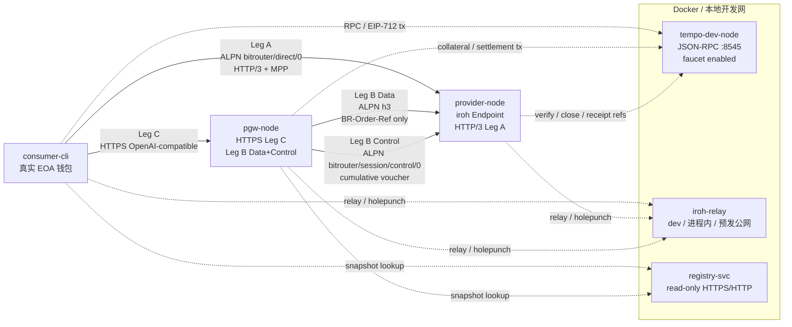

# 007-03 — v0 网络原型第二版 PRD

> 状态：**v0.1 — 草案**。本文是 [`007-01`](./007-01-proto-prd.md) 的第二版产品需求文档，基于第一轮原型实现报告 [`bitrouter-p2p-proto/docs/V0_IMPLEMENTATION_REPORT.md`](../../../code/bitrouter/bitrouter-p2p-proto/docs/V0_IMPLEMENTATION_REPORT.md) 与最新协议文档（[`003`](./003-l3-design.md) / [`004-02`](./004-02-payment-protocol.md) / [`004-03`](./004-03-pgw-provider-link.md) / [`005`](./005-l3-payment.md)）重写。
>
> 目标：构建一个**尽量贴近真实世界网络**的 v0 网络原型。与第一版不同，本版不再用模拟链、自定义 QUIC 分帧、自写 MPP/JWS、明文 HTTP PGW 入口作为主路径；而是要求使用真实中继节点、真实 Web3 钱包、真实 Tempo Docker 本地测试网、原版或 fork+patch 的 MPP SDK、真实 HTTP/3 协议栈。
>
> 本文仍是原型 PRD：目标是验证真实组件组合后的网络可行性、协议互操作性与工程风险，不是生产发布规范。

---

## 0. 摘要

- **网络层真实化**：使用真实 `iroh` Endpoint + 中继服务。开发 / CI 可用进程内中继或 `iroh-relay --dev`；长跑 / 预发环境必须部署一台真实公网中继，并通过 `RelayMode::Custom` 接入。
- **传输层标准化**：Leg A 使用 ALPN `bitrouter/direct/0` + HTTP/3 语义；Leg B 数据连接使用标准 ALPN `h3`；Leg B 控制连接使用独立 QUIC ALPN `bitrouter/session/control/0`。不再使用第一版的自定义请求 / 响应分帧。
- **支付层标准化**：Leg A 采用 MPP 402 challenge / credential / `Payment-Receipt`；优先使用原版 `mppx` / `mpp-rs`，若缺少 BitRouter 需要的 trailer、JCS、Tempo session 或 extension hook，则 fork + patch，并把 patch 面控制在适配层。
- **链与钱包真实化**：开发 / CI 使用 Tempo Docker 本地测试网（参考 `tempoxyz/mpp-rs` 的 `docker-compose.yml`：`ghcr.io/tempoxyz/tempo:latest node --dev --http --faucet.enabled`）；所有 voucher 用真实 secp256k1 EOA + EIP-712 typed data 签名，不再使用 ed25519 JWS 假装链上 voucher。
- **禁止重复造轮子**：第二版必须先删除第一版中自研且已有成熟基础设施替代的模块。保留代码只能是“薄适配层 / 配置 / 测试夹具”，不得继续维护自写 MPP core、模拟链、模拟 Tempo client、自定义 QUIC 分帧、自定义 payment auth、自定义 voucher 格式或自定义 HTTP/3 替代层。
- **PGW↔Provider 重构为 Leg B**：不再发送旧 `Order-Envelope` / per-request voucher 头；数据连接只带 `BR-Order-Ref`；支付与对账走独立控制连接的 cumulative ed25519 voucher。
- **SSE 兼容性锁定**：LLM streaming body 保持 OpenAI-compatible anonymous SSE + final usage chunk + `[DONE]`，`Payment-Receipt` 走 HTTP trailer + GET fallback。
- **并发能力单独验收**：在不计算上游 LLM API 速率限制的前提下，使用本地模拟 LLM upstream 验证网络本身承载能力；`local-e2e` 目标为单 PGW、单 Provider、单中继下 PGW 路径 1000 条并发活跃 SSE stream，Direct 路径 300 条并发活跃 SSE stream。

---

## 1. 背景：第一版原型的结论

第一轮原型（commit `46fc695`）已经证明：

1. Consumer 可以通过 Registry 找到 Provider / PGW。
2. Direct 与 PGW 两条路径能跑通 `/v1/chat/completions` streaming。
3. Provider / PGW / CLI 多进程共享一套模拟 ledger 后，channel nonce / cumulative 可对账。
4. 100 次顺序调用、故障注入、Registry lint、fixture 验签均可自动化通过。

但实现报告 §8 / §9 同时指出第一版为了快速闭环保留了若干**必须在第二版移除或降级为仅测试用途的原型捷径**：

| 原型捷径 | 第一版做法 | 第二版要求 |
|---|---|---|
| 链 | `InMemoryLedger` / `bitrouter-chain-mock` / `HttpTempoClient` | 删除原型自研链模块；开发 / CI 使用 Tempo Docker 本地测试网 + RPC 后端；单元测试只允许内联 fixture 或上游 test-utils，不保留可被误用的 runtime mock crate |
| MPP | 自写 `bitrouter-mpp`、自定义 challenge / credential | 删除自写 MPP core；接入原版或 fork+patch MPP SDK；线协议对齐 `WWW-Authenticate: Payment` / `Authorization: Payment` / `Payment-Receipt` |
| voucher | ed25519 JWS JSON payload | 删除自定义 voucher 格式；使用 Tempo session EIP-712 voucher + secp256k1 EOA + TIP-20 base units |
| transport | iroh QUIC 双向 stream 上自定义分帧 | 删除自定义 request/response framing；使用真实 HTTP/3 over QUIC |
| PGW→Provider | `Order-Envelope` + `X-Channel-Voucher` per request | Leg B 数据 / 控制双连接；数据连接只带 `BR-Order-Ref` |
| settlement | SSE `event: settlement` / 自定义对象 | 删除自定义 settlement event；使用 MPP `Payment-Receipt` trailer + GET fallback |
| 金额 | decimal string + `f64` | integer base-unit string + rational pricing + big-int |
| PGW 入口 | 明文 HTTP + API key | dev 可 HTTP，staging 必须 HTTPS / TLS termination |

第二版 PRD 的核心目标不是“加更多功能”，而是**用真实底座重跑同样的网络闭环**，把第一版中被模拟实现掩盖的链、钱包、transport、SDK 互操作风险暴露出来。

---

## 2. 范围与非目标

### 2.1 范围内

| 类别        | 第二版必须实现                                                                                                                                |
| --------- | -------------------------------------------------------------------------------------------------------------------------------------- |
| Registry  | 继续使用中心化 git 仓库 + 只读服务；snapshot 字段按最新 [`003`](./003-l3-design.md) / [`001-02`](./001-02-terms.md)；身份字符串统一 `ed25519:<base58btc>`          |
| L1/L2 网络  | 真实 iroh Endpoint；真实中继节点；支持自定义中继 URL；至少一个公网中继预发配置                                                                                       |
| HTTP/3    | Leg A `bitrouter/direct/0` 上承载 HTTP/3；Leg B 数据连接标准 `h3`；控制连接独立 QUIC ALPN `bitrouter/session/control/0`                                             |
| Tempo     | Docker 本地测试网为开发 / CI 主路径；JSON-RPC 可配置；faucet 自动给测试 EOA 发 TIP-20                                                                        |
| 钱包        | CLI / node 使用真实 secp256k1 EOA 私钥；EIP-712 signing；DID PKH `did:pkh:eip155:<chain_id>:0x...`                                              |
| MPP SDK   | 优先接入上游 SDK（`mppx` 或 `mpp-rs`）；若不满足协议细节，fork + patch；禁止继续扩展自写 MPP core 为主路径                                                             |
| 删除重复造轮子模块 | 删除第一版中替代 MPP、Tempo、HTTP/3、QUIC framing、voucher、payment auth 的自研模块；新代码只能作为上游库适配、配置、状态编排或测试夹具存在                                          |
| Leg A     | Direct Consumer↔Provider：MPP challenge / credential / Tempo voucher / OpenAI-compatible SSE / `Payment-Receipt` trailer + GET fallback |
| Leg B     | PGW↔Provider：数据 / 控制双连接、`BR-Order-Ref`、长连接 channel、cumulative ed25519 voucher、`payment-stream-completed`                               |
| Leg C     | PGW 对外最小 HTTPS OpenAI-compatible 入口；可以继续 API key，不定义为 BitRouter protocol                                                               |
| 测试        | docker-compose 集成测试、Rust e2e harness、并发压测、故障注入、真实 Tempo 本地网结算                                                                          |

### 2.2 范围外

- 链上 / permissionless Registry。
- 多 Provider 拍卖、声誉、slashing、DAO 治理。
- 外部第三方 PGW 生态。
- 非 Tempo method（Solana / Stripe / Lightning）主路径。
- 非 LLM API（embeddings / image / audio）。
- 生产钱包托管、KYC、法币入金。
- 多区域高可用、autoscaling、SLA 生产化。
- Tempo mainnet / public testnet 资金操作；第二版只要求 Docker localnet，staging 可选接公共 testnet。

---

## 3. 上游组件与代码依据

本文选型基于以下上游正式代码 / 文档：

| 组件 | 上游依据 | 对 PRD 的影响 |
|---|---|---|
| Tempo localnet | `tempoxyz/mpp-rs/docker-compose.yml` 使用 `ghcr.io/tempoxyz/tempo:latest node --dev --http --http.port 8545 --faucet.enabled --faucet.address ... --faucet.amount ...` | 第二版集成测试必须用 Docker Tempo dev node，RPC `http://localhost:8545`，chain id 由 RPC 探测 |
| Tempo SDK | `tempoxyz/tempo-ts` package 依赖 `viem`，导出 `tempo.ts` / `tempo.ts/server` | TS wallet / EIP-712 path 可用 `tempo.ts` + `viem`；Rust path 可用 Alloy / viem-compatible typed data 测试向量对齐 |
| MPP SDK | `wevm/mppx` package exports `mppx`, `mppx/client`, `mppx/server`, `mppx/tempo`，提供 `Challenge`, `Credential`, `Receipt`, `BodyDigest` 等 core primitives | Leg A 不再自写 Payment Auth core；需要适配层确认 challenge auth-param、body digest、receipt header/trailer、Tempo session hook 是否满足 BitRouter |
| MPP docs | `mpp.dev/llms-full.txt` 明确 challenge / credential / receipt / HTTP transport / Tempo session / TypeScript SDK | 402 / `Authorization: Payment` / `Payment-Receipt` 是协议主路径 |
| iroh relay | `n0-computer/iroh/iroh-relay/README.md`：`iroh-relay --dev`、开发模式不带 HTTPS/QAD、test-utils `run_relay_server()`、custom relay | 开发可用进程内中继；真实网络原型要部署中继并使用自定义中继映射 |
| iroh Endpoint | `iroh/examples/listen.rs` / `connect.rs` 使用 `Endpoint::builder`, `.secret_key`, `.alpns`, `.relay_mode`, `endpoint.connect(addr, ALPN)` | Provider / PGW / Consumer 的 L1/L2 接入必须保留 ALPN 与 relay 可配置 |
| HTTP/3 stack | `hyperium/h3` examples 使用 `h3_quinn`, `quinn`, rustls ALPN `h3`, `h3::server::Connection`, `h3::client::new` | 第二版要用真实 h3/quinn 或等价 HTTP/3 协议栈；若不能直接复用 iroh connection，需要明确适配 / fork / bridge 风险 |

### 3.1 MPP SDK patch 策略

优先级：

1. **原版上游**：若 `mppx` / `mpp-rs` 能直接处理 `WWW-Authenticate: Payment`、`Authorization: Payment`、Tempo session voucher、`Payment-Receipt`，则只写 BitRouter 适配层。
2. **fork + patch 只是上游补丁暂存区**：若缺少以下能力，允许 fork，但 fork 的目标必须是把能力补回上游 SDK，而不是在 BitRouter 内部形成第二套 MPP / Tempo / HTTP/3 实现：
   - HTTP/3 trailer 读写 / streaming response trailer hook；
   - JCS canonicalization hook；
   - BitRouter `payload.order` extension type；
   - Tempo local Docker chain config；
   - receipt GET fallback helper；
   - `source = did:pkh:eip155:<chain_id>:0x...` 与 base-unit string 的 strict schema。
3. **禁止方向**：不得继续把 `crates/bitrouter-mpp` 扩成长期 MPP core；不得在 `bitrouter-tempo` 中实现替代 Tempo SDK / 合约协议；不得在 `bitrouter-h3` 中实现替代 HTTP/3 协议栈；不得继续维护自定义 Payment Auth、JWS voucher、mock ledger 或 QUIC request/response framing。

所有 fork patch 必须：

- 记录上游 commit SHA；
- patch 以最小 diff 存在 `third_party/patches/` 或 fork branch；
- 每个 patch 对应一个上游 issue / PR 链接（即使暂未提交，也要写本地 tracking issue）；
- e2e 同时跑上游兼容测试向量，避免 BitRouter 私有分叉漂移。

### 3.2 删除重复造轮子模块的硬约束

第二版原型的第一项工程目标是**删除会误导后续演进方向的自研替代模块**。如果一个模块的主要职责已经由 Tempo、MPP SDK、HTTP/3 stack、iroh、viem / Alloy、rustls / quinn 等上游基础设施覆盖，则 BitRouter 仓库内不得保留可被 runtime 主路径调用的替代实现。

必须删除或降级为不可被 runtime 引用的测试夹具：

| 旧模块 / 旧能力 | 处理要求 |
|---|---|
| `crates/bitrouter-mpp` 中的 challenge / credential / receipt / payment auth core | 删除 runtime crate；如需保留测试向量 runner，迁入 `tests/fixtures/` 或 `tests/support/`，且不能被 `bitrouter-node` / `bitrouter-cli` 依赖 |
| `bitrouter-chain-mock`、`InMemoryLedger`、`HttpTempoClient` 等模拟链 / 模拟 Tempo client | 删除 runtime 依赖；测试只允许直接启动 Tempo Docker localnet 或使用上游 test-utils |
| ed25519 JWS voucher / 自定义链上 voucher payload | 删除；只允许 Tempo session EIP-712 voucher |
| 自定义 QUIC request/response framing | 删除；Leg A / Leg B 数据面只允许真实 HTTP/3 |
| bespoke settlement SSE event / settlement object | 删除；只允许 MPP `Payment-Receipt` trailer + GET fallback |
| 手写 HTTP/3 / MPP / Tempo 协议解析器 | 删除；只允许上游库调用、类型转换、错误映射和配置 glue code |

允许保留的新代码边界：

- **薄适配层**：只做类型映射、配置注入、错误码映射、日志 / metrics、调用上游库；不得复制上游协议状态机。
- **业务状态机**：Provider / PGW 的 order、voucher epoch、receipt store、channel manager 可以存在，因为这是 BitRouter 业务逻辑，不是替代上游基础设施。
- **测试夹具**：必须位于 `tests/`、`fixtures/` 或 `examples/`，且不能被 runtime crate 依赖。
- **临时迁移代码**：必须带明确删除条件，不能作为第二版验收路径的一部分。

---

## 4. 目标网络拓扑



### 4.1 运行配置

| 配置 | 用途 | Tempo | 中继 | Registry | PGW 入口 |
|---|---|---|---|---|---|
| `unit` | 快速单元测试 | 模拟后端可用 | 进程内 / 禁用 | fixture loader | 进程内 |
| `local-e2e` | 默认开发 / CI | Docker Tempo dev node | `iroh::test_utils::run_relay_server()` 或 `iroh-relay --dev` | 本地进程 | 允许 HTTP |
| `staging` | 最接近真实世界 | Docker Tempo dev node 或公共 testnet | 公网中继 + 尽可能启用 TLS/QAD | HTTPS | HTTPS / TLS termination |
| `manual-mainnet-like` | 手动演示 | Tempo public testnet 可选 | 公网中继 | HTTPS | HTTPS |

第二版验收以 `local-e2e` 与 `staging` 为主；`unit` 不能作为最终验收替代。

---

## 5. 协议路径需求

### 5.1 Leg A：Consumer ↔ Provider Direct

Leg A 必须完全按 [`005`](./005-l3-payment.md)：

1. Consumer 通过 Registry 获取 Provider snapshot，验证 `provider_id` ed25519 签名，解析 endpoint 地址 / 中继 URL / pricing。
2. Consumer 用 iroh 连接 Provider：ALPN `bitrouter/direct/0`。
3. 连接内跑 HTTP/3 请求：

   ```http
   POST /v1/chat/completions HTTP/3
   Content-Type: application/json
   ```

4. Provider 若未收到 credential，返回：

   ```http
   402 Payment Required
   WWW-Authenticate: Payment id="...", realm="ed25519:<provider_id>", method="tempo", intent="session", request="...", expires="...", digest="...", opaque="..."
   ```

5. Consumer 使用真实 Tempo EOA 钱包构造 EIP-712 voucher，提交：

   ```http
   Authorization: Payment <base64url(JCS({ challenge, source, payload }))>
   ```

6. Provider 通过 MPP SDK / adapter 验证 challenge HMAC、digest、expires、Tempo voucher、channel state。
7. Provider 输出 OpenAI-compatible SSE：
   - anonymous `data: <json>`;
   - final usage chunk;
   - final `data: [DONE]`;
   - body 内无 BitRouter-specific 字段。
8. Provider 在 HTTP trailer 发送：

   ```http
   Payment-Receipt: <base64url(JCS(receipt_envelope_json))>
   ```

9. Consumer 若拿不到 trailer，调用 `GET /v1/payments/receipts/{challenge_id}` fallback。

### 5.2 Leg B：PGW ↔ Provider

Leg B 必须完全按 [`004-03`](./004-03-pgw-provider-link.md)：

| 连接 | 要求 |
|---|---|
| 数据连接 | 独立 QUIC 连接；ALPN `h3`；HTTP/3 request；唯一 BitRouter-specific header = `BR-Order-Ref: <ulid>` |
| 控制连接 | 独立 QUIC 连接；ALPN `bitrouter/session/control/0`; length-prefixed JCS-JSON frames |

正常路径：

1. PGW 启动后读取 Registry，找到 curated Provider。
2. PGW 与 Provider 建 Control Connection，发送 `channel-open-request`。
3. PGW 用真实 Tempo EOA 在 Tempo localnet 锁 collateral；链下 Leg B channel 记录 `channel_id` / `asset` / `collateral_base_units`。
4. Consumer 从 Leg C 调 PGW；PGW 生成 `order_ref`，在 Data Connection 发 HTTP/3 request：

   ```http
   POST /v1/chat/completions HTTP/3
   BR-Order-Ref: 01J...
   ```

5. Provider 完成 LLM stream 后，通过 Control Connection 发：

   ```json
   {
     "type": "payment-stream-completed",
     "payload": {
       "order_ref": "01J...",
       "provider_share_base_units": "123456",
       "usage": { "input_tokens": 12, "output_tokens": 34, "total_tokens": 46 },
       "completed_at": "..."
     }
   }
   ```

6. PGW 按 epoch / threshold 推送 `payment-voucher`，由 PGW ed25519 签 JCS `{channel_id, cumulative_amount, nonce}`。
7. Provider 校验 nonce / cumulative / collateral / signature；超阈值则拒绝新的数据 stream。

Leg B 主路径不使用 MPP per-request challenge；仅作为 fallback / 调试配置。

### 5.3 Leg C：Consumer ↔ PGW

Leg C 不定义为 BitRouter 协议，但原型需要一个最小可用入口：

- `POST /v1/chat/completions` OpenAI-compatible HTTPS endpoint。
- 鉴权：`Authorization: Bearer <api_key>` 或 `X-API-Key`，二选一即可；建议用 Bearer。
- streaming response 透传 OpenAI-compatible SSE。
- 不向 Consumer 暴露 `BR-Order-Ref`、Leg B voucher、Control Connection 状态。
- PGW 可在 response header 中输出 `BitRouter-Request-Id` 供调试，但不得污染 SSE body。

---

## 6. 数据模型与金额规则

### 6.1 身份

- 所有 BitRouter node identity 使用 [`001-02 §8.5`](./001-02-terms.md)：`<algo>:<base58btc-lower-no-pad>`。
- v0 网络原型**不再要求** `provider_id == endpoint_id`；允许继续单 endpoint，但必须实现 root key 与 endpoint key 分层：
  - `provider_id` / `pgw_id`: ed25519 root key，签 snapshot / receipt / Leg B voucher；
  - `endpoint_id`: iroh EndpointId，连接身份；
  - snapshot 内 root proof 覆盖 endpoint 列表。
- Tempo payment identity 是 secp256k1 EOA：`did:pkh:eip155:<chain_id>:0x...`，与 BitRouter ed25519 identity 解耦。

### 6.2 金额

- 所有链上结算金额：TIP-20 base units integer string。
- 所有 pricing rates：rational `{numerator, denominator}`。
- 所有计算：big-int。
- 唯一 rounding：`ceil(numerator * usage_units / denominator)`。
- 禁止 `f64` / decimal string 参与协议金额计算。

### 6.3 Snapshot 变更

Provider / PGW snapshot 必须更新到最新协议形态：

- `pricing[].rates` 使用 rational。
- `endpoints[].alpn`：
  - Leg A Provider endpoint: `bitrouter/direct/0`;
  - PGW / Provider Leg B Data: `h3` 可作为能力字段或在 PGW config 中声明；
  - Control ALPN `bitrouter/session/control/0` 必须在 PGW/Provider config 中声明。
- `chain_addrs[]` 使用 Tempo EOA / DID PKH 或 CAIP-compatible account reference；具体展示字段可在实现中保持原格式，但 wire credential source 必须是 DID PKH。

---

## 7. 组件需求

### 7.1 `bitrouter-node --role=provider`

必须模块：

| 模块 | 要求 |
|---|---|
| Identity | root ed25519 + endpoint ed25519；base58btc encoding；snapshot proof |
| iroh | 自定义中继配置；Leg A 使用 ALPN `bitrouter/direct/0`；Leg B 使用 ALPN `h3` 和 `bitrouter/session/control/0` |
| HTTP/3 server | 接收 Leg A HTTP/3 request；支持 streaming body / response trailer |
| MPP server adapter | 生成 / 验证 MPP challenge；验证 Tempo session credential；生成 `Payment-Receipt` |
| Tempo RPC | 连接 Docker Tempo localnet；读取 channel / token / tx state；支持 timeout / retry |
| LLM upstream | OpenAI-compatible 模拟 upstream + 真实 upstream 配置；输出标准 SSE |
| Leg B data | 接收 `BR-Order-Ref` request；不得要求 payment header |
| Leg B control | 管理 channel-open、voucher、stream-completed、epoch-close、keepalive、payment-error |
| Receipt store | receipt ≥ 24h 或测试配置可调；支持 GET fallback |

### 7.2 `bitrouter-node --role=pgw`

必须模块：

| 模块 | 要求 |
|---|---|
| HTTPS 入口 | Leg C OpenAI-compatible endpoint；dev 可 HTTP，staging 必须 TLS |
| Registry client | 拉 Provider snapshots，验证 root proof |
| Provider routing | v0 最小按 model + active + price 选一个 Provider；失败可切下一个 |
| Tempo 钱包 | PGW secp256k1 EOA；collateral lock / top-up / close |
| Leg B data client | HTTP/3 `h3` connection pool；每请求带 `BR-Order-Ref` |
| Leg B control client | 独立 QUIC Control Connection；long-lived channel；cumulative voucher state |
| Channel manager | pending / committed / rolled-back 状态；持久化 nonce/cumulative；crash recovery |
| Ledger | 记录 `order_ref -> usage -> provider_share_base_units -> voucher epoch` |
| 可观测性 | per-leg latency、voucher lag、collateral remaining、control reconnect count |

### 7.3 `bitrouter-cli`

必须命令：

```bash
bitrouter-cli wallet create --chain tempo --profile local
bitrouter-cli wallet faucet --asset pathUSD --amount 1000000000
bitrouter-cli wallet balance
bitrouter-cli registry list-providers --model <name>
bitrouter-cli chat --direct --provider <provider_id> --model <name> -m "hello"
bitrouter-cli chat --via-pgw --pgw <pgw_id> --model <name> -m "hello"
bitrouter-cli receipts get --provider <provider_id> --challenge-id <id>
```

Direct 模式必须自动使用 MPP SDK / 适配层：第一次请求 → 402 → 签 credential → 重试 → stream → receipt。

### 7.4 `registry-svc`

保持第一版范围，但更新校验：

- base58btc identity regex and length checks.
- rational pricing schema.
- base-unit integer string schema.
- `endpoints[].alpn == "bitrouter/direct/0"` for Leg A Provider endpoint.
- `accepted_pgws` may remain permissioned for v0.
- root/endpoint separation allowed and tested.

### 7.5 `tempo-devnet`

Add `docker-compose.tempo.yml` equivalent to mpp-rs:

```yaml
services:
  tempo-node:
    image: ghcr.io/tempoxyz/tempo:latest
    command: >
      node --dev
      --dev.block-time 200ms
      --http
      --http.addr 0.0.0.0
      --http.port 8545
      --http.api all
      --http.corsdomain '*'
      --faucet.enabled
      --faucet.private-key 0xac0974bec39a17e36ba4a6b4d238ff944bacb478cbed5efcae784d7bf4f2ff80
      --faucet.address 0x20c0000000000000000000000000000000000000
      --faucet.address 0x20c0000000000000000000000000000000000001
      --faucet.address 0x20c0000000000000000000000000000000000002
      --faucet.address 0x20c0000000000000000000000000000000000003
      --faucet.amount 1000000000000
      --engine.legacy-state-root
      --engine.disable-precompile-cache
    ports:
      - "8545:8545"
    healthcheck:
      test: ["CMD", "curl", "-sf", "http://localhost:8545", "-X", "POST", "-H", "Content-Type: application/json", "-d", "{\"jsonrpc\":\"2.0\",\"method\":\"eth_chainId\",\"params\":[],\"id\":1}"]
      interval: 2s
      timeout: 5s
      retries: 15
```

实现可以直接复制这一结构，并固定镜像 digest 以保证可复现。

---

## 8. 实施阶段

### 阶段 0 — 删除重复造轮子模块

交付物：

- 从 runtime dependency graph 中移除自写 MPP core、模拟链 / 模拟 Tempo client、自定义 JWS voucher、自定义 QUIC framing、自定义 settlement event。
- 删除或移动旧 crate / module：`bitrouter-mpp` 只能留下测试向量资料，`bitrouter-chain-mock` 不能作为 runtime crate 存在，自定义 transport framing 不能被 Provider / PGW / CLI 引用。
- 为每个保留的 adapter 写明边界：只允许调用上游库、做类型映射、配置注入、错误映射和 observability，不允许实现上游协议状态机。
- 在 workspace 依赖图中确认 `bitrouter-node`、`bitrouter-cli`、`bitrouter-registry` 不依赖任何旧替代模块。

退出条件：

- `cargo tree` / workspace metadata 检查证明 runtime crate 不再依赖旧 MPP core、mock chain、自定义 transport framing。
- grep 旧模块名只能命中 `tests/`、`fixtures/`、迁移说明或第一版历史描述。
- Direct / PGW e2e 只能通过真实 Tempo localnet、真实 MPP SDK、真实 HTTP/3 stack 跑通。

### 阶段 A — 协议数据迁移

交付物：

- 将旧 Order Envelope 类型替换为 Leg A 的 `payload.order` extension 类型。
- 增加 Leg B frame 类型（`channel-open-request`、`payment-voucher` 等）。
- 将 decimal amount 类型替换为 base-unit integer string + rational rate。
- 增加 base58btc identity 测试向量。
- 兼容性 fixtures 只保留在 `legacy/` 测试下；新 fixtures 使用最新协议。

退出条件：

- 生成文档 / fixtures 中不再出现旧术语：旧 order envelope header、旧 settlement trailer、single-blob challenge、per-request voucher header。
- 新协议类型不能依赖旧自研 MPP / settlement / transport 模块。

### 阶段 B — Tempo 本地网 + 钱包

交付物：

- `docker-compose.tempo.yml`。
- 使用 Alloy / viem-compatible RPC 类型实现 `RpcTempoClient`。
- CLI / Provider / PGW 的 secp256k1 钱包存储。
- 本地网 faucet 命令。
- EIP-712 voucher 签名与验证测试向量。

退出条件：

- CLI 可以创建钱包、领取 faucet 资金、签署 EIP-712 voucher，并基于本地链配置验证签名。

### 阶段 C — MPP SDK 适配层

交付物：

- 评估 `mppx` 和 / 或 `mpp-rs` 的以下能力：
  - challenge 解析 / 序列化；
  - credential 解析 / 序列化；
  - body digest；
  - receipt 解析 / 序列化；
  - Tempo session 支持；
  - server middleware hooks。
- 将 `bitrouter-mpp-adapter` 实现为薄适配层，且禁止复制 `mppx` / `mpp-rs` 的 challenge、credential、receipt 状态机。
- 如需 fork，创建 fork / patch tracking 文档。

退出条件：

- Direct Leg A 的 402 flow 通过适配层跑通，且不使用 BitRouter 自定义 challenge 格式。
- `bitrouter-mpp-adapter` 的代码审计证明其只调用上游 SDK，不含替代性 MPP core。

### 阶段 D — HTTP/3 传输

交付物：

- Leg A 的 HTTP/3 over QUIC server / client。
- Leg B 的 HTTP/3 数据连接。
- 独立 QUIC ALPN 上的控制连接 length-prefixed JCS frames。
- trailer 读写支持；GET receipt fallback。

开放工程风险：

- `h3_quinn` examples 假设 quinn endpoint + rustls ALPN `h3`；iroh 暴露的是自己的 Endpoint / connection API。如果无法直接在 iroh connection 上跑 `h3`，实现必须选择一条路径：
  1. 将 iroh connection 适配到 h3 QUIC traits；
  2. 为 HTTP/3 原型单独运行 quinn HTTP/3 socket，同时保留 iroh 作为发现 / 中继层；
  3. 在传输层做 patch / bridge。

选定路径必须在阶段 D 退出前写入文档。

阶段 D 不允许用自定义 request/response framing 伪装 HTTP/3 通过验收。如果 h3 over iroh 不可行，只能选择真实 quinn / h3 旁路或上游 patch，不能恢复第一版 framing。

### 阶段 E — Leg A 端到端

交付物：

- Tempo localnet 上的 Consumer CLI direct flow。
- 带 OpenAI-compatible SSE 的 Provider MPP server。
- `Payment-Receipt` trailer + GET fallback.

退出条件：

- `direct-e2e-real.sh` 在 Docker Tempo、真实钱包、真实 MPP credential、HTTP/3 transport 下通过。

### 阶段 F — Leg B 端到端

交付物：

- PGW 控制连接 channel open / voucher / epoch close。
- PGW 数据连接携带 `BR-Order-Ref` 转发请求。
- Provider `payment-stream-completed`.
- PGW channel manager pending / commit / rollback。

退出条件：

- `pgw-e2e-real.sh` 通过，且不出现旧 order envelope / per-request voucher header。

### 阶段 G — 压测、故障注入、预发

交付物：

- Rust-based e2e harness（shell smoke 可保留）。
- 并发压测。
- 中继预发配置。
- 崩溃恢复测试。
- 结构化 JSON 错误。

退出条件：

- §9 验收表全部通过。

---

## 9. 验收标准

| # | 标准 | 验证方式 |
|---|---|---|
| AC-1 | Docker Tempo localnet 启动且 RPC healthcheck 通过 | `docker compose -f docker-compose.tempo.yml up -d` + `eth_chainId` |
| AC-2 | CLI 创建真实 Tempo EOA 钱包并收到 faucet TIP-20 | `bitrouter-cli wallet create` + `wallet faucet` + `wallet balance` |
| AC-3 | Direct Leg A 通过 HTTP/3 完成 MPP 402 retry | e2e 断言第一次响应 402、第二次响应 200 SSE |
| AC-4 | Direct Leg A voucher 是 EIP-712 secp256k1 签名，金额为 base-unit amount | 测试向量 + Provider 验证 |
| AC-5 | Direct SSE body 保持 OpenAI-compatible，并以 `[DONE]` 结束 | fixture validator；body 内无 BitRouter 字段 |
| AC-6 | `Payment-Receipt` trailer 被发送，并由 Provider ed25519 签名 | trailer 提取 + 签名验证 |
| AC-7 | GET receipt fallback 在 ≥ test TTL 内返回同一 receipt | 比对 trailer receipt 与 GET body/header |
| AC-8 | Leg B 使用两个独立 QUIC 连接 | connection ID / 日志显示数据连接与控制连接分离 |
| AC-9 | Leg B 数据请求只携带 `BR-Order-Ref` 作为 BitRouter-specific header | HTTP/3 request capture |
| AC-10 | Leg B 控制连接的 cumulative voucher nonce 与 amount 严格单调 | control frame log validator |
| AC-11 | PGW 路径在 `local-e2e` 下完成 1000 条并发活跃 SSE stream，且无 nonce race / voucher race | `N>=10000 CONCURRENCY=1000 MOCK_LLM_DELAY_MS=1000` harness |
| AC-12 | PGW 重启后恢复 channel manager 状态，且不 replay nonce | 测试中 kill / restart PGW |
| AC-13 | Provider 重启后保留 receipt store，或返回明确的 `receipt.not_ready` / `receipt.not_found` | 故障注入 |
| AC-14 | 中继预发配置可跨两台机器 / 两个网络工作 | 手动或 nightly staging 测试 |
| AC-15 | runtime 日志 / fixtures 中没有 legacy wire form | grep 生成 fixtures / log snapshots 中的旧术语 |
| AC-16 | Direct 路径在 `local-e2e` 下完成 300 条并发活跃 SSE stream，且 402 retry / receipt 状态无交叉污染 | `N>=3000 CONCURRENCY=300 MOCK_LLM_DELAY_MS=1000` harness |
| AC-17 | 预发环境跨机器 / 跨网络完成 PGW 路径 300 并发、Direct 路径 100 并发 | staging load harness + structured metrics |
| AC-18 | runtime dependency graph 中不存在重复造轮子模块 | `cargo tree` / metadata 检查 + grep：`bitrouter-node`、`bitrouter-cli`、`bitrouter-registry` 不依赖自写 MPP core、mock chain、自定义 transport framing、自定义 JWS voucher、自定义 settlement event |

---

## 10. 测试矩阵

| 测试 | 配置 | 组件 | 目的 |
|---|---|---|---|
| unit-protocol | unit | 无链 | JCS、base58btc、rational、base-unit schema |
| unit-mpp-adapter | unit | 仅 MPP SDK | challenge / credential / receipt 兼容性 |
| tempo-wallet | local-e2e | Docker Tempo | 钱包、faucet、EIP-712 |
| direct-real | local-e2e | Tempo + 中继 + Provider + CLI | Leg A 完整路径 |
| direct-receipt-fallback | local-e2e | 同上 | trailer 缺失 / GET fallback |
| pgw-real | local-e2e | Tempo + 中继 + PGW + Provider + CLI | Leg B + Leg C |
| pgw-concurrent | local-e2e | 同上 | nonce / cumulative 并发 |
| direct-network-load | local-e2e | Tempo + 中继 + Provider + loadgen | Direct 路径 300 并发活跃 SSE stream |
| pgw-network-load | local-e2e | Tempo + 中继 + PGW + Provider + loadgen | PGW 路径 1000 并发活跃 SSE stream |
| staging-network-load | staging | 公网中继 + 两台或更多机器 | 跨机器 PGW 300 并发、Direct 100 并发 |
| control-disconnect | local-e2e | 同上 | 控制连接断开时的数据连接行为 |
| tempo-rpc-fault | local-e2e | Tempo 停止 / 延迟 | 链不可用错误 |
| relay-staging | staging | 公网中继 | 真实 NAT / 中继行为 |
| https-ingress | staging | TLS PGW 入口 | Leg C 的类生产形态 |

---

## 11. 并发压测要求

本节只衡量 BitRouter 网络本身的并发承载能力，**不把上游 LLM API 的速率限制计入目标**。压测必须使用本地模拟 LLM upstream，输出 OpenAI-compatible SSE：首包可配置延迟，随后按固定节奏输出少量 chunk，最后输出 final usage chunk 和 `data: [DONE]`。

### 11.1 压测拓扑

基准拓扑固定为：

| 节点 | 数量 | 说明 |
|---|---:|---|
| loadgen / consumer-cli | 1 | 可在同机或独立机器运行；生成 Direct 与 PGW 两类请求 |
| PGW | 1 | 单实例，不使用 autoscaling |
| Provider | 1 | 单实例，连接本地模拟 LLM upstream |
| iroh relay | 1 | `local-e2e` 可为进程内 / dev relay；`staging` 必须为公网中继 |
| Tempo localnet | 1 | Docker Tempo dev node；压测期间只做必要 channel / voucher 操作 |
| Registry | 1 | 本地或 HTTPS 只读服务 |

### 11.2 目标并发

| 场景 | 配置 | 目标 |
|---|---|---|
| Direct 路径本地压测 | `local-e2e` | 300 条并发活跃 SSE stream，累计不少于 3000 个请求 |
| PGW 路径本地压测 | `local-e2e` | 1000 条并发活跃 SSE stream，累计不少于 10000 个请求 |
| Direct 路径预发压测 | `staging` | 跨机器 / 跨网络 100 条并发活跃 SSE stream，累计不少于 1000 个请求 |
| PGW 路径预发压测 | `staging` | 跨机器 / 跨网络 300 条并发活跃 SSE stream，累计不少于 3000 个请求 |
| Leg B 控制面 | `local-e2e` | 处理不少于 1000 个 `payment-stream-completed` / 分钟；voucher nonce 与 cumulative amount 严格单调 |

### 11.3 通过条件

- 成功率 ≥ 99%，失败必须有结构化 `error.code`，不得出现 silent drop。
- PGW 路径不得出现 nonce race、cumulative amount 回退、重复 voucher、order_ref 串单。
- Direct 路径不得出现 challenge / credential / receipt 交叉污染。
- SSE body 必须保持 OpenAI-compatible，压测时仍以 `[DONE]` 结束。
- trailer 缺失时，GET receipt fallback 成功率 ≥ 99%。
- p95 首个 SSE chunk 额外网络与协议开销：`local-e2e` ≤ 250ms，`staging` ≤ 800ms。该指标只统计 BitRouter 网络、HTTP/3、MPP、PGW 转发与控制面开销，不统计模拟 LLM upstream 的固定延迟。
- 压测结束后，Provider / PGW 的 channel state、receipt store、voucher ledger 可以通过一致性校验。

---

## 12. 可观测性要求

每个节点必须输出结构化 JSON 日志，并至少包含：

- `request_id`
- `challenge_id`
- `order_ref`
- `provider_id`
- `pgw_id`
- `endpoint_id`
- `leg` (`A` / `B-data` / `B-control` / `C`)
- `channel_id`
- `voucher_nonce`
- `cumulative_amount_base_units`
- `latency_ms`
- `error.code`

最小指标：

| 指标 | 标签 |
|---|---|
| `bitrouter_requests_total` | `leg`, `status`, `model` |
| `bitrouter_request_latency_ms` | `leg`, `model` |
| `bitrouter_voucher_lag_base_units` | `provider_id`, `pgw_id` |
| `bitrouter_control_reconnects_total` | `provider_id`, `pgw_id` |
| `bitrouter_tempo_rpc_errors_total` | `method`, `code` |
| `bitrouter_receipt_fallback_total` | `provider_id` |

---

## 13. 仓库变更

目标仓库：`~/code/bitrouter/bitrouter-p2p-proto`。

预期高层结构：

```text
crates/
  bitrouter-core/          # 最新协议数据类型，默认不含 legacy wire form
  bitrouter-registry/      # registry 服务 + lint
  bitrouter-mpp-adapter/   # 只调用上游 / fork MPP SDK 的薄适配层，不含 MPP core
  bitrouter-tempo/         # 只封装 RPC / 钱包 / EIP-712 调用，不含模拟链
  bitrouter-h3/            # 只封装上游 HTTP/3 stack，不含自定义 framing
  bitrouter-node/          # provider / pgw
  bitrouter-cli/           # consumer + 钱包 + ops
docker-compose.tempo.yml
examples/
  direct-e2e-real.sh
  pgw-e2e-real.sh
  relay-staging.md
tests/e2e/
```

如果 Rust 不能直接消费选定的 MPP SDK，`bitrouter-mpp-adapter` 可以是：

- 包装 `mpp-rs` 的 Rust wrapper；或
- 使用 `mppx` 的 TS sidecar，且仅由测试 harness 调用；或
- 对上游 `mpp-rs` 的 fork + patch，并以 `third_party/patches/` 形式记录最小补丁。

除非后续决策明确改变节点运行时语言，生产候选路径必须是 Rust-native。

明确不允许保留在 runtime workspace 中的旧模块形态：

```text
crates/bitrouter-mpp/          # 自写 MPP core，必须删除或迁入 tests/fixtures
crates/bitrouter-chain-mock/   # 模拟链，必须删除
custom-quic-framing modules    # 自定义 request/response framing，必须删除
jws-voucher modules            # 自定义 voucher，必须删除
settlement-sse modules         # 自定义 settlement event，必须删除
```

---

## 14. 风险与待决策事项

| 风险 | 影响 | 缓解方式 |
|---|---|---|
| HTTP/3 over iroh connection 可能无法直接匹配 `h3` traits | 可能延迟阶段 D | 先做 spike；记录 adapter / fallback；不得退回自定义分帧来掩盖问题 |
| MPP SDK receipt schema 可能小于 BitRouter 所需 receipt extension | 可能需要 fork / patch | 将 `order` extension 保持为允许的额外对象；尽可能提交上游 PR |
| 所选 HTTP/3 stack 的 trailer 支持可能不完整 | receipt 交付风险 | 及早实现 GET fallback；单独测试 trailer |
| Tempo localnet contract / MPP session SDK 不匹配 | 阻塞真实 voucher | 使用上游 mpp-rs docker compose 与测试向量；隔离在 `bitrouter-tempo` |
| PGW voucher 并发状态可能竞争 | 双花 / invalid nonce | pending / commit 状态机 + DB transaction / mutex + recovery tests |
| Relay dev mode 缺少 HTTPS / QAD | 与预发环境不一致 | 本地使用 dev；预发要求真实证书配置或 hosted relay |
| 删除旧模块可能导致短期 e2e 断裂 | 开发速度下降 | 这是第二版的 intentional constraint；不得通过恢复旧模块绕过，只能补上游适配或调整实施顺序 |

---

## 15. 开放问题

1. **节点运行时语言边界**：主节点继续 Rust；是否允许 Leg A MPP 适配层短期通过 TS `mppx` sidecar 跑 e2e？建议只允许在阶段 C spike 中使用，最终节点路径 Rust-native。
2. **HTTP/3 适配策略**：优先适配 iroh connection 到 `h3`，还是直接用 quinn HTTP/3 socket + iroh discovery？需要阶段 D spike 结论。
3. **Tempo session contract address**：Docker localnet 中 `TempoStreamChannel` / TIP-20 地址是否固定由 MPP SDK 部署 / 发现，还是原型自行部署？需以 `mpp-rs` 实际实现为准。
4. **PGW Leg C payment**：第二版是否让 Consumer→PGW 也走 MPP？本文暂定不做，Leg C 用 API key + internal test balance，避免同时实现两套 customer-facing product。
5. **Receipt retention**：原型默认 24h 还是测试 TTL？建议实现配置项，CI 用短 TTL + explicit ≥24h config test。

---

## 16. 完成定义

本 PRD 完成的定义：

1. `local-e2e` 配置下，Direct 与 PGW 路径均使用 Docker Tempo localnet、真实 EOA、真实 EIP-712 voucher、真实 HTTP/3、真实中继。
2. runtime 主路径不再出现旧 `Order-Envelope` header、旧 per-request channel voucher header、旧 single-blob challenge、旧 settlement SSE event。
3. `local-e2e` 配置完成 PGW 路径 1000 并发活跃 SSE stream、Direct 路径 300 并发活跃 SSE stream 的网络压测。
4. `staging` 配置至少完成一次跨机器 / 跨网络中继测试，并达到 PGW 路径 300 并发、Direct 路径 100 并发。
5. AC-1 到 AC-18 全部通过，并写入第二版实现报告。
6. 第一版模拟链 / 自定义分帧 / 自写 MPP core / 自定义 voucher / 自定义 settlement event 从 runtime workspace 删除；如需保留历史 fixture，只能放在 `tests/` / `fixtures/` 且不能被 runtime crate 依赖。
