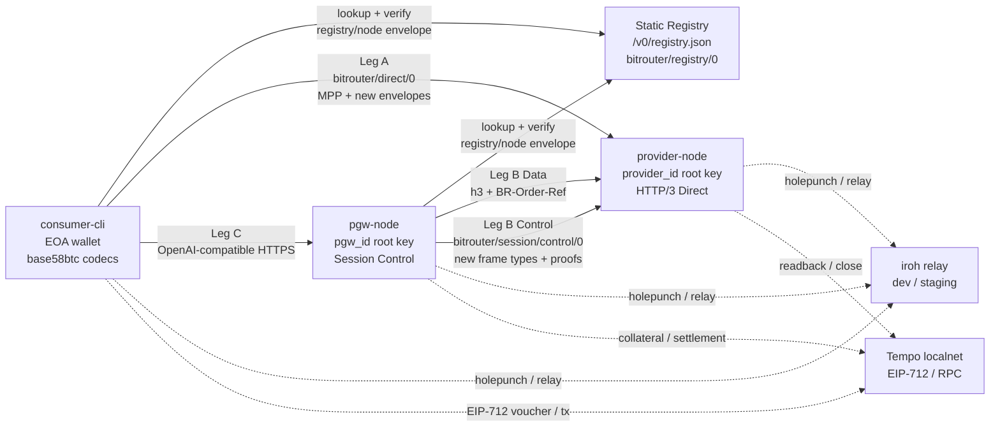

# 007-05 — v0 网络原型第三版 PRD

> 状态：**v0.1 — 草案**。本文是 [`007-03`](./007-03-proto-prd-v2.md) 的第三版产品需求文档，基于 [`007-04`](./007-04-proto-implementation-brief.md) 对 v2 原型的验收结论，以及最新协议约定（[`001-03`](./001-03-protocol-conventions.md) / [`001-04`](./001-04-api-reference-examples.md) / [`003`](./003-l3-design.md) / [`004-03`](./004-03-pgw-provider-link.md) / [`005`](./005-l3-payment.md) / [`008-03`](./008-03-bitrouter-registry.md)）重写。
>
> 目标：在 v2 已经跑通的现有网络拓扑上，验证新的 **Type ID、base58btc 编码、JCS 签名 envelope、proof profile、BitRouter error object** 能正确集成到 Registry、Direct path、Session Control path、Payment Receipt 与 Tempo voucher wrapper 中。
>
> 本文仍是原型 PRD：目标是验证协议格式收敛后的端到端互操作、迁移风险和实现边界，不是生产发布规范。

---

## 0. 摘要

- **拓扑不重做**：沿用 v2 的 Consumer / Provider / PGW / Registry / iroh relay / Tempo localnet 拓扑；本版不新增网络角色、不重写 Leg A / Leg B / Leg C 分层。
- **格式收敛是主目标**：所有 BitRouter-owned wire JSON 的顶层 `type` 统一为 `bitrouter/<namespace>/<name>/<major>`；签名对象统一为 `{ type, payload, proofs[] }`；BitRouter 自有 opaque bytes 统一使用 base58btc。
- **Registry 改为真实新格式**：v3 原型必须加载 `bitrouter/registry/0` aggregate，校验 `bitrouter/registry/node/0` / `bitrouter/registry/tombstone/0` signed envelope，不再接受 `schema_version`、inline `signature` / `sig`、z-base32 root key 或 hex digest。
- **Direct path 改为真实新格式**：MPP challenge / credential 仍遵循上游 MPP，但 `payload.order`、Tempo voucher wrapper、`Payment-Receipt` 必须使用最新 BitRouter envelope / proof profile。
- **Session Control 改为真实新格式**：Leg B Control Connection 帧使用 `bitrouter/session/.../0` Type ID；cumulative voucher / epoch close 使用 Ed25519-JCS proof；`payment-error` 使用 BitRouter error payload。
- **错误模型改为真实新格式**：HTTP error response 使用 `application/vnd.bitrouter.error+json` + `bitrouter/error/0`；SSE 内错误保持 OpenAI-compatible `{"error": ...}` 外形但字段对齐 error payload。
- **负向兼容测试是验收核心**：v3 必须证明 legacy wire format 会被拒绝，而不是“仍然兼容旧格式”。

---

## 1. 背景：v2 已经验证了什么

v2 原型已经完成第二版 PRD 的主要验收目标：

1. Direct / PGW 网络拓扑可用。
2. Direct path 已迁移到 MPP 402 / credential / `Payment-Receipt`。
3. Direct / PGW 数据面已迁移到 HTTP/3 over iroh QUIC。
4. Leg B 已实现 Data / Control split，控制面使用 `bitrouter/session/control/0`。
5. Tempo localnet 已覆盖 open / voucher update / close / settle lifecycle。
6. 本地并发与 forced-relay staging 已达到 v2 prototype target。

但 v2 原型完成时，协议文档又进一步收敛了以下规范：

| 领域 | 新决议 | 相关文档 |
|---|---|---|
| Type ID | 所有 BitRouter 自有格式统一 `bitrouter/<namespace>/<name>/<major>` | [`001-03`](./001-03-protocol-conventions.md) |
| Bytes encoding | BitRouter 自有公钥、签名、digest 统一 base58btc | [`001-03 §2`](./001-03-protocol-conventions.md#2-base58btc-bytes-encoding) |
| 签名 envelope | 签名对象统一 `{ type, payload, proofs[] }` | [`001-03 §3`](./001-03-protocol-conventions.md#3-signed-object-envelope) |
| Ed25519 proof | `bitrouter/proof/ed25519-jcs/0` + JCS + detached proof | [`001-03 §5`](./001-03-protocol-conventions.md#5-ed25519--jcs-proof) |
| EIP-712 proof | Tempo voucher 外层使用 `bitrouter/tempo/voucher/0` wrapper | [`001-03 §6`](./001-03-protocol-conventions.md#6-eip-712-proof) |
| Error object | canonical wire error 使用 `bitrouter/error/0` | [`001-03 §4`](./001-03-protocol-conventions.md#4-bitrouter-error-object) |
| Registry | v0 Registry 是 public repo + committed generated `/v0/registry.json` | [`008-03`](./008-03-bitrouter-registry.md) |

v3 原型的核心任务就是：**不改变 v2 拓扑，只把 v2 各路径里的协议对象替换为最新格式，并证明替换后的系统仍能端到端运行。**

---

## 2. 范围与非目标

### 2.1 范围内

| 类别 | v3 必须实现 |
|---|---|
| Registry read path | 从静态 `/v0/registry.json` 或等价本地 fixture 读取 `bitrouter/registry/0` aggregate，解析并校验所有 node item；tombstone 校验属于 registry repo source validation |
| Registry source item | 生成、修改、删除 Provider / PGW item 时使用 `bitrouter/registry/node/0` 或 `bitrouter/registry/tombstone/0` signed envelope |
| Type ID validation | 所有协议对象必须按位置校验 top-level `type`，不允许只做“字段存在即接受” |
| base58btc codec | `provider_id` / `pgw_id` / `endpoint_id`、Ed25519 signature、SHA-256 digest 全部按 base58btc 编解码；iroh hex 只允许停留在 SDK 边界 |
| Ed25519-JCS proof | Registry item、Order、Payment Receipt、Session voucher、Session epoch close 必须使用 `bitrouter/proof/ed25519-jcs/0` 验签 |
| EIP-712 proof | Tempo session voucher 保持链上 EIP-712 语义，BitRouter wrapper 使用 `bitrouter/tempo/voucher/0` + `bitrouter/proof/eip712/0` |
| MPP boundary | `WWW-Authenticate: Payment` / `Authorization: Payment` / `Payment-Receipt` 的外层 HTTP transport 保持 MPP 兼容；内部 BitRouter extension 使用新 envelope |
| Direct path | Consumer ↔ Provider Direct e2e 使用新 Registry item、新 order envelope、新 Tempo voucher wrapper、新 receipt envelope |
| Session path | PGW ↔ Provider Control Connection 使用 `bitrouter/session/.../0` Type ID 与新 proof / error payload |
| Error object | HTTP error body 使用 `application/vnd.bitrouter.error+json` + `bitrouter/error/0`；Session `payment-error` payload 与 `bitrouter/error/0.payload` 对齐 |
| Negative tests | legacy `schema_version`、inline `signature` / `sig` / `order_sig`、z-base32 key、base64url signature、hex digest、URL-based error `type` 必须被拒绝 |

### 2.2 范围外

- 不重新设计 v2 网络拓扑。
- 不新增非 Tempo payment method。
- 不做链上 / permissionless Registry。
- 不做生产级 Registry CI / GitHub PR automation；v3 只需要本地 fixture + CLI export / verify 能证明格式正确。
- 不做多区域 HA、自动扩缩容、生产钱包托管、KYC、法币入金。
- 不要求兼容 v1 / v2 原型旧 wire format；v3 是内部原型，直接替换。
- 不把 RFC 9457 `application/problem+json` 作为 P2P canonical wire；如需外部投影，只能在 gateway 层实现，不进入本版验收主路径。

---

## 3. 目标网络拓扑

v3 沿用 v2 拓扑，只替换各边上的协议对象格式：



### 3.1 关键原则

1. **网络路径不变，协议对象变**：同一条 Direct / Session path 必须先通过新格式验证，再进入 v2 已有业务逻辑。
2. **Registry 是第一个验收点**：如果 snapshot / aggregate proof 验不过，后续 Direct / Session 流程不得启动。
3. **类型校验早于业务校验**：先校验 `type`、encoding、JCS hash、proof profile，再校验 pricing、nonce、quota、collateral。
4. **外部标准在边界保留**：MPP base64url credential token、EIP-712 typed data 标准字段、EVM `0x...` 地址不被 BitRouter base58btc 规则改写。

---

## 4. 协议对象需求

### 4.1 Registry aggregate

输入示例见 [`001-04 §1`](./001-04-api-reference-examples.md#1-static-registry)。v3 必须支持：

```jsonc
{
  "type": "bitrouter/registry/0",
  "updated_at": "2026-04-28T00:00:00Z",
  "source": {
    "repository": "github.com/bitrouter/bitrouter-registry",
    "branch": "main",
    "commit": "<sha>"
  },
  "nodes": [
    {
      "type": "bitrouter/registry/node/0",
      "payload": {},
      "proofs": []
    }
  ]
}
```

验收要求：

1. `type` 必须等于 `bitrouter/registry/0`。
2. `nodes[]` 只接受 `bitrouter/registry/node/0`。
3. aggregate 不包含 tombstones；`tombstones/*.json` 只在 registry repo 的 source validation 中使用。
4. 每个 node item 的 `proofs[].protected.payload_hash` 必须等于 `sha256(JCS(payload))`。
5. 每个 node item 的 root proof signer 必须等于 `payload.provider_id`。
6. aggregate 中不得出现旧 `schema_version`。

### 4.2 Identity and bytes

v3 必须集中实现并测试一套 codec：

| 数据 | 格式 |
|---|---|
| Provider root key | `ed25519:<base58btc(32 bytes)>` |
| PGW root key | `ed25519:<base58btc(32 bytes)>` |
| iroh endpoint key | `ed25519:<base58btc(32 bytes)>` |
| Ed25519 signature | `<base58btc(64 bytes)>` |
| SHA-256 digest | `sha256:<base58btc(32 bytes)>` |
| EVM address / tx hash / bytes32 | `0x...`，保持外部标准 |
| EIP-712 signer | `did:pkh:eip155:<chain_id>:0x<address>` |

验收要求：

1. codec 拒绝 z-base32、hex public key、base64url signature、non-canonical base58、空串。
2. iroh `PublicKey::Display` 的 hex 输出只能在 iroh adapter 内出现；进入 Registry / logs / CLI JSON / protocol payload 前必须转为 `ed25519:<base58btc>`.
3. 所有 fixtures 必须用固定 seed 生成，确保跨语言 golden vector 可复现。

### 4.3 Signed Object Envelope

v3 必须把以下对象全部接入统一 envelope 校验：

| 对象 | Type ID | Signer |
|---|---|---|
| Registry node item | `bitrouter/registry/node/0` | `payload.provider_id` |
| Registry tombstone | `bitrouter/registry/tombstone/0` | 被删除 item 的 root key |
| Order extension | `bitrouter/order/0` | `payload.pgw_id` |
| Payment receipt | `bitrouter/payment/receipt/0` | Provider `provider_id` |
| Session payment voucher | `bitrouter/session/payment-voucher/0` | PGW `pgw_id` |
| Session epoch close | `bitrouter/session/payment-epoch-close/0` | PGW `pgw_id` |

验收要求：

1. 单元测试覆盖 signing input：
   ```text
   bitrouter-signature-input/0\n
   JCS({ "type": envelope.type, "payload": envelope.payload, "protected": proof.protected })
   ```
2. 修改 `payload` 任意字段必须导致 proof invalid。
3. 修改 `proof.protected.payload_type`、`payload_hash`、`signer` 任意字段必须导致 proof invalid。
4. 重排 JSON object key 不影响验证；改变数组顺序必须按业务语义处理，不能被 canonicalization 静默掩盖。
5. envelope payload 内不得包含 `signature`、`sig`、`order_sig`。

### 4.4 Tempo EIP-712 wrapper

Tempo voucher 仍以 EIP-712 typed data 为链上真实签名对象；BitRouter 只负责 wrapper：

```jsonc
{
  "type": "bitrouter/tempo/voucher/0",
  "payload": {
    "typed_data": {
      "types": {},
      "primaryType": "Voucher",
      "domain": {},
      "message": {}
    }
  },
  "proofs": [
    {
      "protected": {
        "type": "bitrouter/proof/eip712/0",
        "payload_type": "bitrouter/tempo/voucher/0",
        "signer": "did:pkh:eip155:<chain_id>:0x<consumer_eoa>"
      },
      "signature": "<base58btc(65 bytes)>"
    }
  ]
}
```

验收要求：

1. wrapper 的 `proofs[].protected.type` 必须是 `bitrouter/proof/eip712/0`。
2. `typed_data` 内 EIP-712 标准字段保留 `primaryType`、`chainId`、`verifyingContract` 等原始命名。
3. wallet / RPC 边界可使用 `0x...` signature；进入 BitRouter wrapper 后必须是 base58btc 65 bytes。
4. Provider 验证 wrapper 后仍必须按 Tempo / EIP-712 规则验证 typed data 签名与 channel state。

### 4.5 BitRouter Error Object

HTTP error response：

```http
HTTP/3 409 Conflict
Content-Type: application/vnd.bitrouter.error+json
```

```jsonc
{
  "type": "bitrouter/error/0",
  "payload": {
    "code": "registry.snapshot_stale",
    "title": "Registry snapshot is stale",
    "status": 409,
    "detail": "Provider snapshot is older than freshness window",
    "category": "registry",
    "retriable": true,
    "doc_url": "https://docs.bitrouter.ai/errors/registry.snapshot_stale"
  }
}
```

验收要求：

1. HTTP status 必须等于 `payload.status`。
2. 机器分支只使用 `payload.code`。
3. 文档 URL 只允许在 `payload.doc_url`。
4. 不接受 URL-based top-level `type`。
5. 不把 `application/problem+json` 作为 P2P canonical wire。

---

## 5. 路径级需求

### 5.1 Direct path: Consumer ↔ Provider

v3 Direct path 必须跑通：

1. Consumer 读取 `bitrouter/registry/0` aggregate。
2. Consumer 验证目标 Provider 的 `bitrouter/registry/node/0` envelope。
3. Consumer 用 `endpoint_id` 建立 `bitrouter/direct/0` HTTP/3 connection。
4. Provider 返回 MPP `402 + WWW-Authenticate: Payment ...`。
5. Consumer 构造 MPP credential，其中：
   - `payload.tempo.voucher` 是 `bitrouter/tempo/voucher/0` wrapper；
   - `payload.order` 在 PGW 参与时是 `bitrouter/order/0` envelope；
   - Direct no-PGW path 省略 `payload.order`。
6. Provider 验证 MPP challenge / digest / expires / Tempo voucher wrapper / optional order envelope。
7. Provider 返回 OpenAI-compatible SSE。
8. Provider 发送 `Payment-Receipt: <base64url(JCS(receipt_envelope_json))>`，其中 JSON 是 `bitrouter/payment/receipt/0` envelope。
9. Consumer 验证 receipt proof，读取 `payload.settlement` 和 `payload.order`。
10. GET fallback 返回同一份 receipt envelope；未 ready 时返回 `bitrouter/error/0`。

### 5.2 Session path: PGW ↔ Provider

v3 Session path 必须跑通：

1. PGW 与 Provider 建立 Data Connection：ALPN `h3`，业务请求只携带 `BR-Order-Ref`。
2. PGW 与 Provider 建立 Control Connection：ALPN `bitrouter/session/control/0`。
3. Control frame 使用 length-prefixed JCS JSON，顶层 `type` 必须是 `bitrouter/session/.../0`。
4. `bitrouter/session/payment-voucher/0` 使用 Ed25519-JCS proof，由 PGW `pgw_id` 签名。
5. `bitrouter/session/payment-stream-completed/0` 使用 `{ order_ref, provider_share_base_units, usage, completed_at }`。
6. `bitrouter/session/payment-epoch-close/0` 使用 Ed25519-JCS proof。
7. `bitrouter/session/payment-error/0` 的 payload 是 BitRouter error payload，不是 RFC 9457 problem object。
8. Provider 对 voucher nonce / cumulative / collateral 的 v2 业务校验保持不变。

### 5.3 Registry mutation fixture

v3 不要求真实 GitHub PR automation，但必须提供本地 fixture / CLI 流程证明：

1. 生成新的 Provider item。
2. 修改 Provider item 并 `seq + 1` 重签。
3. 生成 tombstone 删除 item。
4. 聚合成 `registry.json`。
5. 从 static-file path 读取 aggregate 并完整验证。
6. 对上述每一步生成正向 fixture 与至少一个负向 fixture。

---

## 6. 测试与验收标准

### 6.1 Golden vector

必须提交固定测试向量：

| Vector | 内容 |
|---|---|
| `base58_identity` | seed → ed25519 pubkey → `ed25519:<base58btc>` |
| `sha256_jcs_payload` | payload JSON → JCS bytes → digest bytes → `sha256:<base58btc>` |
| `ed25519_jcs_proof` | envelope + protected → signing input → signature |
| `registry_node_item` | 完整 signed node item |
| `registry_tombstone` | 完整 signed tombstone |
| `order_envelope` | PGW-signed `bitrouter/order/0` |
| `payment_receipt` | Provider-signed `bitrouter/payment/receipt/0` |
| `session_voucher` | PGW-signed `bitrouter/session/payment-voucher/0` |
| `tempo_voucher_wrapper` | EIP-712 typed data + base58btc signature wrapper |
| `error_object` | `bitrouter/error/0` HTTP body |

### 6.2 Unit tests

必须覆盖：

1. base58btc codec 正向 / 负向。
2. JCS canonicalization 与 hash vector。
3. Ed25519-JCS signing input vector。
4. envelope verifier 的 type / proof / signer / payload hash 校验。
5. EIP-712 wrapper 的 signer / signature encoding / typed data field preservation。
6. BitRouter error object parser。
7. legacy format rejection。

### 6.3 Component tests

必须覆盖：

| 组件 | 验收 |
|---|---|
| Registry loader | static aggregate load + all item proof verification |
| Registry exporter | node item / tombstone / aggregate export |
| MPP adapter | credential extension 内的 order / voucher wrapper parse + verify |
| Receipt store | trailer 与 GET fallback 返回同一 receipt envelope |
| Session control | frame type dispatch + voucher proof verify + payment-error payload parse |
| CLI | `registry verify` / `snapshot sign` / `receipt verify` 类命令能读取新格式 fixture |

### 6.4 E2E tests

v3 至少需要以下 e2e：

| 场景 | 验收 |
|---|---|
| Direct happy path | Registry verify → Direct MPP → Tempo voucher wrapper → SSE → receipt envelope verify |
| Direct receipt fallback | trailer 丢失时 GET fallback 返回同一 `bitrouter/payment/receipt/0` |
| Direct stale registry | Provider 拒绝陈旧 snapshot，返回 `bitrouter/error/0` |
| PGW path happy path | Consumer→PGW→Provider，Data Connection 只带 `BR-Order-Ref`，Control voucher proof verify |
| Session voucher invalid | nonce 回退 / payload_hash 错误触发 `bitrouter/session/payment-error/0` |
| Registry tombstone | tombstoned Provider 不进入候选池 |
| Forced relay smoke | 使用 iroh relay 时所有新格式验证仍通过 |

### 6.5 Negative compatibility tests

以下旧格式必须被拒绝：

| Legacy input | 拒绝原因 |
|---|---|
| `schema_version` registry item | 旧版本字段 |
| inline `signature` / `sig` / `order_sig` | 签名未与 payload 分离 |
| `ed25519:<z-base32>` | 身份编码错误 |
| raw iroh hex public key in protocol JSON | iroh 内部显示格式外泄 |
| `sha256:<hex>` digest | digest 编码错误 |
| base64url Ed25519 signature | 签名编码错误 |
| `proof.scheme` | 旧 proof scheme 命名 |
| URL-based error `type` | 错误对象不是 `bitrouter/error/0` |
| `application/problem+json` as canonical wire | media type 错误 |
| wrong `payload_type` | proof 与 envelope type 不匹配 |

---

## 7. 实施顺序

建议按以下顺序实现，避免 e2e 先失败太多：

1. **Protocol codec crate / module**
   - Type ID constants。
   - base58btc identity / digest / signature codec。
   - JCS helper。
   - `bitrouter/error/0` parser / serializer。

2. **Envelope verifier**
   - Ed25519-JCS signing / verification。
   - payload hash calculation。
   - proof profile dispatch。
   - shared negative tests。

3. **Registry fixtures**
   - node item / tombstone / aggregate。
   - CLI export / verify。
   - static-file loader。

4. **Direct path integration**
   - MPP credential extension parser。
   - Tempo voucher wrapper。
   - order envelope。
   - payment receipt envelope。

5. **Session path integration**
   - control frame Type ID dispatch。
   - payment voucher / epoch close envelope。
   - payment-error payload。

6. **E2E and staging smoke**
   - Direct happy path。
   - PGW happy path。
   - negative compatibility suite。
   - forced-relay smoke。

---

## 8. Definition of Done

v3 原型完成的最低标准：

1. 所有 v3 golden vectors 固定并通过。
2. Registry aggregate / node item / tombstone 全部使用新格式并可离线验证。
3. Direct path e2e 使用新 order / Tempo wrapper / receipt envelope。
4. PGW Session Control 使用新 frame Type ID、voucher proof 与 error payload。
5. 所有 BitRouter 自有 opaque bytes 使用 base58btc；测试能证明 z-base32、hex、base64url legacy input 被拒绝。
6. 所有 HTTP canonical error response 使用 `application/vnd.bitrouter.error+json` + `bitrouter/error/0`。
7. 旧 wire format 只允许出现在 `tests/fixtures/legacy` 或文档历史说明，不得被 runtime 主路径接受。
8. v2 已通过的 Direct / PGW happy path、receipt fallback、Tempo lifecycle、forced-relay smoke 在替换格式后仍通过。

---

## 9. 风险与观察点

| 风险 | 观察点 | 缓解 |
|---|---|---|
| JCS 跨语言差异 | Rust / TS / Go fixture 生成 hash 不一致 | 固定 golden vector，优先复用 RFC 8785 合规库 |
| base58btc canonicalization | 不同库对 leading zero / invalid char 处理不同 | codec 层做严格 round-trip 与 non-canonical rejection |
| iroh hex 泄漏 | logs / CLI / registry fixture 出现 64-char hex key | 增加 snapshot / log sanitizer 测试 |
| EIP-712 signature encoding | wallet 产出 `0x...`，BitRouter wrapper 要 base58btc | wallet boundary 单点转换，测试 65-byte 长度 |
| MPP SDK extension hook 不足 | `payload.order` / voucher wrapper 难以注入 | 保持 adapter 层最小 patch，不 fork MPP state machine |
| Error object 与 HTTP client 兼容 | 某些 client 期待 problem+json | P2P canonical wire 不迁就；外部 gateway 可做 RFC 9457 projection |
| Legacy fixture 误入 runtime | 旧格式测试夹具被主路径接受 | negative compatibility suite 作为 CI blocker |

---

## 10. 与 v2 的差异总结

| 领域 | v2 | v3 |
|---|---|---|
| 主要目标 | 用真实网络 / Tempo / MPP / HTTP/3 替换 mock | 用统一 Type ID / encoding / signature / error format 替换旧协议对象 |
| 拓扑 | Direct + PGW Data/Control + Registry + Relay + Tempo | 不变 |
| Registry | 可跑通 snapshot / verification | 必须使用 `bitrouter/registry/0` aggregate 与 signed item / tombstone |
| Identity encoding | 已开始统一 base58btc | 严格拒绝 z-base32 / hex 外泄 / base64url signature |
| Signature shape | 各对象仍可能有历史差异 | 全部收敛为 `{ type, payload, proofs[] }` 或 EIP-712 wrapper |
| Error wire | 仍有 problem+json 历史形态 | canonical wire 固定 `bitrouter/error/0` |
| 验收重点 | 正向 e2e 与并发 | 正向 e2e + legacy format rejection |

---

## 11. 关联文档

- [`001-03 — 协议版本、编码与签名规范`](./001-03-protocol-conventions.md)
- [`001-04 — API Reference and examples`](./001-04-api-reference-examples.md)
- [`003 — L3 设计`](./003-l3-design.md)
- [`004-03 — PGW ↔ Provider Session`](./004-03-pgw-provider-link.md)
- [`005 — L3 支付：MPP 在 BitRouter Direct 中的绑定`](./005-l3-payment.md)
- [`008-03 — BitRouter Registry`](./008-03-bitrouter-registry.md)
