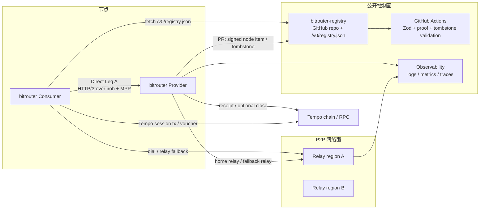
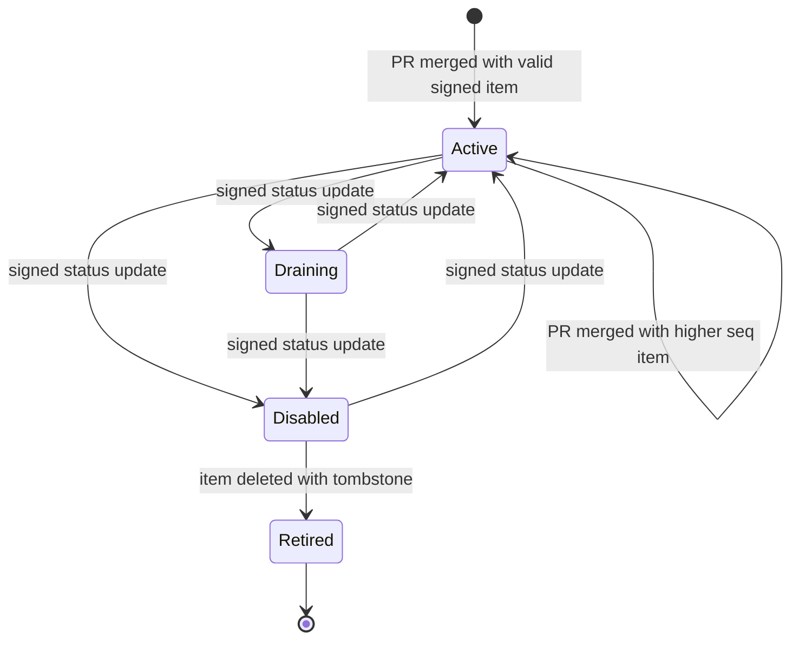

# 008-01 — P2P 正式环境网络拓扑与部署

> 状态：**v0.2 — 正式环境部署设计**。
>
> 本文负责 BitRouter P2P 网络从原型进入正式环境后的部署拓扑、环境分层、网络入口、运维与验收。主仓库代码集成见 [`008-02`](./008-02-main-repo-integration.md)；公开 Registry 数据仓库见 [`008-03`](./008-03-bitrouter-registry.md)。

---

## 0. 结论

v0 正式网络采用“公开静态 Registry 数据仓库 + 自托管 relay fleet + Provider/Consumer P2P Direct Leg A + Tempo payment”的部署形态：

关键决策：

1. v0 不做 DHT Registry，也不把 active provider 状态写入链上。
2. Registry 不部署 Supabase、Next.js、Vercel API、admin API 或数据库；它只是公开 GitHub 仓库中的 signed node item / tombstone 与 committed generated registry file。
3. Provider 与 Consumer 的 LLM 请求仍走 P2P Direct Leg A；Registry 不代理 LLM 流量。
4. Relay fleet 只负责 NAT / 防火墙穿透与连接可达性，不承载业务状态。
5. Tempo 是支付结算网络；Registry 不是支付 ledger，也不收取 registry mutation gas fee。

---

## 1. 环境分层

| 环境 | 用途 | Registry | Relay | Tempo | 节点 |
|---|---|---|---|---|---|
| local | 开发与单机集成 | 本地 fixture `registry.json` 或本地 clone 的 `bitrouter-registry` | local relay dev | Tempo Docker localnet | 单机多进程 |
| staging | 预发布与压测 | `bitrouter-registry` staging branch / fork committed `v0/registry.json` | 多 region staging relay | Tempo testnet / localnet nightly | 团队控制节点 |
| production | 公开 v0 网络 | GitHub raw `main/v0/registry.json` | 多 region production relay | Tempo main / approved network | 任意提交合法 signed item PR 的 Provider / Consumer |

### 1.1 local

local 环境用于开发验证，不要求公网可达：

- Registry 使用本地 fixture 或本地 `bitrouter-registry` clone 生成的 `v0/registry.json`。
- Relay 使用单实例 dev relay。
- Tempo 使用 Docker localnet。
- Provider / Consumer 使用不同 `BITROUTER_HOME` 在同机运行。
- 验收 Direct Leg A 的 402、credential、SSE、receipt、registry cache 与 proof verification。

### 1.2 staging

staging 环境模拟正式网络；早期可使用团队控制节点做稳定性验证，但 Registry 语义仍保持 permissionless file submission：

- Registry 使用 staging branch、fork 或独立 test registry URL。
- Relay 至少两个 region，以验证跨 region relay 选择与故障切换。
- Provider node item 必须走真实 proof / Zod / tombstone / generation validation 流程。
- 支持 forced-relay 压测：Provider 不暴露 direct addr，仅使用 relay。

### 1.3 production

production 面向真实 Provider 与 Consumer：

- Registry 默认 URL 为 `https://raw.githubusercontent.com/bitrouter/bitrouter-registry/main/v0/registry.json`。
- Relay fleet 多 region 部署，具备容量告警。
- Provider 通过 GitHub PR 提交 signed node item / tombstone 与 regenerated `v0/registry.json`；merge 后出现在 GitHub raw registry。
- Consumer 默认 fetch production registry，并在本地验证、缓存、过滤 active node。
- 所有正式收款使用真实 Tempo 网络与受控 escrow config。

---

## 2. 组件职责

### 2.1 `bitrouter-registry`

职责：

- 保存公开 registry source item：`nodes/*.json`。
- 保存 signed delete / retire proof：`tombstones/*.json`。
- 用根目录 TypeScript/Zod scripts、validator、GitHub Actions 校验 PR。
- 保存 committed generated artifact：`v0/registry.json`，供 GitHub raw 直接读取。
- 通过 Git history / PR discussion / tombstone 提供公开审计线索。

不做：

- 不代理 LLM 请求。
- 不托管 Provider 私钥。
- 不替代 Provider root proof。
- 不作为支付 ledger。
- 不做 Provider 准入；准入、KYC、商业关系和 curated set 留给未来 BitRouter Cloud PGW。
- 不提供 query API、publish API、admin API 或数据库服务。

### 2.2 Relay fleet

Relay 的目标是提高连接可达性：

- 提供 iroh relay endpoint。
- 支持 Provider / Consumer home relay。
- 提供 forced-relay fallback。
- 输出连接数、带宽、错误率、region、relay fallback rate。

Relay 不读取 HTTP/3 request body，不参与 MPP 验证，不保存 Provider 状态。

### 2.3 Provider node

Provider 是启用 `p2p.provider.enabled = true` 的 `bitrouter`：

- 暴露 Direct Leg A。
- 复用本机 `providers:` / `models:` 执行上游 LLM 调用。
- 使用 MPP / Tempo 收款。
- 导出 signed registry node item，并通过 PR 提交到 `bitrouter-registry`。
- 将 receipt fallback 写入本机数据库。

### 2.4 Consumer node

Consumer 是启用 `p2p.consumer.enabled = true` 的 `bitrouter`：

- 拉取 `/v0/registry.json`。
- 验证 node item proof、status、`valid_until`、pricing 与 endpoint。
- 将 `api_protocol: p2p` provider 路由为远端 P2P Provider。
- 自动处理 MPP 402 / credential retry。
- 校验 `Payment-Receipt` signed envelope 与 Provider proof。

### 2.5 Tempo / RPC

Tempo 网络提供：

- session open / voucher / close / settle 的链上基础。
- TIP-20 base units 结算资产。
- localnet / staging / production 的不同 RPC endpoint。

正式部署必须明确每个环境使用的 `chain_id`、RPC URL、escrow contract、currency token、funding / faucet 策略。

---

## 3. 网络入口与域名

| 服务 | 建议入口 | 说明 |
|---|---|---|
| Registry static file | `https://raw.githubusercontent.com/bitrouter/bitrouter-registry/main/v0/registry.json` | Consumer 默认读取入口；可配置 mirror |
| Registry repository | `https://github.com/bitrouter/bitrouter-registry` | Provider 通过 PR 提交 signed node item / tombstone |
| Relay region | `https://relay-{region}.bitrouter.ai` | iroh relay |
| Metrics | internal only | Prometheus / tracing / logs |

所有 public endpoint 必须使用 TLS。Registry static file 不需要 auth；Relay 不承载业务鉴权，但必须有滥用限制。

---

## 4. Provider 生命周期

生命周期规则：

1. Provider 本地生成 root identity 与 endpoint identity。
2. Provider 导出 signed node item。
3. Provider 通过 GitHub PR 创建、修改或删除 registry file item。
4. CI 校验 Zod schema、签名、tombstone、pricing、endpoint、payment config、`seq` 与 `valid_until`。
5. PR merge 后，合法 item 出现在 GitHub raw `/v0/registry.json`；不需要 publish API、账号或 mutation fee。
6. Consumer 默认只选择 `status: active` 且未过期的 node。
7. `draining` / `disabled` 是 Provider 自公告状态；永久退出可删除 item 并附带 signed tombstone。
8. `provider_id` / `node_id` 不复用。

---

## 5. Consumer 查询与缓存

Consumer 访问 Registry 的基本流程：

1. 拉取 `/v0/registry.json`。
2. 校验 registry 结构与 signed envelope。
3. 对每个 node item 验证 root proof。
4. 过滤 `status == active`、`valid_until > now`、model、region、payment method、`api_surface`。
5. 按本地 trust policy 选择 endpoint。
6. 建立 Direct Leg A。

缓存策略：

- 使用 HTTP `etag` / `last_modified` 做 conditional request。
- `registry.json` 中的 node item 带 `seq` / `valid_until`。
- 下载的新 registry 必须完整校验后才替换 last-known-good cache。
- 缓存命中不能绕过 `valid_until`。
- node 被删除、`disabled` 或 tombstone 后，下次成功 sync 会从可选 endpoint 集合中移除。

---

## 6. 观测与告警

### 6.1 Registry 指标

Registry 不运行服务，因此不产生 API / DB 指标。需要关注：

- GitHub Actions validation pass / fail。
- registry static file fetch success / failure。
- registry static file size。
- active node count。
- stale / expired node count。
- invalid registry download count on Consumer side。
- last-known-good cache age。

### 6.2 Relay 指标

- active connection count。
- relay bytes in/out。
- direct vs relay fallback ratio。
- per-region error rate。
- connection establishment latency。

### 6.3 Provider 指标

- Direct Leg A request count。
- MPP 402 count / credential success rate。
- SSE stream duration。
- receipt fallback hit rate。
- Tempo open / close / receipt error。

### 6.4 Consumer 指标

- Registry static fetch latency / failure count。
- registry verification failure count。
- endpoint dial latency。
- 402 retry success rate。
- receipt verification failure count。
- provider selection failure count。

---

## 7. 安全与运营边界

1. Provider registry item 必须验证 root proof。
2. 删除 item 必须有 signed tombstone。
3. Relay 不应成为中心化业务状态依赖；relay outage 只影响连接可达性。
4. GitHub repository history 是 v0 的公开审计源，但 Consumer 最终只信任通过签名验证的 Provider advertisement。
5. Provider 私钥不进入 Registry。
6. Consumer 不信任 static file 本身；必须本地验证 proof、status、`valid_until` 与 pricing。
7. abuse / spam 控制在 PR review、CI validation、Zod / policy limits、GitHub spam controls、relay rate limit 五层处理；不得把反滥用机制演变成维护者准入许可。

---

## 8. 正式环境验收

| 编号 | 标准 |
|---|---|
| DEP-1 | staging static Registry + staging relay + two-node Direct Leg A 通过 |
| DEP-2 | forced-relay 模式下 Consumer 可成功调用 Provider |
| DEP-3 | Provider 提交合法 signed node item PR 与 regenerated `v0/registry.json` → merge 后进入 GitHub raw `/v0/registry.json` → Consumer sync / verify / dial 全链路通过 |
| DEP-4 | Tempo localnet / staging payment lifecycle 验收通过 |
| DEP-5 | Registry raw fetch、Relay、Provider、Consumer 关键指标可观测 |
| DEP-6 | Registry validation CI 拒绝 Zod invalid / proof / seq / pricing / tombstone / generation failure |
| DEP-7 | Provider shutdown 通过 `status: disabled` 或 signed tombstone 删除后，Consumer 下次 sync 不再选择该 node |
| DEP-8 | relay region 故障时，Consumer 可切换到其他 relay 或明确失败 |
