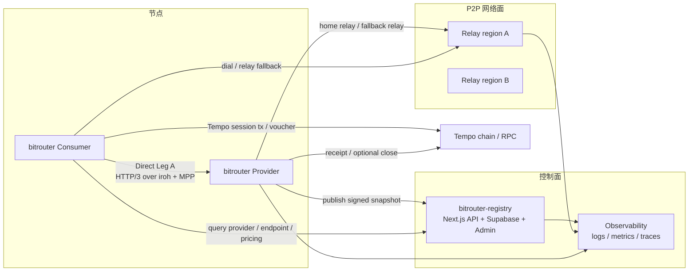
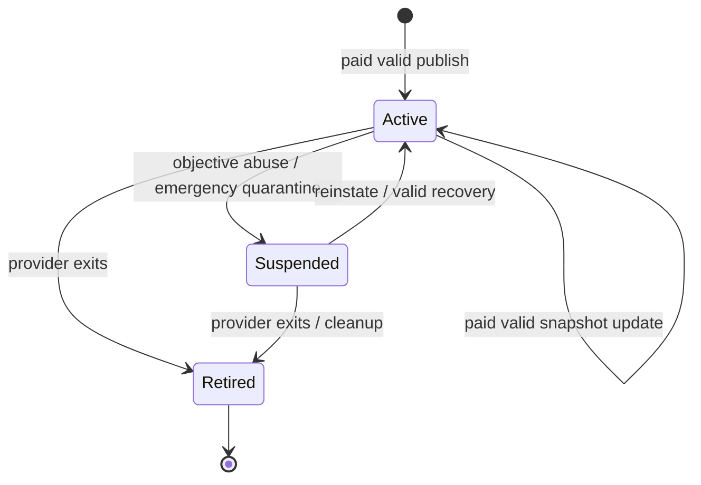

# 008-01 — P2P 正式环境网络拓扑与部署

> 状态：**v0.1 — 正式环境部署设计**。
>
> 本文负责 BitRouter P2P 网络从原型进入正式环境后的部署拓扑、环境分层、网络入口、运维与验收。主仓库代码集成见 [`008-02`](./008-02-main-repo-integration.md)；中心化 Registry 服务见 [`008-03`](./008-03-bitrouter-registry.md)。

---

## 0. 结论

v0 正式网络采用“中心化 Registry（Next.js + Supabase）+ 自托管 relay fleet + Provider/Consumer P2P Direct Leg A + Tempo payment”的部署形态：

关键决策：

1. v0 不做 DHT Registry，也不把 active provider 状态写入链上。
2. Registry 是团队维护的中心化状态服务，作为去中心化状态源的 v0 替代：用 Supabase 承担 CRUD / DB / 权限 / 扩容，用 Next.js 薄包装负责验签、MPP fee、API 稳定化和反滥用，但不做 Provider 准入。
3. Provider 与 Consumer 的 LLM 请求仍走 P2P Direct Leg A；Registry 不代理 LLM 流量。
4. Relay fleet 只负责 NAT / 防火墙穿透与连接可达性，不承载业务状态。
5. Tempo 是支付结算网络；Registry 不是支付 ledger。

---

## 1. 环境分层

| 环境 | 用途 | Registry | Relay | Tempo | 节点 |
|---|---|---|---|---|---|
| local | 开发与单机集成 | Supabase CLI local stack | local relay dev | Tempo Docker localnet | 单机多进程 |
| staging | 预发布与压测 | Vercel staging / preview + Supabase staging project | 多 region staging relay | Tempo testnet / localnet nightly | 团队控制节点 |
| production | 公开 v0 网络 | Vercel production + Supabase production project | 多 region production relay | Tempo main / approved network | 任意付费发布合法状态的 Provider / Consumer |

### 1.1 local

local 环境用于开发验证，不要求公网可达：

- Registry 使用 Supabase CLI local stack；Next.js API 使用本地 env 连接 local Supabase。
- Relay 使用单实例 dev relay。
- Tempo 使用 Docker localnet。
- Provider / Consumer 使用不同 `BITROUTER_HOME` 在同机运行。
- 验收 Direct Leg A 的 402、credential、SSE、receipt、数据库 fallback。

### 1.2 staging

staging 环境模拟正式网络；早期可使用团队控制节点做稳定性验证，但 Registry 语义仍保持 permissionless publish：

- Registry 使用独立 Supabase staging project 与 Vercel staging / preview deployment。
- Relay 至少两个 region，以验证跨 region relay 选择与故障切换。
- Provider snapshot 必须走真实 paid publish / verify / active 流程。
- 支持 forced-relay 压测：Provider 不暴露 direct addr，仅使用 relay。

### 1.3 production

production 面向真实 Provider 与 Consumer：

- Registry API 使用稳定域名与 TLS。
- Registry API 由 Vercel 部署的 Next.js Route Handlers 提供，数据库与权限复用 Supabase production project。
- Relay fleet 多 region 部署，具备容量告警。
- Provider 通过 Registry publish API 支付 network fee、提交 signed snapshot；合法状态自动 active，无需维护者许可。
- Consumer 默认使用 production Registry 查询 active Provider。
- 所有正式收款使用真实 Tempo 网络与受控 escrow config。

---

## 2. 组件职责

### 2.1 `bitrouter-registry`

职责：

- Provider / PGW 状态数据库，由 Supabase Postgres 承载。
- signed snapshot 存储与版本状态机。
- Provider endpoint / model / pricing 索引。
- paid publish / verify / active / suspend / retire 流程，由 Next.js API 编排并写入 Supabase。
- Consumer 查询 API，由 Next.js API 对 Supabase public views / tables 做稳定响应包装。
- Provider CLI publish API。
- Admin 权限、RLS、备份、扩容优先复用 Supabase / Vercel 基础设施。

不做：

- 不代理 LLM 请求。
- 不托管 Provider 私钥。
- 不替代 Provider root signature。
- 不作为支付 ledger。
- 不做 Provider 准入；准入、KYC、商业关系和 curated set 留给未来 BitRouter Cloud PGW。
- 不自研 CRUD 数据库服务；v0 使用 Supabase + TypeScript 薄包装。

### 2.2 Relay fleet

Relay 的目标是提高连接可达性：

- 提供 iroh relay endpoint。
- 支持 Provider / Consumer home relay。
- 提供 forced-relay fallback。
- 输出连接数、带宽、错误率、region、relay fallback rate。

Relay 不读取 HTTP/3 request body，不参与 MPP 验证，不保存 Provider 状态。

### 2.3 Provider node

Provider 是启用 `p2p.provider.enabled = true` 的 `bitrouter`：

- 暴露 Direct Leg A。
- 复用本机 `providers:` / `models:` 执行上游 LLM 调用。
- 使用 MPP / Tempo 收款。
- 将 signed snapshot 发布到 Registry。
- 将 receipt fallback 写入本机数据库。

### 2.4 Consumer node

Consumer 是启用 `p2p.consumer.enabled = true` 的 `bitrouter`：

- 查询 Registry。
- 将 `api_protocol: p2p` provider 路由为远端 P2P Provider。
- 自动处理 MPP 402 / credential retry。
- 校验 `Payment-Receipt` 与 `Payment-Receipt-Sig`。

### 2.5 Tempo / RPC

Tempo 网络提供：

- session open / voucher / close / settle 的链上基础。
- TIP-20 base units 结算资产。
- localnet / staging / production 的不同 RPC endpoint。

正式部署必须明确每个环境使用的 `chainId`、RPC URL、escrow contract、currency token、funding / faucet 策略。

---

## 3. 网络入口与域名

| 服务 | 建议域名 | 说明 |
|---|---|---|
| Registry API | `https://registry.bitrouter.ai` | Vercel / Next.js API；Consumer 查询与 Provider publish |
| Registry Admin | `https://registry-admin.bitrouter.ai` | Next.js 内部页面或 Supabase Dashboard；反滥用 / 紧急治理后台，可内网 / VPN 限制 |
| Relay region | `https://relay-{region}.bitrouter.ai` | iroh relay |
| Metrics | internal only | Prometheus / tracing / logs |

所有 public endpoint 必须使用 TLS。Registry API 与 Admin API 分离鉴权；Supabase service role key 只能存在服务端 secret；Relay 不承载业务鉴权，但必须有滥用限制。

---

## 4. Provider 生命周期

生命周期规则：

1. Provider 本地生成 root identity 与 endpoint identity。
2. Provider 导出或直接 publish signed snapshot。
3. Registry 对 mutation request 收取小额 MPP network fee。
4. Registry 校验 schema、签名、pricing、endpoint、payment config、`seq` 与 `valid_until`。
5. 合法且已付费的状态写入自动变为 `active`，不需要维护者 approve。
6. Consumer 默认只查询 `active` Provider。
7. `suspended` 只用于客观滥用、协议攻击、恶意垃圾写入、法律/安全紧急处置等反滥用场景；它不是准入失败。
8. `retired` Provider root id 不复用。

---

## 5. Consumer 查询与缓存

Consumer 访问 Registry 的基本流程：

1. 拉取 model query 结果：`model + region + payment method + api_surface`。
2. 获得 Provider snapshot、endpoint、pricing、relay hints。
3. 本地验证 snapshot root signature。
4. 按策略选择 endpoint。
5. 建立 Direct Leg A。

缓存策略：

- active Provider 查询结果可短缓存。
- snapshot 带 `seq` / `valid_until`。
- Registry 返回 `etag` / `last_modified`，Consumer 可条件请求。
- 缓存命中不能绕过 `valid_until`。
- Registry 明确返回 suspended / retired 时，本地缓存必须失效。

---

## 6. 观测与告警

### 6.1 Registry 指标

- Vercel API QPS / latency / error rate。
- Supabase DB CPU / connection / slow query / storage。
- publish accepted / invalid / unpaid count。
- mutation fee paid / failed count。
- active Provider count。
- stale snapshot count。
- suspended reason distribution。

### 6.2 Relay 指标

- active connection count。
- relay bytes in/out。
- direct vs relay fallback ratio。
- per-region error rate。
- connection establishment latency。

### 6.3 Provider 指标

- Direct Leg A request count。
- MPP 402 count / credential success rate。
- SSE stream duration。
- receipt fallback hit rate。
- Tempo open / close / receipt error。

### 6.4 Consumer 指标

- Registry query latency。
- endpoint dial latency。
- 402 retry success rate。
- receipt verification failure count。
- provider selection failure count。

---

## 7. 安全与运营边界

1. Registry admin 必须使用 Supabase Auth / service-side role check 强鉴权与审计日志。
2. Provider snapshot publish 必须验证 root signature。
3. Relay 不应成为中心化业务状态依赖；relay outage 只影响连接可达性。
4. Supabase production DB 是 v0 网络状态权威源，必须备份、迁移、审计。
5. Provider 私钥不进入 Registry。
6. Consumer 不信任 Registry 返回内容本身，只信任通过签名验证的 snapshot 与当前 Registry 状态。
7. abuse / spam 控制在 mutation MPP network fee、rate limit、relay rate limit、紧急 suspend 四层处理；不得把反滥用机制演变成维护者准入许可。

---

## 8. 正式环境验收

| 编号 | 标准 |
|---|---|
| DEP-1 | staging Registry + staging relay + two-node Direct Leg A 通过 |
| DEP-2 | forced-relay 模式下 Consumer 可成功调用 Provider |
| DEP-3 | Provider 支付 network fee 并 publish 合法 signed snapshot → 自动 active → Consumer query 全链路通过 |
| DEP-4 | Tempo localnet / staging payment lifecycle 验收通过 |
| DEP-5 | Registry、Relay、Provider、Consumer 关键指标可观测 |
| DEP-6 | Supabase DB 备份、迁移、RLS policy 与 restore 流程可演练 |
| DEP-7 | suspend Provider 后 Consumer 默认查询不再返回该 Provider，且 suspend 只用于客观反滥用 / 紧急治理 |
| DEP-8 | relay region 故障时，Consumer 可切换到其他 relay 或明确失败 |
