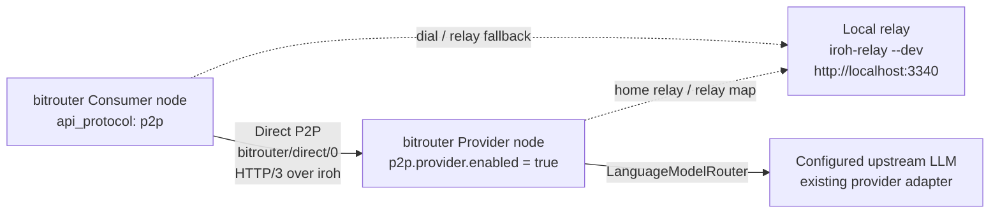

# 008-02 — 主 `bitrouter` 仓库 P2P Direct 集成 PRD

> 状态：**v0.5 — Provider / Consumer 本地 relay MVP PRD**。
>
> 本文负责主仓库 [`bitrouter/bitrouter`](https://github.com/bitrouter/bitrouter) 的 P2P 代码集成、阶段拆分与验收标准。正式环境部署见 [`008-01`](./008-01-network-deployment.md)；公开 Registry 数据仓库见 [`008-03`](./008-03-bitrouter-registry.md)；协议编码、签名与错误对象见 [`001-03`](./001-03-protocol-conventions.md)。

---

## 0. 结论

主仓库 P2P MVP 的目标是：

> **一个 Provider node 可以接入 BitRouter P2P 网络；一个 Consumer node 可以通过 P2P 网络正确请求到该 Provider node。第一阶段先使用本地 `iroh-relay --dev` 跑通，不要求必须使用远程 relay。**

第一阶段不先做完整 Registry、MPP、Tempo lifecycle 或 PGW Session，而是先开发 `bitrouter-p2p::primitives` 模块。该模块必须把 v3 原型已经验证过的 base58btc 编解码、Ed25519 身份、JCS payload hash、签名、验签和 signed envelope proof 机制沉淀成主仓库可复用的基础能力，并提供完备的、自举的单元测试和集成测试。

主仓库集成按以下顺序推进：

| Phase | 目标 | 是否本 PRD 阻塞 |
|---|---|---|
| 0 | `bitrouter-p2p::primitives`：base58btc、identity、digest、JCS、sign、verify、signed envelope | **是，第一交付** |
| 1 | `bitrouter-p2p` crate skeleton、feature wiring、config schema、本地 relay config | 是 |
| 2 | Provider node 通过 iroh endpoint 接入本地 relay，并导出可验证 node descriptor / registry item | 是 |
| 3 | Consumer node 读取目标 Provider descriptor，经过本地 relay 建立 Direct P2P HTTP/3 连接 | 是 |
| 4 | Consumer 对 Provider 发起 OpenAI-compatible chat request，并收到正确 response stream / body | 是 |
| 5 | 远程 relay、Registry `/v0/registry.json`、MPP / Tempo payment、receipt envelope、Anthropic surface | 后续增强，不阻塞最小本地 relay MVP |

本 PRD 将 Phase 0 写成详细工程规格和验收标准；后续 Phase 1-4 给出主仓库 MVP 的明确边界，保证 primitives 开发不会偏离最终 provider/consumer 本地 relay 连通目标。远程 relay `https://ap-southeast-1.relay.v0.bitrouter.ai` 保留为后续 staging / production 验收目标。

---

## 1. 范围与非目标

### 1.1 范围内

| 类别 | 本 PRD 要求 |
|---|---|
| 主仓库 crate | 新增 `bitrouter-p2p` companion crate，Rust import path 为 `bitrouter_p2p` |
| 第一阶段模块 | `bitrouter_p2p::primitives`，不依赖 iroh、h3、MPP、Tempo、数据库或 `bitrouter` binary |
| 编码 | BitRouter-owned opaque bytes 使用无 multibase 前缀的 base58btc |
| 身份 | Ed25519 public key wire form 固定为 `ed25519:<base58btc(32 bytes)>` |
| 签名 | Ed25519 signature wire form 固定为裸 `<base58btc(64 bytes)>` |
| Digest | SHA-256 digest wire form 固定为 `sha256:<base58btc(32 bytes)>` |
| JCS | payload hash 和 proof signing input 使用 RFC 8785 JSON Canonicalization Scheme |
| Signed envelope | 支持 `{ type, payload, proofs[] }` 与 `bitrouter/proof/ed25519-jcs/0` |
| 自举测试 | 单元 / 集成测试不依赖网络、不依赖外部 registry、不依赖外部二进制生成 fixture |
| 本地 relay MVP | Provider 与 Consumer 默认使用本地 `iroh-relay --dev`，relay URL 为 `http://localhost:3340` |
| Direct request | Consumer 可以通过 P2P Direct path 请求 Provider 的 OpenAI-compatible `/v1/chat/completions` |

### 1.2 非目标

- 不在第一阶段实现 PGW Session path。
- 不在第一阶段实现完整 MPP / Tempo 支付闭环；支付对象必须保留协议设计位置，但不阻塞本地 relay 连通 MVP。
- 不在第一阶段实现 Registry public repo 的 PR / CI / generator；该规范已由 [`008-03`](./008-03-bitrouter-registry.md) 固化，主仓库后续只实现 client / export 能力。
- 不把 `bitrouter-p2p::primitives` 拆成单独 crate；先保留在 `bitrouter-p2p` 内部模块。
- 不在 `bitrouter-core` 中引入 iroh / h3 / network runtime 重依赖。
- 不恢复自写 MPP core、mock chain、JWS voucher、HTTP/1 stream shim over QUIC 或旧 inline signature 格式。

---

## 2. 目标网络拓扑

MVP 网络拓扑：



验收时至少要证明：

1. 本地启动 `iroh-relay --dev`，relay HTTP URL 为 `http://localhost:3340`。
2. Provider node 使用本地 Ed25519 identity 启动 iroh endpoint，并配置本地 relay。
3. Consumer node 能使用 Provider 的 node descriptor / endpoint info 进行 dial。
4. Direct connection 使用 ALPN `bitrouter/direct/0`。
5. Consumer 能发出一个 OpenAI-compatible chat request。
6. Provider 复用主仓库既有 routing / provider adapter，返回正确 response。
7. forced-relay 模式下也能通过；测试不得只依赖同机 direct address 成功。

---

## 3. `bitrouter-p2p` crate 形态

### 3.1 Workspace

新增 workspace member：

```text
bitrouter-p2p/
├── Cargo.toml
├── src/
│   ├── lib.rs
│   ├── primitives/
│   │   ├── mod.rs
│   │   ├── base58.rs
│   │   ├── digest.rs
│   │   ├── identity.rs
│   │   ├── jcs.rs
│   │   ├── envelope.rs
│   │   └── error.rs
│   ├── config.rs
│   ├── identity_store.rs
│   ├── registry_client.rs
│   ├── transport/
│   │   ├── mod.rs
│   │   ├── iroh.rs
│   │   └── h3.rs
│   ├── consumer/
│   │   ├── mod.rs
│   │   └── model.rs
│   ├── provider/
│   │   ├── mod.rs
│   │   └── server.rs
│   └── error.rs
└── tests/
    ├── primitives_vectors.rs
    ├── primitives_envelope.rs
    └── public_relay_smoke.rs
```

`bitrouter_p2p::primitives` 是其它模块的基础，不得依赖 transport、registry client、consumer、provider 或主 `bitrouter` binary。

### 3.2 Feature

主仓库新增 `p2p` feature：

```toml
p2p = ["dep:bitrouter-p2p"]
```

默认 feature 是否立刻包含 `p2p` 由主仓库发布策略决定；但代码必须满足：

1. 启用 `p2p` 时可以构建 provider / consumer P2P runtime。
2. 禁用 `p2p` 时不编译 iroh / h3 / relay 相关重依赖。
3. `ApiProtocol::P2p` 可以被配置层识别；若 binary 未启用 `p2p` feature，运行时返回明确错误：`bitrouter was built without p2p feature`。

---

## 4. Phase 0：`bitrouter-p2p::primitives`

### 4.1 设计目标

`primitives` 负责所有 BitRouter P2P 自有 wire primitive：

| 能力 | API 要求 |
|---|---|
| base58btc | encode / decode arbitrary bytes；严格拒绝非法字符、空串、non-canonical representation |
| identity | parse / format `ed25519:<base58btc(32 bytes)>`；从 Ed25519 verifying key 构造 identity |
| signature | parse / format `<base58btc(64 bytes)>`；从 Ed25519 signature 构造 wire string |
| digest | `sha256(JCS(payload))` → `sha256:<base58btc(32 bytes)>` |
| JCS | 对 `serde_json::Value` 生成 RFC 8785 canonical bytes |
| signing input | 固定 `bitrouter-signature-input/0\n` + JCS object |
| proof | `bitrouter/proof/ed25519-jcs/0` protected header 与 signature |
| envelope | generic signed envelope parse / sign / verify |
| errors | typed error enum，可区分 encoding、type mismatch、payload hash mismatch、bad signer、bad signature |

Rust API 形态示意：

```rust
pub mod primitives {
    pub struct Base58Bytes(Vec<u8>);
    pub struct Ed25519Identity(String);
    pub struct Sha256Digest(String);
    pub struct Ed25519Signature(String);

    pub struct SignedEnvelope<T> {
        pub r#type: String,
        pub payload: T,
        pub proofs: Vec<Proof>,
    }

    pub struct Proof {
        pub protected: ProofProtected,
        pub signature: Ed25519Signature,
    }

    pub struct ProofProtected {
        pub r#type: String,
        pub payload_type: String,
        pub signer: Ed25519Identity,
        pub payload_hash: Sha256Digest,
    }
}
```

最终实现不必逐字采用上述类型名，但必须提供等价的类型安全边界，不能用裸 `String` 在业务层反复手写解析。

### 4.2 编码规则

必须严格实现 [`001-03 §2`](./001-03-protocol-conventions.md#2-base58btc-bytes-encoding)：

| 数据 | Wire form | 长度 |
|---|---|---|
| Ed25519 public key | `ed25519:<base58btc>` | decode 后 32 bytes |
| Ed25519 signature | `<base58btc>` | decode 后 64 bytes |
| SHA-256 digest | `sha256:<base58btc>` | decode 后 32 bytes |
| Generic bytes | `<base58btc>` | 调用方指定 expected length 或允许 arbitrary length |

拒绝：

- 空串。
- multibase `z` 前缀。
- z-base32。
- base64url signature。
- hex public key / digest。
- base58 alphabet 外字符，尤其 `0`、`O`、`I`、`l`。
- decode 后 re-encode 不等于原字符串的 non-canonical input。

### 4.3 签名规则

Ed25519-JCS proof 必须实现 [`001-03 §5`](./001-03-protocol-conventions.md#5-ed25519--jcs-proof)：

```text
bitrouter-signature-input/0\n
JCS({
  "type": envelope.type,
  "payload": envelope.payload,
  "protected": proof.protected
})
```

验证顺序：

1. parse envelope。
2. 校验 envelope top-level `type` 等于调用方期望 type。
3. 校验 `proof.protected.type == "bitrouter/proof/ed25519-jcs/0"`。
4. 校验 `proof.protected.payload_type == envelope.type`。
5. 计算 `sha256(JCS(envelope.payload))` 并比较 `payload_hash`。
6. 从 `proof.protected.signer` 解出 Ed25519 verifying key。
7. 构造 signing input 并验签。
8. 执行业务层传入的 signer binding，例如 Registry node item 要求 signer 等于 `payload.provider_id`。

`primitives` 只负责 cryptographic verification 和通用 type / hash checks；provider_id、seq、valid_until、node status 等业务规则留给 registry / runtime 层。

### 4.4 Type IDs

`primitives` 至少应提供常量：

```rust
pub const TYPE_PROOF_ED25519_JCS: &str = "bitrouter/proof/ed25519-jcs/0";
pub const TYPE_REGISTRY_NODE: &str = "bitrouter/registry/node/0";
pub const TYPE_REGISTRY_TOMBSTONE: &str = "bitrouter/registry/tombstone/0";
pub const TYPE_PAYMENT_RECEIPT: &str = "bitrouter/payment/receipt/0";
pub const TYPE_ERROR: &str = "bitrouter/error/0";
pub const ALPN_DIRECT: &str = "bitrouter/direct/0";
```

是否把全部 Type IDs 放在 `primitives::types` 或未来共享模块中，由实现决定；但不得在 consumer / provider runtime 中散落字符串字面量。

### 4.5 自举测试要求

测试必须是 self-contained：

1. 不访问网络。
2. 不读取用户 HOME、系统 keychain 或外部 wallet。
3. 不依赖 `bitrouter-registry` 仓库。
4. 不依赖原型仓库生成 fixture。
5. 不依赖当前时间。
6. 使用固定 seed 生成 Ed25519 keypair，或在测试中内联固定 raw bytes。
7. 若提交 JSON fixture，fixture 必须由测试本身可重新计算并验证，不接受“只比较快照文本”。

推荐测试文件：

```text
bitrouter-p2p/tests/primitives_vectors.rs
bitrouter-p2p/tests/primitives_envelope.rs
```

最低测试矩阵：

| 编号 | 测试 |
|---|---|
| PRIM-1 | base58btc round-trip：空 leading zero、普通 bytes、32 bytes key、64 bytes signature |
| PRIM-2 | base58btc rejects：空串、`z...` multibase、hex、base64url、非法字符、non-canonical input |
| PRIM-3 | Ed25519 identity parse / format；长度不是 32 bytes 时失败 |
| PRIM-4 | Signature parse / format；长度不是 64 bytes 时失败 |
| PRIM-5 | SHA-256 digest parse / format；长度不是 32 bytes 时失败 |
| PRIM-6 | JCS object key reorder 不影响 digest；array reorder 改变 digest |
| PRIM-7 | deterministic keypair signs a `bitrouter/registry/node/0` payload and verifies |
| PRIM-8 | tampered payload fails payload_hash check |
| PRIM-9 | tampered `protected.payload_type` fails |
| PRIM-10 | tampered `protected.signer` fails |
| PRIM-11 | signature from wrong key fails |
| PRIM-12 | envelope with inline `signature` / `sig` inside payload is rejected if caller enables signed-object payload lint |
| PRIM-13 | payment receipt envelope can be signed and verified with the same primitive API |
| PRIM-14 | all errors expose stable machine-readable error kind for tests and future CLI messages |

验收命令：

```bash
cargo test -p bitrouter-p2p primitives
cargo test -p bitrouter-p2p --test primitives_vectors
cargo test -p bitrouter-p2p --test primitives_envelope
cargo clippy -p bitrouter-p2p --all-targets --all-features
cargo fmt --all --check
```

---

## 5. Phase 1：config 与 identity

### 5.1 节点配置

建议配置：

```yaml
p2p:
  enabled: true
  identity:
    key_file: p2p/identity.ed25519
  relay:
    urls:
      - http://localhost:3340
    force_relay: true
  registry:
    raw_url: https://raw.githubusercontent.com/bitrouter/bitrouter-registry/main/v0/registry.json
    cache_dir: p2p/registry-cache
    refresh_interval_secs: 300
  consumer:
    enabled: true
  provider:
    enabled: true
    expose_models:
      claude-3-5-sonnet-20241022: default
```

Rules：

1. 本地 MVP 的 `relay.urls` 默认使用 `http://localhost:3340`，由 `iroh-relay --dev` 提供。
2. `force_relay: true` 用于验收与故障复现：Provider descriptor 不暴露 direct addresses，Consumer 必须经本地 relay 成功连接。
3. identity 文件生成、加载、权限检查、public identity 导出必须使用 `primitives` 的 Ed25519 wire format。
4. 配置层只保存 serde data，不直接依赖 iroh / h3 heavy runtime。
5. `https://ap-southeast-1.relay.v0.bitrouter.ai` 是后续 staging / production relay 示例，不是第一阶段本地 MVP 的阻塞条件。

### 5.2 Provider target

Consumer 侧 provider target：

```yaml
providers:
  remote-sonnet:
    api_protocol: p2p
    p2p:
      provider_id: ed25519:...
      endpoint_id: ed25519:...
      relay_urls:
        - http://localhost:3340
      model: claude-3-5-sonnet-20241022
      api_surface: openai_chat_completions

models:
  sonnet-p2p:
    strategy: priority
    endpoints:
      - provider: remote-sonnet
        model_id: claude-3-5-sonnet-20241022
```

Registry client 完成前，MVP 可以使用显式 provider target；Registry client 完成后，显式 target 与 `/v0/registry.json` 解析结果应收敛到同一个 internal `P2pProviderTarget`。

---

## 6. Phase 2-4：Provider / Consumer Direct P2P MVP

### 6.1 Provider role

Provider node 是启用 `p2p.provider.enabled = true` 的 `bitrouter` 进程：

1. 加载 Ed25519 identity。
2. 启动 iroh endpoint。
3. 配置 relay map，默认包含 `http://localhost:3340`。
4. 监听 ALPN `bitrouter/direct/0`。
5. 在 HTTP/3 request 到达后复用主仓库既有 `LanguageModelRouter`。
6. 返回 OpenAI-compatible response。
7. 暴露本地命令输出 node descriptor，供 Consumer config 或 Registry item 使用。

Provider node descriptor 最低字段：

```jsonc
{
  "type": "bitrouter/registry/node/0",
  "payload": {
    "node_id": "ed25519:<base58btc>",
    "provider_id": "ed25519:<base58btc>",
    "seq": 1,
    "status": "active",
    "valid_until": "2026-07-01T00:00:00Z",
    "endpoints": [
      {
        "endpoint_id": "ed25519:<base58btc>",
        "status": "active",
        "region": "local",
        "relay_urls": ["http://localhost:3340"],
        "direct_addrs": [],
        "api_surfaces": ["openai_chat_completions"]
      }
    ],
    "models": []
  },
  "proofs": []
}
```

MVP 可以先输出 unsigned descriptor 用于 local config，但进入 Registry / public repo 前必须使用 `primitives` 生成 signed envelope。

### 6.2 Consumer role

Consumer node 是把 `api_protocol: p2p` provider target 路由为远端 P2P Provider 的 `bitrouter` 进程：

1. 读取显式 target 或 Registry cache。
2. 验证 target 中的 identity / endpoint encoding。
3. 通过 relay map dial Provider endpoint。
4. 建立 HTTP/3 over iroh connection。
5. 发起 `POST /v1/chat/completions`。
6. 接收 response body / stream。
7. 将结果返回给调用方，与普通 HTTP provider adapter 的模型响应语义一致。

第一版 Direct P2P MVP 的 request 可以暂不启用 MPP credential gate；但 runtime 边界必须预留 payment middleware 插入点，后续接入 `WWW-Authenticate: Payment`、`Authorization: Payment` 与 `Payment-Receipt` signed envelope 时不需要重写 transport。

### 6.3 API surface

MVP 必须支持：

| `api_surface` | HTTP/3 path | 验收 |
|---|---|---|
| `openai_chat_completions` | `POST /v1/chat/completions` | non-streaming 或 streaming 至少一种端到端通过；若主仓库默认路由已支持 streaming，则验收 streaming |

后续再加入：

- `anthropic_messages`
- `/v1/responses`
- payment-required Direct request
- receipt fallback

---

## 7. Registry 集成位置

Registry 规范由 [`008-03`](./008-03-bitrouter-registry.md) 定义。主仓库的职责是：

1. Consumer client 读取 GitHub raw `/v0/registry.json`。
2. 使用 `primitives` 验证每个 `bitrouter/registry/node/0` envelope proof。
3. 本地过滤 `status`、`valid_until`、model、api_surface、pricing、region、endpoint。
4. Provider CLI 导出 signed node item / tombstone。
5. 不实现 Registry publish API、query API、admin API、Supabase / Next.js / Vercel 服务或 mutation fee。

Registry client 不是 Phase 0 阻塞项，但 `primitives` API 必须足够验证 `008-03` 的 node item 与 tombstone。

---

## 8. 错误与日志

MVP 错误分层：

| 层 | 错误例子 | 要求 |
|---|---|---|
| primitives | invalid base58, wrong key length, payload hash mismatch, bad signature | typed error kind；测试可精确断言 |
| config | missing identity, invalid relay URL, invalid provider_id | 启动失败并给出明确 config path |
| relay / dial | relay unavailable, endpoint not found, ALPN rejected | consumer request 返回可诊断错误；日志包含 relay URL 和 endpoint_id |
| HTTP/3 | path unsupported, malformed request, response stream error | 映射到主仓库现有 provider error 语义 |
| future payment | missing credential, invalid voucher, receipt unavailable | 使用 `bitrouter/error/0`，不回退到 URL-based top-level `type` |

日志中的 identity 必须使用 `ed25519:<base58btc>`；不得把 iroh internal hex public key 作为协议 JSON 或用户可复制配置输出。

---

## 9. 安全与边界

1. `primitives` 不保存私钥到磁盘；identity store 另行负责 key file。
2. signing API 不应把 secret key 暴露给 consumer / provider runtime 的普通业务对象。
3. 所有 verifier 默认 fail closed。
4. 不允许 broad `catch` / silent fallback 接受旧格式。
5. Provider descriptor 中的 relay URL 必须是 URL parse 后的 URL；本地 MVP relay 为 `http://localhost:3340`。进入 staging / production 后再要求 HTTPS relay URL，例如 `https://ap-southeast-1.relay.v0.bitrouter.ai`。
6. `force_relay` 验收必须避免 direct address 偶然成功掩盖 relay 问题。
7. Public relay 不承载业务鉴权；Provider 仍必须在应用层保留后续 payment / auth middleware 插入点。

---

## 10. 分阶段验收标准

### 10.1 Phase 0：primitives 验收

| 编号 | 标准 |
|---|---|
| P0-1 | 新增 `bitrouter-p2p` crate 与 `bitrouter_p2p::primitives` module |
| P0-2 | base58btc encode / decode 覆盖正常、leading zero、非法字符、空串、non-canonical input |
| P0-3 | `ed25519:<base58btc>` identity parse / format / length validation 完备 |
| P0-4 | signature 与 SHA-256 digest wire types 有类型边界，不在业务层使用裸 `String` |
| P0-5 | JCS canonicalization 与 `sha256:<base58btc>` payload hash 测试通过 |
| P0-6 | Ed25519-JCS signed envelope sign / verify 通过 |
| P0-7 | tamper payload、payload_type、payload_hash、signer、signature 均失败 |
| P0-8 | Registry node item、tombstone、payment receipt 至少各有一个自举集成测试 |
| P0-9 | tests 不访问网络、不依赖外部文件、不依赖当前时间 |
| P0-10 | `cargo test -p bitrouter-p2p`、`cargo clippy -p bitrouter-p2p --all-targets --all-features`、`cargo fmt --all --check` 通过 |

### 10.2 Phase 1：config / feature 验收

| 编号 | 标准 |
|---|---|
| P1-1 | workspace 可在启用 `p2p` feature 时编译 `bitrouter-p2p` |
| P1-2 | 禁用 `p2p` feature 时不编译 iroh / h3 heavy dependency |
| P1-3 | config 支持 `p2p.relay.urls`，本地 MVP 默认或示例包含 `http://localhost:3340` |
| P1-4 | `api_protocol: p2p` 可被配置层解析；未启用 feature 时运行时错误明确 |
| P1-5 | identity generate / load / display 使用 `primitives` wire format |

### 10.3 Phase 2-4：本地 relay MVP 验收

| 编号 | 标准 |
|---|---|
| P2-1 | Provider node 启动后输出 provider_id、endpoint_id、relay_urls |
| P2-2 | Provider node descriptor 中 relay URL 为 `http://localhost:3340` |
| P2-3 | Consumer node 能使用显式 P2P target dial Provider |
| P2-4 | Direct connection ALPN 为 `bitrouter/direct/0` |
| P2-5 | 本地 `iroh-relay --dev` forced-relay smoke 通过，测试不依赖 direct_addrs |
| P2-6 | Consumer 对 Provider 发起 `/v1/chat/completions` 并收到正确 response |
| P2-7 | Provider 复用主仓库 `LanguageModelRouter` / provider adapter，不复制上游模型调用逻辑 |
| P2-8 | relay unavailable / wrong endpoint / wrong identity 时错误可诊断 |
| P2-9 | smoke test 可在两套 `BITROUTER_HOME` 下运行 provider / consumer 两个进程 |
| P2-10 | public relay smoke 默认可跳过 CI，但必须有手动验收脚本和明确环境变量 |

---

## 11. 建议实施顺序

1. 新增 `bitrouter-p2p` crate，只包含 `primitives` 与测试。
2. 实现 base58btc codec、typed identity / signature / digest。
3. 实现 JCS payload hash 与 Ed25519-JCS signed envelope。
4. 补齐 self-contained unit / integration tests。
5. 接入 workspace、fmt、clippy、test。
6. 添加 `p2p` feature wiring 与 config schema。
7. 实现 identity store 与 Provider descriptor export。
8. 接入 iroh endpoint、relay URL config、ALPN `bitrouter/direct/0`。
9. 实现 Provider HTTP/3 listener 与 Consumer HTTP/3 client。
10. 添加 two-process local smoke。
11. 添加本地 `iroh-relay --dev` forced-relay smoke。
12. 后续再接 Registry `/v0/registry.json` client、MPP / Tempo payment 与 receipt envelope。

---

## 12. 与最新原型成果的关系

v3 原型已经证明：

1. Type ID、base58btc、JCS signed envelope、Ed25519-JCS proof 可以在 Rust 中实现并通过 Direct / Session / Registry 路径验证。
2. Static Registry `/v0/registry.json` 模型已经在 `008-03` 规范化。
3. Direct receipt、Tempo voucher wrapper、BitRouter error object 等对象格式已经收敛。

主仓库不应把原型代码逐字搬运成长期架构；但应复用其已经验证的协议边界。`bitrouter-p2p::primitives` 是把这些边界沉淀到主仓库的第一步。只有 primitives 稳定且测试自举后，Provider / Consumer 本地 relay MVP 才能避免在 transport、registry、payment 中重复实现编码与验签逻辑；远程 relay 验收应在本地链路稳定后再进入 staging / production 阶段。
