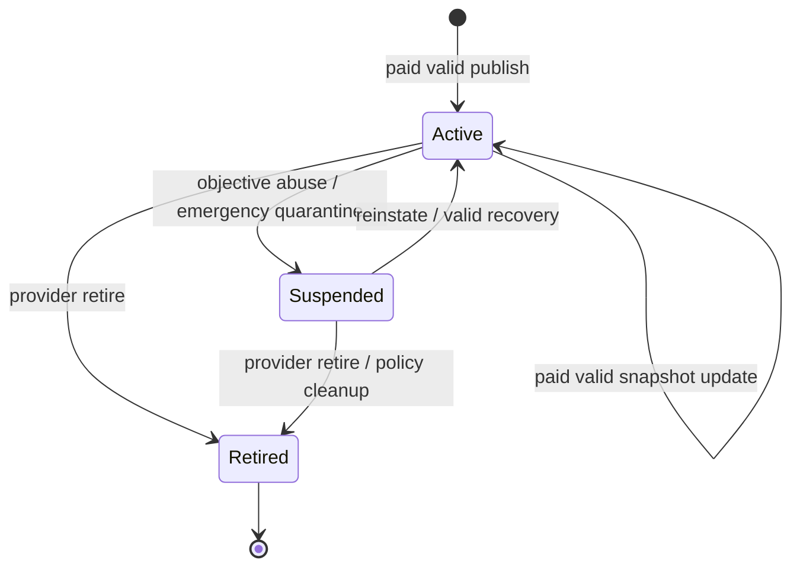

# 008-03 — `bitrouter-registry`：v0 网络中心化状态服务

> 状态：**v0.2 — Supabase + Next.js 实现设计**。
>
> 本文定义 `bitrouter-registry` 服务的职责、状态模型、数据库、API 与运维边界。它是 v0 P2P 网络的中心化状态源，不是 DHT，不是链上 Registry。正式网络部署见 [`008-01`](./008-01-network-deployment.md)；主仓库集成见 [`008-02`](./008-02-main-repo-integration.md)。

---

## 0. 结论

`bitrouter-registry` 是团队维护的中心化服务，但它在协议语义上只是“去中心化状态源的 v0 中心化替代”：

- 保存 Provider / PGW / endpoint / model / pricing / snapshot 状态；
- 对状态写入请求做 MPP gas fee 校验、签名校验、schema 校验与状态机校验；
- 合法且已支付网络费用的 Provider snapshot 自动进入 active 状态；
- 为 Consumer 提供查询 API；
- 为 Provider CLI 提供 publish API；
- 保留 signed snapshot 模型，使未来仍可迁移到更去中心化的状态源。

实现上不再优先使用 Rust 自研 CRUD 服务。v0 Registry 是简单状态服务，应直接采用 **Supabase + TypeScript 薄包装 + Next.js + Vercel**：

- Supabase Postgres 承担主要 CRUD、索引、迁移、备份、权限、扩容与审计基础设施；
- Next.js App Router / Route Handlers 提供协议级 API 包装、签名校验、MPP 402 challenge / credential 校验编排、响应格式稳定化；
- Vercel 承担 Web/API 部署、preview environment、edge/network 入口、日志与告警接入；
- Admin 权限优先复用 Supabase Auth、RLS、service role、dashboard / SQL policy，而不是自研 admin 后台。

不做：

- 不代理 LLM 请求；
- 不保存 Provider 私钥；
- 不替代 Provider root signature；
- 不作为 Tempo ledger；
- 不实现 DHT discovery；
- 不把 active provider 状态写入链上。
- 不做 Provider 准入、不要求维护者同意、不做 KYC / curated set 判断。

任何 Provider node 只要能：

1. 提交合法 signed snapshot；
2. 通过 `provider_id` root signature 验证；
3. 支付状态写入所需的小额 MPP network fee；
4. 满足 `seq` / `valid_until` / schema / pricing 等客观规则；

就可以自由加入 v0 P2P 网络。准入、商业关系、客户入口、发票、KYC、风控和 curated provider set 留给未来 BitRouter Cloud PGW 或其他 PGW 实现。

---

## 1. 实现职责与技术边界

建议仍保留独立仓库 `bitrouter-registry`，但它是 Next.js / TypeScript 服务，不是 Rust workspace：

```text
bitrouter-registry/
├── app/
│   ├── api/
│   │   ├── v1/
│   │   │   ├── providers/
│   │   │   ├── models/
│   │   │   └── search/
│   │   └── admin/
│   └── admin/             # 可选轻量内部管理页面
├── lib/
│   ├── registry/          # snapshot validation, state transition, response shaping
│   ├── payment/           # MPP fee challenge / credential verification wrapper
│   ├── supabase/          # server client, typed queries
│   └── crypto/            # ed25519 / canonical JSON helpers
├── tests/
│   ├── integration/        # Vitest + Supabase local + Next.js handlers
│   ├── fixtures/
│   └── helpers/
├── supabase/
│   ├── migrations/
│   ├── seed.sql
│   └── policies.sql
├── openapi/
├── docs/
└── vercel.json
```

### 1.1 Supabase 负责

- Postgres 表、索引、事务、迁移、备份与 PITR。
- Row Level Security、admin / service role 权限、API key 管理。
- 基础 CRUD、查询筛选、排序与分页。
- Realtime / Edge Functions 可作为后续扩展，但 v0 不依赖。

### 1.2 Next.js 薄包装负责

- 对外稳定 API path、请求 / 响应 schema、OpenAPI。
- Provider publish 前的 MPP network fee challenge / credential 验证流程。
- signed snapshot canonical JSON、ed25519 root signature、`seq`、`valid_until`、pricing 等协议校验。
- 把一个 publish mutation 原子化写入 providers、snapshots、endpoints、models、mutation fee、audit log。
- Consumer query 的响应裁剪：只返回公开字段与可验证签名材料，不暴露内部 admin / audit 字段。

### 1.3 不自研的部分

- 不自研数据库连接池、后台任务系统、admin RBAC、备份系统、扩容系统。
- 不为 CRUD 单独创建 Rust crate / service。
- 不把 Supabase client 直接暴露给 Provider / Consumer；公开协议仍由 Next.js API 包装。

---

## 2. 核心状态模型

### 2.1 Provider

Provider 是长期身份，主键是 `provider_id`：

```jsonc
{
  "providerId": "ed25519:<z-base32>",
  "displayName": "Example Provider",
  "status": "active|suspended|retired",
  "operatorAccountId": "...",
  "createdAt": "...",
  "updatedAt": "..."
}
```

`provider_id` 永不复用。即使 Provider retired，也不能把同一 ID 分配给其他实体。

### 2.2 Snapshot

Snapshot 是 Provider 对外可验证状态单元：

```jsonc
{
  "provider_id": "ed25519:<z-base32>",
  "seq": 42,
  "valid_until": "2026-07-01T00:00:00Z",
  "endpoints": [],
  "models": [],
  "accepted_pgws": {},
  "sig": "ed25519:<sig>"
}
```

Registry 必须校验：

1. JSON schema。
2. canonical JSON signature。
3. `provider_id` 与签名 key 一致。
4. `seq` 单调递增。
5. `valid_until` 合理。
6. endpoints / models / pricing 合法。
7. payment asset descriptor / escrow config 合法。

### 2.3 Endpoint

Endpoint 是可拨号实例：

```jsonc
{
  "endpointId": "ed25519:<z-base32>",
  "providerId": "ed25519:<z-base32>",
  "status": "active|draining|disabled",
  "region": "geo:us-east-1",
  "relayUrls": ["https://relay-us.bitrouter.ai/"],
  "directAddrs": [],
  "capacity": {
    "concurrentRequests": 100
  },
  "apiSurfaces": ["openai_chat_completions", "anthropic_messages"],
  "minProtocolVersion": 0,
  "maxProtocolVersion": 0
}
```

### 2.4 Model 与 pricing

Registry 保存 Provider 公告的模型与 pricing，用于 Consumer 查询与排序：

```jsonc
{
  "providerId": "ed25519:<z-base32>",
  "model": "claude-3-5-sonnet-20241022",
  "apiSurface": "anthropic_messages",
  "pricing": [
    {
      "scheme": "token",
      "protocol": "mpp",
      "method": "tempo",
      "intent": "session",
      "currency": "0x20c0000000000000000000000000000000000000",
      "recipient": "0xf39Fd6e51aad88F6F4ce6aB8827279cffFb92266",
      "methodDetails": {
        "chainId": 4217,
        "feePayer": true
      },
      "rates": {
        "input": { "numerator": "3000000", "denominator": "1000000" },
        "output": { "numerator": "15000000", "denominator": "1000000" }
      }
    }
  ]
}
```

金额仍使用 [`004-02`](./004-02-payment-protocol.md) 的 base-unit / rational 规则。

注意：协议内部公告里的 payment asset **不是裸 token 地址**，而是 MPP 对齐字段共同组成的 asset descriptor。对 Tempo 来说，`currency` 是 TIP-20 token 合约地址；`methodDetails.chainId` 指定 Tempo 网络；`recipient` 是默认收款地址。唯一性、校验和查询筛选必须把 `(protocol, method, currency, methodDetails.chainId)` 作为支付资产身份的核心，不得只比较 `currency`。

---

## 3. 状态机



规则：

1. 没有 `submitted` / `approved` / `rejected` 准入状态。合法、已付费、验签通过的 publish 请求直接写入并成为 `active`。
2. `active` 是默认 Consumer 查询返回状态。
3. `suspended` 只用于客观滥用、协议攻击、恶意垃圾写入、法律/安全紧急处置等反滥用场景；它不是准入失败，也不是维护者对 Provider 商业资质的判断。
4. `retired` 表示 Provider 自愿退出或长期无效状态清理；retired 的 `provider_id` 不复用。
5. invalid signature、stale `seq`、invalid pricing、未支付 network fee 等请求直接失败，不产生 `rejected` Provider 状态。
6. 所有成功状态变更和失败 mutation attempt 都必须写 audit log。

---

## 4. Supabase 数据库草案

数据库使用 Supabase Postgres。以下表由 `supabase/migrations` 管理；开发环境使用 Supabase CLI local stack，staging / production 使用 Supabase hosted project。字段名应采用 snake_case，Next.js 层负责与协议 JSON 的 camelCase / snake_case 做显式映射。

### 4.1 表

```text
providers
├── provider_id TEXT PRIMARY KEY
├── display_name TEXT
├── operator_account_id TEXT
├── status TEXT NOT NULL
├── created_at TIMESTAMP NOT NULL
└── updated_at TIMESTAMP NOT NULL

provider_snapshots
├── id UUID PRIMARY KEY
├── provider_id TEXT NOT NULL
├── seq BIGINT NOT NULL
├── snapshot_hash TEXT NOT NULL
├── snapshot_json JSONB/TEXT NOT NULL
├── sig TEXT NOT NULL
├── status TEXT NOT NULL        # current | superseded
├── valid_until TIMESTAMP NOT NULL
└── activated_at TIMESTAMP NOT NULL

provider_endpoints
├── endpoint_id TEXT PRIMARY KEY
├── provider_id TEXT NOT NULL
├── snapshot_id UUID NOT NULL
├── status TEXT NOT NULL
├── region TEXT
├── relay_urls JSONB/TEXT NOT NULL
├── direct_addrs JSONB/TEXT NOT NULL
├── capacity JSONB/TEXT NOT NULL
└── updated_at TIMESTAMP NOT NULL

provider_models
├── id UUID PRIMARY KEY
├── provider_id TEXT NOT NULL
├── snapshot_id UUID NOT NULL
├── model TEXT NOT NULL
├── api_surface TEXT NOT NULL
├── pricing JSONB/TEXT NOT NULL
└── updated_at TIMESTAMP NOT NULL

audit_log
├── id UUID PRIMARY KEY
├── actor_id TEXT NOT NULL
├── action TEXT NOT NULL
├── subject_type TEXT NOT NULL
├── subject_id TEXT NOT NULL
├── before JSONB/TEXT NULL
├── after JSONB/TEXT NULL
└── created_at TIMESTAMP NOT NULL

registry_mutation_fees
├── id UUID PRIMARY KEY
├── provider_id TEXT NULL
├── mutation_type TEXT NOT NULL
├── challenge_id TEXT NOT NULL
├── payment_receipt_hash TEXT NOT NULL
├── amount_base_units TEXT NOT NULL
├── payment_asset JSONB/TEXT NOT NULL
├── status TEXT NOT NULL        # paid | failed | refunded
└── created_at TIMESTAMP NOT NULL
```

### 4.2 索引

- `provider_snapshots(provider_id, seq)` unique。
- `provider_snapshots(provider_id, status)`。
- `provider_endpoints(provider_id, status)`。
- `provider_models(model, api_surface)`。
- `provider_models(provider_id, model)`。
- `audit_log(subject_type, subject_id, created_at)`。
- `registry_mutation_fees(provider_id, created_at)`。
- `registry_mutation_fees(challenge_id)` unique。

### 4.3 RLS 与权限

Supabase 权限模型：

1. Public anonymous key 只能访问只读查询 view / RPC，默认仅返回 `active` Provider 的公开字段。
2. Provider publish / update / retire 不直接使用 Supabase anonymous write；必须经过 Next.js Route Handler，由服务端使用 service role 执行事务。
3. Admin API / admin 页面使用 Supabase Auth 登录，并通过 RLS policy 或 service-side role check 限制到团队维护者。
4. `audit_log`、`registry_mutation_fees`、内部风控字段默认不对 public query 暴露。
5. 所有 service role key 只存在 Vercel / Supabase server-side secret，不进入浏览器、不进入 `bitrouter` 客户端。

建议创建 public read views，例如：

```text
public_active_providers
public_active_provider_snapshots
public_active_provider_endpoints
public_active_provider_models
```

Next.js 查询 API 可优先读这些 view，避免把权限裁剪散落在应用代码中。

---

## 5. API 草案

API 由 Next.js Route Handlers 实现；Supabase 不直接作为公开 REST API 暴露给 `bitrouter` 客户端。这样可以保持未来迁移到自托管 Postgres、Rust 服务或链上状态源时，客户端协议不变。

### 5.1 Public query API

```http
GET /v1/providers/{provider_id}
GET /v1/providers/{provider_id}/snapshot
GET /v1/models/{model}/providers?api_surface=openai_chat_completions&region=geo:us-east-1
GET /v1/search/providers?model=...&method=tempo&intent=session
```

默认只返回 `active` Provider。

查询响应必须包含：

- Provider metadata；
- active snapshot hash / seq；
- endpoints；
- models / pricing；
- signature material；
- `valid_until`；
- Registry response timestamp。

### 5.2 Provider publish API

```http
POST /v1/providers
POST /v1/providers/{provider_id}/snapshots
POST /v1/providers/{provider_id}/retire
```

所有会改变数据库状态的 publish / update / retire 请求都必须先完成 MPP network fee 支付。典型流程由 Next.js 层编排：

1. Provider CLI 发起 mutation 请求。
2. Next.js Route Handler 返回 `402 Payment Required` 与 fee challenge。
3. Provider CLI 使用 MPP credential 支付并重试同一 mutation body。
4. Next.js Route Handler 验证 payment credential。
5. Next.js Route Handler 验证 snapshot signature / schema / `seq` / pricing。
6. Next.js Route Handler 使用 Supabase service role 在事务中写入 `active` 或 `retired` 状态。

publish 请求必须携带：

- signed snapshot；
- Provider root signature；
- MPP payment credential；
- optional contact / metadata。

publish 请求**不**需要维护者 approve，也不需要 Registry 维护者预先创建账号。

### 5.3 Admin API

```http
POST /admin/providers/{provider_id}/suspend
POST /admin/providers/{provider_id}/reinstate
POST /admin/providers/{provider_id}/retire
GET  /admin/audit
```

Admin API 只用于反滥用和紧急治理，不用于准入。它必须使用 Supabase Auth / service-side role check 强鉴权、写 audit log，并支持 reason 字段。不得新增 `approve` / `reject` 作为 Provider 加入网络的前置步骤。

Admin 页面可以是 Next.js 内部页面，也可以优先使用 Supabase Dashboard + SQL policy / audited RPC。只有当 suspend / reinstate 操作需要更稳定的团队工作流时，才增加自定义管理页面。

---

## 6. CLI 集成

主 `bitrouter` CLI 通过 [`008-02`](./008-02-main-repo-integration.md) 的 `bitrouter-p2p` registry client 调用本服务：

```bash
bitrouter p2p identity show
bitrouter p2p snapshot export
bitrouter p2p registry login
bitrouter p2p registry publish
bitrouter p2p registry sync
bitrouter p2p dial-test <provider_id>
bitrouter p2p status
```

CLI publish 流程：

1. 读取本地 P2P identity。
2. 从 config 生成 Provider snapshot。
3. 使用 root key 签 snapshot。
4. 调用 Registry publish API；若收到 402，则用 MPP 支付 network fee 并重试。
5. 输出 active / failed 状态。

CLI 不依赖 Supabase SDK，也不持有 Supabase key；它只知道 `registry_url` 与 Registry HTTP API。

---

## 7. 验证与反滥用

Registry publish 必检项：

1. mutation fee 已支付，且 payment credential 绑定当前 mutation。
2. snapshot schema。
3. root signature。
4. `seq` 单调递增。
5. endpoint id 格式。
6. relay URL syntax。
7. model 与 api_surface 合法。
8. pricing 合法，金额字段为 base-unit integer string 或 rational。
9. MPP payment asset descriptor 合法：`currency` 不得单独作为跨网络资产身份；Tempo 必须同时校验 `method == "tempo"`、TIP-20 `currency`、`recipient` 地址格式、`methodDetails.chainId` 与 token 白名单。
10. Provider 状态允许本次 transition。

这些校验必须在 Next.js 服务端完成；Supabase RLS / constraint 只承担最终防线。不能把协议级验签、MPP credential 验证、pricing 语义校验下放给前端或客户端。

反滥用策略：

- mutation MPP network fee。
- publish rate limit。
- endpoint count limit。
- model count limit。
- suspicious pricing / region / endpoint audit log。
- suspend / reinstate 紧急操作。

反滥用策略不能演变为维护者准入许可；默认规则必须保持 permissionless publish。

---

## 8. Vitest 集成测试设计

Registry 使用 TypeScript / Next.js 实现，因此集成测试以 **Vitest** 为主，不再为 CRUD 路径单独引入 Rust 测试栈。目标是验证 Next.js Route Handlers、Supabase schema / RLS、MPP fee wrapper、snapshot validation 与公开查询响应之间的真实集成。

### 8.1 测试运行形态

建议测试命令：

```bash
pnpm test:integration
```

对应脚本：

```jsonc
{
  "scripts": {
    "test:integration": "vitest run --config vitest.integration.config.ts"
  }
}
```

测试环境：

1. 使用 Supabase CLI local stack 启动本地 Postgres / Auth / REST。
2. 运行 `supabase/migrations` 和测试 seed。
3. Vitest 在 Node 环境中直接 import Next.js Route Handler，构造 `Request` 并断言 `Response`。
4. Supabase service role key 只在测试进程 env 中出现；测试 fixture 不写真实 secret。
5. MPP/Tempo network fee 验证默认使用本地 fake verifier；另设少量 contract test 对齐 `mppx` challenge / credential / receipt shape。真实 Tempo localnet 闭环属于端到端测试，不阻塞每次 integration run。

### 8.2 测试目录

```text
tests/
├── integration/
│   ├── publish-provider.test.ts
│   ├── query-providers.test.ts
│   ├── admin-suspend.test.ts
│   ├── payment-fee.test.ts
│   ├── payment-asset.test.ts
│   └── rls.test.ts
├── fixtures/
│   ├── snapshots.ts
│   ├── payment-assets.ts
│   └── keys.ts
└── helpers/
    ├── route.ts              # call Route Handler with Request
    ├── supabase.ts           # reset DB, seed fixtures
    ├── mpp.ts                # fake MPP verifier + mppx shape contract helpers
    └── crypto.ts             # deterministic ed25519 signing helpers
```

### 8.3 必测场景

| 编号 | 文件 | 场景 | 断言 |
|---|---|---|---|
| IT-1 | `publish-provider.test.ts` | 无 payment credential publish | 返回 `402 Payment Required`，不写任何 provider / snapshot / model |
| IT-2 | `publish-provider.test.ts` | 已支付、签名合法、`seq=1` 的新 Provider publish | `providers.status = active`，写 current snapshot、endpoints、models、mutation fee、audit log |
| IT-3 | `publish-provider.test.ts` | `seq` 回退或重复 | 返回 409 / problem+json，不替换 current snapshot |
| IT-4 | `publish-provider.test.ts` | root signature 与 `provider_id` 不匹配 | 返回 400 / 401，不写状态 |
| IT-5 | `query-providers.test.ts` | Consumer 查询 model providers | 只返回 active Provider，包含公开 snapshot hash / endpoint / model / pricing，不包含 audit / fee / service 字段 |
| IT-6 | `admin-suspend.test.ts` | 非 admin 调用 suspend | 返回 401 / 403，状态不变 |
| IT-7 | `admin-suspend.test.ts` | admin suspend 后查询 | Provider 状态为 suspended，默认 query 不再返回，audit log 有 reason |
| IT-8 | `payment-fee.test.ts` | payment credential 未绑定 mutation body | 拒绝写入，防止复用旧 fee credential |
| IT-9 | `payment-fee.test.ts` | mutation fee paid 但 snapshot invalid | 写 failed mutation audit，可记录 fee，但不创建 active Provider |
| IT-10 | `payment-asset.test.ts` | Tempo pricing 使用裸 `currency` 但缺少 `methodDetails.chainId` | 拒绝 publish，错误码指向 `pricing.payment_asset.invalid` |
| IT-11 | `payment-asset.test.ts` | 同一 `currency` 但不同 `methodDetails.chainId` | 视为不同 payment asset；唯一性校验不误判冲突 |
| IT-12 | `payment-asset.test.ts` | `currency` 合法但不在该 chainId 的 token 白名单 | 拒绝 publish |
| IT-13 | `rls.test.ts` | anonymous Supabase client 直连写表 | 被 RLS 拒绝 |
| IT-14 | `rls.test.ts` | anonymous Supabase client 读 public view | 只能读 active public fields |

### 8.4 Fixture 规则

`tests/fixtures/payment-assets.ts` 至少包含：

```ts
export const tempoMainnetPathUsd = {
  protocol: 'mpp',
  method: 'tempo',
  currency: '0x20c0000000000000000000000000000000000000',
  recipient: '0xf39fd6e51aad88f6f4ce6ab8827279cfffb92266',
  methodDetails: {
    chainId: 4217,
    feePayer: true,
  },
} as const
```

测试里禁止使用 `asset: "0x..."` 或只用 `currency` 代表支付资产。若未来接入 x402，可在 x402 variant 内沿用 x402 上游 `asset` 字段；但 MPP / Tempo 公告必须继续使用 MPP 对齐字段。

### 8.5 CI 门槛

每次合并 `bitrouter-registry` 必须通过：

1. TypeScript typecheck。
2. Vitest unit tests。
3. Vitest integration tests against Supabase local stack。
4. Supabase migration dry-run。
5. OpenAPI schema generation / diff check。

---

## 9. 与链上 / DHT 的关系

v0 明确不使用：

- DHT discovery；
- on-chain active provider set；
- on-chain provider metadata；
- chain event indexing 作为 Consumer 查询来源。

保留 signed snapshot 是为了未来迁移：

- 中心化 DB 可导出全部 active snapshots。
- 每条 snapshot 可离线验证。
- `seq` 与 `valid_until` 可映射到未来链上状态机。

---

## 10. 观测与运营

必须记录：

- publish accepted / invalid / unpaid count；
- mutation fee paid / failed count；
- active Provider count；
- query QPS / latency；
- stale snapshot count；
- suspended Provider count；
- per-model Provider availability；
- admin actions audit；
- API auth failure。

实现来源：

- Vercel logs / analytics 记录 HTTP API latency、error、deployment health。
- Supabase metrics 记录 DB CPU、connection、slow query、storage、backup health。
- 应用级 audit log 仍写入 Supabase `audit_log`，用于 suspend / reinstate / mutation failure 排查。

运营任务：

- 过期 snapshot 扫描。
- suspended provider 排查。
- relay URL 健康检查。
- endpoint reachability sampling。
- DB backup / restore 演练。

---

## 11. 验收标准

| 编号 | 标准 |
|---|---|
| REG-1 | 任意 Provider 支付 mutation fee 并 publish 合法 signed snapshot 后自动进入 `active` |
| REG-2 | Provider 加入网络不需要维护者 approve / allowlist / KYC |
| REG-3 | Consumer 查询结果包含 endpoint、model、pricing、snapshot signature |
| REG-4 | invalid signature / stale seq / invalid pricing 被拒绝 |
| REG-5 | suspend 后默认查询不再返回 Provider |
| REG-6 | 所有状态变更写 audit log |
| REG-7 | OpenAPI / client schema 与主仓库 registry client 对齐，且 CLI 不依赖 Supabase SDK |
| REG-8 | mutation fee 的 402 → MPP credential → retry publish 流程通过 |
| REG-9 | Supabase migration、RLS policy、backup、restore 流程可演练 |
| REG-10 | Vercel preview / staging / production 部署可复现，server-side secrets 不进入浏览器 bundle |
| REG-11 | Vitest integration tests 覆盖 publish/query/admin/payment asset/RLS，且拒绝裸 `currency` 代表 Tempo payment asset |
